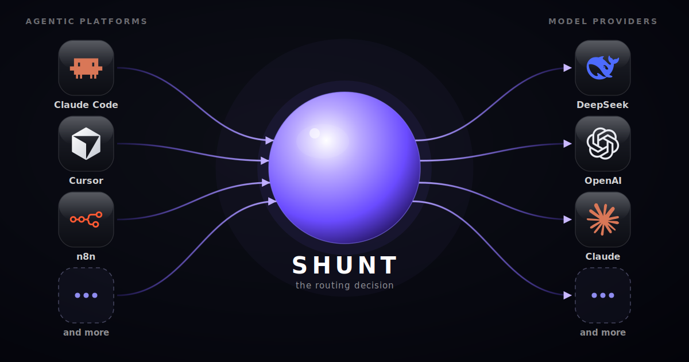

# Shunt

**One cheap model for the routine 80%. A frontier model for the hard tail. The
line learned from your own passing tests — not a guess.**

Shunt is a local, cache-safe router that sits between your coding agent and the
model API. Point your agent at it with one environment variable, and Shunt aims
to send each request to the cheapest model that can actually do the job —
cutting the bill without cutting quality, and proving it with a benchmark rather
than a pitch.

[](https://kookas.github.io/shunt/)


<p align="center">
  
</p>

## The bet

Most coding-agent requests are routine work a cheap open-weight model handles
fine. Only a hard tail genuinely needs a frontier model. Today your agent pays
frontier prices for all of it.

Shunt's bet is that a router can learn which is which — from *verified outcomes*
(did the tests pass? did it typecheck?), not from a model's own confidence — and
route accordingly. The hard, valuable part is that **decision**. The
multi-provider plumbing is commoditizing to free; the judgment of *which model
for which task*, grounded in your own results and safe for prompt caches, is
what doesn't exist yet as a shippable, self-hosted, Apache-2.0 product.

That's what Shunt is being built to be.

## System Capabilities

What the platform is built to support today:

- 🔌 **Drop-in for any agent.** Speaks both the OpenAI and Anthropic wire
  formats and translates between them, so Claude Code, opencode, aider,
  Continue, Cline, Cursor, and Zed all connect with one line — plus agent
  frameworks (LangChain, Pydantic AI, LiteLLM) and no-code builders (n8n,
  Flowise).
- 🗂️ **A configurable model pool.** A provider registry with `cheap` → `mid` →
  `high` → `frontier` tiers, per-model enable/disable, and a fallback chain — you
  own the pool and the prices.
- 🧠 **A decision core.** Task embedding → nearest-neighbour lookup → a
  cheapest-that-succeeds selection rule, plus pluggable strategies (fixed, kNN,
  blended, cascade, oracle).
- ✅ **Outcome verification.** Async, auto-detected test and typecheck verifiers
  that grade a result and feed the *next* decision — never blocking the response.
- 🔒 **Cache-safety as a design center.** Decisions land at task and session
  boundaries, never mid-cached-turn, so switching a model never silently
  re-reads the whole history at full price.
- 📊 **An offline benchmark.** Scores any routing strategy against a cache of
  verified outcomes — reward (quality minus cost), bootstrap confidence
  intervals, and a Pareto check against a perfect-oracle baseline.
- 🛡️ **Bring-your-own keys, zero telemetry.** Your provider accounts, your keys,
  localhost-bound by default. Nothing is phoned home, replayed, or resold.

## Current Status

**Pre-alpha.** The proxy runs; the routing intelligence is designed, unit-tested,
and validated offline, but is **not yet on the live request path**. Honestly:

**✅ Achieved**

- ✅ **Live proxy** — a single-process, localhost-bound server exposing
  `/health`, `/v1/models`, `/v1/chat/completions`, and `/v1/messages`, speaking
  both wire formats and forwarding to a cheap default model.
- ✅ **Decision transparency** — every response carries an `X-Shunt-Decision`
  header naming the model and the reason.
- ✅ **Model registry** — multi-provider, tiered, with enable/disable and
  fallback, driving the benchmark today.
- ✅ **Offline benchmark harness** — routing strategies scored against
  SWE-bench-Verified tasks judged by their own tests, six models spanning >50×
  in output price.
- ✅ **~18 tool integrations** — copy-paste config plus a dry-run handshake that
  proves the wiring without spending a cent.
- ✅ **Published distribution** — `shunt-router` on PyPI (`pip install`) and
  `ghcr.io/kookas/shunt-router` on Docker, released on tag with a boot-smoke and
  a live-index install check before it ships.
- ✅ **Hosted docs** — [kookas.github.io/shunt](https://kookas.github.io/shunt/),
  built strict (broken links fail the build) and deployed on every docs change.

**🚧 In progress**

- 🚧 **The kill-gate experiment** — dogfood the router on a real Claude
  Code / opencode workflow and measure it against fixed-frontier-with-caching.
  Ship routing only if it wins.
- 🚧 **Baseline measurement** — adaptive frontier collection with a doubly-robust
  (PPI++/AIPW) cost estimator; partial coverage of the 500-task suite today.

**⬜ Not yet**

- ⬜ **Routing on the live path** — the decision core is built and tested but not
  yet called by the proxy.
- ⬜ **The live learning loop** — verifiers writing outcomes the router reads
  from, plus per-key spend caps.
- ⬜ **Verify-and-escalate live** — try cheap, check the result, escalate on
  failure with an upfront recompute-cost quote.

An honest early result worth stating: offline, the prompt-embedding difficulty
signal carried clear signal on QA/reasoning workloads but came out **near chance
on agentic coding** — the workload we care about. That doesn't kill the project
(the cache-safe proxy and the verify-and-escalate path don't depend on it), but
it's why routing goes live only when a measurement earns it, not before.

## Quick start

Install it directly:

```bash
pip install shunt-router
shunt
```

Or with Docker:

```bash
docker run -p 8080:8080 ghcr.io/kookas/shunt-router
```

Then point your agent at it — one line, and it talks to Shunt instead of the
provider.

**Claude Code** and any Anthropic-wire client:

```bash
export ANTHROPIC_BASE_URL=http://127.0.0.1:8080
```

**opencode, aider, Continue** and any OpenAI-compatible client:

```
base_url = http://127.0.0.1:8080/v1
```

Copy-paste config for each tool — plus a dry-run handshake that proves the wiring
without spending a cent — lives in
[`examples/integrations/`](examples/integrations/README.md).

## How the decision works

The intended mechanism is k-nearest-neighbours over task embeddings: embed the
task, find similar past tasks with known pass/fail outcomes, and pick the
cheapest model that succeeded on work like it. kNN over frozen embeddings has
matched or beaten learned routers at lower sample complexity on published
benchmarks — a fine-tuned model is overkill to start. The real lever is the
labeled `(task → verified outcome)` store, not the model class.

Verification is what grounds it: async test and typecheck runs grade each result
and inform the *next* decision. Escalation, when it comes, decides at task and
session boundaries — never mid-cached-turn — and quotes the recompute cost
upfront.

## Measured, not marketed

The decision is the whole product, so we hold it to a pre-registered kill gate:
**beat fixed-frontier-with-caching at equal quality on a real coding workflow, or
don't ship the router.** That gate has not been cleared yet. Published evidence
puts single-turn code-gen savings at 15–30%, and the one study on *agentic*
Claude Code found no benefit — so we measure our own workflow before quoting any
number. There is no "beats Opus" claim here because we haven't earned one.

Running a frontier model on every task to set that bar is expensive, so Shunt
collects outcomes adaptively — cheap and mid models on every task, the frontier
model only where cheaper tiers disagree plus a random audit — and estimates the
baseline with a doubly-robust estimator whose validity rests on that audit. The
benchmark can *reject* a bad strategy; it can't *prove* a good one works in
production, which is exactly why the kill gate is measured on a live workflow.
See [`docs/benchmark.md`](docs/benchmark.md).

## Why build it in the open

Existing routers make you choose: cloud-only with a take-rate, licensed so
enterprises can't self-host, proxy-only with no real routing, or a research
artifact never built to ship. Shunt aims to be cache-safe, outcome-grounded,
tool-agnostic, self-hosted, and Apache-2.0 all at once.

- 🧩 **Cache-safe by design.** Routing decides at task and session boundaries,
  never mid-cached-turn.
- 🏠 **Local-first, zero telemetry, Apache-2.0.** You own the model pool, the
  keys, and — once it exists — the learning data. No phone-home, no take-rate, no
  CLA; a DCO sign-off is all we ask.
- 🔐 **Secure because it holds your keys.** Localhost-bind by default, no exposed
  control plane, keys kept out of logs, dependencies pinned and locked.

## Roadmap

Where Shunt is headed, in order:

1. **Wire routing onto the live path** — move the validated offline decision
   (embed + kNN, cache-aware task-level selection) into the proxy, gated on
   clearing the kill gate on a real workflow.
2. **The learning loop** — async verifiers writing outcomes to a local store the
   router reads from; per-key spend caps; graceful handling of models added or
   pulled.
3. **Reach and control** — verify-and-escalate on the live path with an upfront
   recompute-cost quote, a pluggable-policy extension API, and bring-your-own
   eval metric.

Further out: a plugin ecosystem for third-party policies and verifiers, more
providers on demand, and a faster runtime if concurrency calls for it.

## Repository layout

```
├── src/shunt/             Router package
│   ├── cli.py             CLI entry point (shunt start, explain, flag, version)
│   ├── proxy/             HTTP server: /health, /v1/chat/completions, /v1/messages, /v1/models
│   │                      (today: forwards to a cheap default model)
│   ├── router/            Decision core — embed → nearest-neighbour → selection rule
│   │                      (built and unit-tested; NOT yet called by the live proxy)
│   ├── verifiers/         Async outcome backfill (auto-detected tests, typecheck) — not yet on the live loop
│   ├── db/                SQLite persistence for sessions, outcomes, index
│   ├── session/           Session lifecycle, inactivity timeout, model lock
│   └── models/            Provider config, capability tiers, fallback chain
├── benchmark/             Offline model-capability and routing evaluation
├── docs/                  User documentation (MkDocs)
├── examples/providers/    Copy-paste registry config, one file per provider
├── examples/integrations/ Tool integration examples (CLI agents, frameworks, gateways)
└── tests/                 Test suite
```

## Contributing

Shunt is a one-person project in the open, and early is the best time to shape
it.

- ⭐ **Star the repo** if you want to follow where it goes.
- 💬 **Open a discussion or issue** with your workflow, your cost pain, or an
  idea.
- 📝 **Docs and typo fixes** make a low-friction first pull request. Contributions
  sign off under the [DCO](CONTRIBUTING.md); there's no CLA.

See [CONTRIBUTING.md](CONTRIBUTING.md) for how changes get merged.

## Commercial support

Shunt's router core is Apache-2.0, free for everyone including companies, and it
stays that way. If your organization later needs priority support, custom
integration, or governance features built around the free core, that will be a
separate offering — never a gate on the core routing itself. If that's ever you,
open an issue to start the conversation.

## License

**[Apache-2.0](LICENSE)** — free for everyone, with a patent grant.

Security disclosures: [SECURITY.md](SECURITY.md) ·
Community standards: [CODE_OF_CONDUCT.md](CODE_OF_CONDUCT.md)
</content>
</invoke>
