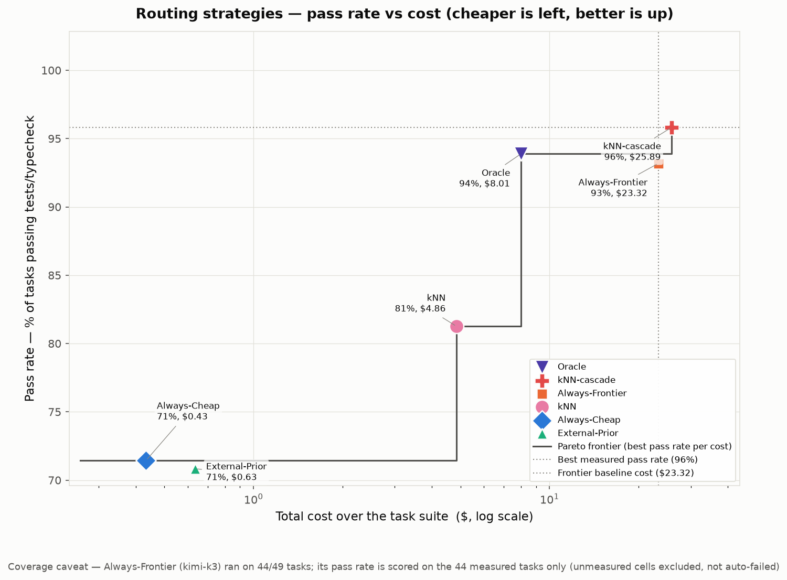
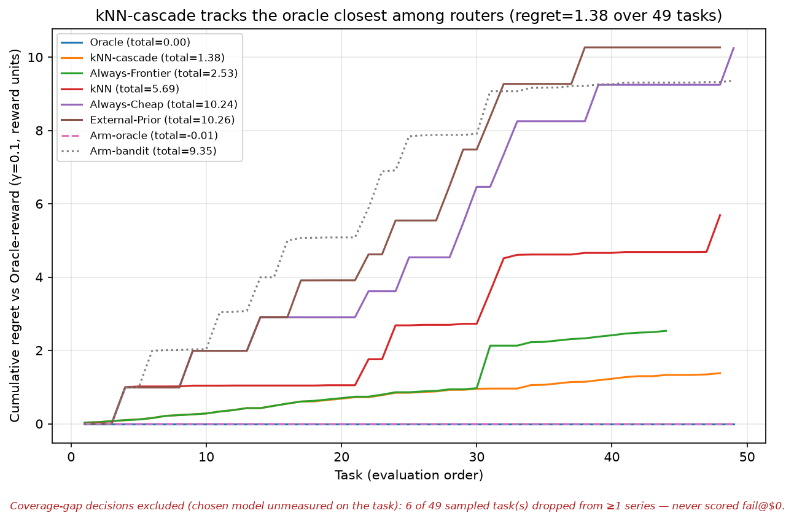
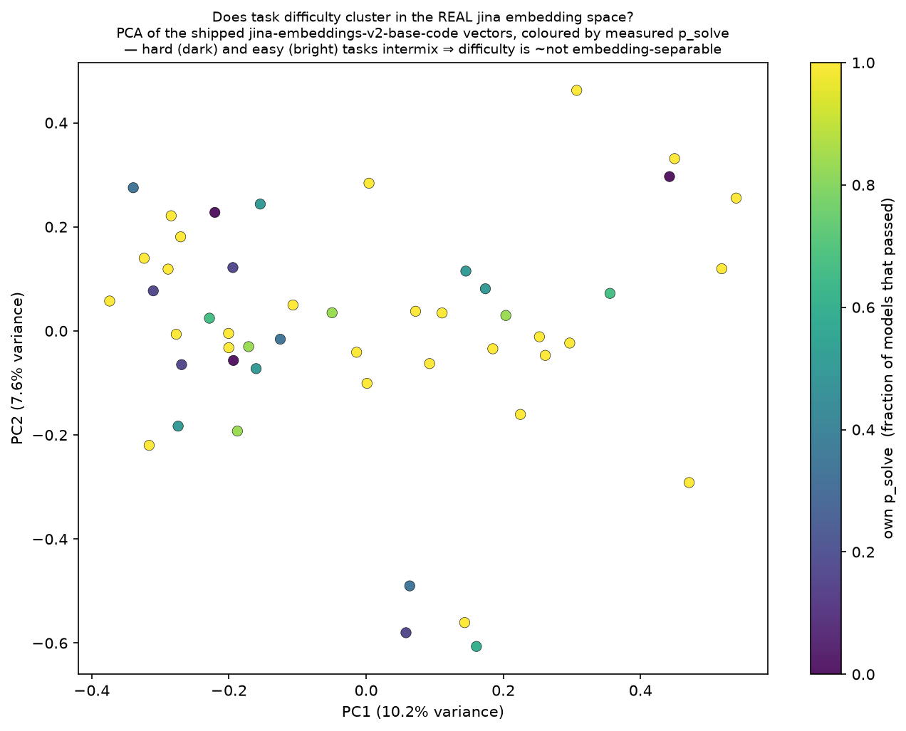

<p align="center">
  <picture>
    <source media="(prefers-color-scheme: dark)" srcset="docs/assets/lockup-brand-dark.svg">
    
  </picture>
</p>
<!-- Theme-aware wordmark; the emoji + text alt is the placeholder if the SVG fails to load. -->

<p align="center">
  <b>Open-source, self-hosted LLM router. Ships a registry of 11 models across
  Requesty and DeepSeek; add any OpenAI-compatible provider yourself.</b>
</p>

<p align="center">
  <a href="https://kookas.github.io/shunt/"></a>
  
  
  
  
</p>

<p align="center">
  <picture>
    <source srcset="docs/assets/routing.webp" type="image/webp">
    
  </picture>
</p>
<!-- Animated WebP where supported (GitHub renders it); the static hero.svg is the fallback/placeholder. -->

**One cheap model for the routine 80%, a frontier model for the hard tail — the
line learned from your own passing tests, not a guess.**

Shunt is a local, cache-safe router between your coding agent and the model API.
Point your agent at it with one env var; it routes each request to the cheapest
model that can do the job — cutting the bill without cutting quality, and proving
it with a benchmark.

## The bet

Most coding-agent requests are routine work a cheap open-weight model handles
fine; only a hard tail needs a frontier model — yet today your agent pays
frontier prices for all of it. Shunt learns which is which from *verified
outcomes* (did the tests pass?), not a model's own confidence, and routes
accordingly. The hard, valuable part is that **decision**; the multi-provider
plumbing is commoditizing to free.

This is a **first step, not a one-time implementation**. Long term we expect to
run more than one model per task and to keep adding routing algorithms, more
evaluation data, and more features — a continuous project aimed at the best
cost-effective success rate for any task. Prior work (e.g. the academic
[ACRouter](https://arxiv.org/abs/2606.22902)) shows a learned, outcome-grounded
router can match frontier quality at lower cost; we aim to bring that to every CLI
and agentic tool, and to prove it on our own SWE-bench-based
[benchmark](#benchmark) rather than borrowed numbers.

**Goal: find the cheapest model for your task, without losing quality.**

## How it's different

Most routers sit at one of two extremes. **Model fusion** (mixture-of-agents,
ensembling) runs several models per request and combines their answers — it chases
frontier-level quality, but calling many models costs *more* than calling one.
**Rule-based routing** (regexes, keyword patterns) is cheap but blunt: a handful of
hand-written rules can't capture what actually makes a request hard, so they
mis-route the moment a query doesn't fit the pattern. Neither is really built for
*cost* — one overspends for quality, the other is too coarse to trust.

Shunt takes a third path. A **locally-hosted ML model** (a task embedding +
nearest-neighbour lookup) picks the model for each task, and the pick is grounded
in *verified outcomes* — did your tests pass? — not a hand-written rule or a
model's own confidence. The approach is measured on our own SWE-bench benchmark,
and it adapts to *your* work: the more you use Shunt, the more outcomes it has to
learn from. All of it runs on your machine — **no data collection, no telemetry.**

## System Capabilities

What the platform is built to support today:

- 🔌 **Drop-in for any agent.** Speaks both the OpenAI and Anthropic wire
  formats and translates between them, so Claude Code, opencode, aider,
  Continue, Cline, Cursor, and Zed all connect with one line — plus agent
  frameworks (LangChain, Pydantic AI, LiteLLM) and no-code builders (n8n,
  Flowise).
- 🗂️ **A configurable model pool.** A provider registry with `cheap` → `mid` →
  `high` → `frontier` tiers, per-model enable/disable, and a fallback chain — you
  own the pool and the prices.
- 🧠 **A decision core.** Task embedding → nearest-neighbour lookup → a
  cheapest-that-succeeds selection rule, plus pluggable strategies (fixed, kNN,
  blended, cascade, oracle).
- ✅ **Outcome verification.** Async, auto-detected test and typecheck verifiers
  that grade a result without blocking the response at session close. Verified
  outcomes feed the next decision via the kNN index and exploration priors.
- 🔒 **Cache-safety as a design center.** Decisions land at task and session
  boundaries, never mid-cached-turn, so normal operation never silently
  re-reads a cached conversation at full price. The one exception is an upstream
  failure: falling back to another model means that model must prefill the whole
  conversation, because a provider's cache is per-model and cannot be transferred.
  Shunt's job is to make that rare and deliberate, not to pretend it is free.
- 📊 **An offline benchmark.** Scores any routing strategy against a cache of
  verified outcomes — reward (quality minus cost), bootstrap confidence
  intervals, and a Pareto check against a perfect-oracle baseline.
- 🛡️ **Bring-your-own keys, zero telemetry.** Your provider accounts, your keys,
  localhost-bound by default. Nothing is phoned home, replayed, or resold.

## Current status

**Pre-alpha.** The proxy runs and routes the session model on the first turn, and
the learning loop is live: outcomes are recorded automatically at session close
via off-wire test execution, or manually via `shunt flag`, and
feed the next decision. With no outcomes yet, the router cold-starts to the cheap
default. The immediate focus is the **kill gate** — dogfood on a real Claude Code /
opencode workflow and ship routing only if it beats fixed-frontier-with-caching at
equal quality.

**Achieved**

- **Live proxy**: localhost-bound server speaking both the OpenAI and Anthropic wire formats.
- **Decision transparency**: every response carries an `X-Shunt-Decision` header (model + reason).
- **Model registry**: multi-provider, tiered, with enable/disable and a fallback chain.
- **Offline benchmark**: routing strategies scored on SWE-bench-Verified tasks judged by their own tests.
- **~18 tool integrations**: copy-paste config plus a dry-run handshake that proves the wiring for free.
- **Published distribution**: `shunt-router` on PyPI and `ghcr.io/kookas/shunt-router` on Docker.
- **Hosted docs**: [kookas.github.io/shunt](https://kookas.github.io/shunt/), built strict.
- **Live learning loop**: automatic off-wire outcome capture (plus manual `shunt flag`) that updates the kNN index, exploration priors, and escalation gate.

**Future**

- **More routing algorithms** — kNN is only the first; we'll try and benchmark
  others and pick the best router for the task.
- **CLI / UI** to monitor and manage Shunt.
- **Low-level performance** work on the hot path.
- **Mid-session model adaptation** — if a session drifts in difficulty, re-adjust the model.
- **Enterprise suite** — audit, RBAC, monitoring, and more.

## Quick start

Install it directly:

```bash
pip install shunt-router
shunt
```

Or with Docker:

```bash
docker run -p 127.0.0.1:8080:8080 --env-file .env ghcr.io/kookas/shunt-router
```

Then point your agent at it — one line, and it talks to Shunt instead of the
provider.

**Claude Code** and any Anthropic-wire client:

```bash
export ANTHROPIC_BASE_URL=http://127.0.0.1:8080
```

**opencode, aider, Continue** and any OpenAI-compatible client:

```
base_url = http://127.0.0.1:8080/v1
```

Copy-paste config for each tool — plus a dry-run handshake that proves the wiring
without spending a cent — lives in
[`examples/integrations/`](examples/integrations/README.md).

## How the decision works

Shunt runs a **Context → Action → Feedback** loop: it sees the task (context),
routes it to a model (action), then records a verified outcome at session close
(feedback) that sharpens the next route. Today the routing algorithm is
k-nearest-neighbours over task embeddings — embed the task, find similar past
tasks with known pass/fail outcomes, pick the cheapest model that succeeded on
work like it — because kNN matches or beats learned routers at lower sample
complexity to start. The algorithm is **not fixed**: as the project grows we'll
pick the best router for the task. The real lever is the labeled
`(task → verified outcome)` store, not the model class.

Verification is what grounds it: async test and typecheck runs grade each result
and inform the *next* decision. Escalation, when it comes, decides at task and
session boundaries — never mid-cached-turn — and quotes the recompute cost
upfront. See [docs/feedback.md](docs/feedback.md) for the full loop.

## Measured, not marketed

Prior work is mixed, routing can cut cost at matched quality on some workloads, and the one study on *agentic* Claude Code found no benefit — so we don't quote anyone else's number. We measure our own workflow on our own [benchmark](#benchmark), and there is no "beats Opus" claim here because we haven't earned one on our own data.

Running a frontier model on every task to set that bar is expensive, so Shunt
collects outcomes adaptively — cheap and mid models on every task, the frontier
model only where cheaper tiers disagree plus a random audit — and estimates the
baseline with a doubly-robust estimator whose validity rests on that audit. The
benchmark can *reject* a bad strategy; it can't *prove* a good one works in
production, which is exactly why the kill gate is measured on a live workflow.
See [`docs/benchmark.md`](docs/benchmark.md).

## Benchmark

We back every claim with our own benchmark: routing strategies scored on
SWE-bench-Verified tasks judged by their own tests — reward (quality − cost),
bootstrap confidence intervals, and a Pareto check against a perfect-information
oracle. Method and how to run it: [`docs/benchmark.md`](docs/benchmark.md). These
are our own runs and grow as the suite scales; contributions are welcome — please
ask first ([Contributing](#contributing)).

<details>
<summary><b>Key plots</b> (click to expand)</summary>

<br>

**Strategy comparison** — pass rate (%) vs cost ($) per strategy, with the
perfect-information oracle marked. *Look for:* a strategy that is **high-performing
and cheap** — up near the oracle's pass rate but well left of the frontier
baseline's cost. A good router beats always-cheap on quality and always-frontier on
cost; the oracle is the ceiling.



**Cumulative regret** — reward lost against the oracle's choices, accumulated over
the run. *Look for:* a **low, flat line** hugging the bottom — that means the
strategy tracks the oracle's picks. A steadily climbing line means costly mis-routes;
the steeper the slope, the worse.



**Embedding routing map** — a 2-D PCA of the **real** jina prompt embeddings (the
same `jina-embeddings-v2-base-code` the router ships), each task colored by its
measured `p_solve`. *Look for:* whether **hard (dark) and easy (bright) tasks
separate**. They don't — difficulty intermixes across the embedding space, which is
the near-chance signal we stay honest about.



</details>

## Why build it in the open

Existing routers make you choose: cloud-only with a take-rate, licensed so
enterprises can't self-host, proxy-only with no real routing, or a research
artifact never built to ship. Shunt aims to be cache-safe, outcome-grounded,
tool-agnostic, self-hosted, and Apache-2.0 all at once.

- 🧩 **Cache-safe by design.** Routing decides at task and session boundaries,
  never mid-cached-turn.
- 🏠 **Local-first, zero telemetry, Apache-2.0.** You own the model pool, the
  keys, and — once it exists — the learning data. No phone-home, no take-rate, no
  CLA; a DCO sign-off is all we ask.
- 🔐 **Secure because it holds your keys.** Localhost-bind by default, no exposed
  control plane, keys kept out of logs, dependencies pinned and locked.

## Repository layout

```
├── src/shunt/             Router package
│   ├── cli.py             CLI entry point (shunt start, explain, flag, reindex, version)
│   ├── proxy/             HTTP server: /health, /v1/chat/completions, /v1/messages, /v1/models
│   │                      (calls router to decide model; cold-starts to cheap default)
│   ├── router/            Decision core — embed → nearest-neighbour → selection rule
│   │                      (called on the first turn; learns from verified outcomes)
│   ├── capture/           Off-wire outcome capture at session close (work_dir resolver, coordinator, background worker)
│   ├── verifiers/         Async outcome verification (auto-detected tests, typecheck runner)
│   ├── db/                SQLite persistence for sessions, outcomes, index
│   ├── session/           Session lifecycle, inactivity timeout, model lock
│   ├── models/            Provider config, capability tiers, fallback chain
│   └── config/            Shipped defaults: models.yaml registry, router.yaml policy
├── benchmark/             Offline model-capability and routing evaluation
├── docs/                  User documentation (MkDocs)
├── examples/providers/    Copy-paste registry config, one file per provider
├── examples/integrations/ Tool integration examples (CLI agents, frameworks, gateways)
└── tests/                 Test suite
```

## Contributing

Shunt is a one-person project in the open, and early is the best time to shape
it.

- ⭐ **Star the repo** if you want to follow where it goes.
- 💬 **Open a discussion or issue** with your workflow, your cost pain, or an
  idea.
- 📝 **Docs and typo fixes** make a low-friction first pull request. Contributions
  sign off under the [DCO](CONTRIBUTING.md); there's no CLA.
- 📊 **Benchmark results** are especially welcome — the benchmark is how we back
  every claim. **Ask before running one:** results are cost-expensive (a single
  frontier-model datapoint can run $1–3), and we're adding per-contributor key
  signing so every datapoint stays attributable to who produced it.

See [CONTRIBUTING.md](CONTRIBUTING.md) for how changes get merged.

## Commercial support

Shunt's router core is Apache-2.0, free for everyone including companies, and it
stays that way. If your organization later needs priority support, custom
integration, or governance features built around the free core, that will be a
separate offering — never a gate on the core routing itself. If that's ever you,
open an issue to start the conversation.

## License

**[Apache-2.0](LICENSE)** — free for everyone, with a patent grant.

Security disclosures: [SECURITY.md](SECURITY.md) ·
Community standards: [CODE_OF_CONDUCT.md](CODE_OF_CONDUCT.md)
</content>
</invoke>
