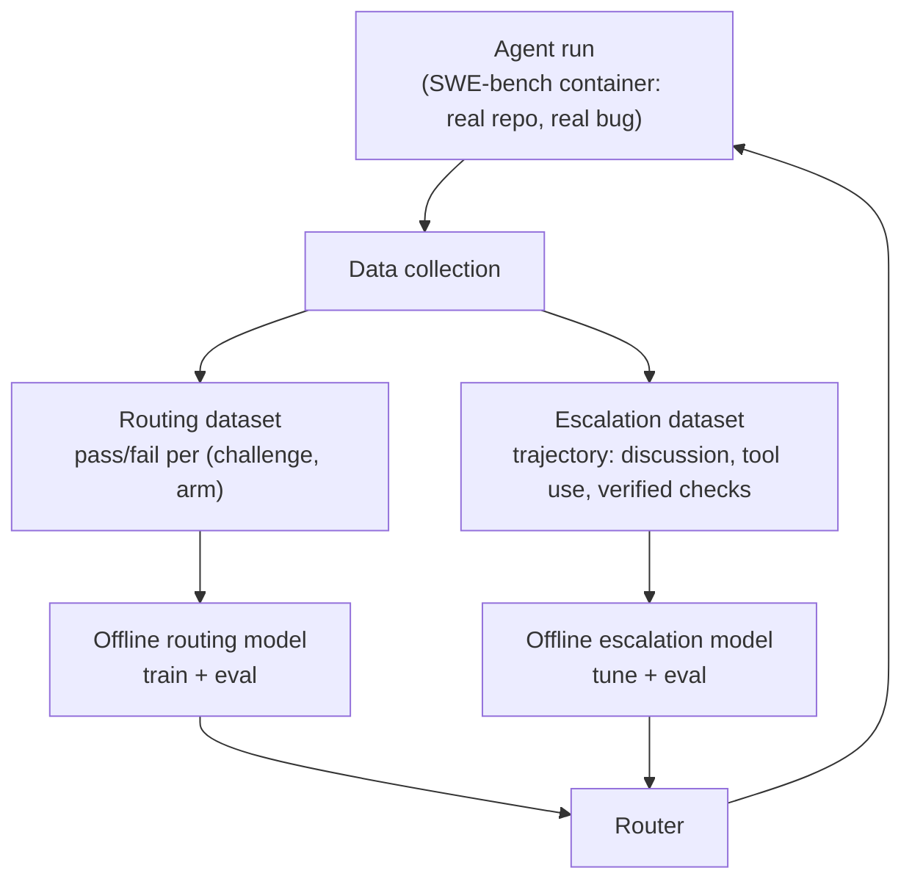
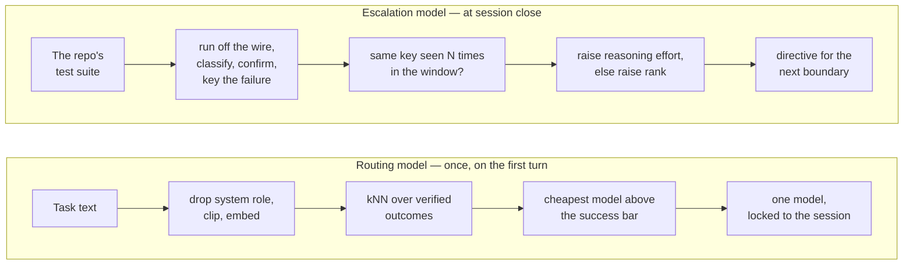
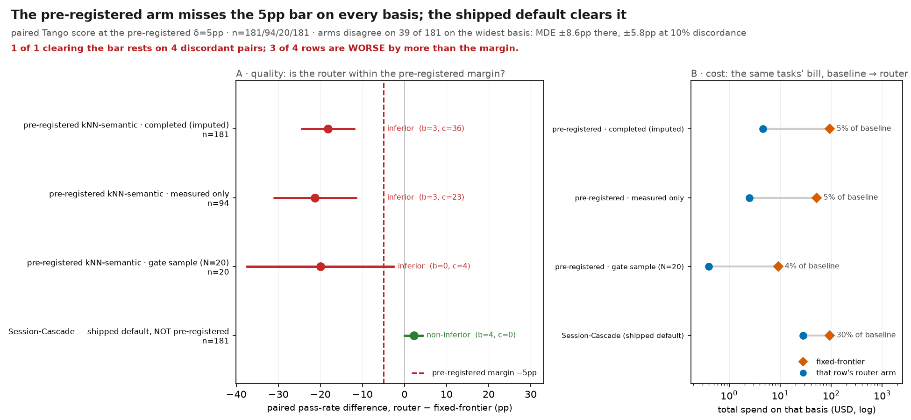
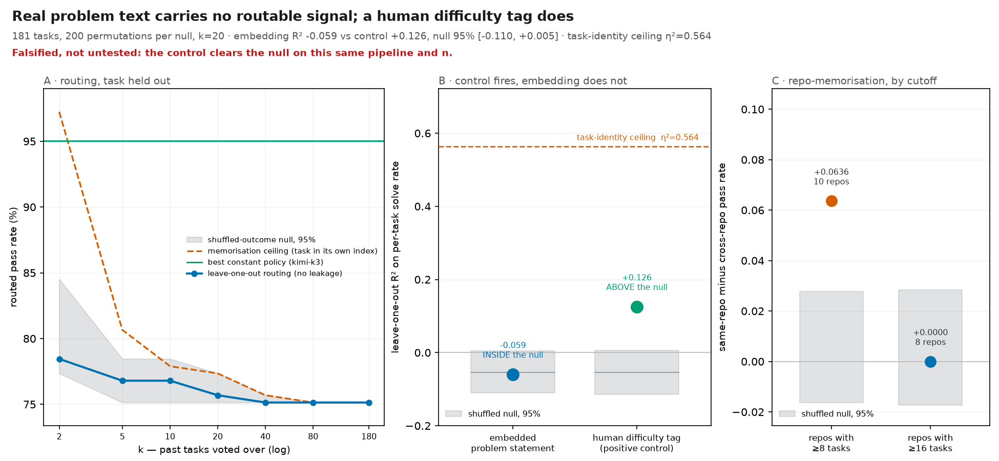

<p align="center">
  <picture>
    <source media="(prefers-color-scheme: dark)" srcset="docs/assets/lockup-brand-dark.svg">
    
  </picture>
</p>
<!-- Theme-aware wordmark; the emoji + text alt is the placeholder if the SVG fails to load. -->

<p align="center">
  <b>Open-source, self-hosted LLM router. Ships a registry of 11 models across
  Requesty and DeepSeek; add any OpenAI-compatible provider yourself.</b>
</p>

<p align="center">
  <a href="https://kookas.github.io/shunt/"></a>
  
  
  
  
</p>

<p align="center">
  <picture>
    <source srcset="docs/assets/routing.webp" type="image/webp">
    
  </picture>
</p>
<!-- Animated WebP where supported (GitHub renders it); the static hero.svg is the fallback/placeholder. -->

**One cheap model for the routine 80%, a frontier model for the hard tail — the
line learned from your own passing tests, not a guess.**

## The problem

Most coding-agent requests are routine work a cheap open-weight model handles
fine; only a hard tail needs a frontier model. Today your agent pays frontier
prices for all of it. Both halves of that claim hold on our data: always routing
to the cheapest model already solves **75.5%** of scored tasks, and price does
not buy capability — `deepseek-v4-flash` at $0.42/Mtok solves 68.9% while
`gpt-5-mini` at 5× the price solves 54.5%.

## The solution

Shunt is a local, cache-safe router between your coding agent and the model API.
Point your agent at it with one env var. It picks a model per task, tracks how
each model actually performs on *your* work, and escalates to a stronger one when
the evidence says the current attempt is going nowhere.

## Goal

**Build the best router for cost-effective model allocation: same results or
better, for less money.** Three jobs make that up: allocate the right model up
front, track what each model actually delivers, and escalate to a
higher-reasoning model when an attempt is failing.

<p align="center">
  
</p>

Think of it as satnav for a task. The cheap model is the default road. When the
evidence says that road is blocked — tests still failing, retry budget spent —
Shunt recalculates and takes the stronger model, and it does so **at a junction**:
a task or session boundary, never mid-request, because switching inside a cached
turn throws the cache away. Once it escalates, it stays escalated.

## Vision

**Routing is a mathematical and statistical problem, not a systems problem.**
Making the pipeline faster or cleaner buys nothing until the underlying decision
rule is right. Systems work pays off only once it does. So the job is to find
that rule, and we will take it from wherever it comes: deterministic, statistical,
or learned, judged only on our own data. That is not a preference, it is where the
evidence points — the cheapest strategy we have found so far uses no embeddings
and no training at all, and it beats the learned one.

Five criteria set what belongs in this repo. Read them as scope, not slogans: a
proposal that breaks one is out, however well it scores. And read them against
what this is. Pre-alpha research, honest about it. Despite what the literature
claims, we cannot confirm a production-ready result today. What we have is a
benchmark, a dataset we own end to end, and measured findings, several of them
negative.

- **Data driven.** We act only on data we own and can re-score offline. The label
  is a verified outcome from our own run: did your tests pass? A model's
  self-reported confidence does not count, and neither does a hand-written guess
  about what "hard" looks like. When the data says a mechanism fails, we publish
  that.
- **Lightweight.** It has to run on any laptop. A router that needs a big machine
  to save you money defeats its own purpose. Embeddings come from fastembed and
  the index is hnswlib, both CPU-only. The `Dockerfile` builds hnswlib with
  `HNSWLIB_NO_NATIVE=1`, then runs `objdump` over the compiled extension and
  fails the build if an AVX-512 opcode got baked in, so a wheel that would
  SIGILL on an older CPU never ships.
- **Divide and conquer.** Break routing into narrow subtasks, and give each one
  its own dataset, its own model, and its own honest evaluation. Routing and
  escalation are the first two. Each is a supervised problem with labels we
  collect ourselves, so each can be replaced, benchmarked, and beaten
  independently. Domain-specific verifiers, cost models, and human feedback
  should follow; the architecture is built to take them.
- **Community driven.** One person is shortsighted. The highest-value
  contribution here is an idea rather than a patch: applied maths, statistics,
  applied ML, ML research, system design. Ideas and code are both shared, and an
  idea that turns out to be wrong is still worth posting — we publish our own
  negative results for the same reason. Many brains on one problem, as a live
  evolving project rather than a paper.
- **Open source.** We think AI infrastructure should be open, and a tool that
  runs on your laptop holding your provider keys has to be inspectable to be
  trustworthy. Existing routers make you pick: cloud-only with a take-rate,
  licensed so enterprises can't self-host, proxy-only with no real routing, or a
  research artifact never built to ship. Shunt's core is Apache-2.0, free for
  everyone including companies, and never gated on routing quality. You own the
  model pool, the keys, and the learning data, nothing phones home, and
  contributions sign off under a DCO rather than a CLA. Support and governance
  features, if they ever exist, will be a separate offering.

## How it works

Agent runs produce data, the data becomes two labelled datasets, and each dataset
trains and evaluates its own model — entirely offline, so iterating costs nothing.


```mermaid
flowchart TD
  A["Agent run<br/>(SWE-bench container: real repo, real bug)"] --> B[Data collection]
  B --> C["Routing dataset<br/>pass/fail per (challenge, arm)"]
  B --> D["Escalation dataset<br/>trajectory: discussion, tool use, verified checks"]
  C --> E["Offline routing model<br/>train + eval"]
  D --> F["Offline escalation model<br/>tune + eval"]
  E --> G["Router"]
  F --> G
  G --> A
```

We own this loop end to end and rely on a trusted external source only for the
*challenges* themselves — SWE-bench Verified, which ships containerised
repositories with real bugs and the repo's own tests as the grader. We use no
precomputed leaderboard numbers. Everything else is ours: our runs, our labels,
our evaluation.

That makes both problems **supervised**, with a dataset we can re-score offline
against data already on disk. Testing a new routing rule or a new escalation
detector costs nothing.

### Context → Action → Feedback

- **Context** — the task text, embedded. This is what the **routing** model sees,
  once, at the task boundary.
- **Action** — route the task to a (model, reasoning-effort) arm.
- **Feedback** — two channels. The main one is the **escalation** loop: verified
  check results streaming out of the running trajectory, which decide whether to
  escalate mid-task. The second is **human feedback** via `shunt flag` — a
  working proof of concept, not yet deeply integrated.

Full loop: [docs/feedback.md](docs/feedback.md).

## The two models

They answer different questions, on different inputs, at different times.
Conflating them makes every number ambiguous, so we keep them apart throughout.

| | **Routing model** | **Escalation model** |
|---|---|---|
| Question | Which (model, effort) should *start* this task? | Is this attempt going to fail — escalate *now*? |
| When | Once, at the task boundary, before any tokens are spent | At the next boundary, once a verified outcome exists — live, one per closed session |
| Input | The task text, embedded | Verified failing-check ids from re-running your tests off the wire |
| Learns from | Task outcome, pass/fail | Whether this attempt ultimately failed |
| Today | k-nearest-neighbours over task embeddings | A recurrence rule over verified failing-check ids |
| Status | **No measurable signal over the base rate yet** | **Policy: `OK_OFFLINE_ONLY` — real edge at the shipped threshold once the reproduction phase is excluded (eval-only); as-shipped it fires on everything; prefix model: `NO_SKILL`** |
| Next | bigram / linear models, calibrated classifiers, better selection rules | calibrated risk scoring, structural loop features, late fusion |

The escalation model is a **first attempt**, inspired by the published
[ACRouter](https://arxiv.org/abs/2606.22902) design. The recurrence rule carries
a real edge at the **shipped** threshold once the reproduction phase is excluded:
gated on failures after the agent's first edit, the best cell is `escalate_after_n=3` — 354
of 723 runs at P(fail|fired)=0.638 with AUROC 0.722 (n=2 already reads AUROC 0.710),
clearing both the family-wise
and length-stratified nulls. As shipped (counting every same-key failure including
the reproduction phase) it fires on every run and reads exactly the base rate.
Both readings are **per-step** signals on the offline corpus — production decides
once per session, so neither is shippable as measured, and the edit-gated variant
is eval-only (production has no per-step action stream). The prefix risk model
reads no skill. Escalation **ships enabled** (owner choice, 2026-08-08) with those
caveats carried in the docs. It is armed once a repo is resolved — the explicit
`capture.work_dir` / `capture.work_dirs` / `SHUNT_WORK_DIR`, or else the launch
directory, so `cd myrepo && shunt start` arms it with no configuration — and the
router warns at boot if it is enabled but not armed.
We reproduced that paper and withdrew our citation of it; the write-up is in the
[research log](docs/research-log.md).

### Both pipelines, end to end


```mermaid
flowchart LR
  subgraph R["Routing model — once, on the first turn"]
    direction LR
    R1["Task text"] --> R2["drop system role,<br/>clip, embed"] --> R3["kNN over verified<br/>outcomes"] --> R4["cheapest model above<br/>the success bar"] --> R5["one model,<br/>locked to the session"]
  end
  subgraph E["Escalation model — at session close"]
    direction LR
    E1["The repo's<br/>test suite"] --> E2["run off the wire,<br/>classify, confirm,<br/>key the failure"] --> E3["same key seen N times<br/>in the window?"] --> E4["raise reasoning effort,<br/>else raise rank"] --> E5["directive for the<br/>next boundary"]
  end
```

**The routing model is opt-in.** A default install runs
`router.strategy: session_cascade` — start on the cheapest model, let a repeated verified
failure climb it — and that path skips the whole left-hand box above: no embedding, no
neighbourhood query, no candidate scoring. Set `router.strategy: knn_cascade` to switch
the routing model on. What follows describes that opt-in.

**The routing model** reads the first turn's `user` and `tool` text — the system
prompt is dropped, it would swamp the clip window — clips it, and embeds it with a
CPU-only fastembed model. That vector queries an HNSW index of past sessions whose
outcomes you verified. Each neighbour is weighted by its verification confidence and
its closeness; models are then scored on weighted success rate, and the **cheapest
one clearing the success bar with enough samples** wins. Below the bar it falls
through to the cheapest model it has no history for, which is why an under-informed
router looks a lot like `always_cheap`. Until enough verified outcomes accumulate it
cold-starts to a fixed cheap model. The pick is then **locked to the session** — that
lock is the cache-safety guarantee. Depth: [docs/routing.md](docs/routing.md).

**The escalation model** is two stages, and only the first involves pattern matching.
At session close Shunt re-runs *your* repo's suite off the wire — **pytest** (Python),
**jest / vitest** (JavaScript/TypeScript), **`go test`** (Go), **`cargo test`** (Rust),
plus Maven/Gradle (Java), `dotnet test` (C#/.NET), RSpec/minitest (Ruby), PHPUnit
(PHP), GoogleTest/CTest (C/C++), XCTest (Swift), bats (Shell), prove (Perl),
testthat (R), ExUnit (Elixir) and hspec/tasty/HUnit (Haskell) — auto-detected from
the repo's files — and classifies the result by exit code
first, then by regex over the output: did tests really run and fail, or was this an
environment error? A genuine failure is re-run to confirm it is not a flake, then
given a **dedup key**: the failing test's node id, or a hash of the detail with
timings, addresses, temp paths and seeds stripped. Stage two is plain counting. When
the *same* key reaches `escalate_after_n` confirmed, non-infrastructural failures
inside a window of recent decisions, the router raises the current model's reasoning
effort — same model, so the prompt cache survives — and only steps to a pricier model
once that ladder is exhausted. Different failures never add up; a passing suite wipes
the slate. The runner matrix below is what the classifier is *built and tested*
on today — pytest, jest/vitest, go test, cargo test, Maven/Gradle, dotnet, RSpec,
PHPUnit, GTest/CTest, XCTest, bats, shunit2, prove, testthat, ExUnit and
hspec/tasty; it is designed to be extended to any runner whose output reports
pass/fail (see [which runners are supported](docs/escalation.md#which-runners-are-supported)).
`shunt escalate` prints that counter's live state — the effective config and where each
value came from, the current rung, every key in the window and why it does or does not
count, and what the next decision would do
([reference](docs/configuration.md#inspect-it-shunt-escalate)).
Depth: [docs/escalation.md](docs/escalation.md).

**One verified outcome per session, not per step.** The verifier runs at session
close, so escalation sees at most one failure event per session — never one per tool
call. With the shipped threshold that means two *sessions* failing the same check.
It does not watch an attempt unfold and step in mid-flight.

### Where they stop

- The routing model rests on ranking task difficulty from a prompt embedding, and on
  agentic coding that signal has not cleared our bar. The proxy and cache-safety do
  not depend on it; the kNN decision does.
- An empty neighbourhood and a confident one produce the same-looking response. Only
  `shunt explain` tells them apart.
- Escalation is inert without a repo it can test. It resolves one from `capture.work_dirs`,
  then `SHUNT_WORK_DIR` / `capture.work_dir`, then the launch directory — so launching
  outside a git repo, or with `trust_launch_dir: false`, leaves it enabled but not armed
  (not a load error — the router warns at boot). It is equally inert on a repo with no tests.
- Escalation grades nothing — it counts. Every confirmed failure weighs the same, so
  a trivial assertion and a total collapse are one event each.
- A test runner whose output varies run to run in a way our normalisers do not strip
  yields a fresh key every time, so recurrence never accumulates. The field still
  looks populated, which is what makes it quiet.
- Neither model adapts mid-session. The model is locked; a directive applies to the
  next boundary.

### Scope: SWE tasks today

Both models handle **software-engineering work only**. The routing corpus is coding
tasks, and escalation's only verified signal is a repository's own test suite — from
pytest, jest/vitest, `go test` and `cargo test` through Maven/Gradle, `dotnet test`,
RSpec, PHPUnit, GTest/CTest, XCTest, bats, prove, testthat, ExUnit and hspec/tasty
(the classifier is one runner-independent rule that recognizes any runner that
reports pass/fail). Point
Shunt at a notebook, a market analysis, or a piece of prose and it still proxies and
forwards — but the routing decision has no evidence behind it and nothing grades the
result afterwards.

**Other domains are planned, not scheduled.** Data science and ML work (a notebook
that runs, a metric that moves) and non-engineering work (business analysis,
literature — where the check is a spreadsheet rule or a rubric a person signs off)
need their own dataset, their own verifier, and their own honest evaluation, which is
what the divide-and-conquer design is for. None of it starts before the SWE case
holds up.

### Rank and cost are different orderings

Easy to conflate, so, precisely:

- **Cost** is the dollars a task actually consumed: `real_cost`, cache-aware,
  read from the provider's own usage accounting. Never a price-list estimate.
- **Rank** is a model's position in the registry, which is ordered by **price**.
  It is *not* a capability ordering — the cheapest model in our registry
  outscores one at 5× the price, as [The problem](#the-problem) shows.

## Quick start

```bash
pip install shunt-router
cd /path/to/your/repo    # not optional — see below
shunt doctor    # what resolves, what is armed, what is inert — no spend, no download
shunt
```

**Start it from inside the repo you are working on**, or pass `--work-dir`. Escalation's
only signal is a verified failure, and it gets one by re-running *that repo's* tests at
session close. Launched anywhere else it stays enabled and never fires — the router warns
at boot and `shunt doctor` says so, but nothing else will. This is also the step that arms
test execution on that tree, so point it at a repo you trust.

Or with Docker:

```bash
docker run -p 127.0.0.1:8080:8080 --env-file .env ghcr.io/kookas/shunt-router
```

Then point your agent at it. **Claude Code** and any Anthropic-wire client:

```bash
export ANTHROPIC_BASE_URL=http://127.0.0.1:8080
```

**opencode, aider, Continue** and any OpenAI-compatible client:

```
base_url = http://127.0.0.1:8080/v1
```

Copy-paste config for each tool — plus a dry-run handshake that proves the wiring
without spending a cent — lives in
[`examples/integrations/`](examples/integrations/README.md).

## Benchmark

Routing strategies and escalation detectors are scored on SWE-bench-Verified
tasks judged by their own tests: reward (quality − cost), bootstrap confidence
intervals, permutation nulls, and a Pareto check against a perfect-information
oracle. Method: [`docs/benchmark.md`](docs/benchmark.md). Each figure carries its
claim, its sample size, and — where a reader could be actively misled — one red
line, so a plot lifted out of context still says what it cannot support. The rest
of what each one means is in [`docs/routing.md`](docs/routing.md#figures) and
[`docs/escalation.md`](docs/escalation.md#figures).

Three figures below carry the headline. The other seventeen, each with how to
read it and what it cannot support, are in [routing](docs/routing.md#figures) and
[escalation](docs/escalation.md#figures).

**Does the shipped router beat always-frontier at equal quality?** The figure carries two
different arms and two different answers, and the labels say which is which.

The **pre-registered** arm is the bare kNN *selection rule* — routing with the ladder
removed — at δ=5pp on three evidence bases, and on all three it is **worse** by more than
the margin (Δ=−16.8pp [−22.9, −10.8] on the completed basis, `inferior`, the interval <!-- generated-by: benchmark/routing/figures/kill_gate.py -->
excluding the bar). It spends far less, but that is a saving bought at a quality loss
pre-registered as unacceptable. The **shipped default** — `session_cascade`, the
cheapest-model start with the escalation ladder on top — clears the bar: Δ=+1.6pp [−0.2, +3.5], `non_inferior`, <!-- generated-by: benchmark/routing/figures/kill_gate.py -->
at still under half the baseline's bill. It was **not** pre-registered, so read it as an
observation and not as the gate being met.

Both are published, because the honest version of this is that the rename **exposed a
pre-existing defect**: the pre-registered arm adjudicates a configuration no operator can
select. Repointing the gate after seeing the data would rewrite the registered test, so
the arm stays where it is and the shipped default is drawn beside it.



**Does the embedding predict anything?** No — and this is now a falsification
rather than a gap. The router embeds the real SWE-bench problem statement, and its
neighbourhood estimate still sits inside the shuffled-outcome null, while a
three-level human difficulty tag clears that null on the same pipeline and the
same n. A working positive control beside a negative result.



**Does the escalation trigger fire on the runs that fail?** At the shipped
configuration, no: it fires on 723 of 723 runs and lands exactly on the base rate.
Counting only failures *after* the agent's first edit separates outcomes 0.589 vs
0.164 at the shipped threshold — but that variant is eval-only, because production
has no per-step action stream to gate on.


## Results

Full numbers, method, and caveats: **[docs/results.md](docs/results.md)**. The one
scoped claim we make about escalation, with its pre-registered falsifiers and their
verdicts: **[docs/escalation-claim.md](docs/escalation-claim.md)**. The routing
headline, stated plainly:

> **The escalation ladder at session cadence — one decision per session,
> cache-safe by construction, enabled in a default install and selectable as
> `router.strategy: session_cascade` — reaches the blocked mid-session cascades
> at equal quality. On the 184-task scoring path it
> costs $28.71 cache-aware at 96.74%, against Price-Cascade's $27.11 at the same
> pass rate and Always-Frontier's $96.02 at 95.11%. On the harder fully-measured
> 74-task set it costs $28.76 at 90.91% against Always-Frontier's $37.63 at <!-- frozen-value: n=74, date=2026-08-11, run=49b8362 -->
> 86.36%.**
> The saving is real and comes from *mechanism*, not prediction — the machine
> learning still contributes nothing. And it is much smaller on measured cells
> than on imputed ones: see the correction below.

**Set A — the 184-task scoring path** (35% of cells monotone-imputed). Naive
totals are cache-blind sums; the cache-aware column is what a provider would
bill. Only `Session-Cascade` re-serves the same model on consecutive attempts, so
it is the only row the cache term moves.

| strategy | pass rate | 95% CI | naive cost | cache-aware cost |
|---|---:|---|---:|---:|
| Oracle (hindsight — a bound, never deployable) | 96.7% | 94.0–98.9 | $18.33 | $18.33 |
| Price-Cascade (blocked — not deployable) | 96.7% | 94.0–98.9 | $27.11 | $27.11 |
| **Session-Cascade, `rank_shortlist=3` (`strategy: session_cascade`)** | **96.7%** | 94.0–98.9 | $33.56 | **$28.71** |
| kNN-cascade (within-task) (blocked — not deployable) | 96.7% | 94.0–98.9 | $30.44 | $30.44 |
| kNN-cascade (`strategy: knn_cascade` — the opt-in routing model) | 96.7% | 94.0–98.9 | $43.01 | $38.26 |
| Always-Frontier | 95.1% | 91.9–97.8 | $96.02 | $96.02 |
| kNN (control — the pick with the ladder removed; not selectable) | 78.3% | 72.3–84.2 | $13.21 | $13.21 |
| Always-Cheap | 75.5% | 69.0–81.5 | $1.50 | $1.50 |
| Tier-Classifier (blocked — not deployable) | 65.8% | — | $11.53 | $11.53 |

`Session-Cascade` **is the shipped default** — `router.strategy: session_cascade`,
a preset meaning `always_cheap` plus the escalation ladder
(`escalation.enabled: true`, `escalation.rank_shortlist: 3`) — so a default install
starts on the cheapest model and climbs a rung at the next **session** boundary on a
repeated verified failure. Say plainly what that means: **the default does no
routing.** It never embeds a turn, never queries the neighbourhood, never scores
candidates. The routing model is `router.strategy: knn_cascade`, and it is opt-in.
Two things follow that are easy to miss: exploration is inert under the default, and
`shunt doctor` downgrades a missing embedding-weights cache from a failure to a
warning, because nothing needs it.

`kNN-cascade` is that opt-in — the kNN pick with the same ladder on top — and on this
corpus it is **dominated by the default**: both reach 96.7%, and opening the ladder on
the kNN pick instead of on the cheapest model costs $9.55 more cache-aware for no
measured quality. We publish that because we measured it. One reason to think it flatters
the cheap start: both rows assume every failure recurs identically (the replay data carries
no failing-check identity), which is the fastest climb the policy could ever make and is
worth most to the row that starts at the bottom. Live, escalation needs two confirmed
same-key failures in a ten-decision window, so climbing is slower and each wasted rung is a
whole failed session — which is where a better first pick would pay. That is an argument,
not a result; nothing in this corpus quantifies it. See
[Results](docs/results.md#the-shipped-default-and-the-routing-model-priced-against-it).

Both cascade rows are **offline replays whose every rung starts from a fresh tree and a
fresh context**. Live they do not: the escalated model inherits the cheap rung's edits and
the whole prior conversation, uncached. What that does to quality is untested and its
direction is unknown —
[the divergence, stated once](docs/escalation.md#offline-vs-live-cascade).

On a paired per-task bootstrap `Session-Cascade` costs
**$1.37 more than `Price-Cascade`** (95% CI [+0.82, +2.00]) and is **not
distinguishable from `kNN-cascade (within-task)`** (−$1.23, [−3.42, +0.73]). Against
Always-Frontier: **−$66.12** ([−74.19, −57.90]). That $1.37 is the entire price
of being cache-safe, and it is what the two blocked rows below now exist to
measure.

`Price-Cascade` uses no embeddings, no nearest neighbours, and no training. It
tries models in ascending price order and stops at the first one whose patch
passes — which needs a verified outcome **mid-session**, so the router rejects
`price_cascade` at boot. **You cannot buy that row, and you never will**: one
model decision per session is the cache-safety spine, not a to-do. The learned
`kNN-cascade (within-task)` costs *more* for the same 96.7% and is blocked for the same reason.
The learned `kNN` row sits 1.7pp above `Always-Cheap`, inside noise: on this
corpus the embedding does not buy routing quality. See
[Results](docs/results.md#routing-results).

Read the 96.7% shared by those three rows with the caveat it carries: a cascade
stops at the first attempt whose tests pass and is then scored on that same
label, so it is a **best-of-N coverage** number, not a single-shot one — which is
also why all three land on exactly the hindsight `Oracle`'s pass count. The cost
axis is honest; every attempt in the chain is billed.

**The correction: the saving is much smaller on measured cells.** Set B is the
raw, un-imputed basis — 74 scorable tasks, every cell actually run, and <!-- frozen-value: n=74, date=2026-08-11, run=49b8362 -->
biased *hard* where set A is biased easy. **Set A has 184 tasks and set B has 74,
so totals do not compare across them; compare only within a set.**

| basis | Price-Cascade vs Always-Frontier | Session-Cascade `sl=3` (cache-aware) vs Always-Frontier |
|---|---|---|
| Set A — 184 tasks, 35% imputed | $27.11 vs $96.02 — **72% cheaper** | $28.71 vs $96.02 — **70% cheaper** |
| Set B — 74 tasks, 100% measured | $27.10 vs $37.63 — **28% cheaper** | $28.76 vs $37.63 — **24% cheaper** |

A four-fold saving becomes roughly a quarter. The direction holds on measured
data; the magnitude is mostly imputation, and the ordering survives two selections
biased in opposite directions — that last part is the load-bearing claim, not
either total. On set B the ladder's 90.91% [83.33, 96.97] point estimate is above
Always-Frontier's 86.36% [80.33, 93.94], but the intervals overlap: the two are
**not distinguishable on quality**. Full tables, both subset guards verbatim, and
the paired bootstrap:
[Routing at session cadence](docs/results.md#routing-at-session-cadence).

Three things we will not let you take away from that table:

1. **Set A is part projection.** 22% of Price-Cascade's dollars and 45% of
   Always-Frontier's are imputed, and every imputed cell is filled as a **pass** —
   which charges the frontier baseline full price on tasks a cheaper model
   demonstrably solved. That is where the four-fold saving comes from, and set B
   above is what is left when it is removed. Neither subset is pre-registered;
   both are coverage-selected and say so.
2. **The two quality figures are not the same kind of number.** A cascade stops
   at the first attempt whose tests pass and is scored on that same label, so its
   figure is best-of-N coverage while Always-Frontier's is single-shot. We flagged
   exactly this pattern as a flaw in prior work; it applies to us too. The cost
   axis is honest — every attempt in the chain is billed.
3. **The learned part contributes nothing here — but read the next section
   before concluding it cannot.** kNN's leave-one-out accuracy equals the base
   rate to four decimals and sits inside a permutation null at every *k*. That
   result stands as a description of what our shipped router does. It is *not*
   yet a result about embeddings, for the reason below.

We would rather publish that than keep selling the model. **We do not claim the
make-or-break gate is passed.**

### Three claims we retracted after auditing our own benchmark

An audit of every committed figure found that three conclusions we were about to
sell you were **measurement artifacts**. We are leaving this section in the
README rather than quietly fixing it, because how a project handles its own bad
results is the only evidence you have about the rest of its numbers.

**We were not embedding the task — and now we are.** The router used to embed a
string built as `repo@sha — resolve <pytest node id>`: a median of 106 characters
containing a repo slug, a truncated commit hash and a test path. No problem
statement, no code, nothing about difficulty. 61% of each task's twenty nearest
neighbours shared its repo against a 10% chance rate — it was behaving as a path
detector. So *"prompt embeddings cannot separate task difficulty"* had never been
tested.

It has been now. The task manifest was rebuilt from the pinned SWE-bench revision
with the real `problem_statement` (median 1,185 characters), `routing_text()`
prefers it, and every committed routing figure and number is computed on that
basis. Two independent statistics, both in the committed pipeline:

| | embedding | human difficulty tag | shuffled null 95% |
|---|---:|---:|---|
| Neighbourhood Brier skill | −0.045 | **+0.038** | [−0.104, −0.012] |
| Leave-one-out R² on `p_solve` | −0.053 | **+0.076** | [−0.115, −0.001] |

The embedding sits inside the null on the correct input, while a crude three-level
human tag clears it on the same pipeline, the same n and the same null. That is a
**working positive control beside a negative result**, which is what makes this a
falsification rather than a coverage gap — the distinction we previously could not
claim. Task identity accounts for ~57% of outcome variance, so there is structure
there; this encoder does not reach it.

Routing quality *fell* when the input was corrected: kNN went from 81.71% to
**78.26%**, which is inside noise of always-cheap's 75.54%. The 106-character label
was not merely uninformative, it was mildly leaky — the repo name it carried is a
weak difficulty proxy. Given the right input, the learned router is not
distinguishable from the trivial policy. Figures:
[`embedding_signal`](docs/routing.md#fig-embedding-signal),
[`knn_calibration`](docs/routing.md#fig-knn-calibration).

**The detection floor still bounds what a null here can mean.** Running

```sh
python3 -m benchmark.routing.sensitivity
```

puts the weakest effect this test can detect at 80% power at **AUROC ≈ 0.88**, the
most sensitive of the eight configurations it sweeps. Published task-difficulty
detectors sit near 0.62. So the falsification is specific and bounded: on this
corpus, at this n, this encoder carries no routable signal — not that no encoder
could.

**Our escalation baseline was reading the test labels.** The comparison gave each
run the leave-one-out failure rate of *its own instance's other runs*, while the
cross-validation split grouped by instance — so the baseline was scored on labels
from its own test fold. A router meeting a new task has no such siblings. That is
where `AUROC 0.883` came from; computed honestly it is about 0.42–0.45. Since the
headline was `detector − baseline`, the detector was being asked to beat an
oracle, which is why it reported −0.000.

Worse, the permutation test that was supposed to catch this **could not fire.**
Shuffling labels globally collapses the baseline to chance, giving the null 0.5
of headroom while the observed statistic was arithmetically capped at 0.117 — and
the null's 97.5th percentile sat at 0.117. No detector, however good, could ever
have passed that gate. The null now permutes labels **inside each challenge**, so
every challenge keeps its outcome multiset and the baseline is identical under
the null and the observation; only the prefix's contribution is nulled.

**And the comparison was floored the wrong way — or rather, not at all.** The
honest prior scores *below* chance on this corpus (0.42 at 5 decisions), so
`combined − prior` was handing the detector the baseline's deficit as if it were
skill. Measured against `max(prior, 0.5)`, as it always should have been, the
headline increment at 5 decisions falls from **+0.144 to +0.061** — 57% of it was
the broken comparator. What remains does not clear the corrected null.

**Our escalation baseline was reading the fold identity.** The prior column,
`prior_from_splits`, gives every test row its train-fold base rate. Under the old
GroupKFold, that value is the exact arithmetic complement of the fold's own test
prevalence (measured corr = −1.0000 at every depth). The prior thus acted as a
fold-identity proxy: it added zero within-fold discrimination
(within-fold Spearman = 1.000000) while shifting the pooled AUROC. The
incremental headline at depth 20 was published as +0.076, p = 0.015. But six
columns of pure Gaussian noise over the real challenge group structure produced
E[incremental] = +0.042 at depth 20, with a maximum of +0.080 across 8 seeds —
the published +0.076 was *smaller* than what pure noise produced. StratifiedGroupKFold
now collapses the fold-prevalence spread from 0.141 to 0.011, and a null-corpus
regression test pins E[incremental] ~ 0. The pre-existing positive-control
fixture was structurally immune (one failed and one resolved run per challenge
makes every fold base rate exactly 0.5), which is why it never caught the defect.
A label-substitution positive control tested the real six features against model
identity (cheap vs frontier): AUROC 0.497/0.525/0.538 at depths 5/10/20, versus
0.428/0.491/0.543 against the real failure label — both measured before the
state-capture audit marked unverifiable steps as unmeasured. That the shipped
features cannot distinguish model identity — a fact unambiguously present in
trajectory patterns — shows the gate was a null generator, not an instrument.

So we are withdrawing *"the escalation model does not work"* and replacing it
with something less satisfying and more accurate: **we cannot yet tell** — at
least not for a shallow-prefix detector, which is why that half still reads
`NO_SKILL`; the escalation results now attribute the signal to the recurrence
rule at the **shipped** threshold once the reproduction phase is excluded
(eval-only; status `OK_OFFLINE_ONLY` at the edit-gated `escalate_after_n=3`,
AUROC 0.722, see [docs/results.md](docs/results.md#escalation-results)).
The prefix evaluation could only ever have detected a detector at AUROC ≥ 0.59.
The raw features hint at ≈ 0.52 — squarely inside the blind spot. Resolving it
needs roughly four times the distinct challenges (152 → ~640); more runs per
existing challenge buy almost nothing, because the clustering already inflates
variance ~3×.

**What survives all of it:** the cascade result. It is untouched by every defect
above, because it uses no model, so there was no model to get wrong — and it is
no longer only a measurement. `Price-Cascade` at $27.11 against Always-Frontier's
$96.02 is still blocked at boot and still unrunnable, but the session-cadence
ladder reaches the same 96.74% for $28.71 cache-aware, is cache-safe by
construction, ships enabled, and is now nameable as
`router.strategy: session_cascade`. What the audit and the un-imputed basis together
sharpened is the *size*: on fully-measured tasks the saving is ~25%, not ~75%.
And ~90% of the headroom is mechanical, which bounds the entire remaining prize
for a perfect difficulty predictor at **about $7.0 on a $96.02 base**. That number
is the honest answer to "how much is routing intelligence worth here", and it is
small.

## Future

### What would take escalation past pre-alpha

**We do not claim the escalation trigger, or the arm it escalates to, beats
always-frontier.** On our offline escalation corpus the shipped trigger is a null
detector (it fires on 723 of 723 replayed trajectories, AUROC 0.500), the escalate
arm loses to always-frontier on quality (−0.108, 95% [−0.165, −0.056]) and is
indistinguishable from firing at random at the same rate (−0.039, [−0.152,
+0.084]) — and the cost comparison that would have been the fallback is not
computed on a common task set, so we withdraw it rather than quote it. Escalation
ships enabled as a design choice (one decision per session, cache-safe, bounded
spend), not as a measured win.

Two things the measurements *do* support: failure is learnable offline from a
trajectory counter the product does not run (AUROC 0.710 against a run-length
baseline of 0.568, clearing a family-wise and a length-stratified null at
p = 0.0005), and escalating beats never escalating (+0.185, 95% [+0.006, +0.375]).
Neither rescues the comparison above.

This is a different measurement from the `Session-Cascade` row in
[Results](#results): that row models the escalation *layer* over the **routing**
corpus and compares total spend at a matched pass rate. This section is about the
escalation *trigger* and the arm it escalates to, on the escalation corpus's
48-instance overlap set. Neither transfers to the other.

The full scoping, and the seven pre-registered falsifiers with their verdicts —
three fired, two of them worded badly enough that a literal reading would have
said otherwise — are in
[docs/escalation-claim.md](docs/escalation-claim.md).

Seven things would move it, in the order they block each other:

1. **Cadence.** Every session-cadence number reads *parallel effort arms* as
   sequential sessions. A real escalation's second session runs *because* the
   first failed and can see that failure; ours did not. This is not a volume
   problem — the committed corpus already holds well over the 60 multi-cheap-session
   instances the probe needs, at zero new spend. It holds no causally sequential
   pair.
2. **Deployability.** Three machine-stated reasons stamp every result
   `OFFLINE-ONLY UPPER BOUND`. Cadence closes one. The other two — `infra_rate`
   and `max_action_repeat_rate` — read fields the shipped failure record never
   retains, so they are product-side and no amount of collection reaches them. A
   `fail_rate`-only feature set at session cadence already returns
   `DEPLOYABLE ESTIMATE` on existing data.
3. **Identification.** `escalation.exploration_epsilon` is built, defaults to
   `0.0`, and has never been enabled. Under a deterministic policy
   P(escalate) = 0, so the off-policy estimator can only return
   `NOT_IDENTIFIED`. ε in 0.1–0.3 with logged propensities buys an interval.
4. **Power.** The prefix instrument's minimum detectable effect is ≈ 0.59 AUROC;
   closing it needs roughly 640 distinct challenges against the 152 we have. And
   every outcome is pass@1 from a single sample — escalation-boundary decisions
   need ≥ 2.
5. **Prediction economics.** The break-even discrimination for a predictive
   trigger sits above the best AUROC we have measured from the text channel. The
   published analogue on the routing side is the same shape: ~90% of the headroom
   is mechanical, bounding a *perfect* predictor's whole prize at ~$7 on a $96
   base.
6. **A cost estimator that can answer the question.** Score both arms on one
   task set (a full-policy read over all 48 instances, not each arm's own
   coverage) and emit a paired difference between their cost figures. Until both
   exist, no cost claim about escalation is inferable from this repository.
7. **Ladder composition.** The ladder ranks by price, and price order is not
   capability order: it used to buy `gpt-5-mini` (measured **net-harmful**, −0.168,
   n=190) and jump over `zai-glm-5.2` (measured **net-helpful**, +0.155, n=84). The
   pool change removed the dominated models from the shipped router, so the ladder
   now buys `zai-glm-5.2`; what remains is that the price order still skips
   `kimi-k3` (measured **net-helpful**, +0.236, n=110) because a research-estimated
   frontier slot falls inside the shortlist walk. No setting fixes this. Sweeping
   `rank_shortlist` over {0,1,2,3,4,5} leaves pass rate at 96.74% with an
   *identically zero* paired difference — the knob picks a prefix of the price
   order, and the measured capability order is a different order. A
   capability-ordered ladder is the fix and it is a feature, not a knob: the
   resolver exists but ships the price prior verbatim and is not wired to the
   escalation path.

Where the rest of the work goes next, in priority order.

- **The escalation model.** The genuinely unsolved one. We will work through
  rule-based detectors, regex over verified check ids, ML approaches (calibrated
  classifiers, n-gram and bigram models over trajectory events, embeddings), and
  quite possibly a **fusion** of several weak signals rather than one winner. The
  feedback that matters is diverse: unit tests today, but literature, business
  rules, and spreadsheet checks in other domains. Fusion is the natural shape for
  combining signals of different flavours.
- **Closing the identification gap.** Our logging policy never escalates, so
  P(escalate) = 0 and no off-policy estimator is identified. ε-greedy
  randomisation at flagged checkpoints with logged propensities fixes it.
- **More routing algorithms.** kNN is the first, not a commitment. Bigram and
  linear models, calibrated classifiers, better selection rules.
- **More distinct challenges.** Offline re-stamping is done — 723 of 822
  trajectories carry verified per-step outcomes — but they cluster on only 152
  challenges, and that clustering, not the trajectory count, is what caps what
  the eval can resolve.
- **Domains beyond software engineering.** Both models are scoped to SWE tasks
  because that is where the verifier is free: the repo's own tests. The direction is
  data science and ML work next — a notebook that runs, a metric that moves — and
  then non-engineering work such as business analysis and literature, where the check
  is a spreadsheet rule or a rubric a person signs off. Each domain needs its own
  dataset, its own verifier, and its own honest evaluation, which is what
  divide-and-conquer above is for. Nothing here is scheduled, and none of it starts
  before the SWE case holds up.
- **CLI / UI** to monitor and manage Shunt, low-level work on the hot path,
  mid-session model adaptation, and an enterprise suite (audit, RBAC, monitoring).

## Contributing

Early is the best time to shape this. Concretely, here is what helps most:

- ⭐ **Star the repo** if you want to follow whether the thesis survives contact
  with the data.
- 🚨 **Ideas on the escalation model.** The genuinely unsolved one. What signal in
  an agent's trajectory actually predicts failure early enough to be worth acting
  on? We have 723 labelled trajectories and a harness that will tell you honestly
  whether your idea works. Rules, n-grams, embeddings, small classifiers, fusion
  of several weak signals — open to anything.
- 🧠 **Ideas on the routing model.** kNN is a starting point. If you have reason to
  think something beats the base rate here, we want to hear it.
- 💬 **Open a discussion or issue** with your workflow, your cost pain, or an idea.
  If you think a number in [Results](#results) is wrong, say so and we'll check
  it — we would rather publish a null result than a flattering one.
- 📝 **Docs and typo fixes** make a low-friction first pull request. Sign off
  under the [DCO](CONTRIBUTING.md).
- 📊 **Benchmark results** are especially welcome. **Ask before running one:**
  results are cost-expensive (a single frontier-model datapoint can run $0.5–3),
  and we're adding per-contributor key signing so every datapoint stays
  attributable to who produced it.

See [CONTRIBUTING.md](CONTRIBUTING.md) for how changes get merged. Architecture,
layout, and capabilities: [docs/architecture.md](docs/architecture.md).

## License

**[Apache-2.0](LICENSE)** — free for everyone, with a patent grant.

Security disclosures: [SECURITY.md](SECURITY.md) ·
Community standards: [CODE_OF_CONDUCT.md](CODE_OF_CONDUCT.md) ·
Trademark policy: [TRADEMARK.md](TRADEMARK.md)
</content>
