<p align="center">
  <picture>
    <source media="(prefers-color-scheme: dark)" srcset="docs/assets/lockup-brand-dark.svg">
    
  </picture>
</p>
<!-- Theme-aware wordmark; the emoji + text alt is the placeholder if the SVG fails to load. -->

<p align="center">
  <b>Open-source, self-hosted LLM router. Ships a registry of 11 models across
  Requesty and DeepSeek; add any OpenAI-compatible provider yourself.</b>
</p>

<p align="center">
  <a href="https://kookas.github.io/shunt/"></a>
  
  
  
  
</p>

<p align="center">
  <picture>
    <source srcset="docs/assets/routing.webp" type="image/webp">
    
  </picture>
</p>
<!-- Animated WebP where supported (GitHub renders it); the static hero.svg is the fallback/placeholder. -->

**One cheap model for the routine 80%, a frontier model for the hard tail — the
line learned from your own passing tests, not a guess.**

## The problem

Most coding-agent requests are routine work a cheap open-weight model handles
fine; only a hard tail needs a frontier model. Today your agent pays frontier
prices for all of it. Both halves of that claim hold on our data: always routing
to the cheapest model already solves **77.4%** of scored tasks, and price does
not buy capability — `deepseek-v4-flash` at $0.42/Mtok solves 68.3% while
`gpt-5-mini` at 5× the price solves 54.5%.

## The solution

Shunt is a local, cache-safe router between your coding agent and the model API.
Point your agent at it with one env var. It picks a model per task, tracks how
each model actually performs on *your* work, and escalates to a stronger one when
the evidence says the current attempt is going nowhere.

## Goal

**Build the best router for cost-effective model allocation: same results or
better, for less money.** Three jobs make that up: allocate the right model up
front, track what each model actually delivers, and escalate to a
higher-reasoning model when an attempt is failing.

## Vision

**Routing is a mathematical and statistical problem, not a systems problem.**
Making the pipeline faster or cleaner buys nothing until the underlying decision
rule is right. Systems work pays off only once it does. So the job is to find
that rule, and we will take it from wherever it comes: deterministic, statistical,
or learned, judged only on our own data. That is not a preference, it is where the
evidence points — the cheapest strategy we have found so far uses no embeddings
and no training at all, and it beats the learned one.

Five criteria set what belongs in this repo. Read them as scope, not slogans: a
proposal that breaks one is out, however well it scores. And read them against
what this is. Pre-alpha research, honest about it. Despite what the literature
claims, we cannot confirm a production-ready result today. What we have is a
benchmark, a dataset we own end to end, and measured findings, several of them
negative.

- **Data driven.** We act only on data we own and can re-score offline. The label
  is a verified outcome from our own run: did your tests pass? A model's
  self-reported confidence does not count, and neither does a hand-written guess
  about what "hard" looks like. When the data says a mechanism fails, we publish
  that.
- **Lightweight.** It has to run on any laptop. A router that needs a big machine
  to save you money defeats its own purpose. Embeddings come from fastembed and
  the index is hnswlib, both CPU-only. The `Dockerfile` builds hnswlib with
  `HNSWLIB_NO_NATIVE=1`, then runs `objdump` over the compiled extension and
  fails the build if an AVX-512 opcode got baked in, so a wheel that would
  SIGILL on an older CPU never ships.
- **Divide and conquer.** Break routing into narrow subtasks, and give each one
  its own dataset, its own model, and its own honest evaluation. Routing and
  escalation are the first two. Each is a supervised problem with labels we
  collect ourselves, so each can be replaced, benchmarked, and beaten
  independently. Domain-specific verifiers, cost models, and human feedback
  should follow; the architecture is built to take them.
- **Community driven.** One person is shortsighted. The highest-value
  contribution here is an idea rather than a patch: applied maths, statistics,
  applied ML, ML research, system design. Ideas and code are both shared, and an
  idea that turns out to be wrong is still worth posting — we publish our own
  negative results for the same reason. Many brains on one problem, as a live
  evolving project rather than a paper.
- **Open source.** We think AI infrastructure should be open, and a tool that
  runs on your laptop holding your provider keys has to be inspectable to be
  trustworthy. Existing routers make you pick: cloud-only with a take-rate,
  licensed so enterprises can't self-host, proxy-only with no real routing, or a
  research artifact never built to ship. Shunt's core is Apache-2.0, free for
  everyone including companies, and never gated on routing quality. You own the
  model pool, the keys, and the learning data, nothing phones home, and
  contributions sign off under a DCO rather than a CLA. Support and governance
  features, if they ever exist, will be a separate offering.

## How it works

Agent runs produce data, the data becomes two labelled datasets, and each dataset
trains and evaluates its own model — entirely offline, so iterating costs nothing.

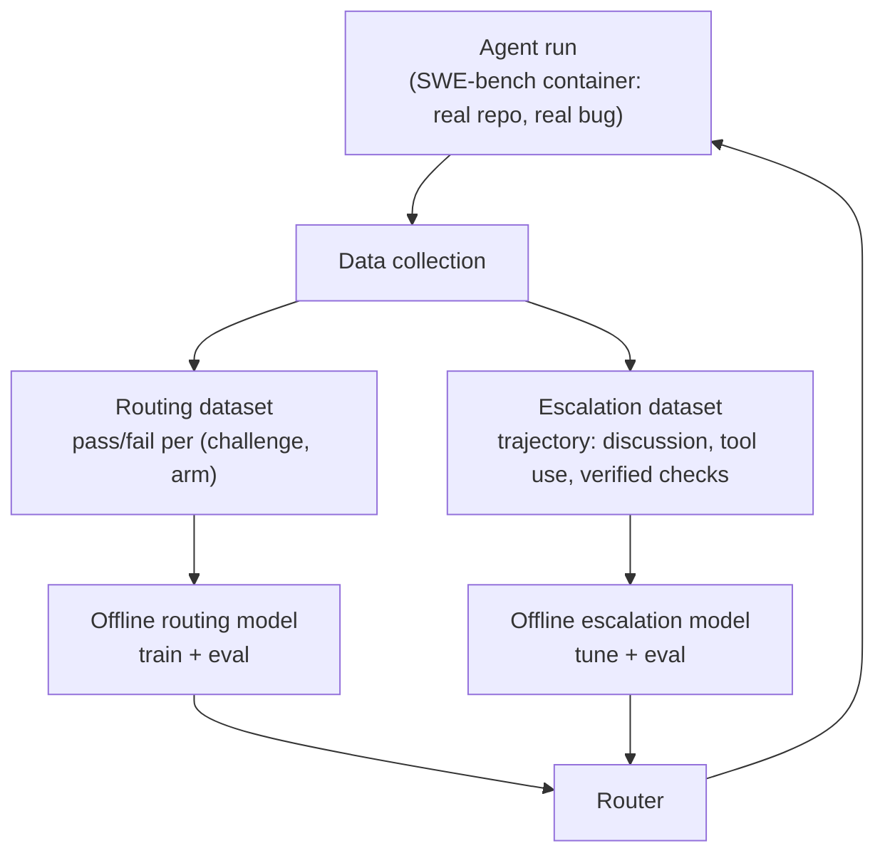
```mermaid
flowchart TD
  A["Agent run<br/>(SWE-bench container: real repo, real bug)"] --> B[Data collection]
  B --> C["Routing dataset<br/>pass/fail per (challenge, arm)"]
  B --> D["Escalation dataset<br/>trajectory: discussion, tool use, verified checks"]
  C --> E["Offline routing model<br/>train + eval"]
  D --> F["Offline escalation model<br/>tune + eval"]
  E --> G["Router"]
  F --> G
  G --> A
```

We own this loop end to end and rely on a trusted external source only for the
*challenges* themselves — SWE-bench Verified, which ships containerised
repositories with real bugs and the repo's own tests as the grader. We use no
precomputed leaderboard numbers. Everything else is ours: our runs, our labels,
our evaluation.

That makes both problems **supervised**, with a dataset we can re-score offline
against data already on disk. Testing a new routing rule or a new escalation
detector costs nothing.

### Context → Action → Feedback

- **Context** — the task text, embedded. This is what the **routing** model sees,
  once, at the task boundary.
- **Action** — route the task to a (model, reasoning-effort) arm.
- **Feedback** — two channels. The main one is the **escalation** loop: verified
  check results streaming out of the running trajectory, which decide whether to
  escalate mid-task. The second is **human feedback** via `shunt flag` — a
  working proof of concept, not yet deeply integrated.

Full loop: [docs/feedback.md](docs/feedback.md).

## The two models

They answer different questions, on different inputs, at different times.
Conflating them makes every number ambiguous, so we keep them apart throughout.

| | **Routing model** | **Escalation model** |
|---|---|---|
| Question | Which (model, effort) should *start* this task? | Is this attempt going to fail — escalate *now*? |
| When | Once, at the task boundary, before any tokens are spent | At the next boundary, once a verified outcome exists — live, one per closed session |
| Input | The task text, embedded | Verified failing-check ids from re-running your tests off the wire |
| Learns from | Task outcome, pass/fail | Whether this attempt ultimately failed |
| Today | k-nearest-neighbours over task embeddings | A recurrence rule over verified failing-check ids |
| Status | **No measurable signal over the base rate yet** | **First attempt, not working — `NO_SKILL`** |
| Next | bigram / linear models, calibrated classifiers, better selection rules | calibrated risk scoring, structural loop features, late fusion |

The escalation model is a **first attempt**, inspired by the published
[ACRouter](https://arxiv.org/abs/2606.22902) design. It does not currently show
good performance, and it ships **disabled**. We reproduced that paper and
withdrew our citation of it; the write-up is in the
[research log](docs/research-log.md).

### Both pipelines, end to end

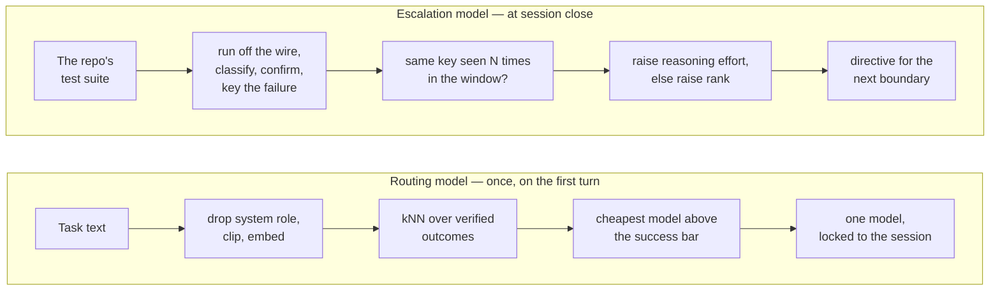
```mermaid
flowchart LR
  subgraph R["Routing model — once, on the first turn"]
    direction LR
    R1["Task text"] --> R2["drop system role,<br/>clip, embed"] --> R3["kNN over verified<br/>outcomes"] --> R4["cheapest model above<br/>the success bar"] --> R5["one model,<br/>locked to the session"]
  end
  subgraph E["Escalation model — at session close"]
    direction LR
    E1["The repo's<br/>test suite"] --> E2["run off the wire,<br/>classify, confirm,<br/>key the failure"] --> E3["same key seen N times<br/>in the window?"] --> E4["raise reasoning effort,<br/>else raise rank"] --> E5["directive for the<br/>next boundary"]
  end
```

**The routing model** reads the first turn's `user` and `tool` text — the system
prompt is dropped, it would swamp the clip window — clips it, and embeds it with a
CPU-only fastembed model. That vector queries an HNSW index of past sessions whose
outcomes you verified. Each neighbour is weighted by its verification confidence and
its closeness; models are then scored on weighted success rate, and the **cheapest
one clearing the success bar with enough samples** wins. Below the bar it falls
through to the cheapest model it has no history for, which is why an under-informed
router looks a lot like `always_cheap`. Until enough verified outcomes accumulate it
cold-starts to a fixed cheap model. The pick is then **locked to the session** — that
lock is the cache-safety guarantee. Depth: [docs/routing.md](docs/routing.md).

**The escalation model** is two stages, and only the first involves pattern matching.
At session close Shunt re-runs *your* repo's suite off the wire — pytest, jest,
`go test`, `cargo test`, auto-detected — and classifies the result by exit code
first, then by regex over the output: did tests really run and fail, or was this an
environment error? A genuine failure is re-run to confirm it is not a flake, then
given a **dedup key**: the failing test's node id, or a hash of the detail with
timings, addresses, temp paths and seeds stripped. Stage two is plain counting. When
the *same* key reaches `escalate_after_n` confirmed, non-infrastructural failures
inside a window of recent decisions, the router raises the current model's reasoning
effort — same model, so the prompt cache survives — and only steps to a pricier model
once that ladder is exhausted. Different failures never add up; a passing suite wipes
the slate. Depth: [docs/escalation.md](docs/escalation.md).

**One verified outcome per session, not per step.** The verifier runs at session
close, so escalation sees at most one failure event per session — never one per tool
call. With the shipped threshold that means two *sessions* failing the same check.
It does not watch an attempt unfold and step in mid-flight.

### Where they stop

- The routing model rests on ranking task difficulty from a prompt embedding, and on
  agentic coding that signal has not cleared our bar. The proxy and cache-safety do
  not depend on it; the kNN decision does.
- An empty neighbourhood and a confident one produce the same-looking response. Only
  `shunt explain` tells them apart.
- Escalation is inert without a repo it can test, and inert on a repo with no tests.
- Escalation grades nothing — it counts. Every confirmed failure weighs the same, so
  a trivial assertion and a total collapse are one event each.
- A test runner whose output varies run to run in a way our normalisers do not strip
  yields a fresh key every time, so recurrence never accumulates. The field still
  looks populated, which is what makes it quiet.
- Neither model adapts mid-session. The model is locked; a directive applies to the
  next boundary.

### Scope: SWE tasks today

Both models handle **software-engineering work only**. The routing corpus is coding
tasks, and escalation's only verified signal is a repository's own test suite. Point
Shunt at a notebook, a market analysis, or a piece of prose and it still proxies and
forwards — but the routing decision has no evidence behind it and nothing grades the
result afterwards.

### Rank and cost are different orderings

Easy to conflate, so, precisely:

- **Cost** is the dollars a task actually consumed: `real_cost`, cache-aware,
  read from the provider's own usage accounting. Never a price-list estimate.
- **Rank** is a model's position in the registry, which is ordered by **price**.
  It is *not* a capability ordering — the cheapest model in our registry
  outscores one at 5× the price, as [The problem](#the-problem) shows.

## Quick start

```bash
pip install shunt-router
shunt
```

Or with Docker:

```bash
docker run -p 127.0.0.1:8080:8080 --env-file .env ghcr.io/kookas/shunt-router
```

Then point your agent at it. **Claude Code** and any Anthropic-wire client:

```bash
export ANTHROPIC_BASE_URL=http://127.0.0.1:8080
```

**opencode, aider, Continue** and any OpenAI-compatible client:

```
base_url = http://127.0.0.1:8080/v1
```

Copy-paste config for each tool — plus a dry-run handshake that proves the wiring
without spending a cent — lives in
[`examples/integrations/`](examples/integrations/README.md).

## Benchmark

Routing strategies and escalation detectors are scored on SWE-bench-Verified
tasks judged by their own tests: reward (quality − cost), bootstrap confidence
intervals, permutation nulls, and a Pareto check against a perfect-information
oracle. Method: [`docs/benchmark.md`](docs/benchmark.md). Every figure carries its
own READ / GOAL / TERMS / NOTE / LIMITS footer, so a plot lifted out of context
still says what it can and cannot support.

### Routing

<details>
<summary><b>Five plots that carry the routing story</b> (click to expand)</summary>

<br>

**Read all five with one caveat.** Every embedding-based reading below was
computed while the router embedded a 106-character identifier label rather than
the task's problem statement. They describe the shipped pipeline as it stands;
they are not results about embeddings. See *Three claims we retracted* below.

**1. The kill-gate figure.** Left panel: every strategy's cost against its pass
rate, with Always-Frontier's own confidence band drawn as the "equal quality"
zone. Right panel: the same contest restricted to the 84 tasks where both
strategies chose genuinely *measured* cells. *How to read it:* the left panel's
dollars are roughly half projection — read the right panel before believing any
saving.

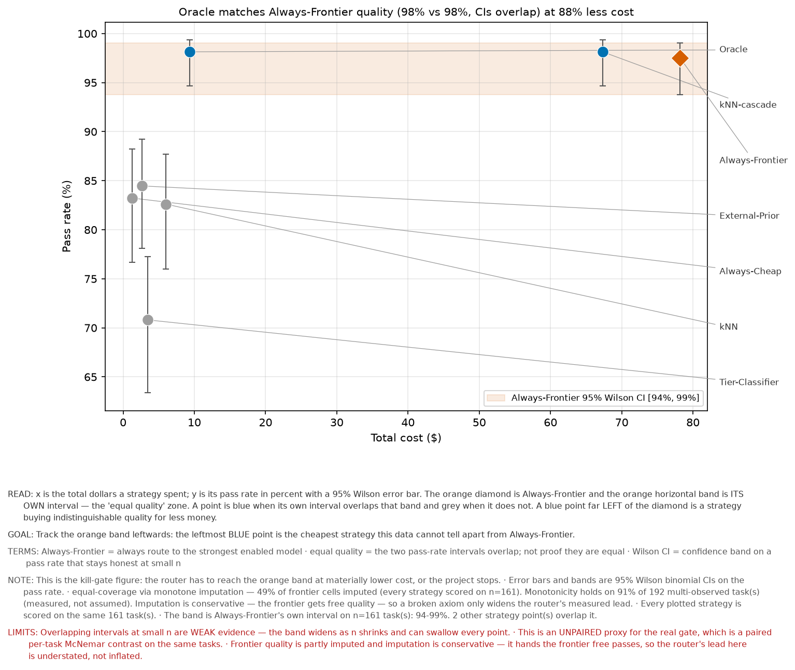

**2. Strategy comparison.** Pass rate vs cost per strategy on a log axis, with
95% intervals and the Pareto frontier. *Look for:* a strategy up near the oracle's
pass rate but well left of the frontier baseline's cost. The intervals on the top
strategies overlap almost entirely.

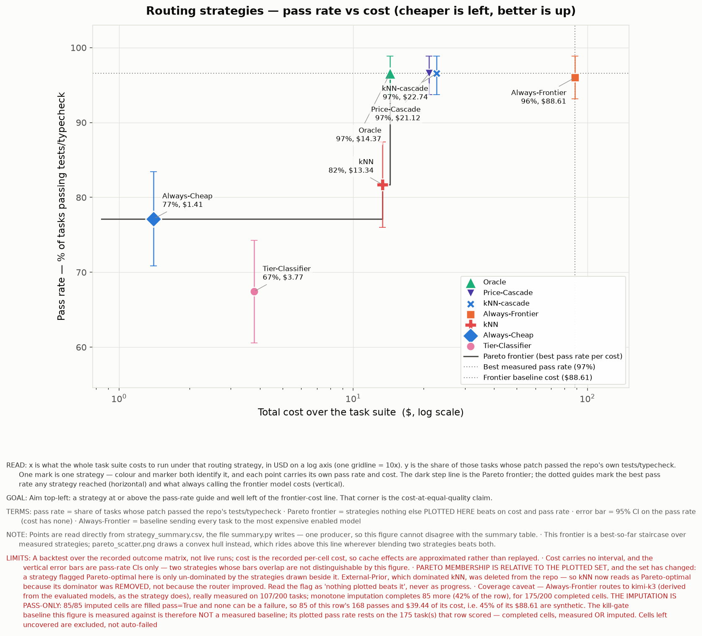

**3. Measured vs projected cost.** Each bar splits a strategy's total into dollars
a provider **actually billed** (solid) and dollars **projected** for cells we
never ran (hatched). *How to read it:* the hatched fraction is how much of the
headline is inference rather than measurement. Imputation is not neutral — every
projected cell is filled as a pass.

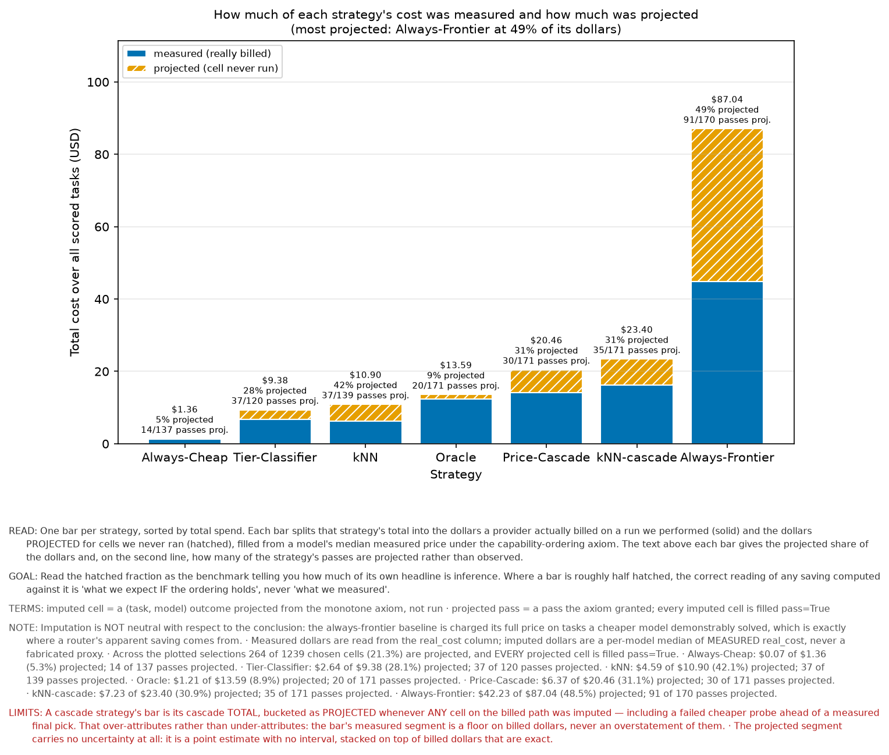

**4. Does the kNN router transfer, or memorise?** Leave-one-task-out pass rate
against *k*, with three reference lines: pure memorisation, the best single
always-one-model policy, and a shuffled-outcome null band. *Look for:* the blue
line above the grey band and above the green line. It is inside the band at every
*k* — on this corpus the router scores what chance scores.

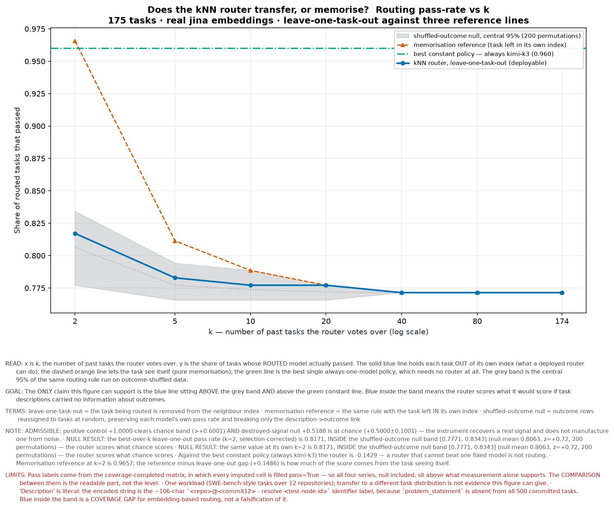

**5. Why it behaves that way.** A 2-D PCA of the jina vectors the router actually
stores, each task coloured by its measured `p_solve`. *Look for:* hard and easy
tasks separating. They don't. Note what was encoded, though: the 106-character
label, not the problem statement. So this shows difficulty is not recoverable
from an identifier — not that it is unrecoverable from the task.

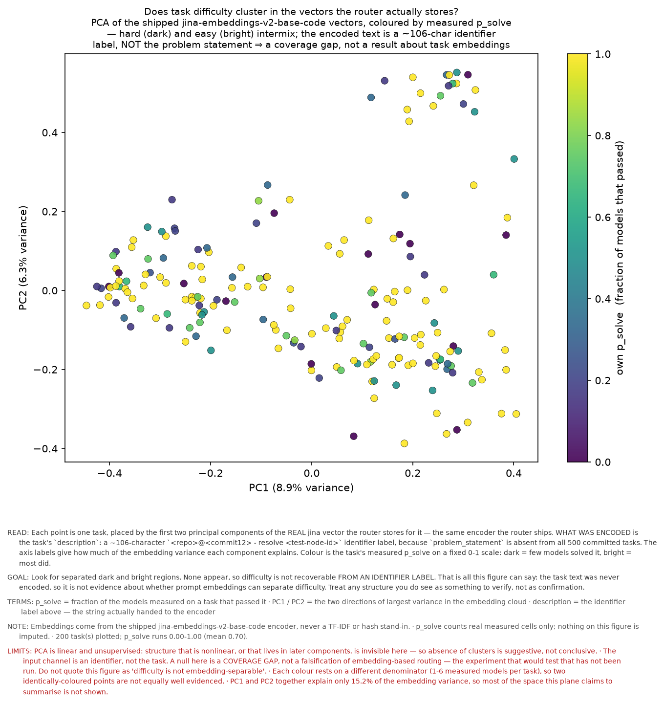

</details>

### Escalation

<details>
<summary><b>Four plots that carry the escalation story</b> (click to expand)</summary>

<br>

**1. The gate: is it beating its own null?** The grey histogram is the same
statistic recomputed under randomly shuffled outcome labels, with the whole
fitting pipeline re-run per shuffle, and labels shuffled *inside* each challenge
so both arms keep the same prior; dashed lines bound the null's central 95%.
*How to read it:* for the detector to be doing anything, the red line must sit
clearly right of the upper dashed line. Under the corrected methodology using
StratifiedGroupKFold to avoid fold-prevalence accounting artifacts, the
incremental signal is not measurable — resampling whole challenges puts the
increment at approximately zero, so the harness returns `NO_SKILL`. (An earlier
evaluation reported +0.076 here, but that figure was inflated by the same
between-fold base-rate artifact that contaminated the prior column; see the
retraction section below.)

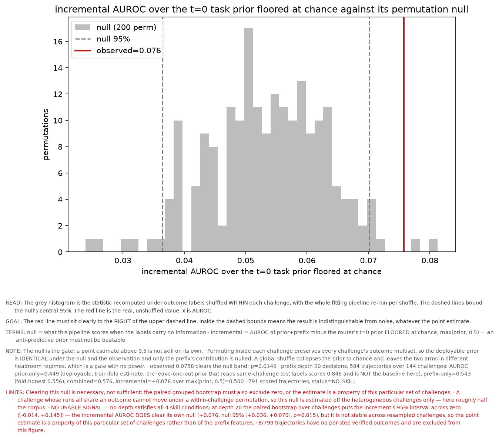

**2. The question the product actually asks.** Of the runs the policy escalated,
how many failed — against the runs it left alone, and against the corpus base
rate. *Look for:* the escalated bar clearly above the base-rate line. On this
corpus the policy escalates every scored run, so there is no left-alone arm and
the escalated rate is the base rate by construction (lift 1.00×).

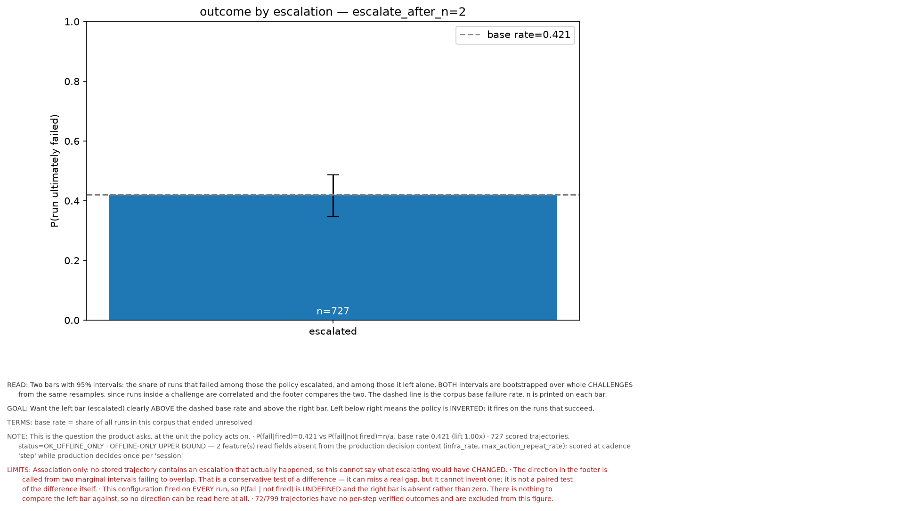

**3. Ranking quality.** The ROC curve for the detector's score against the
corrected causal label. *Look for:* a curve leaving the grey permutation-null
band toward the top-left. The reference is that band and the dashed line at its
**measured** centre — not the faint 0.5 diagonal. The whole pipeline is refit on
every label shuffle, so its no-information AUROC is something the harness
measures rather than assumes; the legend prints the value it came to. The curve
stays inside the band.

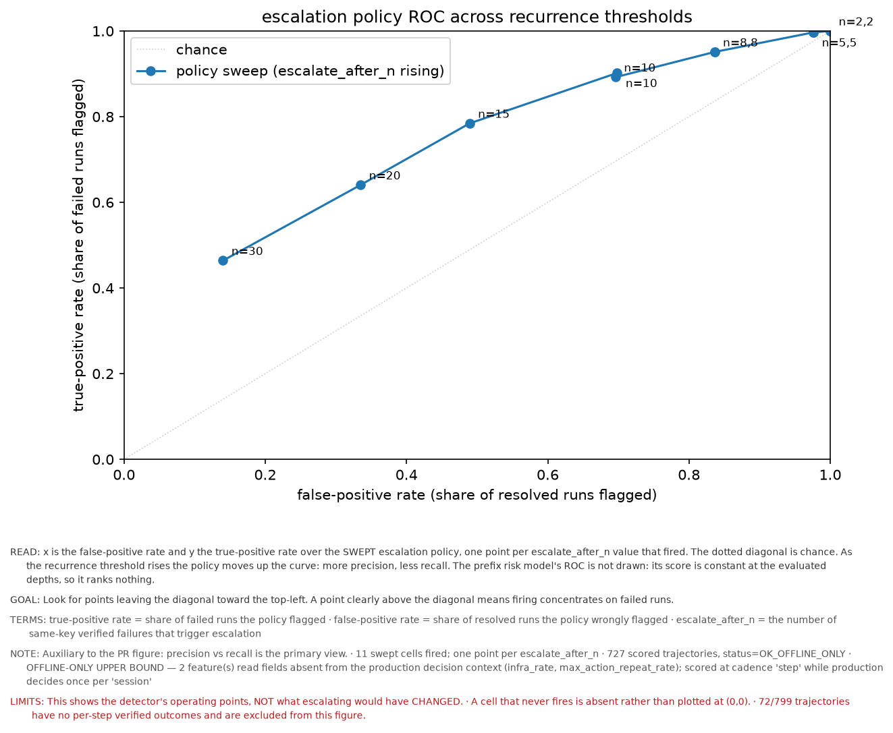

**4. A data gap, now closed.** Share of each model's trajectories that went
through per-step outcome stamping. *Look for:* every bar at 1.0. All six now are.
Three models used to sit at **zero**, leaving the recurrence trigger structurally
dead on them; offline container replay re-stamped those runs at zero API cost.
Closing the gap did not change the verdict.

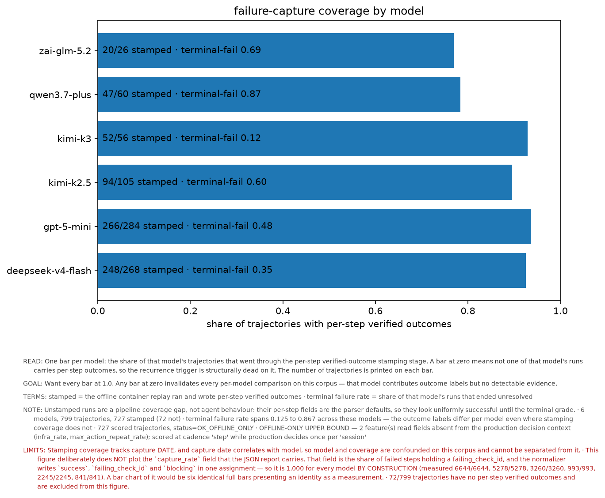

</details>

## Results

Full numbers, method, and caveats: **[docs/results.md](docs/results.md)**. The
headline, stated plainly:

> **Cheap-first routing with verified escalation reaches always-frontier quality
> for roughly a quarter of the cost ($20.46 against $87.04) — but the machine
> learning contributes nothing to that, and the escalation model does not work.**
> The saving is real and comes from *mechanism*, not prediction.

| strategy | pass rate | total cost |
|---|---:|---:|
| Oracle (hindsight — not deployable) | 96.6% | $13.59 |
| Price-Cascade | 96.6% | $20.46 |
| kNN-cascade | 96.6% | $23.40 |
| Always-Frontier | 96.0% | $87.04 |
| Always-Cheap | 77.4% | $1.36 |
| kNN | 78.5% | $10.90 |
| Tier-Classifier | 67.8% | $9.38 |

`Price-Cascade` uses no embeddings, no nearest neighbours, and no training. It
tries models in ascending price order and stops at the first one whose patch
passes. Of the deployable strategies whose quality interval overlaps
Always-Frontier's, it is the cheapest. The learned `kNN-cascade` costs *more* for
the same 96.6%.

Three things we will not let you take away from that table:

1. **It is part projection.** 31% of Price-Cascade's dollars and 49% of
   Always-Frontier's are imputed, and every imputed cell is filled as a **pass**.
   On the 84 challenges where both chose genuinely measured cells, it is
   Always-Frontier **$43.72 @ 91.7%** vs Price-Cascade **$13.42 @ 92.9%**
   (McNemar p = 1.000) — about a third of the cost. The saving survives, but that
   subset is opportunistic, not pre-registered.
2. **The two quality figures are not the same kind of number.** A cascade stops
   at the first attempt whose tests pass and is scored on that same label, so its
   figure is best-of-N coverage while Always-Frontier's is single-shot. We flagged
   exactly this pattern as a flaw in prior work; it applies to us too. The cost
   axis is honest — every attempt in the chain is billed.
3. **The learned part contributes nothing here — but read the next section
   before concluding it cannot.** kNN's leave-one-out accuracy equals the base
   rate to four decimals and sits inside a permutation null at every *k*. That
   result stands as a description of what our shipped router does. It is *not*
   yet a result about embeddings, for the reason below.

We would rather publish that than keep selling the model. **We do not claim the
make-or-break gate is passed.**

### Three claims we retracted after auditing our own benchmark

An audit of every committed figure found that three conclusions we were about to
sell you were **measurement artifacts**. We are leaving this section in the
README rather than quietly fixing it, because how a project handles its own bad
results is the only evidence you have about the rest of its numbers.

**We were not embedding the task.** The router embedded a string built as
`repo@sha — resolve <pytest node id>` — a median of 106 characters containing a
repo slug, a truncated commit hash and a test path. No problem statement, no
code, nothing about difficulty. 61% of each task's twenty nearest neighbours
shared its repo, against a 10% chance rate: it was behaving as a path detector.
So *"prompt embeddings cannot separate task difficulty"* had never actually been
tested. It still has not been. `routing_text()` now prefers `problem_statement`,
but that key is absent from all 500 committed tasks, so the embedder receives the
106-character label on every one of them.

There is task-level structure for it to find. Task identity accounts for about
43% of outcome variance (ICC 0.427), and SWE-bench's crude three-level human
difficulty tag recovers r = +0.29 leave-one-out, +0.27 under repo-grouped CV,
where the 768-dimension embedding recovers −0.05. Neither of those is a text
measurement — one is a variance ceiling, the other a curated human label — so
they bound what a predictor could reach; they do not show the signal is in the
prompt. The tag itself ships in the corpus, but the analysis that produced those
two correlations does not, so read them as an indication of where the headroom
sits rather than as a committed result. We keep them because this is the one
positive result here that survived repo-grouped cross-validation, and cutting it
would leave a tidier record than the evidence supports.

**We tried it on the real problem statements, and we cannot yet close the
question.** In an off-corpus one-off pass, whose figures the committed corpus
does not carry, feeding the genuine SWE-bench issue text (median 1,572 characters
instead of 106) to the same shipped embedder moved almost nothing: R² −0.072 →
−0.061, r −0.052 → −0.026 with a confidence interval straddling zero,
same-repo neighbour rate 61% → 58%. Adding the failing test names did not help,
and neither did lifting the 4,000-character clip that truncates 10.7% of
statements.

We used to report that as the falsification holding. **It is not one.** Nothing
in this repository reproduces it — the corpus still carries no problem
statements, so the only channel the committed code can measure is the label. And
the suite is too blunt to settle the question either way:

```sh
python3 -m benchmark.routing.sensitivity
```

puts the weakest effect this test can detect at 80% power at **AUROC ≈ 0.88** —
the most sensitive of the eight configurations it sweeps, which is a minimum over
those eight and not a bound. The selection rule the transfer figure actually
quotes is worse still: in three of its four cells even a perfect signal fails to
clear 80% power at all, and the fourth needs AUROC 0.94. Published
task-difficulty detectors sit near 0.62. An instrument whose best cell sits 0.26
AUROC above the best anyone has demonstrated, reporting that it found nothing, is
reporting its own floor.

So the position is neither "embeddings separate task difficulty" nor "they
cannot". On this corpus **the question is open and currently unmeasurable**, and
that is a third thing. What the numbers below do describe, accurately, is what
our shipped router does when handed a 106-character label: across every variant
it sent 172–175 of 177 tasks to the cheapest model, landed on *exactly* the
always-cheap pass rate, and cost more doing it — $1.58–1.78 against $1.36. That
is not a router. It is a routing tax. What it is not is a result about
embeddings.

**Our escalation baseline was reading the test labels.** The comparison gave each
run the leave-one-out failure rate of *its own instance's other runs*, while the
cross-validation split grouped by instance — so the baseline was scored on labels
from its own test fold. A router meeting a new task has no such siblings. That is
where `AUROC 0.883` came from; computed honestly it is about 0.42–0.45. Since the
headline was `detector − baseline`, the detector was being asked to beat an
oracle, which is why it reported −0.000.

Worse, the permutation test that was supposed to catch this **could not fire.**
Shuffling labels globally collapses the baseline to chance, giving the null 0.5
of headroom while the observed statistic was arithmetically capped at 0.117 — and
the null's 97.5th percentile sat at 0.117. No detector, however good, could ever
have passed that gate. The null now permutes labels **inside each challenge**, so
every challenge keeps its outcome multiset and the baseline is identical under
the null and the observation; only the prefix's contribution is nulled.

**And the comparison was floored the wrong way — or rather, not at all.** The
honest prior scores *below* chance on this corpus (0.42 at 5 decisions), so
`combined − prior` was handing the detector the baseline's deficit as if it were
skill. Measured against `max(prior, 0.5)`, as it always should have been, the
headline increment at 5 decisions falls from **+0.144 to +0.061** — 57% of it was
the broken comparator. What remains does not clear the corrected null.

**Our escalation baseline was reading the fold identity.** The prior column,
`prior_from_splits`, gives every test row its train-fold base rate. Under the old
GroupKFold, that value is the exact arithmetic complement of the fold's own test
prevalence (measured corr = −1.0000 at every depth). The prior thus acted as a
fold-identity proxy: it added zero within-fold discrimination
(within-fold Spearman = 1.000000) while shifting the pooled AUROC. The
incremental headline at depth 20 was published as +0.076, p = 0.015. But six
columns of pure Gaussian noise over the real challenge group structure produced
E[incremental] = +0.042 at depth 20, with a maximum of +0.080 across 8 seeds —
the published +0.076 was *smaller* than what pure noise produced. StratifiedGroupKFold
now collapses the fold-prevalence spread from 0.141 to 0.011, and a null-corpus
regression test pins E[incremental] ~ 0. The pre-existing positive-control
fixture was structurally immune (one failed and one resolved run per challenge
makes every fold base rate exactly 0.5), which is why it never caught the defect.
A label-substitution positive control tested the real six features against model
identity (cheap vs frontier): AUROC 0.497/0.525/0.538 at depths 5/10/20, versus
0.428/0.491/0.543 against the real failure label — both measured before the
state-capture audit marked unverifiable steps as unmeasured. That the shipped
features cannot distinguish model identity — a fact unambiguously present in
trajectory patterns — shows the gate was a null generator, not an instrument.

So we are withdrawing *"the escalation model does not work"* and replacing it
with something less satisfying and more accurate: **we cannot yet tell.** This
evaluation could only ever have detected a detector at AUROC ≥ 0.59. The raw
features hint at ≈ 0.52 — squarely inside the blind spot. Resolving it needs
roughly four times the distinct challenges (152 → ~640); more runs per existing
challenge buy almost nothing, because the clustering already inflates variance
~3×.

**What survives all of it:** the cascade result. Price-Cascade at $20.46 against
Always-Frontier's $87.04 is untouched by every defect above — it uses no model,
so there was no model to get wrong. If anything the audit sharpened it: 90.6% of
the headroom is mechanical, which bounds the entire remaining prize for a perfect
difficulty predictor at **$6.87 on a $20.46 base**. That number is the honest
answer to "how much is routing intelligence worth here", and it is small.

## Future

Where the work goes next, in priority order.

- **The escalation model.** The genuinely unsolved one. We will work through
  rule-based detectors, regex over verified check ids, ML approaches (calibrated
  classifiers, n-gram and bigram models over trajectory events, embeddings), and
  quite possibly a **fusion** of several weak signals rather than one winner. The
  feedback that matters is diverse: unit tests today, but literature, business
  rules, and spreadsheet checks in other domains. Fusion is the natural shape for
  combining signals of different flavours.
- **Closing the identification gap.** Our logging policy never escalates, so
  P(escalate) = 0 and no off-policy estimator is identified. ε-greedy
  randomisation at flagged checkpoints with logged propensities fixes it.
- **More routing algorithms.** kNN is the first, not a commitment. Bigram and
  linear models, calibrated classifiers, better selection rules.
- **More distinct challenges.** Offline re-stamping is done — 727 of 799
  trajectories carry verified per-step outcomes — but they cluster on only 152
  challenges, and that clustering, not the trajectory count, is what caps what
  the eval can resolve.
- **Domains beyond software engineering.** Both models are scoped to SWE tasks
  because that is where the verifier is free: the repo's own tests. The direction is
  data science and ML work next — a notebook that runs, a metric that moves — and
  then non-engineering work such as business analysis and literature, where the check
  is a spreadsheet rule or a rubric a person signs off. Each domain needs its own
  dataset, its own verifier, and its own honest evaluation, which is what
  divide-and-conquer above is for. Nothing here is scheduled, and none of it starts
  before the SWE case holds up.
- **CLI / UI** to monitor and manage Shunt, low-level work on the hot path,
  mid-session model adaptation, and an enterprise suite (audit, RBAC, monitoring).

## Contributing

Early is the best time to shape this. Concretely, here is what helps most:

- ⭐ **Star the repo** if you want to follow whether the thesis survives contact
  with the data.
- 🚨 **Ideas on the escalation model.** The genuinely unsolved one. What signal in
  an agent's trajectory actually predicts failure early enough to be worth acting
  on? We have 727 labelled trajectories and a harness that will tell you honestly
  whether your idea works. Rules, n-grams, embeddings, small classifiers, fusion
  of several weak signals — open to anything.
- 🧠 **Ideas on the routing model.** kNN is a starting point. If you have reason to
  think something beats the base rate here, we want to hear it.
- 💬 **Open a discussion or issue** with your workflow, your cost pain, or an idea.
  If you think a number in [Results](#results) is wrong, say so and we'll check
  it — we would rather publish a null result than a flattering one.
- 📝 **Docs and typo fixes** make a low-friction first pull request. Sign off
  under the [DCO](CONTRIBUTING.md).
- 📊 **Benchmark results** are especially welcome. **Ask before running one:**
  results are cost-expensive (a single frontier-model datapoint can run $0.5–3),
  and we're adding per-contributor key signing so every datapoint stays
  attributable to who produced it.

See [CONTRIBUTING.md](CONTRIBUTING.md) for how changes get merged. Architecture,
layout, and capabilities: [docs/architecture.md](docs/architecture.md).

## License

**[Apache-2.0](LICENSE)** — free for everyone, with a patent grant.

Security disclosures: [SECURITY.md](SECURITY.md) ·
Community standards: [CODE_OF_CONDUCT.md](CODE_OF_CONDUCT.md)
</content>
