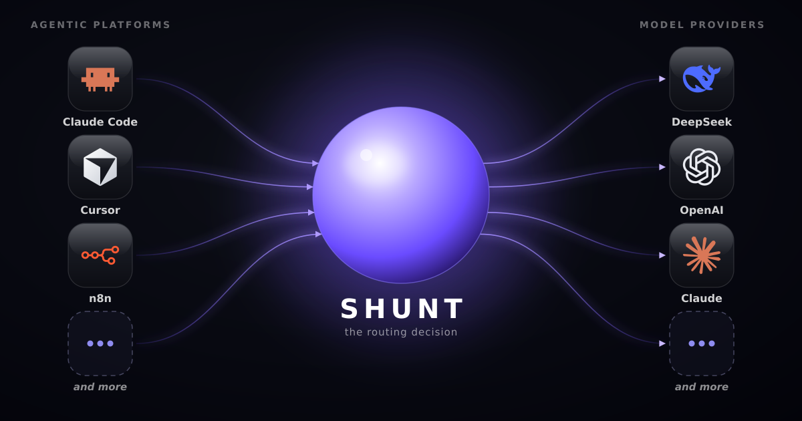
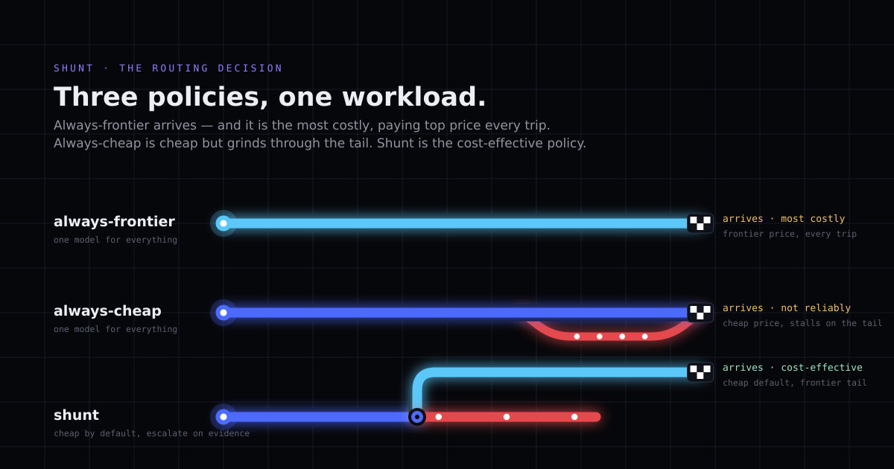
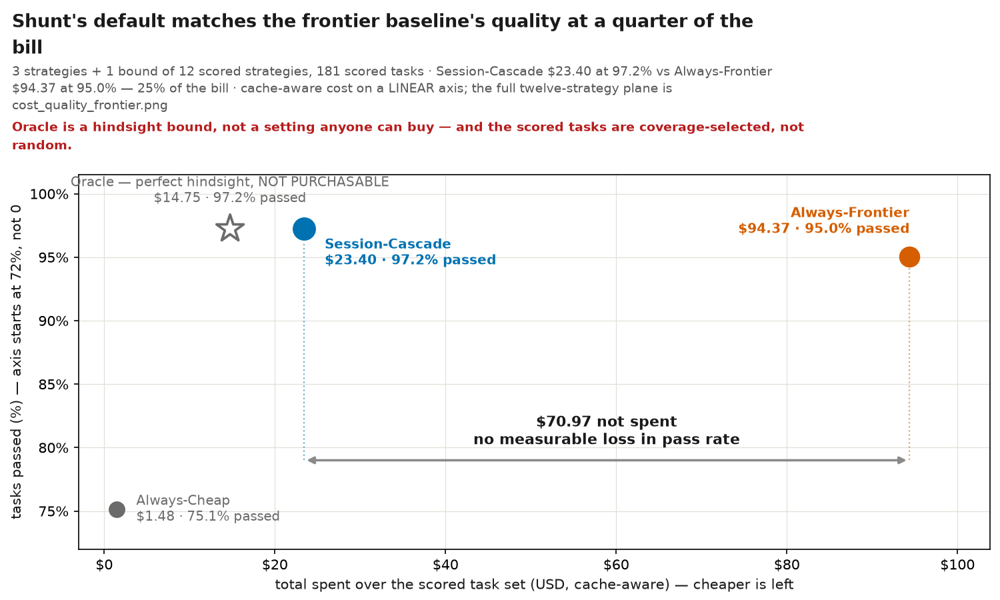
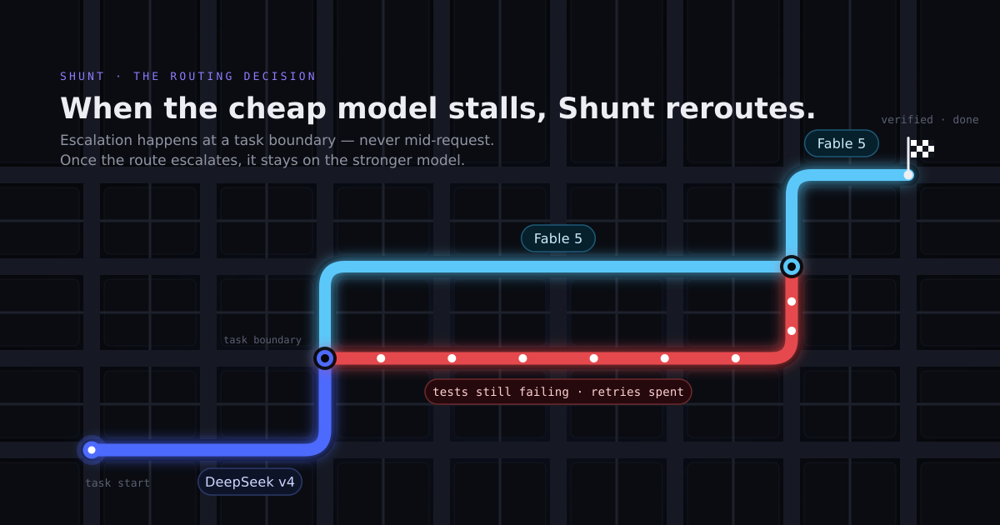
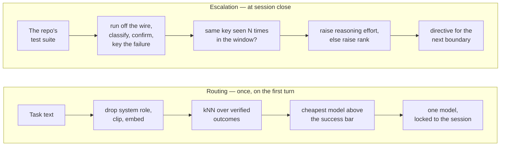

<!--
  README charter — what belongs on this page.

  This page is the pitch, not the paper. Someone with no machine-learning
  background should understand what Shunt is, and why it is worth their time,
  before the first scroll ends. Write for them; the experts have docs/.

  - Sell the project. Lead with the result. Method and caveats come after it,
    never before it.
  - Keep it short. If a section could be a link into docs/, make it a link.
    Length here is a cost paid by every visitor.
  - Do not bombard with numbers. A number earns its place only when it carries
    the claim. Keep confidence intervals for the headline and its baseline and
    nowhere else; no AUROC, R-squared, permutation nulls or p-values on this page.
  - Stay intuitive. Say it in plain words first. The precise version lives in
    docs/, one link away, and every claim here should be one link from its
    evidence.
  - Publish the negative results, briefly. Honesty is part of the pitch rather
    than a footnote to it — but one short section, not a chapter.
  - Human prose. Vary sentence length; let a short sentence sit next to a long
    one. Commit rather than hedge. Cap the boldface. Sentence-case headings.
    Two or three significant digits, never more than the error bars support.

  Cutting is the default. If this file has grown past roughly 400 lines, the
  question is what to remove, not where to add.
-->

<p align="center">
  <picture>
    <source media="(prefers-color-scheme: dark)" srcset="docs/assets/lockup-brand-dark.svg">
    
  </picture>
</p>
<!-- Theme-aware wordmark; the emoji + text alt is the placeholder if the SVG fails to load. -->

<p align="center">
  <b>Open-source, self-hosted LLM router. One cheap model for the routine work,
  a frontier model for the hard tail — and the line between them learned from
  your own passing tests.</b>
</p>

<p align="center">
  <a href="https://kookas.github.io/shunt/"></a>
  
  
  
  
  
</p>

<p align="center">
  <picture>
    <source srcset="docs/assets/routing.webp" type="image/webp">
    
  </picture>
</p>
<!-- Animated WebP where supported (GitHub renders it); the static hero.svg is the fallback/placeholder. -->

## The problem

Most of what a coding agent asks a model to do is routine, and a cheap
open-weight model handles it. A minority of tasks are genuinely hard and need a
frontier model. Today your agent pays frontier prices for both.

Price is not capability, either. On our benchmark the cheapest model we tested
finishes three tasks in four on its own, and it beats a model costing five times
as much. So paying top rates for every request buys very little most of the
time — and a lot, occasionally. Telling those two cases apart is the whole
problem.

Shunt is a local router that sits between your agent and the model API. Point
your agent at it with one environment variable. It picks a model per task,
watches how each model actually does on *your* work, and moves up to a stronger
one when the evidence says the current attempt is going nowhere.

## What it saves you

Think of it as satnav. The cheap model is the default road. Always taking the
motorway gets you there and overpays for every trip; never leaving the back
roads is cheap until you stall in traffic. Shunt takes the cheap road by
default and pays motorway prices only for the stretch that needs it.

<p align="center">
  
</p>

Here is what that costs, measured. Left to right is what each approach spent
over the same set of tasks; up is how many it finished. Cheap is left, good is
up.



The orange dot is what most setups do today. The blue dot is Shunt's default:
same height, a third of the way along. The other eight strategies we measured,
and the uncertainty on every point, are in
[docs/routing.md](docs/routing.md#fig-cost-quality-frontier).

| strategy | pass rate | total cost, 184 tasks |
|---|---:|---:|
| Oracle — a cheat: picks the right model already knowing the answer | 96.7% | $18 |
| `session_cascade` — the default | 96.7% | $29 |
| `knn_semantic_cascade` — opt-in | 96.7% | $38 |
| Always frontier — what most setups do today | 95.1% | $96 |
| Always cheap | 75.5% | $1.50 |

184 SWE-bench-Verified tasks, each judged by its own repository's test suite.
Method: [docs/benchmark.md](docs/benchmark.md). Full tables, every strategy we
dropped from this one, and the caveats: [docs/results.md](docs/results.md).

Read the default against always-frontier: **$29 against $96, at the same pass
rate.** The two quality figures carry 95% confidence intervals of 94.0–98.9% and
91.9–97.8%, which overlap — and that overlap *is* the claim. Same quality, a
third of the bill.

Four things qualify that number, and they are in
[what doesn't work yet](#what-doesnt-work-yet) rather than buried here.

## Quick start

```bash
pip install shunt-router
cd /path/to/your/repo    # not optional — see below
shunt doctor    # prints your config and whether escalation can actually run
shunt
```

Start it from inside the repo you are working on, or pass `--work-dir`. Shunt
learns by re-running that repo's tests when a session closes, so this is not
optional: without a repo it can test, the default strategy is just the cheap
model, the ladder never fires, and the saving above never happens. The router
warns at boot and `shunt doctor` says so. This is also the step that arms
test execution on that tree, so point it at a repo you trust.

Or with Docker:

```bash
docker run -p 127.0.0.1:8080:8080 --env-file .env ghcr.io/kookas/shunt-router
```

Then point your agent at it. Claude Code, and any Anthropic-wire client:

```bash
export ANTHROPIC_BASE_URL=http://127.0.0.1:8080
```

opencode, aider, Continue, and any OpenAI-compatible client:

```
base_url = http://127.0.0.1:8080/v1
```

Copy-paste config for each tool — plus a dry-run handshake that proves the wiring
without spending a cent — lives in
[`examples/integrations/`](examples/integrations/README.md).

## How it works

Two decisions, made at different moments, on different evidence.

<p align="center">
  
</p>

The first decision picks the model that starts a task. The second decides
whether an attempt is going nowhere and a stronger model should take over. Both
happen at a boundary — a task or a session, never mid-request — because
switching models inside a cached turn throws the cache away and you pay to
rebuild the context.


```mermaid
flowchart LR
  subgraph R["Routing — once, on the first turn"]
    direction LR
    R1["Task text"] --> R2["drop system role,<br/>clip, embed"] --> R3["kNN over verified<br/>outcomes"] --> R4["cheapest model above<br/>the success bar"] --> R5["one model,<br/>locked to the session"]
  end
  subgraph E["Escalation — at session close"]
    direction LR
    E1["The repo's<br/>test suite"] --> E2["run off the wire,<br/>classify, confirm,<br/>key the failure"] --> E3["same key seen N times<br/>in the window?"] --> E4["raise reasoning effort,<br/>else raise rank"] --> E5["directive for the<br/>next boundary"]
  end
```

|  | Routing | Escalation |
|---|---|---|
| Question | Which model should *start* this task? | Is this attempt failing — hand it over? |
| When | Once, before any tokens are spent | At the next session boundary |
| Evidence | The task text | Your repo's tests, re-run off the wire |
| Today | Nearest neighbours over past outcomes | Counts repeated verified failures |
| Status | No signal above chance yet | Ships on, unproven — it fires on nearly every run offline |

**A default install does no routing at all.** It starts every session on the
cheapest model and lets a repeated verified failure move it up a rung. That path
never embeds a turn and never queries the neighbourhood — it skips the whole
left-hand box above. The routing model is `router.strategy: knn_semantic_cascade`,
and it is opt-in. This matters for reading the table earlier: the saving is a
mechanism, not a prediction.

**Escalation runs your tests.** When a session closes, Shunt re-runs the
repository's own suite off the wire, works out whether the failure was real or
just a broken environment, re-runs it once to rule out a flake, and gives it a
key. When the same key comes back often enough, the router raises the current
model's reasoning effort first — same model, so the cache survives — and only
moves to a pricier model once that is exhausted. Different failures never add
up. A passing suite wipes the slate.

Auto-detected from your repo's files:

[](docs/escalation.md#which-runners-are-supported)
[](docs/escalation.md#which-runners-are-supported)
[](docs/escalation.md#which-runners-are-supported)
[](docs/escalation.md#which-runners-are-supported)
[](docs/escalation.md#which-runners-are-supported)
[](docs/escalation.md#which-runners-are-supported)
[](docs/escalation.md#which-runners-are-supported)
[](docs/escalation.md#which-runners-are-supported)
[](docs/escalation.md#which-runners-are-supported)
[](docs/escalation.md#which-runners-are-supported)
[](docs/escalation.md#which-runners-are-supported)

The classifier is one runner-independent rule, so anything that reports pass or
fail can be added. `shunt escalate` prints the counter's live state — the
effective config, the current rung, every key in the window, and what the next
decision would do
([reference](docs/configuration.md#inspect-it-shunt-escalate)).

Depth: [routing](docs/routing.md) · [escalation](docs/escalation.md) ·
[the feedback loop](docs/feedback.md).

## What doesn't work yet

We publish our negative results. Here they are in one place, because a project
that only reports its wins is advertising rather than measuring.

First, four things that qualify the table above — we would rather you heard
them from us.

**The three rows at 96.7% retry until something passes.** They are scored on the
attempt that passed; always-frontier gets one shot. That flatters any retry
strategy, ours included. The cost column is honest either way — every attempt in
the chain is billed, failures included.

**Part of that table is filled in rather than run.** About a third of the cells
are projected from cheaper measurements, and every projected cell counts as a
pass, which charges the frontier baseline full price for work a cheap model
demonstrably did. On the 74 tasks where every cell was genuinely measured, the <!-- frozen-value: n=74, date=2026-08-11, run=49b8362 -->
default costs $28.8 against always-frontier's $37.6 — a quarter cheaper, not
seventy per cent. The direction holds. The size does not.

**The benchmark replays each attempt from a clean slate.** Live, a model that
takes over inherits the previous attempt's edits and an uncached conversation.
What that does to quality is untested and we do not know which way it cuts:
[the divergence, stated once](docs/escalation.md#offline-vs-live-cascade).

**Oracle is a bound, not a product.** It reads each task's answer in advance. It
is on the chart to show how much room is left, and it is not a setting.

One more row worth explaining: the opt-in routing model reaches the same quality
as the default and costs about $10 more on this corpus. We publish that because
we measured it.

And the mechanisms themselves.

**Guessing the right model from the text of a task does not beat guessing.** We
look for past tasks that read like this one, and pick the cheapest model that
solved them. On coding work those predictions are no better than random. We
checked that the test itself works: a crude hand-written difficulty label does
beat random on the same code, so this is a real negative result rather than a
broken measurement. The saving above comes from the escalation ladder, not from
prediction.

**We registered one test in advance and it failed.** The pre-registered arm was
the routing model on its own, no ladder. It saved money by giving up more quality
than we had declared acceptable. What we ship clears the same bar, but we found
it after looking at the data, so read it as an observation rather than as a test
we passed.

**The escalation trigger fires on nearly every run.** At the shipped setting it
tells you almost nothing. It ships enabled as a design choice — one decision per
session, cache-safe, bounded spend — not as a measured win.

**An audit of our own benchmark retracted three earlier claims**, including a
baseline that was reading its own test labels. We wrote up what broke and how:
[docs/research-log.md](docs/research-log.md#three-claims-we-retracted-after-auditing-our-own-benchmark).

There is a ceiling on how much the missing piece is worth, and it is low. Almost
all of the saving comes from paying a cheaper tariff, not from predicting
anything: a *perfect* difficulty predictor would be worth roughly $7 more on a
$96 bill. We do not claim the make-or-break gate is passed.

## Scope and limits

Shunt handles software-engineering work. The corpus is coding tasks, and the
only thing that grades an attempt is a repository's own test suite. Point it at a
notebook, a market analysis or a piece of prose and it still proxies and
forwards — but the routing decision has no evidence behind it and nothing checks
the result afterwards. Other domains need their own dataset and their own
verifier; none of that starts before this case holds up.

Known limits, plainly:

- Escalation is equally inert on a repo that has no tests.
- Escalation counts, it does not grade. A trivial assertion and a total collapse
  are one event each.
- A test runner whose output changes on every run defeats the deduplication, so
  repeated failures never add up. Nothing looks broken, which is what makes this
  one easy to miss.
- Neither decision adapts mid-session. The model is locked; a directive applies
  to the next boundary.
- An empty neighbourhood and a confident one produce the same-looking answer.
  Only `shunt explain` tells them apart.

Routing is a statistics problem before it is a systems problem. Making the
pipeline faster buys nothing until the decision rule is right, so we go looking
for that rule wherever it comes from — deterministic, statistical or learned —
and judge it only on our own data. The cheapest strategy we have found so far
uses no embeddings and no training at all, and it beats the learned one.

**What we are betting on.** These are the premises under everything above. Any
of them could turn out wrong, so here they are, stated rather than buried.

- **That your tests are a good enough judge.** A verified pass is our only
  label. A thin suite is a thin signal.
- **That one decision per session is worth what it costs.** Verifying mid-task
  and switching there would be slightly cheaper. It also throws the prompt cache
  away, so we do not do it — and that discipline costs about $1.40 on this
  corpus. We think it is the right trade; it is still a trade.
- **That your work splits the way ours does.** Every number here comes from
  SWE-bench Verified, which is mostly Python bug fixes. If more of your work is
  hard than ours, your saving is smaller.
- **That the cache discount reaches your bill.** We measure each provider's
  cache-read price, but the 90% hit rate behind the prices above is assumed,
  not observed. At a lower rate, $29 moves toward $96.

One distinction worth keeping straight. *Rank* is a model's position in the
registry, which is ordered by price — and as above, price is not capability.
*Cost* is the dollars a task actually consumed, read from the provider's usage
accounting, never a price-list estimate.

## Roadmap

- **The escalation model** — the genuinely unsolved one. Rule-based detectors,
  regex over verified check ids, calibrated classifiers, n-gram models over
  trajectory events, and quite possibly a fusion of several weak signals rather
  than one winner. What it would take, in the order the pieces block each other:
  [docs/escalation-claim.md](docs/escalation-claim.md#what-would-take-this-past-pre-alpha).
- **More routing algorithms** — nearest neighbours is the first attempt, not a
  commitment.
- **More distinct challenges.** Our trajectories cluster on 152 challenges, and
  that clustering, not the trajectory count, is what caps what the benchmark can
  resolve.
- **Turning on the randomisation that is already built.** We never record what
  would have happened had we escalated, so we cannot measure whether escalating
  helps. Escalating at random occasionally, and logging that we did, fixes it.
- **Domains beyond software engineering** — data science first, where a notebook
  that runs and a metric that moves are free verifiers.
- **CLI and UI** to monitor and manage Shunt, work on the hot path, mid-session
  adaptation, and an enterprise suite (audit, RBAC, monitoring).

## Contributing

Early is the best time to shape this. One person is shortsighted, and the
highest-value contribution here is an idea rather than a patch.

- ⭐ **Star the repo** if you want to follow whether the thesis survives contact
  with the data.
- 🚨 **Ideas on the escalation model.** What signal in an agent's trajectory
  predicts failure early enough to be worth acting on? We have 723 labelled
  trajectories and a harness that will tell you honestly whether your idea works.
- 🧠 **Ideas on the routing model.** If you have reason to think something beats
  the base rate here, we want to hear it.
- 💬 **Open a discussion or issue** with your workflow, your cost pain, or an
  idea. If you think a number above is wrong, say so and we will check it — we
  would rather publish a null result than a flattering one.
- 📝 **Docs and typo fixes** make a low-friction first pull request. Sign off
  under the [DCO](CONTRIBUTING.md).
- 📊 **Benchmark results** are especially welcome. Ask before running one:
  results are cost-expensive, and a single frontier-model datapoint can run
  $0.5–3.

See [CONTRIBUTING.md](CONTRIBUTING.md) for how changes get merged. Architecture
and layout: [docs/architecture.md](docs/architecture.md).

## License

**[Apache-2.0](LICENSE)** — free for everyone including companies, with a
patent grant, and never gated on routing quality. Sign-off is a DCO, not a CLA.

Security disclosures: [SECURITY.md](SECURITY.md) ·
Community standards: [CODE_OF_CONDUCT.md](CODE_OF_CONDUCT.md) ·
Trademark policy: [TRADEMARK.md](TRADEMARK.md)
