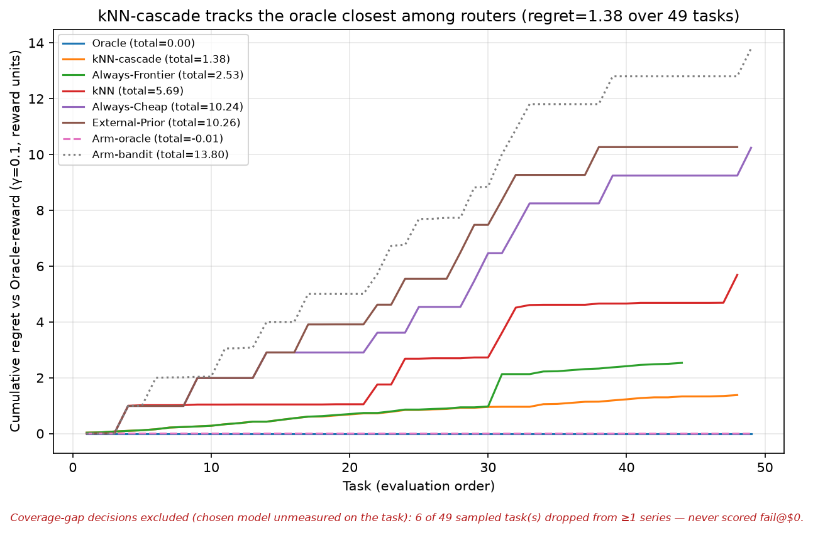

<p align="center">
  <picture>
    <source media="(prefers-color-scheme: dark)" srcset="docs/assets/lockup-brand-dark.svg">
    
  </picture>
</p>
<!-- Theme-aware wordmark; the emoji + text alt is the placeholder if the SVG fails to load. -->

<p align="center">
  <b>Open-source, self-hosted LLM router. Ships a registry of 11 models across
  Requesty and DeepSeek; add any OpenAI-compatible provider yourself.</b>
</p>

<p align="center">
  <a href="https://kookas.github.io/shunt/"></a>
  
  
  
  
</p>

<p align="center">
  <picture>
    <source srcset="docs/assets/routing.webp" type="image/webp">
    
  </picture>
</p>
<!-- Animated WebP where supported (GitHub renders it); the static hero.svg is the fallback/placeholder. -->

**One cheap model for the routine 80%, a frontier model for the hard tail — the
line learned from your own passing tests, not a guess.**

Shunt is a local, cache-safe router between your coding agent and the model API.
Point your agent at it with one env var; it routes each request to the cheapest
model that can do the job — cutting the bill without cutting quality, and proving
it with a benchmark.

## The bet

Most coding-agent requests are routine work a cheap open-weight model handles
fine; only a hard tail needs a frontier model — yet today your agent pays
frontier prices for all of it. Shunt learns which is which from *verified
outcomes* (did the tests pass?), not a model's own confidence, and routes
accordingly. The hard, valuable part is that **decision**; the multi-provider
plumbing is commoditizing to free.

This is a **first step, not a one-time implementation**. Long term we expect to
run more than one model per task and to keep adding routing algorithms, more
evaluation data, and more features — a continuous project aimed at the best
cost-effective success rate for any task.

We work from published research but we don't take it on trust. We previously
cited [ACRouter](https://arxiv.org/abs/2606.22902) here as evidence that a
learned, outcome-grounded router matches frontier quality at lower cost. We then
reproduced it, and **withdrew that citation** — see
[Research, put to the test](#research-put-to-the-test). Every number in
[Results](#results) is from our own runs.

**Goal: find the cheapest model for your task, without losing quality.**

## How it's different

Most routers sit at one of two extremes. **Model fusion** (mixture-of-agents,
ensembling) runs several models per request and combines their answers — it chases
frontier-level quality, but calling many models costs *more* than calling one.
**Rule-based routing** (regexes, keyword patterns) is cheap but blunt: a handful of
hand-written rules can't capture what actually makes a request hard, so they
mis-route the moment a query doesn't fit the pattern. Neither is really built for
*cost* — one overspends for quality, the other is too coarse to trust.

Shunt takes a third path. A **locally-hosted ML model** (a task embedding +
nearest-neighbour lookup) picks the model for each task, and the pick is grounded
in *verified outcomes* — did your tests pass? — not a hand-written rule or a
model's own confidence. The approach is measured on our own SWE-bench benchmark,
and it adapts to *your* work: the more you use Shunt, the more outcomes it has to
learn from. All of it runs on your machine — **no data collection, no telemetry.**

## System Capabilities

What the platform is built to support today:

- 🔌 **Drop-in for any agent.** Speaks both the OpenAI and Anthropic wire
  formats and translates between them, so Claude Code, opencode, aider,
  Continue, Cline, Cursor, and Zed all connect with one line — plus agent
  frameworks (LangChain, Pydantic AI, LiteLLM) and no-code builders (n8n,
  Flowise).
- 🗂️ **A configurable model pool.** A provider registry ranked by price
  (cheapest → priciest), per-model enable/disable, and a fallback chain — you
  own the pool and the prices.
- 🧠 **A decision core.** Task embedding → nearest-neighbour lookup → a
  cheapest-that-succeeds selection rule, plus pluggable strategies (fixed, kNN,
  cascade, tier-classifier, oracle).
- ✅ **Outcome verification.** Async, auto-detected test and typecheck verifiers
  that grade a result without blocking the response at session close. Verified
  outcomes feed the next decision via the kNN index and exploration priors.
- 🔒 **Cache-safety as a design center.** Decisions land at task and session
  boundaries, never mid-cached-turn, so normal operation never silently
  re-reads a cached conversation at full price. The one exception is an upstream
  failure: falling back to another model means that model must prefill the whole
  conversation, because a provider's cache is per-model and cannot be transferred.
  Shunt's job is to make that rare and deliberate, not to pretend it is free.
- 📊 **An offline benchmark.** Scores any routing strategy against a cache of
  verified outcomes — reward (quality minus cost), bootstrap confidence
  intervals, and a Pareto check against a perfect-oracle baseline.
- 🛡️ **Bring-your-own keys, zero telemetry.** Your provider accounts, your keys,
  localhost-bound by default. Nothing is phoned home, replayed, or resold.

## Current status

**Pre-alpha.** The proxy runs and routes the session model on the first turn, and
the learning loop is live: outcomes are recorded automatically at session close
via off-wire test execution, or manually via `shunt flag`, and
feed the next decision. With no outcomes yet, the router cold-starts to the cheap
default. The immediate focus is the **kill gate** — dogfood on a real Claude Code /
opencode workflow and ship routing only if it beats fixed-frontier-with-caching at
equal quality.

**Achieved**

- **Live proxy**: localhost-bound server speaking both the OpenAI and Anthropic wire formats.
- **Decision transparency**: every response carries an `X-Shunt-Decision` header (model + reason).
- **Model registry**: multi-provider, price-ranked, with enable/disable and a fallback chain.
- **Offline benchmark**: routing strategies scored on SWE-bench-Verified tasks judged by their own tests.
- **~18 tool integrations**: copy-paste config plus a dry-run handshake that proves the wiring for free.
- **Published distribution**: `shunt-router` on PyPI and `ghcr.io/kookas/shunt-router` on Docker.
- **Hosted docs**: [kookas.github.io/shunt](https://kookas.github.io/shunt/), built strict.
- **Live learning loop**: automatic off-wire outcome capture (plus manual `shunt flag`) that updates the kNN index, exploration priors, and escalation gate.

**Future**

- **More routing algorithms** — kNN is only the first; we'll try and benchmark
  others and pick the best router for the task.
- **CLI / UI** to monitor and manage Shunt.
- **Low-level performance** work on the hot path.
- **Mid-session model adaptation** — if a session drifts in difficulty, re-adjust the model.
- **Enterprise suite** — audit, RBAC, monitoring, and more.

## Quick start

Install it directly:

```bash
pip install shunt-router
shunt
```

Or with Docker:

```bash
docker run -p 127.0.0.1:8080:8080 --env-file .env ghcr.io/kookas/shunt-router
```

Then point your agent at it — one line, and it talks to Shunt instead of the
provider.

**Claude Code** and any Anthropic-wire client:

```bash
export ANTHROPIC_BASE_URL=http://127.0.0.1:8080
```

**opencode, aider, Continue** and any OpenAI-compatible client:

```
base_url = http://127.0.0.1:8080/v1
```

Copy-paste config for each tool — plus a dry-run handshake that proves the wiring
without spending a cent — lives in
[`examples/integrations/`](examples/integrations/README.md).

## How the decision works

Shunt runs a **Context → Action → Feedback** loop: it sees the task (context),
routes it to a model (action), then records a verified outcome at session close
(feedback) that sharpens the next route. Today the routing algorithm is
k-nearest-neighbours over task embeddings — embed the task, find similar past
tasks with known pass/fail outcomes, pick the cheapest model that succeeded on
work like it — because kNN matches or beats learned routers at lower sample
complexity to start. The algorithm is **not fixed**: as the project grows we'll
pick the best router for the task. The real lever is the labeled
`(task → verified outcome)` store, not the model class.

Verification is what grounds it: async test and typecheck runs grade each result
and inform the *next* decision. Escalation, when it comes, decides at task and
session boundaries — never mid-cached-turn — and quotes the recompute cost
upfront. See [docs/feedback.md](docs/feedback.md) for the full loop.

## Project hypothesis

Two bets, both testable on your own workflow:

1. **Most coding work is routine.** On real coding tasks, an estimated 70–80% are
   solvable by a cheap or open-weight model; only a hard tail needs a frontier
   model. On our benchmark, always routing to the cheapest model solves **77.4%**
   of scored tasks. **Supported.**
2. **Capability and price decorrelate.** A cheaper model can beat a pricier one:
   `deepseek-v4-flash` is our cheapest model at $0.42/Mtok and solves 68.3%,
   against `gpt-5-mini` at 5× the price solving 54.5%. So a model is only worth
   its price if it earns it on *your* tasks; we validate the capability ladder on
   our own benchmark and never assume it from the price list. **Supported.**

Put together: if most tasks are cheap-solvable and price doesn't track capability,
then routing routine work to the cheapest model that can do it — and escalating
only the hard tail — should capture the saving without losing quality.

**Both premises hold. The conclusion does not follow yet:** no routing strategy
we've built converts them into a measured saving over
fixed-frontier-with-caching. See [Results](#results) for exactly where it breaks.

**The make-or-break bar.** This only matters if it beats the obvious alternative.
The bar is blunt: the router must beat **fixed-frontier-with-caching** on cost at
equal quality, measured on your own Claude Code / opencode workflow. If it can't,
it isn't worth running — and we say so rather than ship it. How we measure it:
[Benchmark](#benchmark).

## Measured, not marketed

Prior work is mixed, routing can cut cost at matched quality on some workloads, and the one study on *agentic* Claude Code found no benefit — so we don't quote anyone else's number. We measure our own workflow on our own [benchmark](#benchmark), and there is no "beats Opus" claim here because we haven't earned one on our own data.

Running a frontier model on every task to set that bar is expensive, so Shunt
collects outcomes adaptively — cheap and mid models on every task, the frontier
model only where cheaper models disagree plus a random audit — and estimates the
baseline with a doubly-robust estimator whose validity rests on that audit. The
benchmark can *reject* a bad strategy; it can't *prove* a good one works in
production, which is exactly why the kill gate is measured on a live workflow.
See [`docs/benchmark.md`](docs/benchmark.md).

## Benchmark

We back every claim with our own benchmark: routing strategies scored on
SWE-bench-Verified tasks judged by their own tests — reward (quality − cost),
bootstrap confidence intervals, and a Pareto check against a perfect-information
oracle. Method and how to run it: [`docs/benchmark.md`](docs/benchmark.md). These
are our own runs and grow as the suite scales; contributions are welcome — please
ask first ([Contributing](#contributing)).

<details>
<summary><b>Key plots</b> (click to expand)</summary>

<br>

**Strategy comparison** — pass rate (%) vs cost ($) per strategy, with 95% intervals
and the perfect-information oracle marked. *Look for:* a strategy that is
**high-performing and cheap** — up near the oracle's pass rate but well left of the
frontier baseline's cost. A good router beats always-cheap on quality and
always-frontier on cost; the oracle is the ceiling.

**On our current data, no router does that.** The intervals on the top strategies
overlap almost entirely, and the frontier baseline's row is roughly half filled by
monotone imputation (which can only ever add a pass) — so the cost-at-equal-quality
question is still open, not answered. Read the caveats printed on the figure itself
before drawing a conclusion from it.


**Cumulative regret** — *regret* is how much worse off you are for not having made the
best possible choice: per task, the oracle's reward minus the strategy's reward
(reward = passed − γ×cost). Match the oracle's pick and it is 0; you pay **quality
regret** for failing a task the oracle solved, and **cost regret** for passing on a
bigger model than the task needed. The plot sums that gap over the run.
*Look for:* a **low, flat line** hugging the bottom — that means the strategy tracks
the oracle's picks. The slope is average regret per task, so a steadily climbing line
means costly mis-routes; the steeper, the worse. Full definition:
[`docs/benchmark.md`](docs/benchmark.md#regret-and-how-to-read-the-regret-plot).



**Embedding routing map** — a 2-D PCA of the **real** jina prompt embeddings (the
same `jina-embeddings-v2-base-code` the router ships), each task colored by its
measured `p_solve`. *Look for:* whether **hard (dark) and easy (bright) tasks
separate**. They don't — difficulty intermixes across the embedding space, which is
the near-chance signal we stay honest about.


</details>

## Results

Everything below is measured on our own benchmark. Where a result is a null, it
is reported as a null.

> **Headline, stated plainly: cheap-first routing with verified escalation costs
> about half of always-frontier at equal quality — but the machine learning
> contributes nothing to that, and the escalation model does not work.** The
> saving is real and comes from *mechanism*, not prediction. This section shows
> exactly what the data says and what we're doing about it.

### Two models, two different jobs

Shunt learns two separate things. Conflating them makes every number ambiguous,
so we keep them apart throughout.

| | **Routing model** | **Escalation model** |
|---|---|---|
| Question | Which (model, effort) should *start* this task? | Is this attempt going to fail — escalate *now*? |
| When | Once, at the task boundary, before any tokens are spent | Mid-task, at decision boundaries |
| Input | The task text, embedded | The running trajectory: discussion, tool use, verified check results |
| Learns from | Task outcome, pass/fail | Whether this attempt ultimately failed |
| Today | k-nearest-neighbours over task embeddings | A recurrence rule over verified failing-check ids |
| Status | **No measurable signal over the base rate yet** | **Not working — `NO_SKILL`** |
| Next | bigram / linear models, calibrated classifiers, better selection rules | calibrated risk scoring, structural loop features, late fusion |

### Rank and cost are different orderings

Easy to conflate — we have conflated them ourselves, so, precisely:

- **Cost** is the dollars a task actually consumed: `real_cost`, cache-aware,
  read from the provider's own usage accounting. Never a price-list estimate.
- **Rank** is a model's position in the registry, which is ordered by **price**.
  It is *not* a capability ordering.

Those two come apart, which is the entire reason routing might be worth doing:

| model | price ($/Mtok) | measured pass rate | 95% CI |
|---|---:|---:|---|
| deepseek-v4-flash | 0.42 | 68.3% | 0.613–0.745 |
| qwen3.7-plus | 1.60 | 43.9% | 0.337–0.547 |
| gpt-5-mini | 2.25 | 54.5% | 0.476–0.613 |
| kimi-k2.5 | 3.60 | 50.9% | 0.419–0.598 |
| zai-glm-5.2 | 5.80 | 57.0% | 0.460–0.673 |
| kimi-k3 | 18.00 | 84.1% | 0.760–0.898 |

`deepseek-v4-flash` costs **5× less than `gpt-5-mini` and solves more**. Price
does not buy capability monotonically — so a model is only worth its price if it
earns it on *your* tasks.

### The dataset — how a challenge becomes a label

The benchmark is a set of **challenges** (SWE-bench Verified tasks we run
ourselves — we use no precomputed leaderboard numbers). Each challenge is
attempted by multiple **experiments**, one per (model, reasoning-effort) **arm**,
and each runs to a verified pass or fail judged by the task's own tests.

One run yields two distinct data products:

1. **A pass/fail label per (challenge, arm)** → supervises the **routing** model.
2. **A full trajectory log** — discussion, tool calls, verified check results →
   supervises the **escalation** model.

Both are collected deterministically from real agent runs, so both models can be
re-evaluated **offline** against data already on disk. That is what makes
iteration cheap: we can test a new routing rule or a new escalation detector
without spending another cent. Both are supervised learning problems; the
benchmark is the label factory.

**An assumption we make, and are still testing.** Running every arm on every
challenge is expensive, so we assume the capability ladder is monotone: above a
success is success, below a failure is failure. Our own paired test does **not**
yet confirm it — across 485 co-measured within-model arm pairs, more reasoning
effort is worth **+1.6pp (McNemar exact p = 0.428)**, indistinguishable from no
effect, with 7.2% of pairs violating monotonicity outright. We flag this rather
than lean on it, because it is load-bearing: it is what fills unmeasured cells.

### Routing results

| strategy | pass rate | total cost |
|---|---:|---:|
| Oracle (hindsight — not deployable) | 96.6% | $13.59 |
| Price-Cascade | 96.6% | $20.46 |
| kNN-cascade | 96.6% | $23.40 |
| Always-Frontier | 96.1% | $87.04 |
| Always-Cheap | 77.4% | $1.36 |
| kNN | 78.5% | $10.90 |
| Tier-Classifier | 67.8% | $9.38 |

**The result that matters is which strategy gets there.** `Price-Cascade` uses no
embeddings, no nearest neighbours and no training at all — it tries the models in
ascending price order and stops at the first one whose patch passes. It is the
cheapest deployable strategy in the table. The learned `kNN-cascade` costs *more*
for the same 96.6%, which means the machine learning is not paying for itself: what
buys the quality back is **verified escalation**, not prediction.

That table is still part projection — 24% of each cascade's dollars and 49% of
Always-Frontier's are imputed rather than measured, and every imputed cell is filled
as a **pass**. On the 86 challenges where both strategies chose genuinely *measured*
cells:

- Always-Frontier: **$44.82 @ 91.9%**
- Price-Cascade: **$14.84 @ 93.0%** (McNemar p = 1.000)

On the 52 challenges where *every* model was measured — no projection anywhere —
Price-Cascade costs **$13.15 @ 88.5%** against Always-Frontier's **$26.11 @ 86.5%**.

So the saving survives measurement, at around half the baseline's cost and
indistinguishable quality. We still do **not** call the make-or-break gate passed:
both measured subsets are what survived after removing projected cells, not a
pre-registered sample. Closing that with a designed run is our top priority.

<details>
<summary><b>Measured vs projected cost</b> — the figure behind that claim</summary>

<br>

Each bar splits a strategy's total into dollars a provider **actually billed**
(solid) and dollars **projected** for cells we never ran (hatched), filled under
the monotone-ladder assumption above. *How to read it:* the hatched fraction is
how much of the headline is inference rather than measurement. Where a bar is
about half hatched, any saving computed against it means *"what we expect if the
ordering holds"* — never *"what we measured"*.

Imputation is **not neutral**: the always-frontier baseline is charged full price
on tasks a cheaper model demonstrably solved, which is exactly where a router's
apparent saving comes from.


</details>

The plain `kNN` strategy is weaker still. It buys ~1.1pp of pass rate over
always-cheapest for ~8× the cost, and that margin sits far inside both confidence
intervals ([72.3, 84.8] vs [71.2, 83.6]) — indistinguishable at this sample size.
Its leave-one-out accuracy equals the base rate to four decimals (0.7740), and it
sits inside a permutation null at every *k*. On current data **the routing model
has not learned anything the base rate doesn't already give us.**

The one genuinely positive signal: tasks from the same source repository transfer
slightly better than across repos (+0.0248 against a matched null of
[−0.0176, 0.0236], z = +2.93) — small, real, and repo-local rather than
task-semantic.

### How much is left for a smarter router to win?

We decomposed the gap between the hindsight Oracle and the fixed-frontier
baseline to find out how much of it is *learnable* at all. The answer surprised
us, and it is the reason this project's roadmap changed:

| | cost | saving vs always-frontier | what it requires |
|---|---:|---:|---|
| Always-Frontier | $87.04 | — | nothing |
| **Price-Cascade** | **$20.46** | **76.5%** | **nothing** |
| Difficulty-only oracle | $14.25 | 83.6% | perfect difficulty prediction |
| Oracle (exact model) | $13.59 | 84.4% | + hindsight token counts |

A **difficulty-only oracle** — one that always picks the cheapest model that
solves the task, ignoring which specific model it is — agrees with the full
Oracle on **170 of 177 tasks (96%)** and costs only $0.66 more. So there is
essentially no "one magic model for this task" effect to capture: the Oracle is
99% *"use cheap when cheap works"*.

That splits the available headroom in two:

- **90.6% of it is mechanically available** — collectable today by trying models
  cheapest-first and stopping at the first verified pass. No model, no features,
  no training.
- **The remaining 7.9% requires predicting task difficulty** — and on our data
  difficulty is *not* predictable from task embeddings. Leave-one-out accuracy
  never beats the base rate at any *k*, and sits below the permutation null at
  k=10.

So the honest conclusion is neither "routing works" nor "there's nothing here".
It is: **the prize is real and large, almost all of it is mechanical, and the
learned part is currently worth nothing.** We would rather say that than keep
selling the model.

### Escalation results — WIP, and currently not working

We rebuilt the escalation evaluation this cycle, because the old one **could not
have detected success**: its label was *positional* (the last few steps of a
failed run), so a content-free clock scored AUROC 0.970 while a perfect
task-level oracle capped at 0.757. Any detector tuned against that was tuned
against a clock.

On the corrected causal label, over 546 trajectories carrying verified evidence:

- Task identity alone — what the routing model already knows at *t=0* — predicts
  the outcome at **AUROC 0.886**.
- The detector's **incremental** contribution over that prior is **−0.000**
  (range −0.016 to −0.000; p ≥ 0.33 at every prefix depth).
- Policy precision 0.371–0.375 against a 0.381 base rate — lift 0.97×, every
  interval containing the base rate.
- Harness status: **`NO_SKILL`**.

**This is an unsolved problem and we treat it as one.** The feature ships
disabled. We will not enable an escalation policy that cannot beat knowing which
task it is.

<details>
<summary><b>Escalation vs its permutation null</b> — how we know it doesn't work</summary>

<br>

The grey histogram is the same statistic recomputed under randomly shuffled
outcome labels, with the whole fitting pipeline re-run per shuffle; dashed lines
bound the null's central 95%. *How to read it:* for the detector to be doing
anything, the red line must sit **clearly right of the upper dashed line**.
It sits in the middle of the null. A point estimate above 0.5 is not skill on its
own — the null is the gate.


</details>

Two caveats that make this **harder** than the numbers suggest:

- **A data gap.** 253 of 799 trajectories never went through per-step outcome
  stamping, so the trigger structurally could not fire on them. ~325 are
  re-stampable offline at zero API cost; that work is queued.
- **The value is not identified.** Our logging policy never escalates, so
  P(escalate) = 0 and the overlap condition every off-policy estimator requires
  fails. We currently **cannot** distinguish "escalation helps" from "escalation
  hurts" from this data, at any confidence. The fix is ε-greedy randomisation at
  flagged checkpoints with logged propensities.

### Research, put to the test

This project is deliberately hybrid research-and-development: we implement
published ideas, then check whether they hold on our own data. Two results so
far, both negative, both worth knowing.

**ACRouter / Agent-as-a-Router** ([arXiv 2606.22902](https://arxiv.org/abs/2606.22902)
— these are the same work, so citing both double-counts one source). We
reproduced their headline from their own committed result matrix. Their cascade
stops when a task is resolved and then scores against that same label, so the
stopping rule *is* the metric:

| | AvgPerf | total cost |
|---|---:|---:|
| union of the cheap chain (never escalate) | 71.02% | $46.07 |
| ACRouter as published | 73.30% | $86.72 |

71.02 of those 73.30 points come free from oracle-stopping; **the agentic gate
contributes +2.28 points for +$40.65**. Their advertised closed loop has **zero
callers** in their own repository. We previously cited this paper as support for
our thesis; that citation no longer stands. *(Caveat we could not resolve: the
paper reports 62.50, the repo 73.30, and the sandbox path 66.96 for the same
OOD figure. We don't claim which is right.)*

**Rule-based semantic error detection** — the same framework describes a
self-consistency checker and an LLM-as-Judge in its verifier, but its repository
contains no implementation of either, so there is no evidence to evaluate. What
*we* measured is the adjacent idea: regex over **model prose** as an outcome
label fails badly (~69% reward hacking), which is why our labels come from
executed tests only. Note the narrow scope — regex over *executed test output*
works fine and we still use it.

## Why build it in the open

Existing routers make you choose: cloud-only with a take-rate, licensed so
enterprises can't self-host, proxy-only with no real routing, or a research
artifact never built to ship. Shunt aims to be cache-safe, outcome-grounded,
tool-agnostic, self-hosted, and Apache-2.0 all at once.

- 🧩 **Cache-safe by design.** Routing decides at task and session boundaries,
  never mid-cached-turn.
- 🏠 **Local-first, zero telemetry, Apache-2.0.** You own the model pool, the
  keys, and — once it exists — the learning data. No phone-home, no take-rate, no
  CLA; a DCO sign-off is all we ask.
- 🔐 **Secure because it holds your keys.** Localhost-bind by default, no exposed
  control plane, keys kept out of logs, dependencies pinned and locked.

## Repository layout

```
├── src/shunt/             Router package
│   ├── cli.py             CLI entry point (shunt start, explain, flag, reindex, version)
│   ├── proxy/             HTTP server: /health, /v1/chat/completions, /v1/messages, /v1/models
│   │                      (calls router to decide model; cold-starts to cheap default)
│   ├── router/            Decision core — embed → nearest-neighbour → selection rule
│   │                      (called on the first turn; learns from verified outcomes)
│   ├── capture/           Off-wire outcome capture at session close (work_dir resolver, coordinator, background worker)
│   ├── verifiers/         Async outcome verification (auto-detected tests, typecheck runner)
│   ├── db/                SQLite persistence for sessions, outcomes, index
│   ├── session/           Session lifecycle, inactivity timeout, model lock
│   ├── models/            Provider config, price-derived capability rank, fallback chain
│   └── config/            Shipped defaults: models.yaml registry, router.yaml policy
├── benchmark/             Offline model-capability and routing evaluation
├── docs/                  User documentation (MkDocs)
├── examples/providers/    Copy-paste registry config, one file per provider
├── examples/integrations/ Tool integration examples (CLI agents, frameworks, gateways)
└── tests/                 Test suite
```

## Contributing

Shunt is a one-person project in the open, and early is the best time to shape
it.

- ⭐ **Star the repo** if you want to follow whether the thesis survives contact
  with the data.
- 🧠 **Ideas on the routing model.** kNN is a starting point, not a commitment.
  Bigram and linear models, calibrated classifiers, better selection rules,
  different embeddings — if you have reason to think something beats the base
  rate here, we want to hear it.
- 🚨 **Ideas on the escalation model.** This is the genuinely unsolved one: what
  signal in an agent's trajectory actually predicts failure early enough to be
  worth acting on? We have 546 labelled trajectories and a harness that will tell
  you honestly whether your idea works. Open to anything — rules, n-grams,
  embeddings, small classifiers, fusion of several weak signals.
- 💬 **Open a discussion or issue** with your workflow, your cost pain, or an
  idea. If you think a number in [Results](#results) is wrong, say so and we'll
  check it — we would rather publish a null result than a flattering one.
- 📝 **Docs and typo fixes** make a low-friction first pull request. Contributions
  sign off under the [DCO](CONTRIBUTING.md); there's no CLA.
- 📊 **Benchmark results** are especially welcome — the benchmark is how we back
  every claim. **Ask before running one:** results are cost-expensive (a single
  frontier-model datapoint can run $0.5–3), and we're adding per-contributor key
  signing so every datapoint stays attributable to who produced it.

See [CONTRIBUTING.md](CONTRIBUTING.md) for how changes get merged.

## Commercial support

Shunt's router core is Apache-2.0, free for everyone including companies, and it
stays that way. If your organization later needs priority support, custom
integration, or governance features built around the free core, that will be a
separate offering — never a gate on the core routing itself. If that's ever you,
open an issue to start the conversation.

## License

**[Apache-2.0](LICENSE)** — free for everyone, with a patent grant.

Security disclosures: [SECURITY.md](SECURITY.md) ·
Community standards: [CODE_OF_CONDUCT.md](CODE_OF_CONDUCT.md)
</content>
</invoke>
