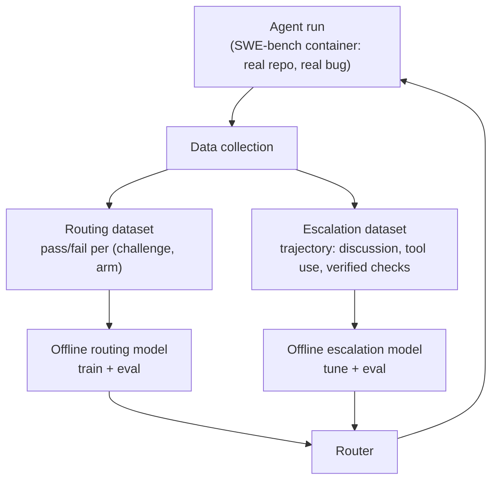
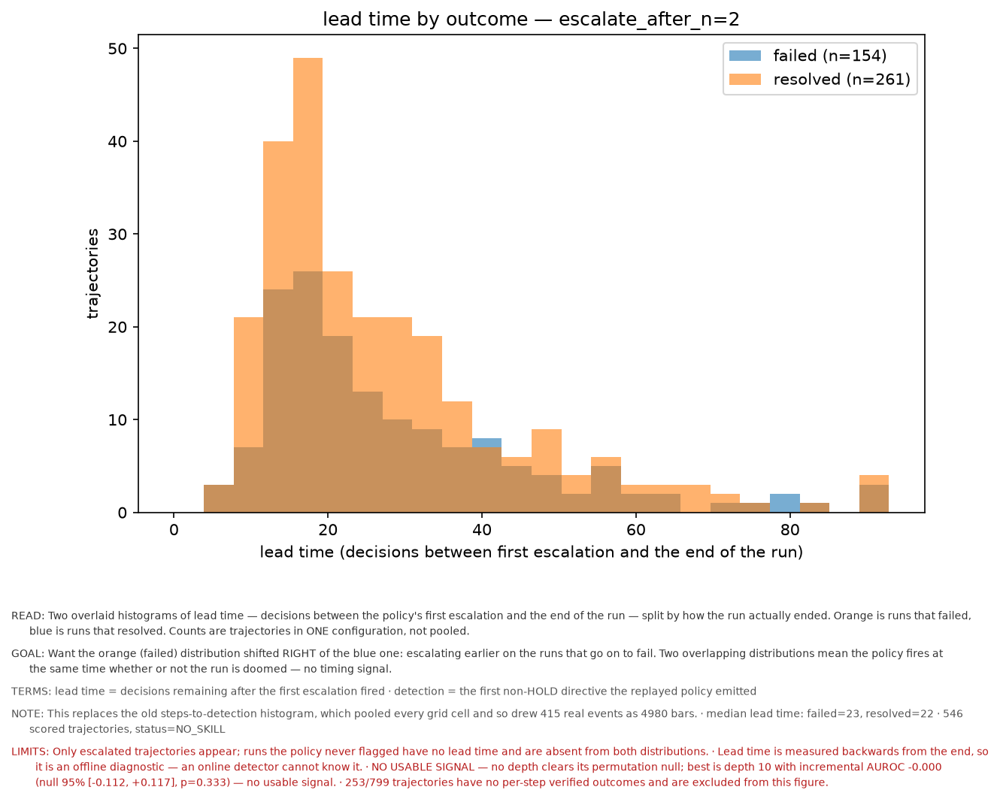

<p align="center">
  <picture>
    <source media="(prefers-color-scheme: dark)" srcset="docs/assets/lockup-brand-dark.svg">
    
  </picture>
</p>
<!-- Theme-aware wordmark; the emoji + text alt is the placeholder if the SVG fails to load. -->

<p align="center">
  <b>Open-source, self-hosted LLM router. Ships a registry of 11 models across
  Requesty and DeepSeek; add any OpenAI-compatible provider yourself.</b>
</p>

<p align="center">
  <a href="https://kookas.github.io/shunt/"></a>
  
  
  
  
</p>

<p align="center">
  <picture>
    <source srcset="docs/assets/routing.webp" type="image/webp">
    
  </picture>
</p>
<!-- Animated WebP where supported (GitHub renders it); the static hero.svg is the fallback/placeholder. -->

**One cheap model for the routine 80%, a frontier model for the hard tail — the
line learned from your own passing tests, not a guess.**

## The problem

Most coding-agent requests are routine work a cheap open-weight model handles
fine; only a hard tail needs a frontier model. Today your agent pays frontier
prices for all of it. Both halves of that claim hold on our data: always routing
to the cheapest model already solves **77.4%** of scored tasks, and price does
not buy capability — `deepseek-v4-flash` at $0.42/Mtok solves 68.3% while
`gpt-5-mini` at 5× the price solves 54.5%.

## The solution

Shunt is a local, cache-safe router between your coding agent and the model API.
Point your agent at it with one env var. It picks a model per task, tracks how
each model actually performs on *your* work, and escalates to a stronger one when
the evidence says the current attempt is going nowhere.

## Goal

**Build the best router for cost-effective model allocation: same results or
better, for less money.** Three jobs make that up: allocate the right model up
front, track what each model actually delivers, and escalate to a
higher-reasoning model when an attempt is failing.

## Vision

**Routing is a mathematical and statistical problem, not a systems problem.**
Making the pipeline faster or cleaner buys nothing until the underlying decision
rule is right. Systems work pays off only once it does. So the job is to find
that rule, and we will take it from wherever it comes: deterministic, statistical,
or learned, judged only on our own data. That is not a preference, it is where the
evidence points — the cheapest strategy we have found so far uses no embeddings
and no training at all, and it beats the learned one.

Five criteria set what belongs in this repo. Read them as scope, not slogans: a
proposal that breaks one is out, however well it scores. And read them against
what this is. Pre-alpha research, honest about it. Despite what the literature
claims, we cannot confirm a production-ready result today. What we have is a
benchmark, a dataset we own end to end, and measured findings, several of them
negative.

- **Data driven.** We act only on data we own and can re-score offline. The label
  is a verified outcome from our own run: did your tests pass? A model's
  self-reported confidence does not count, and neither does a hand-written guess
  about what "hard" looks like. When the data says a mechanism fails, we publish
  that.
- **Lightweight.** It has to run on any laptop. A router that needs a big machine
  to save you money defeats its own purpose. Embeddings come from fastembed and
  the index is hnswlib, both CPU-only. The `Dockerfile` builds hnswlib with
  `HNSWLIB_NO_NATIVE=1`, then runs `objdump` over the compiled extension and
  fails the build if an AVX-512 opcode got baked in, so a wheel that would
  SIGILL on an older CPU never ships.
- **Divide and conquer.** Break routing into narrow subtasks, and give each one
  its own dataset, its own model, and its own honest evaluation. Routing and
  escalation are the first two. Each is a supervised problem with labels we
  collect ourselves, so each can be replaced, benchmarked, and beaten
  independently. Domain-specific verifiers, cost models, and human feedback
  should follow; the architecture is built to take them.
- **Community driven.** One person is shortsighted. The highest-value
  contribution here is an idea rather than a patch: applied maths, statistics,
  applied ML, ML research, system design. Ideas and code are both shared, and an
  idea that turns out to be wrong is still worth posting — we publish our own
  negative results for the same reason. Many brains on one problem, as a live
  evolving project rather than a paper.
- **Open source.** We think AI infrastructure should be open, and a tool that
  runs on your laptop holding your provider keys has to be inspectable to be
  trustworthy. Existing routers make you pick: cloud-only with a take-rate,
  licensed so enterprises can't self-host, proxy-only with no real routing, or a
  research artifact never built to ship. Shunt's core is Apache-2.0, free for
  everyone including companies, and never gated on routing quality. You own the
  model pool, the keys, and the learning data, nothing phones home, and
  contributions sign off under a DCO rather than a CLA. Support and governance
  features, if they ever exist, will be a separate offering.

## How it works

Agent runs produce data, the data becomes two labelled datasets, and each dataset
trains and evaluates its own model — entirely offline, so iterating costs nothing.


```mermaid
flowchart TD
  A["Agent run<br/>(SWE-bench container: real repo, real bug)"] --> B[Data collection]
  B --> C["Routing dataset<br/>pass/fail per (challenge, arm)"]
  B --> D["Escalation dataset<br/>trajectory: discussion, tool use, verified checks"]
  C --> E["Offline routing model<br/>train + eval"]
  D --> F["Offline escalation model<br/>tune + eval"]
  E --> G["Router"]
  F --> G
  G --> A
```

We own this loop end to end and rely on a trusted external source only for the
*challenges* themselves — SWE-bench Verified, which ships containerised
repositories with real bugs and the repo's own tests as the grader. We use no
precomputed leaderboard numbers. Everything else is ours: our runs, our labels,
our evaluation.

That makes both problems **supervised**, with a dataset we can re-score offline
against data already on disk. Testing a new routing rule or a new escalation
detector costs nothing.

### Context → Action → Feedback

- **Context** — the task text, embedded. This is what the **routing** model sees,
  once, at the task boundary.
- **Action** — route the task to a (model, reasoning-effort) arm.
- **Feedback** — two channels. The main one is the **escalation** loop: verified
  check results streaming out of the running trajectory, which decide whether to
  escalate mid-task. The second is **human feedback** via `shunt flag` — a
  working proof of concept, not yet deeply integrated.

Full loop: [docs/feedback.md](docs/feedback.md).

## The two models

They answer different questions, on different inputs, at different times.
Conflating them makes every number ambiguous, so we keep them apart throughout.

| | **Routing model** | **Escalation model** |
|---|---|---|
| Question | Which (model, effort) should *start* this task? | Is this attempt going to fail — escalate *now*? |
| When | Once, at the task boundary, before any tokens are spent | Mid-task, at decision boundaries |
| Input | The task text, embedded | The running trajectory: discussion, tool use, verified check results |
| Learns from | Task outcome, pass/fail | Whether this attempt ultimately failed |
| Today | k-nearest-neighbours over task embeddings | A recurrence rule over verified failing-check ids |
| Status | **No measurable signal over the base rate yet** | **First attempt, not working — `NO_SKILL`** |
| Next | bigram / linear models, calibrated classifiers, better selection rules | calibrated risk scoring, structural loop features, late fusion |

The escalation model is a **first attempt**, inspired by the published
[ACRouter](https://arxiv.org/abs/2606.22902) design. It does not currently show
good performance, and it ships **disabled**. We reproduced that paper and
withdrew our citation of it; the write-up is in the
[research log](docs/research-log.md).

### Rank and cost are different orderings

Easy to conflate, so, precisely:

- **Cost** is the dollars a task actually consumed: `real_cost`, cache-aware,
  read from the provider's own usage accounting. Never a price-list estimate.
- **Rank** is a model's position in the registry, which is ordered by **price**.
  It is *not* a capability ordering — the cheapest model in our registry
  outscores one at 5× the price, as [The problem](#the-problem) shows.

## Quick start

```bash
pip install shunt-router
shunt
```

Or with Docker:

```bash
docker run -p 127.0.0.1:8080:8080 --env-file .env ghcr.io/kookas/shunt-router
```

Then point your agent at it. **Claude Code** and any Anthropic-wire client:

```bash
export ANTHROPIC_BASE_URL=http://127.0.0.1:8080
```

**opencode, aider, Continue** and any OpenAI-compatible client:

```
base_url = http://127.0.0.1:8080/v1
```

Copy-paste config for each tool — plus a dry-run handshake that proves the wiring
without spending a cent — lives in
[`examples/integrations/`](examples/integrations/README.md).

## Benchmark

Routing strategies and escalation detectors are scored on SWE-bench-Verified
tasks judged by their own tests: reward (quality − cost), bootstrap confidence
intervals, permutation nulls, and a Pareto check against a perfect-information
oracle. Method: [`docs/benchmark.md`](docs/benchmark.md). Every figure carries its
own READ / GOAL / TERMS / NOTE / LIMITS footer, so a plot lifted out of context
still says what it can and cannot support.

### Routing

<details>
<summary><b>Five plots that carry the routing story</b> (click to expand)</summary>

<br>

**1. The kill-gate figure.** Left panel: every strategy's cost against its pass
rate, with Always-Frontier's own confidence band drawn as the "equal quality"
zone. Right panel: the same contest restricted to the 84 tasks where both
strategies chose genuinely *measured* cells. *How to read it:* the left panel's
dollars are roughly half projection — read the right panel before believing any
saving.


**2. Strategy comparison.** Pass rate vs cost per strategy on a log axis, with
95% intervals and the Pareto frontier. *Look for:* a strategy up near the oracle's
pass rate but well left of the frontier baseline's cost. The intervals on the top
strategies overlap almost entirely.


**3. Measured vs projected cost.** Each bar splits a strategy's total into dollars
a provider **actually billed** (solid) and dollars **projected** for cells we
never ran (hatched). *How to read it:* the hatched fraction is how much of the
headline is inference rather than measurement. Imputation is not neutral — every
projected cell is filled as a pass.


**4. Does the kNN router transfer, or memorise?** Leave-one-task-out pass rate
against *k*, with three reference lines: pure memorisation, the best single
always-one-model policy, and a shuffled-outcome null band. *Look for:* the blue
line above the grey band and above the green line. It is inside the band at every
*k* — the router scores what chance scores.


**5. Why.** A 2-D PCA of the real jina prompt embeddings the router ships, each
task coloured by its measured `p_solve`. *Look for:* hard and easy tasks
separating. They don't — difficulty intermixes across the embedding space, which
is the near-chance signal above, seen directly.


</details>

### Escalation

<details>
<summary><b>Five plots that carry the escalation story</b> (click to expand)</summary>

<br>

**1. The gate: is it beating its own null?** The grey histogram is the same
statistic recomputed under randomly shuffled outcome labels, with the whole
fitting pipeline re-run per shuffle; dashed lines bound the null's central 95%.
*How to read it:* for the detector to be doing anything, the red line must sit
clearly right of the upper dashed line. It sits in the middle of the null.


**2. The question the product actually asks.** Of the runs the policy escalated,
how many failed — against the runs it left alone, and against the corpus base
rate. *Look for:* the escalated bar clearly above the base-rate line. Both
intervals overlap and both contain the base rate (lift 0.97×).


**3. Ranking quality.** The ROC curve for the detector's score against the
corrected causal label. *Look for:* a curve bowing toward the top-left. It tracks
the diagonal.


**4. A data gap, stated plainly.** Share of each model's trajectories that went
through per-step outcome stamping. *Look for:* every bar at 1.0. Three models
(191 trajectories, 24% of the corpus) sit at **zero** — the recurrence trigger is
structurally dead on them. This is a pipeline coverage gap, not agent behaviour.


**5. Is it early enough to matter?** Lead time between the first escalation and
the end of the run, split by how the run actually ended. *Look for:* the failed
distribution shifted right of the resolved one — escalating earlier on runs that
go on to fail. They overlap.



</details>

## Results

Full numbers, method, and caveats: **[docs/results.md](docs/results.md)**. The
headline, stated plainly:

> **Cheap-first routing with verified escalation reaches always-frontier quality
> for roughly a quarter of the cost ($20.46 against $87.04) — but the machine
> learning contributes nothing to that, and the escalation model does not work.**
> The saving is real and comes from *mechanism*, not prediction.

| strategy | pass rate | total cost |
|---|---:|---:|
| Oracle (hindsight — not deployable) | 96.6% | $13.59 |
| Price-Cascade | 96.6% | $20.46 |
| kNN-cascade | 96.6% | $23.40 |
| Always-Frontier | 96.0% | $87.04 |
| Always-Cheap | 77.4% | $1.36 |
| kNN | 78.5% | $10.90 |
| Tier-Classifier | 67.8% | $9.38 |

`Price-Cascade` uses no embeddings, no nearest neighbours, and no training. It
tries models in ascending price order and stops at the first one whose patch
passes. Of the deployable strategies whose quality interval overlaps
Always-Frontier's, it is the cheapest. The learned `kNN-cascade` costs *more* for
the same 96.6%.

Three things we will not let you take away from that table:

1. **It is part projection.** 31% of Price-Cascade's dollars and 49% of
   Always-Frontier's are imputed, and every imputed cell is filled as a **pass**.
   On the 84 challenges where both chose genuinely measured cells, it is
   Always-Frontier **$43.72 @ 91.7%** vs Price-Cascade **$13.42 @ 92.9%**
   (McNemar p = 1.000) — about a third of the cost. The saving survives, but that
   subset is opportunistic, not pre-registered.
2. **The two quality figures are not the same kind of number.** A cascade stops
   at the first attempt whose tests pass and is scored on that same label, so its
   figure is best-of-N coverage while Always-Frontier's is single-shot. We flagged
   exactly this pattern as a flaw in prior work; it applies to us too. The cost
   axis is honest — every attempt in the chain is billed.
3. **The learned part is currently worth nothing.** kNN's leave-one-out accuracy
   equals the base rate to four decimals, and it sits inside a permutation null
   at every *k*. Escalation returns `NO_SKILL`: task identity alone predicts the
   outcome at AUROC 0.883, and the detector adds **−0.000** on top.

We would rather publish that than keep selling the model. **We do not claim the
make-or-break gate is passed.**

## Future

Where the work goes next, in priority order.

- **The escalation model.** The genuinely unsolved one. We will work through
  rule-based detectors, regex over verified check ids, ML approaches (calibrated
  classifiers, n-gram and bigram models over trajectory events, embeddings), and
  quite possibly a **fusion** of several weak signals rather than one winner. The
  feedback that matters is diverse: unit tests today, but literature, business
  rules, and spreadsheet checks in other domains. Fusion is the natural shape for
  combining signals of different flavours.
- **Closing the identification gap.** Our logging policy never escalates, so
  P(escalate) = 0 and no off-policy estimator is identified. ε-greedy
  randomisation at flagged checkpoints with logged propensities fixes it.
- **More routing algorithms.** kNN is the first, not a commitment. Bigram and
  linear models, calibrated classifiers, better selection rules.
- **More data.** 253 of 799 trajectories never went through per-step stamping.
  Counting those plus the ones that were stamped but captured nothing, ~325 are
  re-stampable offline at zero API cost.
- **CLI / UI** to monitor and manage Shunt, low-level work on the hot path,
  mid-session model adaptation, and an enterprise suite (audit, RBAC, monitoring).

## Contributing

Early is the best time to shape this. Concretely, here is what helps most:

- ⭐ **Star the repo** if you want to follow whether the thesis survives contact
  with the data.
- 🚨 **Ideas on the escalation model.** The genuinely unsolved one. What signal in
  an agent's trajectory actually predicts failure early enough to be worth acting
  on? We have 546 labelled trajectories and a harness that will tell you honestly
  whether your idea works. Rules, n-grams, embeddings, small classifiers, fusion
  of several weak signals — open to anything.
- 🧠 **Ideas on the routing model.** kNN is a starting point. If you have reason to
  think something beats the base rate here, we want to hear it.
- 💬 **Open a discussion or issue** with your workflow, your cost pain, or an idea.
  If you think a number in [Results](#results) is wrong, say so and we'll check
  it — we would rather publish a null result than a flattering one.
- 📝 **Docs and typo fixes** make a low-friction first pull request. Sign off
  under the [DCO](CONTRIBUTING.md).
- 📊 **Benchmark results** are especially welcome. **Ask before running one:**
  results are cost-expensive (a single frontier-model datapoint can run $0.5–3),
  and we're adding per-contributor key signing so every datapoint stays
  attributable to who produced it.

See [CONTRIBUTING.md](CONTRIBUTING.md) for how changes get merged. Architecture,
layout, and capabilities: [docs/architecture.md](docs/architecture.md).

## License

**[Apache-2.0](LICENSE)** — free for everyone, with a patent grant.

Security disclosures: [SECURITY.md](SECURITY.md) ·
Community standards: [CODE_OF_CONDUCT.md](CODE_OF_CONDUCT.md)
</content>
