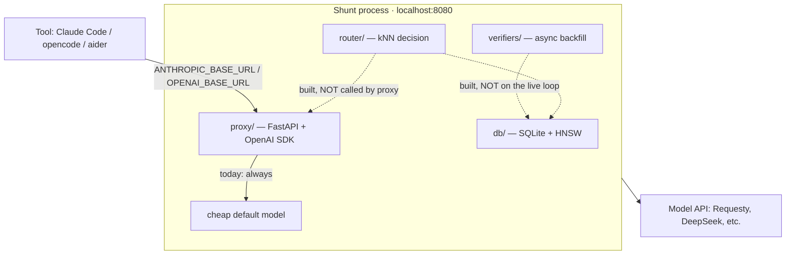

# Architecture

**Status: pre-alpha.** This page separates what runs on the live request path
from what is built but not yet wired to it — because they are not the same thing.

## What the live proxy does today

Shunt is a single process, localhost-bound. It accepts HTTP requests on two API
surfaces — OpenAI-compatible `/v1/chat/completions` and Anthropic `/v1/messages`
— translates between the wire formats, and forwards each request to **one cheap
default model** (`qwen3.7-plus`), a cold-start default held for the whole session.
It also exposes a `/v1/models` stub so clients that auto-discover model lists
don't 404, and returns an `X-Shunt-Decision` header naming the model and reason
(today always the cold-start default).

That is the whole live path: translate, forward to the default, stay cache-safe by
never switching models mid-session. There is no per-task model choice, no
escalation, and no live outcome learning yet.



Solid = live. Dashed = present in the codebase and unit-tested, but not on the
request path.

## Modules

| Module | Role | On the live path? |
|---|---|---|
| **proxy/** | HTTP server: `/health`, `/v1/chat/completions`, `/v1/messages`, `/v1/models` (stub), streaming passthrough; forwards to the cheap default | **Yes** |
| **session/** | Session lifecycle: ID generation, inactivity timeout, model lock (keeps the session on one model — cache-safety) | **Yes** |
| **models/** | Provider config: model pool, capability tiers, fallback chain | **Yes** (read at startup) |
| **router/** | Decision core: embed prompt via fastembed, kNN retrieval via hnswlib, selection rule → cheapest capable model | **No** — built and unit-tested, not yet called by the proxy |
| **verifiers/** | Async outcome verification: output mining, auto-detected tests | **No** — not yet wired into the live loop |
| **db/** | SQLite persistence for sessions, outcomes, HNSW index | Partial — sessions persist; the outcome/index learning loop is not live |

The routing algorithm in `router/` has been validated **offline** on the
SWE-bench Verified suite (see [benchmark.md](benchmark.md)). Wiring it into the
proxy request path — gated on it clearing the kill gate on a real workflow — is
the remaining integration step, and on the agentic-coding workload the
embedding-based difficulty signal has not yet cleared that bar.

## Running

The package is published; install it directly.

```bash
pip install shunt-router
shunt
```

Or with uv: `uv run shunt`. Or with Docker:

```bash
docker run -p 8080:8080 ghcr.io/kookas/shunt-router
```

Config: `SHUNT_PORT`, `SHUNT_HOST`. Provider keys are read from environment
variables (e.g. `DEEPSEEK_API_KEY`, `REQUESTY_API_KEY`) by the OpenAI SDK client;
each model's `base_url` and `api_key_env_var` come from the model config.

## Integration

Point your tool at Shunt (today every request forwards to the cheap default):

| Tool | Config |
|---|---|
| Claude Code | `ANTHROPIC_BASE_URL=http://localhost:8080` |
| opencode | `OPENAI_BASE_URL=http://localhost:8080` |
| aider | `OPENAI_API_BASE=http://localhost:8080/v1` |
| n8n / LangChain | `baseURL: http://localhost:8080` |

## Properties

- **Cache-safe**: forwards at session granularity, never switches model mid-turn
- **No telemetry**: any learning stays local to your SQLite store
- **Secure**: localhost-bind by default, no key logging
- **Apache-2.0**
</content>
