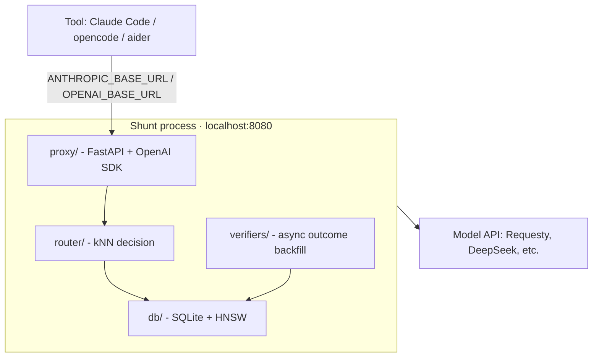

# Architecture

**Status: pre-alpha.** The modules below are implemented and unit-tested, and the routing algorithm has been validated **offline** on the 500-task SWE-bench Verified suite (nested cost-safe sampling; a first-20 partial run: deepseek-v4-flash 16/20 passed, ~$0.01/task). It is **not yet wired end-to-end**: the proxy currently forwards requests through the OpenAI SDK to a cheap default model; kNN-based model selection runs in the offline benchmark but is not yet integrated into the live request path, and the kill-gate validation has not been run.

Shunt is a single process, localhost-bound. It accepts HTTP requests on two API surfaces — OpenAI-compatible `/v1/chat/completions` and Anthropic `/v1/messages` — and proxies them to a model. It also exposes a `/v1/models` stub so clients that auto-discover model lists don't 404. The intended decision (cheapest model that can handle the task, via kNN-informed routing) is validated in the offline benchmark; wiring it into the proxy request path is the remaining integration step.



## Modules

| Module | Role |
|---|---|
| **proxy/** | HTTP server: `/health`, `/v1/chat/completions`, `/v1/messages`, `/v1/models` (stub), streaming passthrough |
| **router/** | Decision core: embed prompt via fastembed, kNN retrieval via hnswlib, selection rule → cheapest capable model |
| **verifiers/** | Async outcome verification: output mining, auto-detected tests |
| **db/** | SQLite persistence for sessions, outcomes, HNSW index |
| **session/** | Session lifecycle: ID generation, inactivity timeout, model lock |
| **models/** | Provider config: model pool, capability tiers, fallback chain |

## Running

```bash
pip install shunt-router
shunt
```

Or with uv: `uv run shunt`

Or with Docker:

```bash
docker run -p 8080:8080 ghcr.io/kookas/shunt-router
```

Config: `SHUNT_PORT`, `SHUNT_HOST`. Provider keys are read from environment variables (e.g. `DEEPSEEK_API_KEY`, `REQUESTY_API_KEY`) by the OpenAI SDK client — each model's `base_url` and `api_key_env_var` come from the model config.

## Integration

Point your tool at Shunt:

| Tool | Config |
|---|---|
| Claude Code | `ANTHROPIC_BASE_URL=http://localhost:8080` |
| opencode | `OPENAI_BASE_URL=http://localhost:8080` |
| aider | `OPENAI_API_BASE=http://localhost:8080/v1` |
| n8n / LangChain | `baseURL: http://localhost:8080` |

## Properties

- **Cache-safe**: routes at session boundaries, never mid-turn
- **No telemetry**: all learning is local to your SQLite index
- **Secure**: localhost-bind by default, no key logging
- **Apache-2.0**
