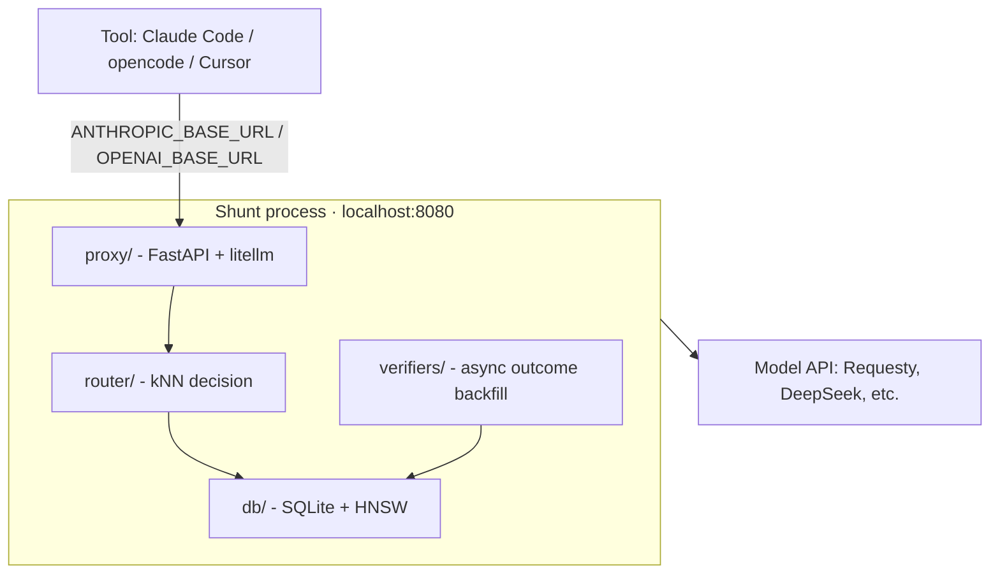

# Architecture

**Pre-alpha notice: the proxy endpoints are stubs that return canned responses — no routing logic is wired yet.**

Shunt is a single process, localhost-bound. It accepts HTTP requests on two API surfaces — OpenAI-compatible `/v1/chat/completions` and Anthropic `/v1/messages` — and proxies them to the cheapest model that can handle the task.

**Status: pre-alpha.** The modules below are planned — the repo is scaffolded and under active build.



## Modules

| Module | Role |
|---|---|
| **proxy/** | HTTP server: `/v1/chat/completions`, `/v1/messages`, streaming passthrough, admin API (`/api/admin/*`), dashboard (`/dashboard/*`) |
| **router/** | Decision core: embed prompt via fastembed, kNN retrieval via hnswlib, selection rule → cheapest capable model |
| **verifiers/** | Async outcome verification: output mining, auto-detected tests |
| **db/** | SQLite persistence for sessions, outcomes, HNSW index |
| **session/** | Session lifecycle: ID generation, inactivity timeout, model lock |
| **models/** | Provider config: model pool, capability tiers, fallback chain |

## Running

```bash
pip install shunt-router
shunt
```

Or with uv: `uv run shunt`

Or with Docker:

```bash
docker run -p 8080:8080 ghcr.io/kookas/shunt-router
```

Config: `SHUNT_PORT`, `SHUNT_HOST`. (Provider keys: planned — see backlog.)

## Integration

Point your tool at Shunt:

| Tool | Config |
|---|---|
| Claude Code | `ANTHROPIC_BASE_URL=http://localhost:8080` |
| opencode | `OPENAI_BASE_URL=http://localhost:8080` |
| Cursor | Settings → API endpoint |
| n8n / LangChain | `baseURL: http://localhost:8080` |

## Properties

- **Cache-safe**: routes at session boundaries, never mid-turn
- **No telemetry**: all learning is local to your SQLite index
- **Secure**: localhost-bind by default, no key logging
- **Apache-2.0**
