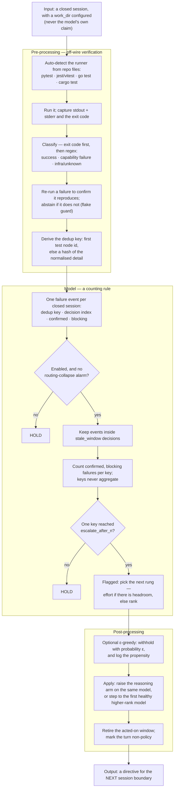
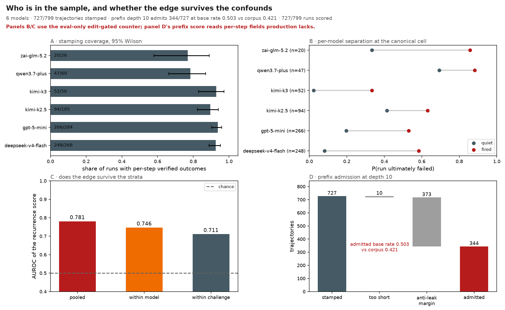
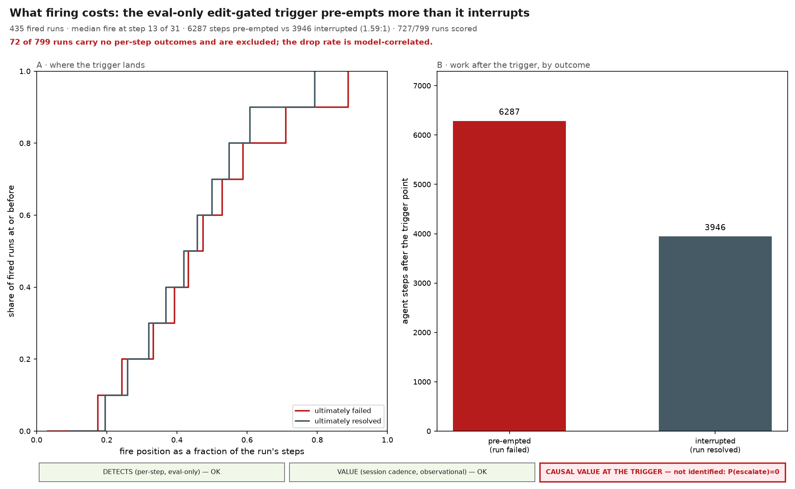
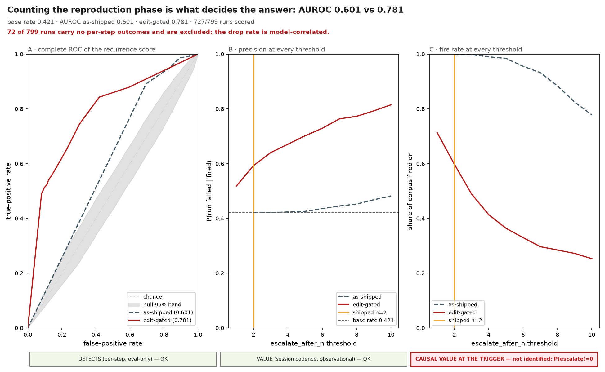
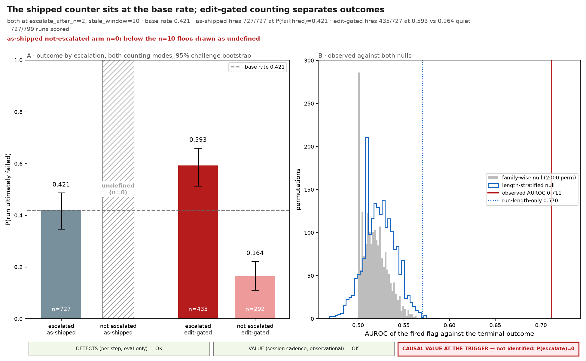
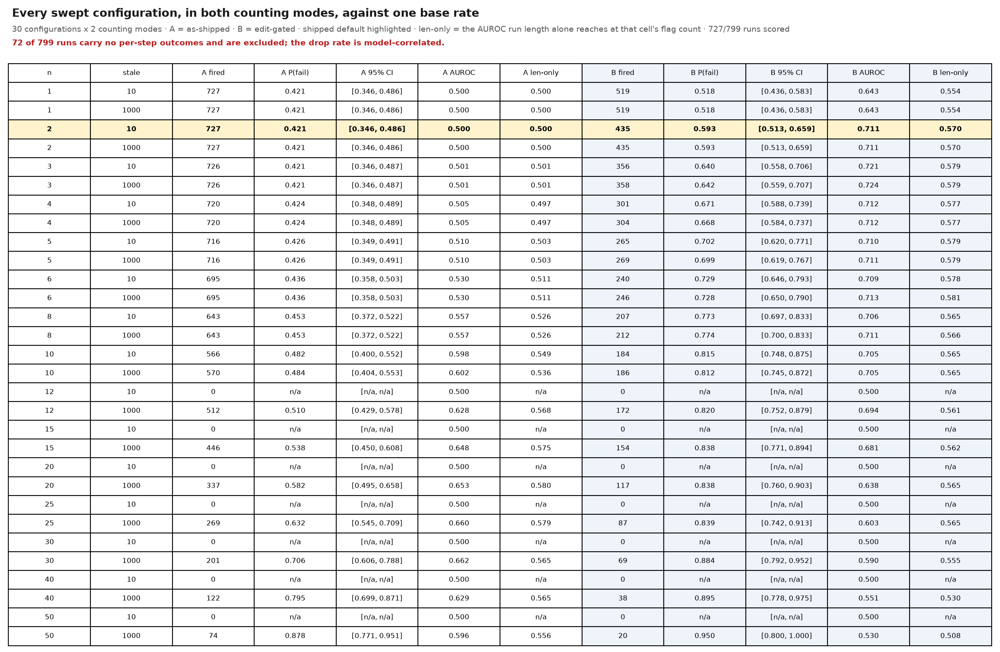
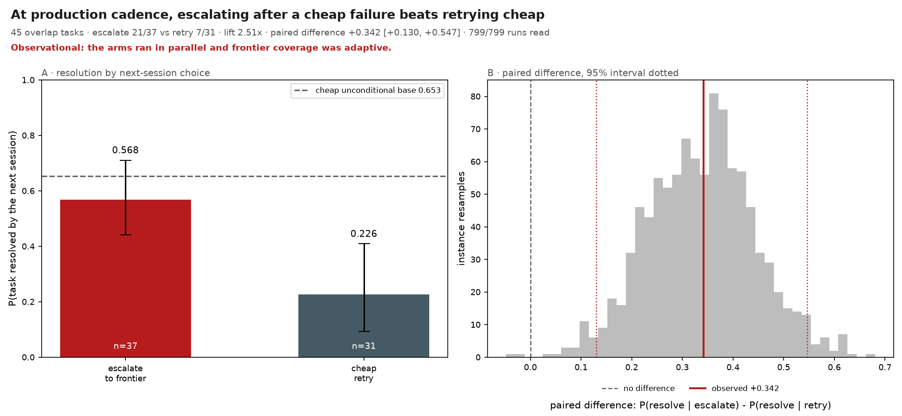

# Error detection & auto-escalation

When the cheap model keeps failing the *same* verified check, Shunt can move up on
its own — raising the model's reasoning effort first, then its rank — without waiting
for you to intervene. This page explains how a failure is detected, what makes one
worth escalating, how the ladder climbs, the safety rails around it, and where it
does nothing.

**It ships OFF.** Auto-escalation is opt-in (`router.escalation.enabled: false` by
default). It is wired on the live routing path, so turning it on takes effect
immediately — but you turn it on deliberately, once you have a verified-outcome
signal for it to act on. The config knobs are in
[Configuration → Auto-escalate on repeated verified failure](configuration.md#auto-escalate-on-repeated-verified-failure).

Its sibling is [the routing model](routing.md), which picks the model *before* any
evidence about the task exists. This one acts only *after* a verified outcome.

## The shape of it

Two stages, and only the first one does any pattern matching.

**Stage one turns a test run into a verdict and an identity.** A subprocess runs your
repo's suite off the wire; the exit code decides first, and regexes over the combined
stdout and stderr decide the rest — whether tests genuinely ran and failed, whether
this was an environment error rather than a capability one, and what to call the
failure. That name is the **dedup key**: the first test node id the runner printed,
or a hash of the failure detail with the volatile parts stripped out.

**Stage two is arithmetic.** No regex, no model, no learned weights: count how many
confirmed, non-infrastructural failures share each dedup key inside a window of
recent decisions, and fire when one key reaches the threshold. Distinct keys never
add together.



**One verified outcome per session, not per step.** This is the single fact most
easily got wrong about the live path. The verifier runs at session close, so the
router records at most one failure event per closed session — not one per tool call,
not one per agent action. With the shipped `escalate_after_n: 2`, escalation
therefore needs **two sessions** on the same repo failing the *same* check inside the
window. It does not watch an attempt unfold and intervene inside it. The offline eval
in `benchmark/escalation/` replays one event per *step*, which is a different and
more frequent cadence; that gap is spelled out under
[what the sweep does not establish](#two-things-this-sweep-does-not-establish).

## Detection — what counts as a failure

Escalation acts on **verified** failures only. A model's own claim that "the tests
pass" is never trusted — coding agents misreport — so the signal comes from a
non-model producer: your test suite, re-run off the wire.

- **Off-wire re-run.** At session close, if you have configured a `work_dir`, Shunt
  re-runs *that repo's* test suite off the request path and records the pass/fail as
  a verified outcome. The runner is auto-detected from the repo: **pytest** (Python),
  **jest**/**vitest** (a `package.json`), **`go test`** (a `go.mod`), or **`cargo
  test`** (a `Cargo.toml`). No `work_dir`, no framework, no signal — Shunt writes
  nothing and never guesses. See [Feedback](feedback.md#1-automatic--off-wire-test-execution-the-signal-that-matters).
- **Flake guard.** A test that fails then passes on unchanged state is a flake, not a
  regression. A failing run is re-run to confirm; if it does not reproduce, the result
  is abstained (it feeds neither the router nor escalation). Only a failure that
  reproduces every time is passed through.
- **Environment vs capability.** A missing module, a broken test-collection step, or a
  wrong interpreter (`ModuleNotFoundError`, a pytest collection error, `go: cannot
  find module`, an unresolved Rust import) is **infrastructural** — no bigger model
  fixes a missing dependency. Shunt classifies these as environment failures and they
  **never count toward escalation**. Only a genuine capability failure — the code ran
  and the assertions failed — is escalation-eligible.

  One caveat, for anyone measuring with this flag rather than just running on it: across the
  ten repositories in `benchmark/escalation/data/live/` the environment-failure rate spans
  13.2% (pylint) to 0.20% (matplotlib) — a 64× spread — while barely moving with model or
  reasoning effort. Do not read that as a property of the repositories. It is driven
  substantially by **individual broken instances**: 175 of pylint's 176 infra-flagged steps
  come from one instance. So any number computed from this flag, the `infra_rate` prefix
  feature included, can be encoding which instances a split happened to contain rather than
  anything the agent did. Do not read one as behavioural without controlling for instance and
  repository.
- **A stable failure identity.** Each confirmed failure gets a **dedup key**: the
  failing test's node id where the runner prints one (`path::Test::case`), or a
  normalized hash of the failure detail otherwise — with timings, hex addresses,
  temp paths, timestamps, randomized run seeds (a runner that prints its own
  `random seed:` / `PYTHONHASHSEED`), subprocess pids, and pytest's `--durations`
  block stripped, so the *same* recurring failure hashes to the same key run to run.
  The durations block is dropped whole rather than value-normalized: it is sorted by
  time, so run-to-run jitter permutes the lines and normalizing only the numbers still
  leaves the key random. That key is what lets Shunt tell "the same problem again" from
  "a different failure."

Human feedback (`shunt flag <id> bad`) is a verified source for the **routing** learner — a person
confirming the result is ground truth, and it feeds the outcome index exactly like a suite. It does
**not** feed auto-escalation's failure log. The escalation log is held in the running engine's
memory and keyed per repo (`work_dir`); `shunt flag` runs in a separate process and writes only the
session's outcome row, so a human-flagged failure never trips an escalation. Feeding human labels
into escalation would need the failure log moved to the same store — a design change, not a wiring
detail.

## Triggers — when it escalates

One failure is not enough. Intermediate fail-then-fix is normal, so a single verified
failure never escalates. Shunt escalates only when the **same** verified failure
recurs:

- **The same key, `escalate_after_n` times** (default **2**) within `stale_window`
  decisions (default **10**). Two reds on the *same* failing check inside the window
  trip it. The default is a **prior, not a tuned value**: under the counter the product
  actually runs (the `as_shipped` sweep family) every low threshold sits at chance, so
  nothing measured prefers 2 to 3 or 3 to 2 — see
  [what the sweep does not establish](#two-things-this-sweep-does-not-establish).
- **Different failures don't aggregate.** Two verified failures with *different* keys
  are two different problems — that is the kNN store's job to learn from, not a signal
  to escalate. Only same-key recurrence counts.
- **A window that goes quiet retires.** A failure that does not recur within
  `stale_window` decisions is dropped from the counter, so an old, since-fixed problem
  cannot trigger later.
- **Success clears the slate.** When the whole suite goes green, every pending failure
  for that repo is retired — the router saw the problem resolve.
- **One escalation consumes its evidence.** After Shunt steps a rung, the failures it
  acted on are consumed. Climbing the *next* rung requires a genuine fresh
  recurrence — two more verified same-check reds — not the same two firing again.

Escalation is keyed per **task** (the repo / `work_dir`), so a repeated failure in one
project never escalates routing for another.

### The sameness premise is now testable — and the stamp is a whole-spec gate, not an error id

"The same failure twice means the model is stuck" is a design assumption. The obvious way to
check it is to compare runs that repeat one failing-check id against runs that hit several. The
current corpus supports that comparison. The trajectories in `benchmark/escalation/data/live/`
were re-stamped (2026-08-02) by the grader-parity container replay (`swebench_grading.GraderParity`),
and every one of the 18 339 failing-check ids on disk is a readable test name — a FAIL_TO_PASS or
PASS_TO_PASS id taken from the instance's own SWE-bench spec. Zero opaque `hash:…` keys remain;
django keys are `test_x (module.Class.test_x)` ids, sympy keys are bare test names, sphinx keys
are `file::Test::case` node ids. An earlier version of this section described a pre-rebuild corpus
whose keys were per-instance hashes and whose sympy runs fabricated passes; that corpus is gone.

What the stamp actually measures, so the premise is read correctly:

- **It is a whole-spec gate, not the agent's error.** Each step replays the agent's workspace at
  that step and runs the instance's target test files; the step is red while the F2P∪P2P set is
  not fully green, and `failing_check_id` is the first test in that set that is still failing. A
  `git log`, a `cat`, and a full `pytest` run are all stamped the same key while the target test
  fails — the stamp is *state*-contingent, never *action*-contingent.
- **Same-key recurrence is therefore a per-instance time-to-fix counter.** The F2P set is fixed
  per instance, so a constant key from step 0 to the fix (or to the terminal step) counts how
  many replay steps the spec stayed red. Resolved runs break the streak exactly at the fix and
  never end red; unresolved runs repeat the same key until the terminal step. A key *change*
  mid-run is meaningful but rare (~8% of runs): it means a different graded test now leads
  (partial fix, or a P2P regression after the F2P set passed).
- **The recurrence edge this produces is real but partly run-length.** Because the counter
  starts at the first reproduction failure, the shipped `escalate_after_n: 2` fires on nearly
  every run, and the discrimination that emerges at high thresholds trades on long runs. Measured
  over the 727 stamped runs: the n=30 cell's AUROC 0.662 is only 0.097 above the 0.565 that run
  length alone scores at the same flag count, and it clears a length-stratified null (0.662 against
  [0.538, 0.583]) — so recurrence adds signal beyond length, but about 40% of the raw excess
  over chance is the length selection. The policy sweep in
  [Results → Escalation](results.md#escalation-results) reports both references on every cell.

**The question is no longer untestable.** Whether same-key recurrence, key diversity, or neither
predicts failure is what the policy sweep measures; it is not reported here as an unconditional
"same-key wins" claim because the honest answer carries the run-length caveat above. Two residual
defects stay on record: a step that could not be reconstructed is stamped green (unmeasured, not
passed — ~7% of steps, on 310 of 799 runs), and the key names the spec's test, so "same error" is
"same graded test still failing", which is the state the whole-spec gate measures.

## The ladder — effort first, then rank

The default ladder is `effort_then_rank`, and it climbs **one rung per step, never
straight to the top**:

1. **Raise reasoning effort first.** The router bumps the *current model* up one
   reasoning arm (e.g. `medium` → `high`). It is the **same model**, so the provider's
   prompt-cache namespace is unchanged — this rung is cache-safe. The higher arm's
   request params are applied to the outbound call, overriding any the client sent.
2. **Then step a rank.** Only once the model's reasoning arms are exhausted — or if the
   model declares no reasoning arms at all — does the router step to the next model
   rank (the next-higher-price model). The new model starts at its *own* default
   arm, not mid-ladder.
3. **Hold at the top.** At the ceiling (top rank, top arm) escalation holds rather than
   thrashing.

**A rank step buys price, not measured capability.** Rank is a model's position in the
registry, and the registry is ordered by price — which is not a capability ordering. On
Shunt's own benchmark that ordering inverts: the cheapest enabled model out-scores several
models priced well above it, so stepping one rank up can *lower* the pass rate on your
workload. The measured per-model table is in
[Results → How to read this page](results.md#how-to-read-this-page); check it against your
own registry before you trust the ladder. The effort rung has no such problem — it is the
same model at a higher reasoning arm — which is why `effort_then_rank` is the default and
why `rank_only` deserves the more careful look.

Set `ladder: rank_only` to skip the effort rung and step ranks directly. The effort
rung needs a model that declares [reasoning arms](configuration.md#reasoning-effort-optional);
a model without them has no effort headroom and steps rank immediately.

## Safety — the rails

- **Never mid-cached-turn.** An escalation applies only at the **next session
  boundary**. Shunt never switches a model in the middle of a cached conversation,
  which would force a full-price re-read of the context. Cache-safety is preserved by
  construction.
- **Routing-collapse guard.** If the recent model-choice distribution is degenerate —
  the expensive tail dominates, or choice-entropy collapses — a routing-collapse alarm
  **suppresses further escalation** so the router cannot ossify onto costly models.
  The same signal is exposed at `GET /admin/loop-health`.
- **Escalated turns don't train the policy.** An escalation is imposed by the failure
  signal, not chosen by the policy, so an escalated turn is recorded as non-policy: its
  selection propensity and candidate scores are neutralized, and it opens a fresh label
  window. The learner never mistakes a forced escalation for a free policy win.
- **State survives a restart.** The failure log and per-task ladder position are
  snapshotted, so a restart resumes where it left off rather than forgetting a
  half-climbed ladder.

## Why it is built this way

The design is mostly a series of refusals, and each one is worth knowing before you
rely on it.

- **The signal comes from a process the model does not control.** A model grading its
  own work is the cheapest verifier available and the least trustworthy. Re-running
  your suite off the wire costs one subprocess per session and buys a label the agent
  cannot talk its way out of.
- **Counting, not scoring.** A learned risk model would need a corpus of labelled
  failures to train on — the thing this loop is still collecting — and would have to be
  trusted before it could be checked. A count has one parameter you can read off the
  config. This is the simplest rule that could work, picked so its failure modes stay
  legible; it is not the end state.
- **Recurrence, because a first failure is ordinary.** Fail, read the traceback, fix:
  that is the loop working. Escalating there spends frontier money on a model that was
  about to succeed anyway. A second *identical* failure is the first evidence that
  reading the traceback did not help.
- **Two failure classes are excluded because no larger model repairs them.** An
  unreproducible failure is a flake; a missing dependency is a broken environment.
  Escalating on either buys a pricier model for a problem that was never about
  capability.
- **One rung at a time, effort before rank.** The cheapest intervention that could
  plausibly work goes first, and the effort rung keeps the same model — so it does not
  cost you the prompt cache. Jumping straight to the top would be simpler to implement
  and would spend the most on the least evidence.
- **At the boundary, never inside a turn.** A mid-conversation switch forces a
  full-price re-read of the cached context. Any escalation that could only pay off by
  breaking the cache is not worth having, so the directive waits for the next session.

## Limitations — read before enabling

Be honest with yourself about where this does nothing:

- **Off by default, and for a reason.** With no verified-outcome history, every
  cheap-model failure would look escalation-worthy and nothing would be learned. Turn
  it on once you have a handful of labelled sessions (roughly 5–10) so the trigger has
  something real to act on.
- **No `work_dir`, no automatic signal.** Auto-escalation is inert until you point
  Shunt at a repo it can test. Without that, auto-escalation has *no* signal at all: `shunt flag`
  feeds the routing learner, not the in-process escalation log, so a repo with no `work_dir`
  produces no verified failure the escalation rule can count.
- **No tests, no signal — the vibecode case.** A repo with no test suite produces no
  verified outcome, so auto-escalation does nothing there. It cannot escalate on a
  signal that does not exist.
- **It needs repeats across sessions, not within one.** Because the verifier runs at
  session close, a session that fails the same check twenty times internally still
  contributes one event. Escalation is a between-session mechanism; nothing here
  rescues a single attempt that is going badly while it is going badly.
- **A runner with unstable output can never accumulate recurrence.** When no test
  node id is printed, the key is a hash of the failure detail, and the normalizers
  strip only the volatility we have enumerated — timings, addresses, temp paths,
  timestamps, seeds, pids, duration blocks. A runner that prints some *other*
  per-run-varying string hashes to a fresh key every time, so the same failure never
  looks like a recurrence. The field stays populated, which is what makes this quiet:
  it looks like it is working.
- **It grades nothing.** This is a counting rule, not a risk model. Every confirmed
  blocking failure counts exactly one; there is no severity, no confidence, and no
  score you can threshold differently. A trivial assertion and a total collapse are
  the same event to it.
- **SWE tasks only.** The verified signal is a repository's own test suite. Work with
  no runnable check — analysis, prose, a spreadsheet — produces nothing for this
  mechanism to act on.
- **The effort rung needs reasoning arms.** A model that declares none skips straight
  to a rank step; there is no effort headroom to climb.
- **Runs where Shunt sits beside your code.** The off-wire re-run needs the repo *and*
  its test toolchain on the same machine — a plain `shunt start` on your dev box. A
  slim container has neither unless you mount them; there, use `shunt flag` via
  `docker exec`. See [Feedback → by deployment](feedback.md#giving-feedback-by-deployment).
- **A pre-human-label mechanism, still being proven.** This is the day-one learning
  signal that works before any human-rating flow exists. Whether cheap-first routing
  plus verify-and-escalate beats always-frontier at equal quality is what Shunt is
  still validating; treat auto-escalation as opt-in until that holds for your own
  workflow.

## Turn it on

Escalation ships off and is configured through `router.yaml` — there is no CLI flag
(`shunt start --config-override '...'` does not exist; the `start` flags cover only routing
strategy, exploration, and budget). Set it in your `router.yaml`:

```yaml
router:
  escalation:
    enabled: true
    escalate_after_n: 2         # same-key verified failures before a step
    stale_window: 10            # a failure not recurring within N decisions retires
    ladder: effort_then_rank    # or rank_only
```

The knob reference, including the reserved `blocking_exit_code` field, is in
[Configuration](configuration.md#auto-escalate-on-repeated-verified-failure).

## Measuring whether escalation actually helps

Turning escalation on tells you nothing about whether it *worked*. A deterministic policy
escalates at every checkpoint it flags and nowhere else, so the logs contain no case where a
flagged checkpoint was left alone. There is no comparison to make — not a noisy one, none. Any
"escalation improved things" read off such logs is a difficulty proxy: escalation fires on the
runs that were already going badly.

`exploration_epsilon` fixes that by withholding the escalation at a small random fraction of
flagged checkpoints and **recording the probability that generated each choice**:

```yaml
router:
  escalation:
    enabled: true
    exploration_epsilon: 0.2    # withhold ~1 in 5 flagged escalations
    exploration_seed: 20260728  # optional; omit and shunt draws + records one
```

It is a **separate opt-in**: `enabled: true` on its own never randomizes anything, and
`exploration_epsilon: 0.0` (the default) is today's behaviour bit for bit.

What gets recorded, on the session's decision provenance, at flagged checkpoints only:

| Field | What it is |
|---|---|
| `checkpoint_id` | The recurring failing-check id that flagged this checkpoint |
| `action` / `policy_action` | The arm taken, and what the deterministic policy would have done |
| `propensity` | `P(action taken)` — `1-ε` for the escalation arm, `ε` for the withheld arm |
| `epsilon`, `seed` | Enough to re-derive the draw after the fact |
| `features` | The state as of the decision — failure counts, distinct keys, ladder headroom |
| `randomized` | `false` for a checkpoint with no rung left to climb; those are excluded, not weighted |

Three properties worth knowing:

- **It cannot cost you cache.** The explored arm is always *hold*. Randomizing can only
  withhold an escalation, never invent one, so it introduces no model switch the deterministic
  policy would not have made — and the directive still applies at the next boundary.
- **It is reproducible.** Given the seed, the sequence of draws is exact, so a logged
  propensity can be audited rather than trusted.
- **It costs quality while it runs.** You are deliberately declining some escalations. Turn it
  off outside collection windows.

Read the logs back with the estimator in `benchmark/escalation/ope.py`:

```python
from benchmark.escalation.ope import always_escalate, estimate_policy_value, rows_from_records
from shunt.db.store import OutcomeStore

store = OutcomeStore()
result = estimate_policy_value(rows_from_records(store.escalation_exploration_rows()))
print(result.status, result.dr_estimate, result.ci_low, result.ci_high)
```

It reports a doubly-robust estimate of a target policy's value with a 90% bootstrap interval —
**or** `status == "not_identified"` with every numeric field `None`, which is what you get from
logs that contain no randomization, only one realized arm, or no verified outcomes. That refusal
is deliberate: the estimator will not hand you a number the data cannot support.

## Evaluating the detector offline

Before you trust the trigger on live traffic, you can measure it — offline, at no API
cost — against stored agent trajectories. The `benchmark/escalation/` harness replays the
exact same decision the live router uses over per-decision trajectories and sweeps its
knobs, so you can see where it fires, how early, and at what precision.

Run it end-to-end:

```bash
make escalation-eval
# equivalently: uv run --extra benchmark python -m benchmark.escalation.run_eval
# figures land in docs/assets/figures/escalation/; pass --plots-dir to write them elsewhere
```

The `--extra benchmark` flag (baked into the Make target) is required — it pulls the
eval deps (`matplotlib`, `swebench`, …); a bare `uv run` strips them.

It prints a JSON report and two metric tables to stdout, and renders the figures. The eval
has **two independent blocks**, because they answer different questions:

**1. The policy, graded per trajectory.** The shipped recurrence policy is replayed over each
stored run and asked the question the product actually asks: given it fired, is this run more
likely to fail? One row is one trajectory (not one prefix), `n_escalated` is per configuration,
and every rate carries a 95% **challenge-level bootstrap** interval next to the corpus base
failure rate. The bootstrap resamples whole challenges rather than rows, because runs on one
challenge are correlated and a row-level interval is too narrow; the fired and not-fired arms
are estimated from the same resamples, so the two are comparable. Read `P(fail | fired)`
against `base`: an interval containing the base rate is a configuration with no measured
value, and an interval below it means firing predicts *success*. The sweep varies **both**
`escalate_after_n` and `stale_window` — they are coupled, since reaching *n* recurrences needs
a window at least that wide — so the grid spans `escalate_after_n` ∈ {1, 2, 3, 4, 5, 6, 8, 10,
12, 15, 20, 25, 30, 40, 50} × `stale_window` ∈ {10, 1000} (30 cells). The dense ladder traces
the full precision/recall mapping so you can pick an operating point — production should pick
a LOW `escalate_after_n` (escalate early, before a doomed run burns its budget) — and both
knobs are already live configuration: `escalate_after_n` and `stale_window` in the
`escalation:` block of `src/shunt/config/router.yaml`. The shipped configuration is guaranteed
a cell and is reported separately, never adopted by argmax.

The report ALSO replays the same grid in a second family, **`count_from_first_edit`**: failures
before the agent's first edit-like action are treated as the reproduction phase (the target bug
at t=0) and are **not counted**. This is why the shipped threshold looks like a coin flip at all
— the as-shipped counter trips on every run's reproduction failures — and it is where the real
edge lives. On the current corpus the edit-gated family separates at the shipped threshold
— at the shipped `escalate_after_n=2` it fires on 435/727 runs with P(fail|fired)=0.593
(lift 1.41) and AUROC 0.711, and the family's best cell, n=3, reaches 358/727 at
P(fail|fired)=0.642 (lift 1.53) and AUROC 0.724, clearing both the family-wise and the
length-stratified nulls; the as-shipped n=2 cell fires on 727/727 at the base rate. The two
families are reported side by side (PR/ROC curves draw both; the edit-gated sweep gets its own
table figure), and `best_skilled_cell` reads across them. `count_from_first_edit` is an
**eval-only** knob: the live router has no per-step action stream to gate on, so the edit-gated
family measures what a per-step detector could do if it only counted failures after the agent
first tried to change the code.

**2. A prefix risk model, graded against the null.** A continuous risk score — the probability
this run ends unresolved — is fit from prefix-only features at fixed decision depths and
evaluated out-of-fold. Three numbers are reported and only the last one is meaningful:

- `prior` — the router's own t=0 knowledge: the per-challenge failure rate estimated from
  **train folds only**, which is what a router meeting an unseen instance actually has. Task
  identity alone is a strong predictor, so any unconditional number mostly rediscovers task
  difficulty.
- `prefix` — out-of-fold discrimination from the prefix alone.
- `incremental` — `AUROC(prior + prefix) − max(AUROC(prior), 0.5)`. **This is the number that
  decides whether escalation is worth anything.** Everything else overstates it. The comparator
  is floored at chance so an anti-predictive prior cannot be beaten into an apparent finding.

The reported ladder is a single depth, **10** — the shallowest depth this corpus can score
full-rank. Depth 5 is dropped: its design is rank-deficient (the first five replayed steps are
all bug-reproduction, so almost every row carries the same feature vector). Depth 20 is
dropped too: at that depth the admission test selects failures, so its incremental measures
selection rather than prefix evidence. On the current corpus this half reads `NO_SKILL`
(prefix AUROC 0.478, incremental −0.022, minimum detectable effect ≈ 0.59) — it is the
secondary, honest instrument; the measurable edge belongs to the policy half.

### Two things this sweep does not establish

**It does not measure the cadence the product runs.** Live, a verified outcome is produced
once per **closed session**: the off-wire verifier runs at the session boundary and the router
records at most one failure event per capture. The offline replay emits one event per **step**
— it walks a stored trajectory and asks the escalation runner for a directive at every
decision, so an 8-step run yields 8 events. Every trajectory in
`benchmark/escalation/data/live/` is a single session: 799 files, 799 distinct ids, median 31
steps. At the live cadence each would contribute exactly **one** event, and the shipped
`escalate_after_n: 2` could not fire even once on the whole corpus. So what the sweep measures
is recurrence *within* one session's steps, which is not the quantity the shipped rule counts.
Any `escalate_after_n` result it reports — including a cell it flags as better than the
default — describes a per-step policy Shunt does not run.

That gap is a property of the data, not a bug awaiting a patch. A true session-cadence replay
needs trajectories spanning several sessions; none of these do, and the report's
[`session_value`](#fig-session-value) figure is the closest the corpus allows — it reads the several (model, arm)
sessions per instance as repeated attempts at one task, which is observational rather than a
causal replay. Closing the gap fully takes new collection, not new code.

**It does not exercise the flake guard.** The live trigger discards any failure that did not
reproduce on re-run (`confirmed=False`). Offline, the stamping stage sets `confirmed=True` on
every step it touches, and the container replay runs each step's target tests exactly once —
there is no second execution a genuine confirmation could come from. Every replayed event
satisfies the guard by construction. Its effect on the policy is therefore **unmeasured**, not
measured and found to be nil. Read every sweep result as the policy's behaviour with the flake
guard switched off.

What the rest of the report means:

- **`status` is gated by a permutation null — and it reads the policy half too, not only the
  prefix.** A policy cell counts as skill when it (a) actually fires, (b) clears its family-wise
  permutation null — the max-over-cells (maxT) reference across the whole swept family, one
  shared shuffle scored at every cell — and (c) has a `P(fail | fired)` interval that clears
  the base failure rate. The family-wise correction applies to the AUROC null **only**: each
  cell's `P(fail | fired)` interval is its OWN marginal challenge bootstrap (built from the same
  resamples as the not-fired arm, so the two are comparable). The precision clause therefore
  does NOT pay for the same selection the null does — the earlier design that gave every swept
  cell the family's max-over-cells precision reference was abandoned, because it handed a cell an
  interval that could exclude its own point estimate (the shipped cell once read
  `0.421 [0.606, 0.788]`). On the current corpus the gate clears
  at the **edit-gated** `escalate_after_n=3` /
  `stale_window=1000` (AUROC 0.724 against the null 95% [0.500, 0.542], adjusted p = 0.0005 over 2000 permutations), so
  the status is `OK_OFFLINE_ONLY` and the verdict names the winning cell (and its family), not a model. The policy null is a
  BLOCK permutation — whole challenge blocks are shuffled, so outcomes move between challenges
  while the global multiset is preserved — because this half's claim is unconditional and the
  exchangeable unit is the whole challenge. Only if no policy cell
  clears does the gate fall through to the prefix depths, which read the family-wise incremental
  AUROC null with the whole fitting pipeline re-run per shuffle. Labels are permuted **within
  each challenge**, never globally: a global shuffle destroys the challenge-level clustering of
  outcomes, which leaves the null and the observation with different amounts of headroom and
  the gate with no power. Otherwise the status is `NO_SKILL` (with the numbers and p-value in
  the reason), `INSUFFICIENT_DATA`, or `AUTHENTICITY_FAILED`, and every figure states it in red
  under the plot. A point estimate above 0.5 is never treated as skill on its own.
- **`deployability` says whether the number is one you could ship.** `status` answers "is there
  a signal"; this answers "is the thing that found it a policy the router could run". It is
  mechanical, not editorial: every scored feature is checked against the fields a live
  escalation decision actually receives — the windowed failure log plus the ladder position —
  and the cadence the eval scored is checked against the one the router runs, a single decision
  per session. On the current corpus the verdict is `OFFLINE-ONLY UPPER BOUND`, because
  `infra_rate` and `max_action_repeat_rate` read step fields the live decision never sees and
  the sweep scores step boundaries. The label is printed under `status`, carried in the JSON as
  `deployability`, and stamped on every figure footer, so a result cannot be quoted as
  deployable by omission.
- **The counting mode is part of that verdict, not a footnote.** The gate checks a third thing:
  *which recurrence counter produced the number.* `as_shipped` is the product's own — it reads
  nothing a live decision lacks. `edit_gated` decides where the reproduction phase ends by
  matching each step's logged command, i.e. it reads `action`, which is one of the offline-only
  step fields, and there is no counting knob in `EscalationPolicy` and no `count_from_first_edit`
  anywhere in `src/`. So the canonical cell gets its **own** verdict, published beside the shipped
  one as `canonical_deployability` and stamped as an `EVAL-ONLY COUNTER` limitation on the three
  figures drawn from it ([operating point](#fig-operating-point),
  [corpus & coverage](#fig-corpus-and-coverage), [budget](#fig-escalation-budget)). This is
  derived, not asserted: `action` counts as unsupported because it is absent from the same
  production-context map the feature check reads, so if it ever became part of that context the
  mode would clear on its own. Before this it was prose in seven files and in no data structure,
  which is exactly how a figure came to carry a caveat saying the recurrence trigger read no such
  field while two of its panels were scored on a counter that did.
- **Two structural anti-leak rules.** Features are read at a **fixed absolute depth**, never a
  fraction of the run — a fraction needs the total length, which is future information. And
  the **terminal step is excluded**, because the harness verdict is stamped onto it. Both are
  pinned by tests; see `benchmark/escalation/features.py`.
- **Grouped cross-validation by challenge.** A challenge never appears in both train and test,
  so the model cannot rediscover task identity through the fold boundary. **This guarded the
  prefix model but not the task prior it was scored against:** the prior was built from the
  leave-one-out mean of each row's *own* challenge, so it read labels from its own test fold.
  The published prior AUROC has been retracted (see `results.md`). The comparison baseline is
  now estimated from **train folds only** over the same grouped partition, so it never reads a
  test row's own challenge; the leaked leave-one-out figure is still reported alongside, marked
  as a diagnostic contrast rather than the baseline. Because that honest prior scores *below*
  chance on this corpus, the increment is measured against `max(prior, 0.5)` — an
  anti-predictive baseline must not be beatable into an apparent finding.
- **The sweep varies `escalate_after_n` AND `stale_window` — they are coupled.** `_in_window`
  admits at most `stale_window` events, so reaching *n* recurrences needs a window at least
  that wide. The grid spans n ∈ {1, 2, 3, 4, 5, 6, 8, 10, 12, 15, 20, 25, 30, 40, 50} ×
  `stale_window` ∈ {10, 1000}; n=1 is kept so the mapping shows the floor (it degrades to the
  base rate), and the high end (40, 50) probes past the corpus's ~31-step median where the
  remaining precision is run-length selection. `ladder` is pinned: the detection metric reads
  whether the policy fired, not which rung it climbed, so it cannot move the headline. The
  shipped configuration (n=3, `stale=10`) is guaranteed a row, highlighted on the sweep table,
  and the report **flags** a better cell and never changes the shipped default. On this corpus
  the `stale=10` rows stop firing at n ≥ 12 — the window cannot hold enough recurrences —
  while the `stale=1000` rows reach a null-clearing edge at high n.
- **Runs with no per-step verified outcomes are excluded and counted.** A trajectory the
  stamping stage never processed carries parser defaults, not evidence; including it would feed
  the model a collection-date proxy. The exclusion count appears in the JSON and in every
  figure footer.
- **Figures.** Six, documented one by one under [Figures](#figures) below: the detection
  decision, the operating point against both nulls, the full sweep table, the
  session-cadence value, the corpus and its confounds, and the budget ledger. Each PNG
  carries its claim, its sample size and — where a reader could be actively misled — one
  red line; the rest of what each one means is in its section here.

**The harness runs on captured multi-step trajectories only.** The recurrence trigger cannot
fire on a length-1 stream, and a prefix model needs a prefix, so the eval reads
`benchmark/escalation/data/live/` (tracked via Git LFS, with a content-hash `manifest.json`
that fails CI if a label is tampered with). Point `--live-dir` elsewhere to score your own.

### Capturing your own trajectories (opt-in, encrypted, local-only)

To evaluate the detector on *your* traffic, Shunt can record full-content per-step
trajectories from live sessions. This is **off by default** and secure by construction:

```yaml
router:
  capture:
    work_dir: /path/to/repo    # the off-wire verifier's repo (see Feedback)
    full_content: true         # opt in to full-content capture
    trajectory_dir: null       # null ⇒ a local dir OUTSIDE the repo ($SHUNT_HOME/trajectories)
```

When enabled it needs the `capture` extra (`pip install 'shunt-router[capture]'`) and an
encryption key in `SHUNT_ESCALATION_KEY` (never commit it). Every free-text field is
**redacted** of secrets and then **encrypted at rest** before anything is written; capture
happens off the wire at the session boundary, never mid-turn, and never changes a routing
decision. The captured files stay **local and git-ignored**.

**Before you share any of it, read this.** A behaviour-only field whitelist
(`COMMITTABLE_FIELDS`, in `benchmark/escalation/schema.py`) names the fields that are
*eligible* to be published — the verified-outcome core and the numeric signals, no prose. But
nothing enforces it on the write path: the serializer writes every field, free text included,
and the projection function that applies the whitelist has no caller outside the tests. That
is what the trajectories shipped in this repo are — full `action`, `args` and `result` text on
every step, secret-redacted but not field-filtered. Redaction is the defence that actually
runs. If you publish your own capture, project it yourself; do not assume the whitelist did it
for you.

## Figures

Each figure below is the PNG committed under `docs/assets/figures/escalation/`. The image carries its claim, its sample size and — where
a reader could be actively misled — one red line. The rest is here.

### Who is in the sample, and whether the edge survives the confounds {#fig-corpus-and-coverage}



*6 models · 727/799 trajectories stamped · prefix depth 10 admits 344/727 at base rate 0.503 vs corpus 0.421 · 727/799 runs scored*

> **Caveat.** Panels B/C use the eval-only edit-gated counter; panel D's prefix score reads per-step fields production lacks.

**Reading.** A: the share of each model's trajectories that carry per-step verified outcomes, with 95% Wilson intervals and the counts printed — a run without them cannot fire the trigger at all and is excluded from every per-step metric. B: per model, P(run failed | fired) against P(run failed | quiet) at the canonical cell, drawn as a dumbbell; a model whose two ends coincide contributes no separation. C: the recurrence score's AUROC pooled, then computed WITHIN each model and WITHIN each challenge and pooled by comparable pairs — the drop between them is how much of the pooled number is the confound rather than the score. D: the prefix risk model's admission waterfall at its reported depth, with the admitted population's base failure rate against the corpus's.

**What to look for.** In C the within-strata bars must stay well above chance: if the pooled edge disappears once ranking happens inside a model or inside a challenge, the score is reading which model or which task the run belongs to. In D read the two base rates against each other — an admitted population failing far more often than the corpus is a different population, and a null measured on it is a coverage gap, not a falsification.

**Terms.** *stamped* — the offline container replay wrote per-step verified outcomes for this run. *canonical cell* — the eval-only edit-gated counter at the shipped knobs (panels B, C). *within-model AUROC* — ranked only against runs of the same model, pooled by pair count. *admission margin* — runs that reached the depth but leave too few steps unread after it.

**Notes.** Stamping coverage tracks capture DATE, and capture date correlates with model, so model and coverage are confounded on this corpus and cannot be separated from it. A single-class stratum contributes no comparable pairs and is DROPPED from the within-strata AUROCs rather than scored at chance. AUROC pooled 0.781 · within-model 0.746 · within-challenge 0.711. 727 scored trajectories, status=OK_OFFLINE_ONLY. OFFLINE-ONLY UPPER BOUND — 2 feature(s) read fields absent from the production decision context (infra_rate, max_action_repeat_rate); scored at cadence 'step' while production decides once per 'session'. canonical cell: OFFLINE-ONLY UPPER BOUND — the 'edit_gated' counter reads step fields absent from the production decision context (action), and the product has no such counting mode; 2 feature(s) read fields absent from the production decision context (infra_rate, max_action_repeat_rate); scored at cadence 'step' while production decides once per 'session'.

**Limits.** Panel D's population is length-selected by construction: the anti-leak margin excludes every short run, and short runs resolve more often, so the admitted base rate is higher than the corpus's by design rather than by accident. 72/799 trajectories have no per-step verified outcomes and are excluded from this figure. EVAL-ONLY COUNTER: this figure is drawn from the 'edit_gated' cell, which ignores failures before the agent's first edit-like action — a rule that reads action, a per-step field the live router never sees, and that no EscalationPolicy knob can ask for. The counter the product does run fires on almost every run and reads the base rate.

<!-- n: models=6, stamped=727, trajectories=799 -->

### What firing costs: the eval-only edit-gated trigger pre-empts more than it interrupts {#fig-escalation-budget}



*435 fired runs · median fire at step 13 of 31 · 6287 steps pre-empted vs 3946 interrupted (1.59:1) · 727/799 runs scored*

> **Caveat.** 72 of 799 runs carry no per-step outcomes and are excluded; the drop rate is model-correlated.

**Reading.** Left: where in a run the trigger fires, as a fraction of the run's total steps, drawn as an ECDF for the runs that ultimately FAILED and for the runs that were RESOLVED. A curve that rises early means the trigger fires early in those runs. Right: the steps that sit AFTER the trigger point, totalled over every fired run and split by how the run ended. On a failed run that work was spent and lost, so escalating there PRE-EMPTS it; on a resolved run the agent went on to fix the task, so escalating INTERRUPTS work that was about to pay off. The ratio between the two bars is the trigger's budget case.

**What to look for.** Want the pre-empted bar clearly taller than the interrupted one — that ratio is what the trigger buys per unit of disruption. In the left panel, want the failed-run curve to the LEFT of the resolved one: firing earlier on the runs that were going to fail is the whole point.

**Terms.** *edit-gated* — failures before the agent's first edit-like action are not counted. *fire position* — the step index the policy first escalated at, over the run's length. *pre-empted* — steps after the trigger on runs that ultimately failed. *interrupted* — steps after the trigger on runs that were ultimately resolved.

**Notes.** Aggregates only. The per-run timing arrays these summarise are deliberately not kept: the same reasoning that deleted the lead-time figure — on this corpus a lead time is largely the run length minus a constant. Steps are agent decisions, not wall-clock and not dollars. This is a work ledger, not a cost estimate. median fire position 0.433 of the run on failed runs, 0.419 on resolved ones. 727 scored trajectories, status=OK_OFFLINE_ONLY. OFFLINE-ONLY UPPER BOUND — 2 feature(s) read fields absent from the production decision context (infra_rate, max_action_repeat_rate); scored at cadence 'step' while production decides once per 'session'. canonical cell: OFFLINE-ONLY UPPER BOUND — the 'edit_gated' counter reads step fields absent from the production decision context (action), and the product has no such counting mode; 2 feature(s) read fields absent from the production decision context (infra_rate, max_action_repeat_rate); scored at cadence 'step' while production decides once per 'session'.

**Limits.** COUNTERFACTUAL BY ARITHMETIC, not by measurement: no logged trajectory escalated, so 'pre-empted' is what firing would have cut short assuming the run would otherwise have continued unchanged. See the scope strip. The ledger's ratio is driven mostly by ARM SIZE, not by timing: most of it is simply that more of the fired runs failed. Read it beside the fire-position panel, which is where a timing claim would have to come from — and where the two curves nearly coincide. 72/799 trajectories have no per-step verified outcomes and are excluded from this figure. EVAL-ONLY COUNTER: this figure is drawn from the 'edit_gated' cell, which ignores failures before the agent's first edit-like action — a rule that reads action, a per-step field the live router never sees, and that no EscalationPolicy knob can ask for. The counter the product does run fires on almost every run and reads the base rate.

<!-- n: fired_positioned=435 -->

### Counting the reproduction phase is what decides the answer: AUROC 0.601 vs 0.781 {#fig-escalation-decision}



*base rate 0.421 · AUROC as-shipped 0.601 · edit-gated 0.781 · 727/799 runs scored*

> **Caveat.** 72 of 799 runs carry no per-step outcomes and are excluded; the drop rate is model-correlated.

**Reading.** Left: the COMPLETE ROC of the recurrence score as a continuous statistic — each run is scored by the largest number of times one failing-check id recurred inside the shipped stale_window, and the curve sweeps every threshold, so it has a point at every possible escalate_after_n rather than only the swept grid. Two curves: as-shipped (every same-key failure counted) and edit-gated (failures before the agent's first edit-like action are not counted). The grey band is the score's own challenge-block permutation null. Middle: P(run failed | score >= t) against t for both families, with the corpus base rate as the no-skill line. Right: what share of the corpus each threshold fires on. The shipped escalate_after_n is marked on both right-hand panels.

**What to look for.** The two curves must differ. If they do, the reproduction phase — not the recurrence mechanism — is what the as-shipped counter is measuring, and the gap between them is its size. Read the middle panel at the shipped threshold: the edit-gated precision there is the operating point every other figure in this set uses.

**Terms.** *recurrence score* — max same-key verified-failure count a run reaches in the window. *edit-gated* — failures before the agent's first edit-like action are not counted. *null band* — central 95% of ROC curves under challenge-block label shuffles.

**Notes.** stale_window is held FIXED at the shipped value for BOTH curves. It is a knob in its own right — the as-shipped score reaches 0.728 at stale_window=1000 — so letting it vary between the two curves would have credited the counting change with a window change. The AUROC of the score bounds what ANY single escalate_after_n can reach. score null 95% [0.472, 0.548], p=0.0005 over 2000 challenge-block shuffles. 727 scored trajectories, status=OK_OFFLINE_ONLY. OFFLINE-ONLY UPPER BOUND — 2 feature(s) read fields absent from the production decision context (infra_rate, max_action_repeat_rate); scored at cadence 'step' while production decides once per 'session'.

**Limits.** Per-step cadence and eval-only: the live router has no per-step action stream to gate on, so the edit-gated family measures what a per-step detector could do, not what ships. Association only — no stored trajectory contains an escalation that actually happened. 72/799 trajectories have no per-step verified outcomes and are excluded from this figure.

<!-- n: stamped_runs=727 -->

### The shipped counter sits at the base rate; edit-gated counting separates outcomes {#fig-operating-point}



*both at escalate_after_n=2, stale_window=10 · base rate 0.421 · as-shipped fires 727/727 at P(fail|fired)=0.421 · edit-gated fires 435/727 at 0.593 vs 0.164 quiet · 727/799 runs scored*

> **Caveat.** as-shipped not-escalated arm n=0: below the n=10 floor, drawn as undefined

**Reading.** Left: at the SAME shipped knobs, the share of runs that ultimately failed among those the policy escalated and among those it left alone — for BOTH counting modes. The left pair is the configuration the product actually ships, which fires on essentially every run: its escalated bar sits on the dashed base rate and its not-escalated arm holds so few runs that no rate can be read off it, so it is drawn as a hatched 'undefined' box rather than as a measured 0.000. The right pair is the same rule with the reproduction phase excluded. Intervals are the central 95% of the same challenge-bootstrap resamples, so the two arms of a pair are paired draw-for-draw. Right: the CANONICAL (edit-gated) cell's AUROC against TWO nulls — the family-wise max-over-cells challenge-block null (grey), which asks whether any cell in the sweep could reach this by chance, and the length-stratified null (blue), which shuffles failures inside equal-count run-length bins and so asks whether firing predicts failure BEYOND what the lengths of the fired runs already predict.

**What to look for.** The left pair IS the negative result and it belongs on a canvas, not in a table row: a shipped configuration whose escalated bar sits on the base rate is a null detector. Then want the right pair's escalated bar clearly above both the dashed line and its own quiet bar, and the red observed line to the right of BOTH null distributions. Clearing the grey null alone is not enough: the challenge-block shuffle destroys the run-length association along with everything else, so a cell whose firing is really length selection can clear it and still sit inside the blue one.

**Terms.** *as-shipped* — every same-key verified failure counts, which is what production runs. *canonical cell* — edit-gated counting at the shipped escalate_after_n/stale_window. *family-wise null* — max AUROC over the swept cells under one shared block shuffle. *length-stratified null* — failures shuffled within equal-count run-length bins.

**Notes.** Both pairs are at the SAME knobs, so the only thing that differs between them is how the counter treats the reproduction phase. The intervals are a CHALLENGE-level bootstrap: the corpus is drawn from ~166 challenges, each attempted by several model/effort arms, so a row-level interval is roughly 2x too narrow. as-shipped at escalate_after_n=2, stale_window=10; fired on 727/727; P(fail|fired)=0.421 [0.346, 0.486] vs quiet n/a; AUROC 0.500 against a run-length-only 0.500. edit-gated at escalate_after_n=2, stale_window=10; fired on 435/727; P(fail|fired)=0.593 [0.513, 0.659] vs quiet 0.164; AUROC 0.711 against a run-length-only 0.570. 727 scored trajectories, status=OK_OFFLINE_ONLY. OFFLINE-ONLY UPPER BOUND — 2 feature(s) read fields absent from the production decision context (infra_rate, max_action_repeat_rate); scored at cadence 'step' while production decides once per 'session'. canonical cell: OFFLINE-ONLY UPPER BOUND — the 'edit_gated' counter reads step fields absent from the production decision context (action), and the product has no such counting mode; 2 feature(s) read fields absent from the production decision context (infra_rate, max_action_repeat_rate); scored at cadence 'step' while production decides once per 'session'.

**Limits.** Association, not causation — see the scope strip: no logged trajectory escalated. Two operating points; the sweep figure shows every other configuration. 72/799 trajectories have no per-step verified outcomes and are excluded from this figure. EVAL-ONLY COUNTER: this figure is drawn from the 'edit_gated' cell, which ignores failures before the agent's first edit-like action — a rule that reads action, a per-step field the live router never sees, and that no EscalationPolicy knob can ask for. The counter the product does run fires on almost every run and reads the base rate.

<!-- n: fired=435, quiet=292 -->

### Every swept configuration, in both counting modes, against one base rate {#fig-policy-sweep}



*30 configurations x 2 counting modes · A = as-shipped · B = edit-gated · shipped default highlighted · len-only = the AUROC run length alone reaches at that cell's flag count · 727/799 runs scored*

> **Caveat.** 72 of 799 runs carry no per-step outcomes and are excluded; the drop rate is model-correlated.

**Reading.** One row per configuration of the two coupled knobs — escalate_after_n and stale_window, with the escalation ladder pinned to the shipped one. The A columns are as-shipped counting (every same-key verified failure counts); the shaded B columns are the same configuration with the reproduction phase excluded, i.e. failures before the agent's first edit-like action are not escalation evidence. Per family: how many trajectories the cell fired on, P(run failed | fired), and the AUROC of the fired flag against the terminal outcome. The row that IS the shipped default is highlighted.

**What to look for.** Compare the A and B columns row by row. A configuration whose P(fail|fired) sits at the base rate has no measured value at all; the gap between the A and B columns of the SAME row is the reproduction phase's contribution, isolated from every other knob. The two knobs are coupled — reaching n recurrences needs a window at least that wide — which is why the stale_window=10 rows stop firing above n=10.

**Terms.** *A* — as-shipped counting. *B* — edit-gated counting (failures before the first edit excluded). *P(fail)* — share of the runs this cell fired on that ultimately failed. *len-only* — the AUROC a pure 'run length >= t' predictor reaches at THIS cell's flag count — the ceiling run length alone can explain, so an AUROC no higher than it is length selection rather than recurrence.

**Notes.** The table is drawn rather than plotted because the sweep has too few distinct results to carry a colour channel honestly. The interval is the CHALLENGE-level bootstrap, not a Wilson interval over rows: the corpus is drawn from ~166 challenges, so rows are not independent draws and a row-level interval is roughly 2x too narrow. 30 configurations per family; highest P(fail|fired) is 0.950 at edit-gated escalate_after_n=50 (stale_window=1000) against a base rate of 0.421. 727 scored trajectories, status=OK_OFFLINE_ONLY. OFFLINE-ONLY UPPER BOUND — 2 feature(s) read fields absent from the production decision context (infra_rate, max_action_repeat_rate); scored at cadence 'step' while production decides once per 'session'.

**Limits.** Every number here is unadjusted for the 60 configurations compared side by side; the family-wise correction lives in each cell's null, not in this table. A configuration that never fires has no P(fail|fired) at all and prints n/a. 30 of 60 configurations across both families clear the base failure rate; every other cell in this table does not. 72/799 trajectories have no per-step verified outcomes and are excluded from this figure.

<!-- n: configurations=30 -->

### At production cadence, escalating after a cheap failure beats retrying cheap {#fig-session-value}



*45 overlap tasks · escalate 21/37 vs retry 7/31 · lift 2.51x · paired difference +0.342 [+0.130, +0.547] · 799/799 runs read*

> **Caveat.** Observational: the arms ran in parallel and frontier coverage was adaptive.

**Reading.** Read on EVERY trajectory in the corpus, not the per-step-stamped subset the other escalation figures score: a session outcome comes off the run header, so a run without per-step stamps still counts here. Measured on the overlap subset — tasks carrying BOTH a second cheap session and a frontier session, so the two arms are read on the same tasks. Left: after a cheap session failed a task, the share of FRONTIER sessions on that task that resolved it (escalate) against the share of a SECOND cheap session that resolved it (retry). Both intervals resample whole INSTANCES, because several frontier sessions on one task are not independent draws. Right: the PAIRED difference, escalate minus retry, on those same instance resamples, with its 95% interval and zero marked.

**What to look for.** The right panel is the answer. Two marginal intervals that fail to overlap is a conservative test of a difference; the paired distribution IS the difference, and the claim holds only if its interval excludes zero.

**Terms.** *frontier* — the two most expensive models present in the corpus. *cheap* — the cheapest model present — the base pick and the retry counterfactual. *overlap subset* — tasks with >=2 cheap sessions AND a frontier session.

**Notes.** At session cadence the detector is trivially satisfied — the failed cheap session carries the task's target failing-check id — so this measures the LADDER's value, not the trigger's detection quality. The dashed line is the cheap model's UNCONDITIONAL base rate. The bars condition on a cheap failure on the same task, so the line is not a ceiling for them. instance-level bootstrap over 45 overlap tasks, not Wilson over sessions: several frontier sessions on one task are one draw, not several. 799 trajectories read at session cadence (per-step stamping not required), status=OK_OFFLINE_ONLY.

**Limits.** Observational: the arms ran in parallel and which tasks got frontier coverage was adaptive. Small n — read the interval, not the point estimate. Production's ladder steps one price rank at a time; this collapses it to its endpoint. Scored on ALL 799 trajectories, not the 727-run per-step-stamped subset the other escalation figures use: a session outcome is read from the run header, so an unstamped run is still scorable here.

<!-- n: escalate_sessions=37, overlap_instances=45, retry_sessions=31 -->
