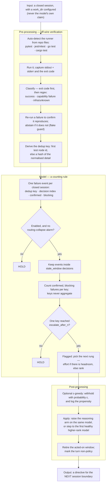

# Error detection & auto-escalation

When the cheap model keeps failing the *same* verified check, Shunt can move up on
its own — raising the model's reasoning effort first, then its rank — without waiting
for you to intervene. This page explains how a failure is detected, what makes one
worth escalating, how the ladder climbs, the safety rails around it, and where it
does nothing.

**It ships OFF.** Auto-escalation is opt-in (`router.escalation.enabled: false` by
default). It is wired on the live routing path, so turning it on takes effect
immediately — but you turn it on deliberately, once you have a verified-outcome
signal for it to act on. The config knobs are in
[Configuration → Auto-escalate on repeated verified failure](configuration.md#auto-escalate-on-repeated-verified-failure).

Its sibling is [the routing model](routing.md), which picks the model *before* any
evidence about the task exists. This one acts only *after* a verified outcome.

## The shape of it

Two stages, and only the first one does any pattern matching.

**Stage one turns a test run into a verdict and an identity.** A subprocess runs your
repo's suite off the wire; the exit code decides first, and regexes over the combined
stdout and stderr decide the rest — whether tests genuinely ran and failed, whether
this was an environment error rather than a capability one, and what to call the
failure. That name is the **dedup key**: the first test node id the runner printed,
or a hash of the failure detail with the volatile parts stripped out.

**Stage two is arithmetic.** No regex, no model, no learned weights: count how many
confirmed, non-infrastructural failures share each dedup key inside a window of
recent decisions, and fire when one key reaches the threshold. Distinct keys never
add together.



**One verified outcome per session, not per step.** This is the single fact most
easily got wrong about the live path. The verifier runs at session close, so the
router records at most one failure event per closed session — not one per tool call,
not one per agent action. With the shipped `escalate_after_n: 2`, escalation
therefore needs **two sessions** on the same repo failing the *same* check inside the
window. It does not watch an attempt unfold and intervene inside it. The offline eval
in `benchmark/escalation/` replays one event per *step*, which is a different and
more frequent cadence; that gap is spelled out under
[what the sweep does not establish](#two-things-this-sweep-does-not-establish).

## Detection — what counts as a failure

Escalation acts on **verified** failures only. A model's own claim that "the tests
pass" is never trusted — coding agents misreport — so the signal comes from a
non-model producer: your test suite, re-run off the wire.

- **Off-wire re-run.** At session close, if you have configured a `work_dir`, Shunt
  re-runs *that repo's* test suite off the request path and records the pass/fail as
  a verified outcome. The runner is auto-detected from the repo: **pytest** (Python),
  **jest**/**vitest** (a `package.json`), **`go test`** (a `go.mod`), or **`cargo
  test`** (a `Cargo.toml`). No `work_dir`, no framework, no signal — Shunt writes
  nothing and never guesses. See [Feedback](feedback.md#1-automatic--off-wire-test-execution-the-signal-that-matters).
- **Flake guard.** A test that fails then passes on unchanged state is a flake, not a
  regression. A failing run is re-run to confirm; if it does not reproduce, the result
  is abstained (it feeds neither the router nor escalation). Only a failure that
  reproduces every time is passed through.
- **Environment vs capability.** A missing module, a broken test-collection step, or a
  wrong interpreter (`ModuleNotFoundError`, a pytest collection error, `go: cannot
  find module`, an unresolved Rust import) is **infrastructural** — no bigger model
  fixes a missing dependency. Shunt classifies these as environment failures and they
  **never count toward escalation**. Only a genuine capability failure — the code ran
  and the assertions failed — is escalation-eligible.

  One caveat, for anyone measuring with this flag rather than just running on it: across the
  ten repositories in `benchmark/escalation/data/live/` the environment-failure rate spans
  13.2% (pylint) to 0.20% (matplotlib) — a 64× spread — while barely moving with model or
  reasoning effort. Do not read that as a property of the repositories. It is driven
  substantially by **individual broken instances**: 175 of pylint's 176 infra-flagged steps
  come from one instance. So any number computed from this flag, the `infra_rate` prefix
  feature included, can be encoding which instances a split happened to contain rather than
  anything the agent did. Do not read one as behavioural without controlling for instance and
  repository.
- **A stable failure identity.** Each confirmed failure gets a **dedup key**: the
  failing test's node id where the runner prints one (`path::Test::case`), or a
  normalized hash of the failure detail otherwise — with timings, hex addresses,
  temp paths, timestamps, randomized run seeds (a runner that prints its own
  `random seed:` / `PYTHONHASHSEED`), subprocess pids, and pytest's `--durations`
  block stripped, so the *same* recurring failure hashes to the same key run to run.
  The durations block is dropped whole rather than value-normalized: it is sorted by
  time, so run-to-run jitter permutes the lines and normalizing only the numbers still
  leaves the key random. That key is what lets Shunt tell "the same problem again" from
  "a different failure."

Human feedback (`shunt flag <id> bad`) is the other verified source and carries the
same weight as a failing suite — a person confirming the result is ground truth.

## Triggers — when it escalates

One failure is not enough. Intermediate fail-then-fix is normal, so a single verified
failure never escalates. Shunt escalates only when the **same** verified failure
recurs:

- **The same key, `escalate_after_n` times** (default **2**) within `stale_window`
  decisions (default **10**). Two reds on the *same* failing check inside the window
  trip it.
- **Different failures don't aggregate.** Two verified failures with *different* keys
  are two different problems — that is the kNN store's job to learn from, not a signal
  to escalate. Only same-key recurrence counts.
- **A window that goes quiet retires.** A failure that does not recur within
  `stale_window` decisions is dropped from the counter, so an old, since-fixed problem
  cannot trigger later.
- **Success clears the slate.** When the whole suite goes green, every pending failure
  for that repo is retired — the router saw the problem resolve.
- **One escalation consumes its evidence.** After Shunt steps a rung, the failures it
  acted on are consumed. Climbing the *next* rung requires a genuine fresh
  recurrence — two more verified same-check reds — not the same two firing again.

Escalation is keyed per **task** (the repo / `work_dir`), so a repeated failure in one
project never escalates routing for another.

### The sameness premise is untested, and this corpus cannot test it

"The same failure twice means the model is stuck" is a design assumption. The obvious way to
check it is to compare runs that repeat one failing-check id against runs that hit several.
That comparison is not available today. The stored trajectories in
`benchmark/escalation/data/live/` carry per-step outcomes stamped by re-running each
instance's target tests, and in three repositories that stamping is broken in ways that
manufacture precisely the buckets such a comparison would use:

- **django fabricates a single key per instance.** Its `FAIL_TO_PASS` ids have the form
  `test_x (module.Class.test_x)`; the runner cannot address them, every step errors out, and
  the failure detail hashes to a per-instance constant. All 108 django keys are opaque hashes,
  not one is a real node id, and 3,266 of 3,412 django steps are stamped blocking-red whatever
  the agent did. Those runs dominate the single-key group — 99 of its 537 members.
- **sympy fabricates passes.** Its ids cannot address `bin/test`, so no test is selected, the
  command exits 0, and the step is stamped a verified success. 80 of the 98 runs carrying no
  failing-check id at all are sympy.
- **sphinx-doc keys are 98.8% opaque hashes** rather than node ids, and it supplies 70 of the
  156 runs with two or more distinct ids.

A split on distinct-key count therefore sorts trajectories largely by which repository they
came from, through three unrelated stamping defects. Any lift it shows is about the harness,
not the agent — which is why this page reports no such number.

**The question is open.** Whether same-key recurrence, key diversity, or neither predicts
failure cannot be settled until the corpus is re-stamped with keys that address the tests they
name. Until then treat the same-key rule as an untested design assumption: not evidence-backed,
and not refuted either.

## The ladder — effort first, then rank

The default ladder is `effort_then_rank`, and it climbs **one rung per step, never
straight to the top**:

1. **Raise reasoning effort first.** The router bumps the *current model* up one
   reasoning arm (e.g. `medium` → `high`). It is the **same model**, so the provider's
   prompt-cache namespace is unchanged — this rung is cache-safe. The higher arm's
   request params are applied to the outbound call, overriding any the client sent.
2. **Then step a rank.** Only once the model's reasoning arms are exhausted — or if the
   model declares no reasoning arms at all — does the router step to the next model
   rank (the next-higher-price model). The new model starts at its *own* default
   arm, not mid-ladder.
3. **Hold at the top.** At the ceiling (top rank, top arm) escalation holds rather than
   thrashing.

**A rank step buys price, not measured capability.** Rank is a model's position in the
registry, and the registry is ordered by price — which is not a capability ordering. On
Shunt's own benchmark that ordering inverts: the cheapest enabled model out-scores several
models priced well above it, so stepping one rank up can *lower* the pass rate on your
workload. The measured per-model table is in
[Results → How to read this page](results.md#how-to-read-this-page); check it against your
own registry before you trust the ladder. The effort rung has no such problem — it is the
same model at a higher reasoning arm — which is why `effort_then_rank` is the default and
why `rank_only` deserves the more careful look.

Set `ladder: rank_only` to skip the effort rung and step ranks directly. The effort
rung needs a model that declares [reasoning arms](configuration.md#reasoning-effort-optional);
a model without them has no effort headroom and steps rank immediately.

## Safety — the rails

- **Never mid-cached-turn.** An escalation applies only at the **next session
  boundary**. Shunt never switches a model in the middle of a cached conversation,
  which would force a full-price re-read of the context. Cache-safety is preserved by
  construction.
- **Routing-collapse guard.** If the recent model-choice distribution is degenerate —
  the expensive tail dominates, or choice-entropy collapses — a routing-collapse alarm
  **suppresses further escalation** so the router cannot ossify onto costly models.
  The same signal is exposed at `GET /admin/loop-health`.
- **Escalated turns don't train the policy.** An escalation is imposed by the failure
  signal, not chosen by the policy, so an escalated turn is recorded as non-policy: its
  selection propensity and candidate scores are neutralized, and it opens a fresh label
  window. The learner never mistakes a forced escalation for a free policy win.
- **State survives a restart.** The failure log and per-task ladder position are
  snapshotted, so a restart resumes where it left off rather than forgetting a
  half-climbed ladder.

## Why it is built this way

The design is mostly a series of refusals, and each one is worth knowing before you
rely on it.

- **The signal comes from a process the model does not control.** A model grading its
  own work is the cheapest verifier available and the least trustworthy. Re-running
  your suite off the wire costs one subprocess per session and buys a label the agent
  cannot talk its way out of.
- **Counting, not scoring.** A learned risk model would need a corpus of labelled
  failures to train on — the thing this loop is still collecting — and would have to be
  trusted before it could be checked. A count has one parameter you can read off the
  config. This is the simplest rule that could work, picked so its failure modes stay
  legible; it is not the end state.
- **Recurrence, because a first failure is ordinary.** Fail, read the traceback, fix:
  that is the loop working. Escalating there spends frontier money on a model that was
  about to succeed anyway. A second *identical* failure is the first evidence that
  reading the traceback did not help.
- **Two failure classes are excluded because no larger model repairs them.** An
  unreproducible failure is a flake; a missing dependency is a broken environment.
  Escalating on either buys a pricier model for a problem that was never about
  capability.
- **One rung at a time, effort before rank.** The cheapest intervention that could
  plausibly work goes first, and the effort rung keeps the same model — so it does not
  cost you the prompt cache. Jumping straight to the top would be simpler to implement
  and would spend the most on the least evidence.
- **At the boundary, never inside a turn.** A mid-conversation switch forces a
  full-price re-read of the cached context. Any escalation that could only pay off by
  breaking the cache is not worth having, so the directive waits for the next session.

## Limitations — read before enabling

Be honest with yourself about where this does nothing:

- **Off by default, and for a reason.** With no verified-outcome history, every
  cheap-model failure would look escalation-worthy and nothing would be learned. Turn
  it on once you have a handful of labelled sessions (roughly 5–10) so the trigger has
  something real to act on.
- **No `work_dir`, no automatic signal.** Auto-escalation is inert until you point
  Shunt at a repo it can test. Without that, the only verified failures are the ones
  you enter by hand with `shunt flag <id> bad`.
- **No tests, no signal — the vibecode case.** A repo with no test suite produces no
  verified outcome, so auto-escalation does nothing there. It cannot escalate on a
  signal that does not exist.
- **It needs repeats across sessions, not within one.** Because the verifier runs at
  session close, a session that fails the same check twenty times internally still
  contributes one event. Escalation is a between-session mechanism; nothing here
  rescues a single attempt that is going badly while it is going badly.
- **A runner with unstable output can never accumulate recurrence.** When no test
  node id is printed, the key is a hash of the failure detail, and the normalizers
  strip only the volatility we have enumerated — timings, addresses, temp paths,
  timestamps, seeds, pids, duration blocks. A runner that prints some *other*
  per-run-varying string hashes to a fresh key every time, so the same failure never
  looks like a recurrence. The field stays populated, which is what makes this quiet:
  it looks like it is working.
- **It grades nothing.** This is a counting rule, not a risk model. Every confirmed
  blocking failure counts exactly one; there is no severity, no confidence, and no
  score you can threshold differently. A trivial assertion and a total collapse are
  the same event to it.
- **SWE tasks only.** The verified signal is a repository's own test suite. Work with
  no runnable check — analysis, prose, a spreadsheet — produces nothing for this
  mechanism to act on.
- **The effort rung needs reasoning arms.** A model that declares none skips straight
  to a rank step; there is no effort headroom to climb.
- **Runs where Shunt sits beside your code.** The off-wire re-run needs the repo *and*
  its test toolchain on the same machine — a plain `shunt start` on your dev box. A
  slim container has neither unless you mount them; there, use `shunt flag` via
  `docker exec`. See [Feedback → by deployment](feedback.md#giving-feedback-by-deployment).
- **A pre-human-label mechanism, still being proven.** This is the day-one learning
  signal that works before any human-rating flow exists. Whether cheap-first routing
  plus verify-and-escalate beats always-frontier at equal quality is what Shunt is
  still validating; treat auto-escalation as opt-in until that holds for your own
  workflow.

## Turn it on

Escalation ships off and is configured through `router.yaml` — there is no CLI flag
(`shunt start --config-override '...'` does not exist; the `start` flags cover only routing
strategy, exploration, and budget). Set it in your `router.yaml`:

```yaml
router:
  escalation:
    enabled: true
    escalate_after_n: 2         # same-key verified failures before a step
    stale_window: 10            # a failure not recurring within N decisions retires
    ladder: effort_then_rank    # or rank_only
```

The knob reference, including the reserved `blocking_exit_code` field, is in
[Configuration](configuration.md#auto-escalate-on-repeated-verified-failure).

## Measuring whether escalation actually helps

Turning escalation on tells you nothing about whether it *worked*. A deterministic policy
escalates at every checkpoint it flags and nowhere else, so the logs contain no case where a
flagged checkpoint was left alone. There is no comparison to make — not a noisy one, none. Any
"escalation improved things" read off such logs is a difficulty proxy: escalation fires on the
runs that were already going badly.

`exploration_epsilon` fixes that by withholding the escalation at a small random fraction of
flagged checkpoints and **recording the probability that generated each choice**:

```yaml
router:
  escalation:
    enabled: true
    exploration_epsilon: 0.2    # withhold ~1 in 5 flagged escalations
    exploration_seed: 20260728  # optional; omit and shunt draws + records one
```

It is a **separate opt-in**: `enabled: true` on its own never randomizes anything, and
`exploration_epsilon: 0.0` (the default) is today's behaviour bit for bit.

What gets recorded, on the session's decision provenance, at flagged checkpoints only:

| Field | What it is |
|---|---|
| `checkpoint_id` | The recurring failing-check id that flagged this checkpoint |
| `action` / `policy_action` | The arm taken, and what the deterministic policy would have done |
| `propensity` | `P(action taken)` — `1-ε` for the escalation arm, `ε` for the withheld arm |
| `epsilon`, `seed` | Enough to re-derive the draw after the fact |
| `features` | The state as of the decision — failure counts, distinct keys, ladder headroom |
| `randomized` | `false` for a checkpoint with no rung left to climb; those are excluded, not weighted |

Three properties worth knowing:

- **It cannot cost you cache.** The explored arm is always *hold*. Randomizing can only
  withhold an escalation, never invent one, so it introduces no model switch the deterministic
  policy would not have made — and the directive still applies at the next boundary.
- **It is reproducible.** Given the seed, the sequence of draws is exact, so a logged
  propensity can be audited rather than trusted.
- **It costs quality while it runs.** You are deliberately declining some escalations. Turn it
  off outside collection windows.

Read the logs back with the estimator in `benchmark/escalation/ope.py`:

```python
from benchmark.escalation.ope import always_escalate, estimate_policy_value, rows_from_records
from shunt.db.store import OutcomeStore

store = OutcomeStore()
result = estimate_policy_value(rows_from_records(store.escalation_exploration_rows()))
print(result.status, result.dr_estimate, result.ci_low, result.ci_high)
```

It reports a doubly-robust estimate of a target policy's value with a 90% bootstrap interval —
**or** `status == "not_identified"` with every numeric field `None`, which is what you get from
logs that contain no randomization, only one realized arm, or no verified outcomes. That refusal
is deliberate: the estimator will not hand you a number the data cannot support.

## Evaluating the detector offline

Before you trust the trigger on live traffic, you can measure it — offline, at no API
cost — against stored agent trajectories. The `benchmark/escalation/` harness replays the
exact same decision the live router uses over per-decision trajectories and sweeps its
knobs, so you can see where it fires, how early, and at what precision.

Run it end-to-end:

```bash
make escalation-eval
# equivalently: uv run --extra benchmark python -m benchmark.escalation.run_eval
# figures land in benchmark/escalation/reports/; pass --plots-dir to write them elsewhere
```

The `--extra benchmark` flag (baked into the Make target) is required — it pulls the
eval deps (`matplotlib`, `swebench`, …); a bare `uv run` strips them.

It prints a JSON report and two metric tables to stdout, and renders the figures. The eval
has **two independent blocks**, because they answer different questions:

**1. The policy, graded per trajectory.** The shipped recurrence policy is replayed over each
stored run and asked the question the product actually asks: given it fired, is this run more
likely to fail? One row is one trajectory (not one prefix), `n_escalated` is per configuration,
and every rate carries a 95% **challenge-level bootstrap** interval next to the corpus base
failure rate. The bootstrap resamples whole challenges rather than rows, because runs on one
challenge are correlated and a row-level interval is too narrow; the fired and not-fired arms
are estimated from the same resamples, so the two are comparable. Read `P(fail | fired)`
against `base`: an interval containing the base rate is a configuration with no measured
value, and an interval below it means firing predicts *success*. The sweep varies **both**
`escalate_after_n` and `stale_window` — they are coupled, since reaching *n* recurrences needs
a window at least that wide — so the grid spans `escalate_after_n` ∈ {2, 5, 8, 10, 15, 20, 30}
× `stale_window` ∈ {10, 1000} (14 cells). The shipped configuration is guaranteed a cell and is
reported separately, never adopted by argmax.

**2. A prefix risk model, graded against the null.** A continuous risk score — the probability
this run ends unresolved — is fit from prefix-only features at fixed decision depths and
evaluated out-of-fold. Three numbers are reported and only the last one is meaningful:

- `prior` — the router's own t=0 knowledge: the per-challenge failure rate estimated from
  **train folds only**, which is what a router meeting an unseen instance actually has. Task
  identity alone is a strong predictor, so any unconditional number mostly rediscovers task
  difficulty.
- `prefix` — out-of-fold discrimination from the prefix alone.
- `incremental` — `AUROC(prior + prefix) − max(AUROC(prior), 0.5)`. **This is the number that
  decides whether escalation is worth anything.** Everything else overstates it. The comparator
  is floored at chance so an anti-predictive prior cannot be beaten into an apparent finding.

The reported ladder is a single depth, **10** — the shallowest depth this corpus can score
full-rank. Depth 5 is dropped: its design is rank-deficient (the first five replayed steps are
all bug-reproduction, so almost every row carries the same feature vector). Depth 20 is
dropped too: at that depth the admission test selects failures, so its incremental measures
selection rather than prefix evidence. On the current corpus this half reads `NO_SKILL`
(prefix AUROC 0.478, incremental −0.022, minimum detectable effect ≈ 0.59) — it is the
secondary, honest instrument; the measurable edge belongs to the policy half.

### Two things this sweep does not establish

**It does not measure the cadence the product runs.** Live, a verified outcome is produced
once per **closed session**: the off-wire verifier runs at the session boundary and the router
records at most one failure event per capture. The offline replay emits one event per **step**
— it walks a stored trajectory and asks the escalation runner for a directive at every
decision, so an 8-step run yields 8 events. Every trajectory in
`benchmark/escalation/data/live/` is a single session: 799 files, 799 distinct ids, median 31
steps. At the live cadence each would contribute exactly **one** event, and the shipped
`escalate_after_n: 2` could not fire even once on the whole corpus. So what the sweep measures
is recurrence *within* one session's steps, which is not the quantity the shipped rule counts.
Any `escalate_after_n` result it reports — including a cell it flags as better than the
default — describes a per-step policy Shunt does not run.

That gap is a property of the data, not a bug awaiting a patch. A session-cadence replay needs
trajectories spanning several sessions; none of these do. Closing it takes new collection, not
new code.

**It does not exercise the flake guard.** The live trigger discards any failure that did not
reproduce on re-run (`confirmed=False`). Offline, the stamping stage sets `confirmed=True` on
every step it touches, and the container replay runs each step's target tests exactly once —
there is no second execution a genuine confirmation could come from. Every replayed event
satisfies the guard by construction. Its effect on the policy is therefore **unmeasured**, not
measured and found to be nil. Read every sweep result as the policy's behaviour with the flake
guard switched off.

What the rest of the report means:

- **`status` is gated by a permutation null — and it reads the policy half too, not only the
  prefix.** A policy cell counts as skill when it (a) actually fires, (b) clears its family-wise
  permutation null — the max-over-cells (maxT) reference across the whole swept family, one
  shared shuffle scored at every cell — and (c) has a `P(fail | fired)` interval that clears
  the base failure rate. That interval is corrected the same way: for a swept family it is the
  family-wise max-over-cells reference built from the same challenge resamples (the distribution
  of the family's best precision), so the precision clause pays for the same selection the null
  does, and a single-cell call keeps its marginal bootstrap. On the current corpus that happens
  at `escalate_after_n=30` /
  `stale_window=1000` (AUROC 0.662 against the null 95% [0.500, 0.549], adjusted p = 0.005), so
  the status is `OK_OFFLINE_ONLY` and the verdict names the winning cell, not a model. The policy null is a
  BLOCK permutation — whole challenge blocks are shuffled, so outcomes move between challenges
  while the global multiset is preserved — because this half's claim is unconditional and the
  exchangeable unit is the whole challenge. Only if no policy cell
  clears does the gate fall through to the prefix depths, which read the family-wise incremental
  AUROC null with the whole fitting pipeline re-run per shuffle. Labels are permuted **within
  each challenge**, never globally: a global shuffle destroys the challenge-level clustering of
  outcomes, which leaves the null and the observation with different amounts of headroom and
  the gate with no power. Otherwise the status is `NO_SKILL` (with the numbers and p-value in
  the reason), `INSUFFICIENT_DATA`, or `AUTHENTICITY_FAILED`, and every figure states it in red
  under the plot. A point estimate above 0.5 is never treated as skill on its own.
- **`deployability` says whether the number is one you could ship.** `status` answers "is there
  a signal"; this answers "is the thing that found it a policy the router could run". It is
  mechanical, not editorial: every scored feature is checked against the fields a live
  escalation decision actually receives — the windowed failure log plus the ladder position —
  and the cadence the eval scored is checked against the one the router runs, a single decision
  per session. On the current corpus the verdict is `OFFLINE-ONLY UPPER BOUND`, because
  `infra_rate` and `max_action_repeat_rate` read step fields the live decision never sees and
  the sweep scores step boundaries. The label is printed under `status`, carried in the JSON as
  `deployability`, and stamped on every figure footer, so a result cannot be quoted as
  deployable by omission.
- **Two structural anti-leak rules.** Features are read at a **fixed absolute depth**, never a
  fraction of the run — a fraction needs the total length, which is future information. And
  the **terminal step is excluded**, because the harness verdict is stamped onto it. Both are
  pinned by tests; see `benchmark/escalation/features.py`.
- **Grouped cross-validation by challenge.** A challenge never appears in both train and test,
  so the model cannot rediscover task identity through the fold boundary. **This guarded the
  prefix model but not the task prior it was scored against:** the prior was built from the
  leave-one-out mean of each row's *own* challenge, so it read labels from its own test fold.
  The published prior AUROC has been retracted (see `results.md`). The comparison baseline is
  now estimated from **train folds only** over the same grouped partition, so it never reads a
  test row's own challenge; the leaked leave-one-out figure is still reported alongside, marked
  as a diagnostic contrast rather than the baseline. Because that honest prior scores *below*
  chance on this corpus, the increment is measured against `max(prior, 0.5)` — an
  anti-predictive baseline must not be beatable into an apparent finding.
- **The sweep varies `escalate_after_n` AND `stale_window` — they are coupled.** `_in_window`
  admits at most `stale_window` events, so reaching *n* recurrences needs a window at least
  that wide. The grid spans n ∈ {2, 5, 8, 10, 15, 20, 30} × `stale_window` ∈ {10, 1000};
  `escalate_after_n=1` is deliberately excluded (it fires on the first verified failure, which
  is failure-biased). `ladder` is pinned: the detection metric reads whether the policy fired,
  not which rung it climbed, so it cannot move the headline. The shipped configuration
  (n=2, `stale=10`) is guaranteed a row, highlighted on the sweep table, and the report
  **flags** a better cell and never changes the shipped default. On this corpus the `stale=10`
  rows stop firing at n ≥ 15 — the window cannot hold enough recurrences — while the
  `stale=1000` rows reach a null-clearing edge at high n.
- **Runs with no per-step verified outcomes are excluded and counted.** A trajectory the
  stamping stage never processed carries parser defaults, not evidence; including it would feed
  the model a collection-date proxy. The exclusion count appears in the JSON and in every
  figure footer.
- **Figures.** PR curve and ROC are the **policy** operating characteristics across the swept
  recurrence thresholds (one point per `escalate_after_n` value that fired; the prefix risk
  model's curves are not drawn, because its score is constant at the evaluated depths and it
  ranks nothing), the confusion matrix at the best-separating cell with a random-at-the-same-
  flag-rate baseline and a populated "not flagged" column, the policy's family-wise
  max-over-cells permutation-null histogram, the sweep as an interval table with the
  shipped-default row highlighted, trajectory outcomes (escalated vs left alone) at the shipped
  cell against the base rate, and failure-capture coverage per model. Each carries a footer —
  what the axes are, what to look for, what the jargon means, and the honest limits — so a
  figure pasted elsewhere is still readable on its own.

**The harness runs on captured multi-step trajectories only.** The recurrence trigger cannot
fire on a length-1 stream, and a prefix model needs a prefix, so the eval reads
`benchmark/escalation/data/live/` (tracked via Git LFS, with a content-hash `manifest.json`
that fails CI if a label is tampered with). Point `--live-dir` elsewhere to score your own.

### Capturing your own trajectories (opt-in, encrypted, local-only)

To evaluate the detector on *your* traffic, Shunt can record full-content per-step
trajectories from live sessions. This is **off by default** and secure by construction:

```yaml
router:
  capture:
    work_dir: /path/to/repo    # the off-wire verifier's repo (see Feedback)
    full_content: true         # opt in to full-content capture
    trajectory_dir: null       # null ⇒ a local dir OUTSIDE the repo ($SHUNT_HOME/trajectories)
```

When enabled it needs the `capture` extra (`pip install 'shunt-router[capture]'`) and an
encryption key in `SHUNT_ESCALATION_KEY` (never commit it). Every free-text field is
**redacted** of secrets and then **encrypted at rest** before anything is written; capture
happens off the wire at the session boundary, never mid-turn, and never changes a routing
decision. The captured files stay **local and git-ignored**.

**Before you share any of it, read this.** A behaviour-only field whitelist
(`COMMITTABLE_FIELDS`, in `benchmark/escalation/schema.py`) names the fields that are
*eligible* to be published — the verified-outcome core and the numeric signals, no prose. But
nothing enforces it on the write path: the serializer writes every field, free text included,
and the projection function that applies the whitelist has no caller outside the tests. That
is what the trajectories shipped in this repo are — full `action`, `args` and `result` text on
every step, secret-redacted but not field-filtered. Redaction is the defence that actually
runs. If you publish your own capture, project it yourself; do not assume the whitelist did it
for you.
