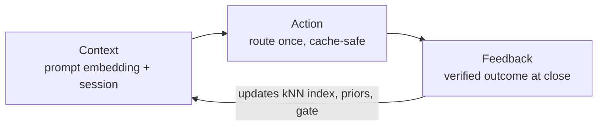

# Feedback: how Shunt learns

Shunt does not assume which model is good at your work — it **learns from verified
outcomes**. Every session is one turn of a **Context → Action → Feedback** loop:
Shunt sees the task (context), routes it to a model (action), then records whether
that model actually succeeded (feedback). The feedback is what makes the next route
better. Without it the router stays in cold-start and sends everything to the cheap
default.



## Context — what Shunt sees

The input to a routing decision: the prompt (embedded into a vector), the session
identity, and the cache state. The decision is made **once**, on the session's first
turn, and reused for the rest of the session — routing mid-session would forfeit the
provider's prompt cache. `shunt explain <session_id>` shows the context and the
decision it produced.

## Action — the routing decision

The model Shunt picks for the session. Alongside the choice it records the
**selection propensity** (how likely that model was to be picked) and the resolved
**model-version fingerprint**, so a feedback that arrives later attributes to the
exact decision that produced it — and so the router can tell a genuine model change
from noise.

## Feedback — recording the verified outcome

At session close Shunt records what happened. There are three sources, ranked by how
much the router trusts them. Only a **non-model producer** — a test runner or a
human — can write a verified label. The model's own claim that "tests pass" is never
trusted, because coding agents reward-hack and misreport.

| Source | Tier | Trust | Enable |
|---|---|---|---|
| Off-wire test run | Tier-2 | Verified (drives routing) | Set a `work_dir` |
| Structured wire signal | Tier-1 | Weak prior, quarantined | Automatic when present |
| Human `shunt flag` | Tier-2 | Verified (drives routing) | Always available |

### 1. Automatic — off-wire test execution (the signal that matters)

When a `work_dir` is configured, at session close Shunt re-runs **that repo's test
suite** off the wire — `pytest`, `jest`/`vitest`, `go test`, or `cargo test`,
auto-detected — and records the pass/fail as a verified Tier-2 outcome. No human step.

Arm it with an environment variable or config:

```bash
SHUNT_WORK_DIR=/path/to/your/repo shunt start
```

```yaml
# router.yaml
router:
  capture:
    work_dir: /path/to/your/repo
    # work_dirs: { "<tool_identity>": /path/to/other/repo }   # per-tool override
```

The startup log states whether capture is armed or manual-only.

**Know its limits before you trust it.** Automatic capture is a strong signal, not
ground truth:

- It runs the **whole** suite and attributes the result to the session that just
  closed. A pre-existing, unrelated failure will label a good session bad.
- It needs the repo **and its test toolchain** wherever Shunt runs. A slim container
  that has neither cannot run your tests — see [by deployment](#giving-feedback-by-deployment).
- A flaky test (fail → pass on unchanged state) is re-run once to confirm it is real;
  a failure that does not reproduce is treated as a flake and abstained from (does not
  feed the router or escalation). A confirmed failure is passed through.
- If there is no test framework, or no `work_dir`, Shunt writes **nothing**. It never
  fabricates a label from a session it could not verify.

### 2. Structured wire signals (weak, quarantined)

Shunt also sees signals on the wire that no model authored — a tool result marked
`is_error`, a terminal `stop_reason`. It records these as a **weak Tier-1 prior**,
but **quarantines** them from routing until a real Tier-2 outcome corroborates: a
prior is a hint, never a label on its own. Coverage today is partial — chiefly tool
errors on the Anthropic stream — and this layer exists mainly for observability.

### 3. Human feedback

The simplest signal: after a task finishes, tell Shunt whether it actually worked.

```bash
shunt flag <session_id> good     # it worked
shunt flag <session_id> bad      # it didn't
```

That counts as a **verified Tier-2 label** — the same weight as a passing test suite —
because a person confirming the result is real ground truth, not the model's own claim.

Finding the session is one step: every routed response carries its id in the
`X-Shunt-Session-Id` header, and `shunt explain <session_id>` shows what a session was
and why it got its model. (In a container, prefix with `docker exec <container>`.)

Flag honestly — a session marked `good` because it merely *looked* right teaches the
router a superstition it cannot later tell from a real success.

**This is deliberately the rough-cut version.** Today feedback is one CLI command per
session. The intended path is much smoother — an inline "did that work?" prompt at the
right moment, batch review of recent sessions, and *implicit* signals (you kept the
change, or you reverted it) so most labels cost you nothing. Those are on the roadmap;
the CLI is the honest floor that works today.

## Giving feedback by deployment

How you record feedback depends on how Shunt runs.

| Deployment | Automatic capture | Human feedback |
|---|---|---|
| `shunt start` on your host / dev box | Works — set `SHUNT_WORK_DIR` | `shunt flag <id> good` |
| Docker / `docker compose` | Off unless you mount the repo + its test deps | `docker exec <container> shunt flag <id> good` |

Automatic capture belongs where Shunt runs **beside** your code and its tests — a
plain `shunt start` in your dev environment. In a container the image is deliberately
slim and has neither your repo nor `pytest`, so auto-capture stays off unless you
mount both; in practice, use human feedback via `docker exec`. There is no HTTP
feedback endpoint yet — feedback is the `shunt` CLI, which is why a container needs
`docker exec`. A feedback API is future work.

## Watching the loop

- `shunt explain <session_id>` — the context and action for one session.
- `GET /admin/loop-health` — label coverage, propensity support, and a
  **reward-independent** routing-collapse alarm. The alarm keys on the model-choice
  distribution alone, so a degenerate loop that keeps reward looking fine while the
  policy ossifies onto one model cannot hide from it.

```bash
curl -s localhost:8080/admin/loop-health
```

## What feedback changes

A verified outcome updates three things for the **next** session, never mid-session:
the kNN index (so a similar prompt routes to what worked), the exploration priors,
and the escalation gate (a model that proves not capable is escalated next time — see
[Error detection & auto-escalation](escalation.md)).
Learning is batch — the index rebuilds from an append-only outcome log on a cadence,
not on every request — which keeps the cache-safe, one-decision-per-session guarantee
intact.

The whole corpus lives in one embedding model's vector space. If you change the embedding
model (or its `max_chars`), the stored vectors no longer match new queries, so Shunt
detects the mismatch at startup and refuses to route on those foreign-space neighbours
until you run `shunt reindex` — see [Configuration](configuration.md#swap-safety-the-fingerprint-and-shunt-reindex).
</content>
