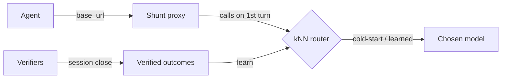

# Shunt

**Pre-alpha.** Shunt is a local, cache-safe proxy between your coding agent and
the model API. The goal is a router that sends routine work to a cheap model and
the hard tail to a frontier one, learning that line from your own passing tests.
**The routing decision seam is live on the first turn, and the learning loop is now wired.**
What runs today: the proxy speaks both the OpenAI and Anthropic wire formats,
calls the router to decide the session model on the first turn, and forwards every request to that model.
Outcomes are recorded automatically at session close via off-wire test re-execution (when configured
with a `work_dir`), or manually via `shunt flag`. The shipped config turns exploration on;
as verified outcomes accumulate, exploration costs are bounded by the budget and weighted by the
router's confidence — see [configuration](configuration.md#tune-the-router).



The solid path is what runs: router chooses a model on the first turn, verifiers record
outcomes at session close (via off-wire test execution when configured), and the router
learns from those outcomes for future sessions.

## An honest result

We tested the core idea (embed a task, find similar past tasks with known
outcomes, pick the cheapest model that succeeded) offline before shipping it.
On QA and reasoning-style workloads the embedding difficulty signal carries and
there is routing headroom. On the agentic-coding workload we actually target it
did **not** clear our viability bar: ranking hard tasks from easy ones off the
prompt embedding came out near chance. We publish that because it scopes the
project — it does not kill the cache-safe proxy or the verify-and-escalate path,
which does not depend on that signal, but it means we do not claim live
coding-task routing we cannot yet back with evidence.

## What runs today

- **A drop-in OpenAI/Anthropic-compatible proxy** — one env var and your agent
  talks to Shunt instead of the provider; Shunt translates between wire formats.
- **Cache-safe forwarding** — no mid-session model switch, so no silent full-price
  re-read of a cached conversation. With a fixed default there is nothing to
  switch; the future routing is being built to keep that guarantee. If an upstream
  fails and Shunt falls back to another model, that model necessarily prefills the
  conversation from scratch — a provider's cache is per-model, so the cost is
  unavoidable rather than a design flaw. It is reported, not hidden.
- **A visible `X-Shunt-Decision` header** — names the model and the reason; today
  the reason is always the cold-start default.
- **Bring-your-own keys, zero telemetry** — nothing phoned home, replayed, or resold.

## Design center (what the roadmap is being built toward)

- **Cache-boundary-aware routing** — decisions at task/session boundaries only,
  never mid-cached-turn.
- **Pluggable, inspectable policy** — kNN over verified outcomes, no brittle rule
  tier; every decision surfaced in a header.
- **OpenAI ↔ Anthropic translation** — these two first, not 100+ providers.
- **Verifier + memory loop** — log `(task → model → verified outcome)` and learn
  from it; verification stays async/backfill, never on the hot path.
- **Secure by default** — localhost-bind, no exposed control plane, no key logging.

## Quickstart

The package is published; install it directly.

```bash
pip install shunt-router
shunt
```

Or with Docker — `.env` carries your provider keys (copy `.env.example`), and the
port is bound to loopback because Shunt holds those keys and does not authenticate
its own clients:

```bash
docker run -p 127.0.0.1:8080:8080 --env-file .env ghcr.io/kookas/shunt-router
```

`docker compose up -d` does the same with a persistent volume for the outcome
store, which is what the router learns from — see `docker-compose.yml`.

**From source** — to run the cloned codebase directly (hacking on Shunt, or running
unreleased code):

```bash
git clone https://github.com/KookaS/shunt.git
cd shunt
cp .env.example .env          # then add your provider keys
uv run shunt                  # pinned deps from uv.lock
```

`uv run shunt`, `python -m shunt`, and the installed `shunt` command are equivalent —
each starts the proxy on `127.0.0.1:8080`. No uv? `pip install -e . && shunt` works
too. (Run from the repo root; the same `shunt <subcommand>` verbs — `flag`, `reindex`,
`explain` — apply.)

Point your tool at localhost:8080 (today, every request forwards to the cheap
default):

| Tool | Env var |
|---|---|
| Claude Code | `ANTHROPIC_BASE_URL=http://localhost:8080` |
| opencode | `OPENAI_BASE_URL=http://localhost:8080/v1` |
| aider | `OPENAI_API_BASE=http://localhost:8080/v1` |
| n8n / LangChain | `baseURL: http://localhost:8080/v1` |

## Teach it which sessions worked

The router learns from verified outcomes. Two ways to give it one:

- **Automatic** — point Shunt at a repo and it re-runs that repo's tests off the wire
  at session close, logging the pass/fail: `SHUNT_WORK_DIR=/path/to/repo shunt start`.
- **By hand** — just tell it a session worked:

  ```bash
  shunt flag <session_id> good     # or: bad
  shunt explain <session_id>       # why that session got the model it got
  ```

  Get `<session_id>` from the `X-Shunt-Session-Id` response header on any routed
  response. Flag honestly — a session marked good because it merely *looked* right
  teaches the router a superstition. Today this is one CLI command per session; a
  smoother "did that work?" prompt and implicit signals are on the roadmap.

Either way, a verified session joins the pool the router compares new tasks against;
until enough accumulate, every session cold-starts to the cheap default. If you swap the
embedding model, re-embed the corpus with `shunt reindex`
([why](configuration.md#swap-safety-the-fingerprint-and-shunt-reindex)). Full loop and
trust rules: [Feedback](feedback.md).

## Contents

- [Architecture](architecture.md) — what runs live vs what's waiting for the learning loop
- [Configuration](configuration.md) — add provider keys and register models
- [Feedback](feedback.md) — how outcomes are captured (auto + manual) and learned from
- [Error detection & auto-escalation](escalation.md) — how a verified failure is detected and, on repeat, escalates a rung (opt-in)
- [Benchmark](benchmark.md) — run the offline model-capability and routing evals
- [Benchmark design](benchmark-design.md) — two-tree structure, strategy interface

## Status

Pre-alpha. The core hypothesis — cheap-first routing beats always-frontier at
equal quality on agentic coding — is unproven and, on the coding workload, the
embedding difficulty signal did not clear the bar. The kill gate (beat
fixed-frontier-with-caching at equal quality on a real workflow) is now
adjudicated online on production sessions. If it does not hold, the router does not ship.

Apache-2.0. Import as `shunt` (`shunt-router` on PyPI — `shunt` is taken).
</content>
