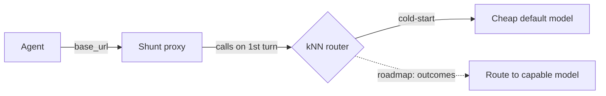

# Shunt

**Pre-alpha.** Shunt is a local, cache-safe proxy between your coding agent and
the model API. The goal is a router that sends routine work to a cheap model and
the hard tail to a frontier one, learning that line from your own passing tests.
**The routing decision seam is now live on the first turn, but the learning loop is not yet wired.**
What runs today: the proxy speaks both the OpenAI and Anthropic wire formats,
calls the router to decide the session model, and forwards every request to that model
(which cold-starts to a cheap default). Outcomes can be manually recorded via `shunt flag`,
but automatic capture from test runs is not yet wired. The shipped config also turns exploration on,
but without recorded outcomes it cannot fire and costs nothing today — see [configuration](configuration.md#tune-the-router).



The solid path is what runs (router is called, but outcomes aren't being written yet).
The dashed path — per-task model selection learning from verified outcomes — is
designed and validated offline; it will engage once the outcome-writing loop is wired.

## An honest result

We tested the core idea (embed a task, find similar past tasks with known
outcomes, pick the cheapest model that succeeded) offline before shipping it.
On QA and reasoning-style workloads the embedding difficulty signal carries and
there is routing headroom. On the agentic-coding workload we actually target it
did **not** clear our viability bar: ranking hard tasks from easy ones off the
prompt embedding came out near chance. We publish that because it scopes the
project — it does not kill the cache-safe proxy or the verify-and-escalate path,
which does not depend on that signal, but it means we do not claim live
coding-task routing we cannot yet back with evidence.

## What runs today

- **A drop-in OpenAI/Anthropic-compatible proxy** — one env var and your agent
  talks to Shunt instead of the provider; Shunt translates between wire formats.
- **Cache-safe forwarding** — no mid-session model switch, so no silent full-price
  re-read of a cached conversation. With a fixed default there is nothing to
  switch; the future routing is being built to keep that guarantee. If an upstream
  fails and Shunt falls back to another model, that model necessarily prefills the
  conversation from scratch — a provider's cache is per-model, so the cost is
  unavoidable rather than a design flaw. It is reported, not hidden.
- **A visible `X-Shunt-Decision` header** — names the model and the reason; today
  the reason is always the cold-start default.
- **Bring-your-own keys, zero telemetry** — nothing phoned home, replayed, or resold.

## Design center (what the roadmap is being built toward)

- **Cache-boundary-aware routing** — decisions at task/session boundaries only,
  never mid-cached-turn.
- **Pluggable, inspectable policy** — kNN over verified outcomes, no brittle rule
  tier; every decision surfaced in a header.
- **OpenAI ↔ Anthropic translation** — these two first, not 100+ providers.
- **Verifier + memory loop** — log `(task → model → verified outcome)` and learn
  from it; verification stays async/backfill, never on the hot path.
- **Secure by default** — localhost-bind, no exposed control plane, no key logging.

## Quickstart

The package is published; install it directly.

```bash
pip install shunt-router
shunt
```

Or with Docker — `.env` carries your provider keys (copy `.env.example`), and the
port is bound to loopback because Shunt holds those keys and does not authenticate
its own clients:

```bash
docker run -p 127.0.0.1:8080:8080 --env-file .env ghcr.io/kookas/shunt-router
```

`docker compose up -d` does the same with a persistent volume for the outcome
store, which is what the router learns from — see `docker-compose.yml`.

Point your tool at localhost:8080 (today, every request forwards to the cheap
default):

| Tool | Env var |
|---|---|
| Claude Code | `ANTHROPIC_BASE_URL=http://localhost:8080` |
| opencode | `OPENAI_BASE_URL=http://localhost:8080/v1` |
| aider | `OPENAI_API_BASE=http://localhost:8080/v1` |
| n8n / LangChain | `baseURL: http://localhost:8080/v1` |

## Teach it which sessions worked

The router learns from verified outcomes, and nothing records them for you yet. Tell
it how a session went and that judgement becomes routing evidence:

```bash
shunt flag <session_id> good     # or: bad
shunt explain <session_id>       # why that session got the model it got
```

A flagged session joins the pool the router compares new tasks against. Until enough
of them accumulate, every session cold-starts to the cheap default, so early flags are
what get routing off the ground. Flag honestly — a session marked good because it
looked plausible teaches the router the wrong lesson, and there is no way to tell that
apart from a real success later.

## Contents

- [Architecture](architecture.md) — what runs live vs what's waiting for the learning loop
- [Configuration](configuration.md) — add provider keys and register models
- [Benchmark](benchmark.md) — run the offline model-capability and routing evals
- [Benchmark design](benchmark-design.md) — two-tree structure, strategy interface

## Status

Pre-alpha. The core hypothesis — cheap-first routing beats always-frontier at
equal quality on agentic coding — is unproven and, on the coding workload, the
embedding difficulty signal did not clear the bar. The kill gate (beat
fixed-frontier-with-caching at equal quality on a real workflow) has not been
run. If it does not hold, the router does not ship.

Apache-2.0. Import as `shunt` (`shunt-router` on PyPI — `shunt` is taken).
</content>
