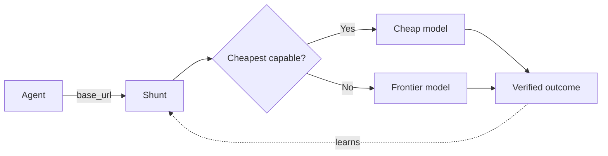

# Shunt

A tool-agnostic, cache-safe LLM router. Shunt sits between your coding agent and the model API. It decides which model handles each request, learns from verified outcomes, and never switches models mid-session.

Cheap models handle the routine ~70-80% of work. Frontier models are reserved for the hard tail. You configure both the model pool and the decision method.



## Why it's different

No shipped OSS project simultaneously gives you pluggable policy, outcome grounding, tool-agnostic design, and cache-safe routing. Each incumbent hits 2-3 of those at best. The hard part is the decision — which task needs the smart model — not the multi-provider plumbing.

## Design center

- **Cache-boundary-aware routing** — controls `cache_control` placement, never switches models mid-session. Post-hoc `usage.cache_read_input_tokens` measures the switch tax but does not decide.
- **Pluggable, inspectable policy** — kNN over verified outcomes, no brittle rule tier. Every decision emits an `X-Shunt-Decision` header.
- **OpenAI ↔ Anthropic translation** — these two first, not 100+ providers.
- **Verifier + memory loop** — log `(task → model → verified outcome)` and learn from it. Verification is async/backfill, never on the hot path.
- **Secure by default** — localhost-bind, no exposed control plane, no key logging. Apache-2.0, zero telemetry.

## Quickstart

```bash
pip install shunt-router
shunt
```

Or with Docker:

```bash
docker run -p 8080:8080 ghcr.io/kookas/shunt-router
```

Point your tool at localhost:8080:

| Tool | Env var |
|---|---|
| Claude Code | `ANTHROPIC_BASE_URL=http://localhost:8080` |
| opencode | `OPENAI_BASE_URL=http://localhost:8080` |
| aider | `OPENAI_API_BASE=http://localhost:8080/v1` |
| n8n / LangChain | `baseURL: http://localhost:8080` |

## Contents

- [Architecture](architecture.md) — modules, flow, integration
- [Benchmark](benchmark.md) — run model-capability and routing evals
- [Benchmark Design](benchmark-design.md) — two-tree structure, strategy interface

## Status

Pre-alpha. The hypothesis — cheap-first routing beats always-frontier at equal quality — is unproven. If it doesn't hold, the project stops.

Apache-2.0. Import as `shunt` (`shunt-router` on PyPI — `shunt` is taken).
