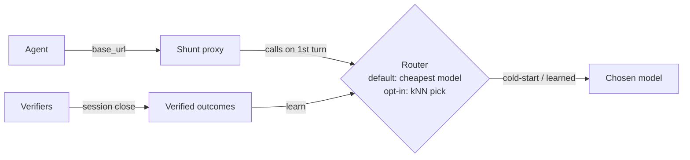

# Shunt

**Pre-alpha.** Shunt is a local, cache-safe proxy between your coding agent and
the model API. The goal is a router that sends routine work to a cheap model and
the hard tail to a frontier one, learning that line from your own passing tests.
**The routing decision seam is live on the first turn, and the learning loop is now wired.**
What runs today: the proxy speaks both the OpenAI and Anthropic wire formats,
calls the router to decide the session model on the first turn, and forwards every request to that model.
Outcomes are recorded automatically at session close via off-wire test re-execution (when configured
with a `work_dir`), or manually via `shunt flag`.

**What a default install decides, precisely.** The shipped `router.strategy` is
`session_cascade`: start every session on the cheapest healthy model, and let a repeated
verified failure raise a rung at the next session boundary. That path does **no per-task
routing** — it never embeds a turn, never queries the neighbourhood, never scores
candidates. The kNN routing model below is what `router.strategy: knn_cascade` turns on,
and it is opt-in. (The `exploration:` block ships `enabled: true` but only perturbs a kNN
base pick, so it too is inert under the default — see
[configuration](configuration.md#tune-the-router).)


```mermaid
graph LR
  A[Agent] -->|base_url| B[Shunt proxy]
  B -->|calls on 1st turn| C{"Router<br/>default: cheapest model<br/>opt-in: kNN pick"}
  C -->|cold-start / learned| D[Chosen model]
  V[Verifiers] -->|session close| R[Verified outcomes]
  R -->|learn| C
```

The solid path is what runs: the router chooses a model on the first turn, verifiers record
outcomes at session close (via off-wire test execution when configured), and the router
learns from those outcomes for future sessions. Under the default strategy the learning
loop feeds the **escalation** ladder rather than a per-task pick; switching to
`knn_cascade` is what makes those outcomes decide the first turn too.

## An honest result

We tested the core idea (embed a task, find similar past tasks with known
outcomes, pick the cheapest model that succeeded) offline before shipping it.
On QA and reasoning-style workloads the embedding difficulty signal carries and
there is routing headroom. On the agentic-coding workload we actually target it
did **not** clear our viability bar: ranking hard tasks from easy ones off the
prompt embedding came out near chance.

That number is weaker evidence than it looks, and we would rather say so than
bank it. The embedder was handed a 106-character identifier instead of the task's
problem statement — still true of every committed task — and the suite's smallest
detectable effect sits far above any published difficulty detector. So on coding
work the question is open, not settled ([Results](results.md#routing-results)).
Either way we do not claim live coding-task routing we cannot back with evidence,
and neither the cache-safe proxy nor the verify-and-escalate path depends on that
signal.

## What runs today

- **A drop-in OpenAI/Anthropic-compatible proxy** — one env var and your agent
  talks to Shunt instead of the provider; Shunt translates between wire formats.
- **Cache-safe forwarding** — no mid-session model switch, so no silent full-price
  re-read of a cached conversation. With a fixed default there is nothing to
  switch; the future routing is being built to keep that guarantee. If an upstream
  fails and Shunt falls back to another model, that model necessarily prefills the
  conversation from scratch — a provider's cache is per-model, so the cost is
  unavoidable rather than a design flaw. It is reported, not hidden.
- **A visible `X-Shunt-Decision` header** — names the model and the reason; while
  the router is cold the reason is the cold-start default, and escalation and fixed
  strategies report theirs (full token list in [routing](routing.md#the-reason-tokens)).
- **Bring-your-own keys, zero telemetry** — nothing phoned home, replayed, or resold.

## Design center (what the roadmap is being built toward)

- **Cache-boundary-aware routing** — decisions at task/session boundaries only,
  never mid-cached-turn.
- **Pluggable, inspectable policy** — kNN over verified outcomes, no brittle
  hand-tuned rules; every decision surfaced in a header.
- **OpenAI ↔ Anthropic translation** — these two first, not 100+ providers.
- **Verifier + memory loop** — log `(task → model → verified outcome)` and learn
  from it; verification stays async/backfill, never on the hot path.
- **Secure by default** — localhost-bind, no exposed control plane, no key logging.

## Quickstart

The package is published; install it directly.

```bash
pip install shunt-router
shunt
```

Or with Docker — `.env` carries your provider keys (copy `.env.example`), and the
port is bound to loopback because Shunt holds those keys and does not authenticate
its own clients:

```bash
docker run -p 127.0.0.1:8080:8080 --env-file .env ghcr.io/kookas/shunt-router
```

`docker compose up -d` does the same with a persistent volume for the outcome
store, which is what the router learns from — see `docker-compose.yml`.

**From source** — to run the cloned codebase directly (hacking on Shunt, or running
unreleased code):

```bash
git clone https://github.com/KookaS/shunt.git
cd shunt
cp .env.example .env          # then add your provider keys
uv run shunt                  # pinned deps from uv.lock
```

`uv run shunt`, `python -m shunt`, and the installed `shunt` command are equivalent —
each starts the proxy on `127.0.0.1:8080`. No uv? `pip install -e . && shunt` works
too. (Run from the repo root; the same `shunt <subcommand>` verbs — `doctor`, `flag`,
`reindex`, `explain`, `escalate`, `inspect` — apply.)

### Check the install first

```bash
shunt doctor
```

It reads configuration only — no provider call, no spend, and it will not download the
embedding model. It reports which provider keys resolve (presence, never the value),
how many models are routable, whether the embedding weights are already cached, whether
the bind address is free, and the one a fresh install usually gets wrong: whether
escalation is **armed** or merely *enabled and inert*. It exits non-zero only when the
router could not serve a request at all, so it is safe in a setup script.

Point your tool at localhost:8080. The router picks the session model on the first
turn and locks it for the session; until enough outcomes accumulate — 20 verified, or
50 labelled of any tier — it cold-starts to the cheap default, which is why a fresh
install looks like one:

| Tool | Env var |
|---|---|
| Claude Code | `ANTHROPIC_BASE_URL=http://localhost:8080` |
| opencode | `OPENAI_BASE_URL=http://localhost:8080/v1` |
| aider | `OPENAI_API_BASE=http://localhost:8080/v1` |
| n8n / LangChain | `baseURL: http://localhost:8080/v1` |

## Teach it which sessions worked

The router learns from verified outcomes. Two ways to give it one:

- **Automatic** — point Shunt at a repo and it re-runs that repo's tests off the wire
  at session close, logging the pass/fail: `SHUNT_WORK_DIR=/path/to/repo shunt start`.
- **By hand** — just tell it a session worked:

  ```bash
  shunt flag <session_id> good     # or: bad
  shunt explain <session_id>       # why that session got the model it got
  ```

  Get `<session_id>` from the `X-Shunt-Session-Id` response header on any routed
  response. Flag honestly — a session marked good because it merely *looked* right
  teaches the router a superstition. Today this is one CLI command per session; a
  smoother "did that work?" prompt and implicit signals are on the roadmap.

Either way, a verified session joins the pool the router compares new tasks against;
until enough accumulate, every session cold-starts to the cheap default. If you swap the
embedding model, re-embed the corpus with `shunt reindex`
([why](configuration.md#swap-safety-the-fingerprint-and-shunt-reindex)). Full loop and
trust rules: [Feedback](feedback.md).

## Contents

- [Architecture](architecture.md) — what runs live vs what's waiting for the learning loop
- [Configuration](configuration.md) — add provider keys and register models
- [Feedback](feedback.md) — how outcomes are captured (auto + manual) and learned from
- [The routing model](routing.md) — what the session's model choice reads, how it decides, and where it stops
- [Model triage](model-selection.md) — which models earn a slot in the live pool: the routine frontier with its Wilson-CI band, the escalation rung, and what gets dropped
- [Error detection & auto-escalation](escalation.md) — how a verified failure is detected and, on repeat, escalates a rung (ships enabled; armed when a repo is resolved)
- [The escalation claim](escalation-claim.md) — what we do and do not assert about escalation, with its pre-registered falsifiers and their verdicts
- [Escalation dataset](escalation-data-card.md) — what the escalation corpus is: provenance, census, known defects, access mechanics
- [Reproducing the escalation eval](escalation-reproduction.md) — run the offline escalation eval from a fresh clone, and the numbers a correct run reproduces
- [The live router](inference.md) — seven figures measuring the shipped router on its own outcome store
- [The same seven figures, on invented data](inference-demo.md) — an illustrative render of those seven over a synthetic corpus, so the panels the measured page leaves empty can be read at all
- [Results](results.md) — every measured routing, escalation, and inference number, with its caveats
- [Research log](research-log.md) — published ideas we tested, and what held
- [Benchmark](benchmark.md) — run the offline model-capability and routing evals
- [Benchmark dataset](benchmark-data.md) — what data is collected and usable, censored cells, outliers, collection modes
- [Benchmark design](benchmark-design.md) — two-tree structure, strategy interface
- [Live smoke](live-smoke-runbook.md) — run one real, cheap session through Shunt against a real provider
- [Free-tier smoke](free-tier-smoke.md) — the weekly, zero-cost CI check against a real $0 model

## Status

Pre-alpha. The core hypothesis — cheap-first routing beats always-frontier at
equal quality on agentic coding — is unproven, and the embedding difficulty
signal has not cleared the bar on coding work (on an instrument that cannot yet
resolve it either way — see above). The make-or-break gate has
been tested offline on SWE-bench Verified; **it has not been passed** (see
[Results](results.md#why-we-still-do-not-call-the-gate-passed)). The router does not ship unless and until this gate clears on a real workflow.

Apache-2.0. Import as `shunt` (`shunt-router` on PyPI — `shunt` is taken).
</content>
