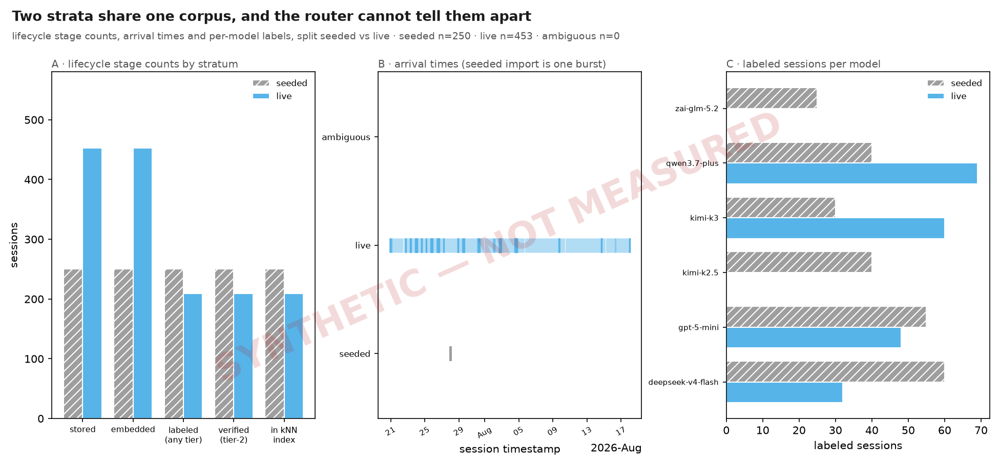
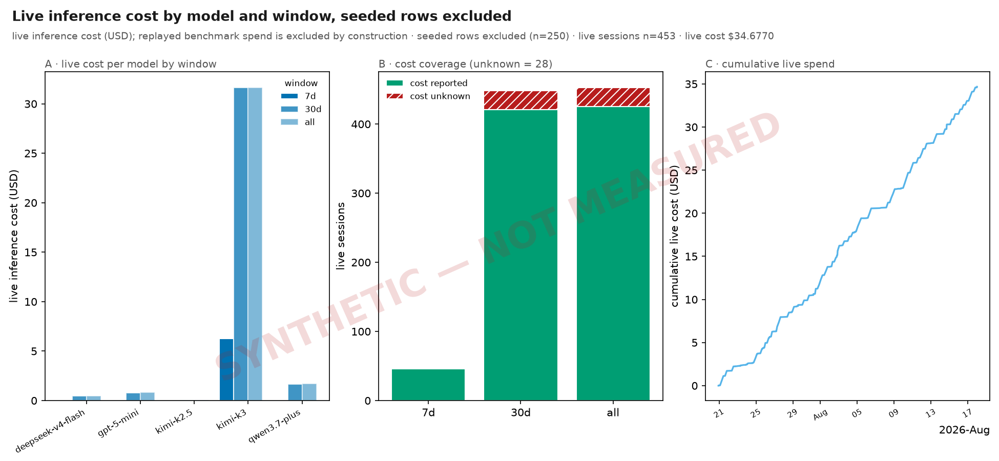
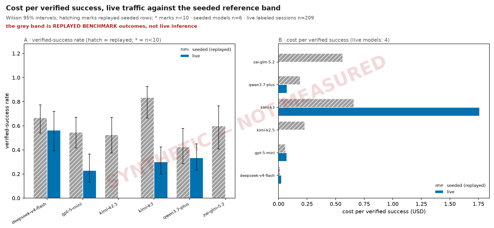
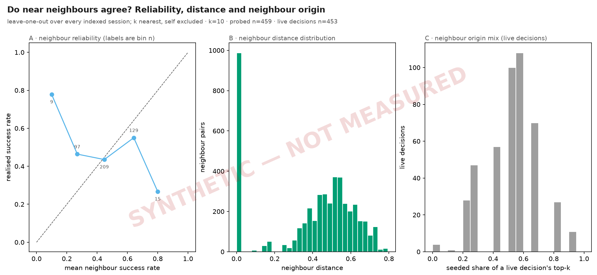
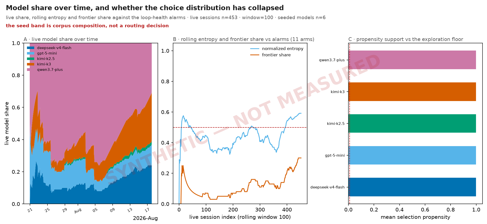
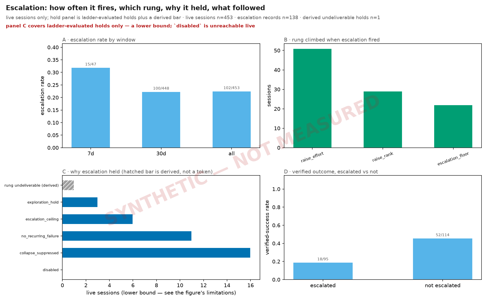
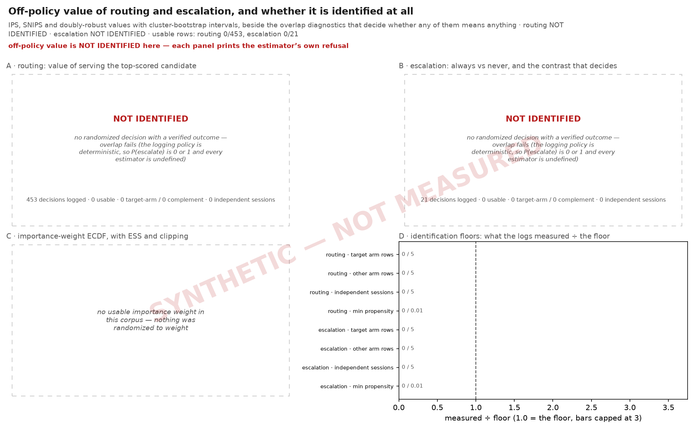

# The same seven figures, on invented data

**Nothing on this page is a measurement.** Every bar, point, band and count below
was generated by `benchmark/routing/demo_corpus.py` from a fixed seed. No number
here describes Shunt, and none may be quoted, compared against a baseline, or
carried into a claim. Each canvas says so on its face: `SYNTHETIC — NOT MEASURED`
is stamped across it by the renderer, not by whoever drew the figure.

The page exists because [the measured page](inference.md) cannot do this job. That
one is the real account — the same seven figures over the store a live Shunt writes
to — and the store it renders from holds no live traffic, so five of its seven
panels are empty. An empty panel is an honest result and the measured page reports
it as one. It is also unreadable: a reader who has never seen a populated F3 cannot
tell what F3 is *for*. So this page populates them, and pays for the legibility by
being worth nothing as evidence.

Read the two together. The measured page tells you what the router did. This one
tells you what the figures would say if there were enough of it.

## Where the numbers come from

The corpus is built in two parts, and the difference between them matters more than
anything else on this page.

**Part one: a joint bootstrap of 40 measured live sessions.** Those 40 rows are
real — a live Shunt deployment's outcome store as of 2026-08-18. The generator
resamples them with replacement, taking a whole row at a time: model, selection
rule, cost, `cost_known` flag, fingerprint, provenance and label move together — so
every marginal and every correlation between them survives the draw. Continuous
fields get ±10% multiplicative jitter, narrow enough that it cannot move mass
between modes or fill in the tail; without it, eight sessions would sit on each
measured value and a reader would read the quantisation as structure.

**Part two: invented rows, for regimes the 40 never contained.** Bootstrapping alone
could not populate this page, because the measured store was missing whole categories
of behaviour — it held no seeded stratum at all, no escalation hold, no frontier-tier
model, and not one escalated session that succeeded. Four figures exist specifically
to *contrast* seeded against live, so on a live-only corpus their seeded half is
structurally zero, and the demo demonstrated a degenerate case rather than the shape
it was built to show. Those regimes are therefore **invented outright**: a 250-row
seeded stratum imported in one burst, the five-token hold vocabulary, the derived
undeliverable case, `kimi-k3` as a frontier arm, and escalated sessions that pass.

So the honest description of this corpus is: **shaped by the measured rows where they
exist, invented where they do not.** The two are not separated on the canvas, and no
reader should try to tell them apart — the whole page is evidence of nothing either
way. They are separated in the generator, where `_ATOMS` holds the audited
transcription of the 40 measured rows and the invented rows live in their own tuple.

One thing is deliberately not preserved: the **arrival rate**. The measured 28-day
span is kept while the count is scaled up, which is what gives the windowed panels
enough rows to draw. The demo also carries its **own frozen clock**, so the `7d` and
`30d` windows mean the same thing on every render instead of thinning toward empty as
real time passes.

That construction is why the demo looks plausible and means nothing. It cannot tell
you the router is cheap, or that escalation helps, or that neighbours predict
outcomes, because it was built from the answer rather than measuring it. Half of it
was not built from an answer at all.

## The embeddings are real, and that is the interesting part

There is no honest synthetic source for a 768-dimensional code embedding. A random
or hashed vector is exactly the kind of proxy featurizer this project refuses
everywhere else, and it would hand F4 a neighbourhood geometry no embedder could
produce — the one panel where invention is hardest to tell from measurement. Emitting
no embeddings at all leaves F4 empty and defeats the page.

So the vectors are **borrowed, not fabricated**: real embeddings lifted from the
committed seed bundle and shuffled onto demo sessions. The consequence is an
asymmetry worth stating plainly. The **geometry is real** — the distances, the
cluster structure, the distance scale F4 draws are all genuine outputs of the shipped
embedder. The **association is invented**: which vector belongs to which session, and
therefore to which outcome, was decided by a shuffle. F4 shows a truthful-looking
neighbourhood whose reliability curve means nothing. That is true of every panel
here; F4 is just the one where it would be easiest to forget.

One artifact of borrowing is worth naming, because it is visible: the seed bundle
holds one row per *(task, model)* cell, so a single task's embedding appears in it
several times over. Drawing vectors from that bundle therefore hands several demo
sessions the *identical* vector, and those pairs sit at distance exactly 0.0 — the
spike at the left edge of F4's panel B. It is a property of the borrowing, not of the
embedder and not of any corpus a live router would build. Deduplicating it away would
mean discarding real geometry to make a synthetic page tidier, which is the wrong
trade on a page that is evidence of nothing.

## F7 refuses here too, on purpose

The off-policy figure prints `NOT IDENTIFIED` on this page exactly as it does on the
measured one, and for the same reason: the shipped logging policy is deterministic,
so `P(action)` is 0 or 1, every importance weight is undefined, and no estimator has
anything to work with. Inventing propensities and drawing four
confident panels would have been trivial.

That would have been the worst thing on the page. A demo whose job is to show what a
figure looks like when it has data must not show a figure that **cannot** have data,
because the reader would take away that Shunt randomizes its decisions. It does not.
Randomized logging is unshipped, and the refusal panel is the accurate picture of what
the estimator does until it ships. The demo depicts the capability that exists.

Filling F7 was reconsidered when the rest of the page was populated, and refused again.
Every other empty panel on this page was empty because the corpus lacked *rows*; F7's is
empty because the router lacks a *capability*. Those are not the same gap, and only the
first one is honest to close with invented data. Note what that costs: the demo carries
`selection_propensity = 1.0` on every live row — the value the deterministic router
actually writes — so F7's routing leg now reports **more** logged decisions than before
and still zero usable ones. The refusal is better supported, not worked around.

If you want to know what it would take to make these panels draw for real rather than
on invented data, [the measured page says
so](inference.md#what-would-have-to-change-for-f7-to-draw-bars): the escalation leg
needs a configuration change and enough traffic, the routing leg needs code. Neither is
something a synthetic corpus can stand in for, which is why this page does not try.

## What each figure would tell you, if it were real

The sections below carry the same reading instructions as the measured page — they
are generated from the figure manifest, so they cannot drift from the canvas. Read
them as *how to read this chart*, never as *what Shunt did*.

- **F1 · strata** — whether one outcome store is holding two populations. Both are
  present here, which is what makes the figure readable: the seeded rows arrive in a
  single burst and collapse to one column in panel B, while live traffic spreads across
  the span. That contrast is the whole point of the figure, and it is the reason any
  recency-window read over a mixed store reports the benchmark matrix rather than
  router behaviour.
- **F2 · cost** — what live inference cost, per model and per window, with the
  unreported-cost count kept separate from the total rather than zero-filled. The
  shape to learn is that "cost unknown" is its own bar.
- **F3 · unit economics** — cost per verified success, against the replayed benchmark
  band. The question it answers on real data is whether the live router is buying
  outcomes at the price the backtest predicted.
- **F4 · neighbourhood** — whether near neighbours in embedding space actually predict
  outcomes. The reliability curve is the router's core bet made falsifiable. Real
  geometry, invented labels; see above.
- **F5 · policy** — the choice distribution over time and its rolling entropy. It is
  the collapse detector: a router that has stopped exploring shows up here first.
- **F6 · escalation** — how often escalation fired, which rung, and where it was held
  or could not be delivered. The hold vocabulary is fixed, so an unfamiliar token is a
  drift finding rather than an "other" bucket.
- **F7 · off-policy** — the value of routing and escalation, and the overlap
  diagnostics that decide whether either estimate means anything. It is the **only
  figure on this page with an empty panel**, and it is empty on purpose; see above.

## Figures

### Two strata share one corpus, and the router cannot tell them apart {#fig-inference-strata}

*lifecycle stage counts, arrival times and per-model labels, split seeded vs live · seeded n=250 · live n=453 · ambiguous n=0*
**Reading.** Panel A counts sessions at five lifecycle stages per stratum: stored, embedded, labeled, Tier-2 and indexed. They are not a funnel and do not nest: `embedded` and `indexed` are the only two contained in `stored`, while `labeled` is counted off the append-only `outcome_events` log and `tier2` off the materialized `outcomes` view, so a later stage can exceed an earlier one. Read each bar as its own count, and read the red line for any adjacent pair that actually inverts. Panel B places every session on its `timestamp`; the seeded stratum is imported in one burst and so collapses to a single column, which is exactly why any recency-window read over the whole store reports the benchmark matrix rather than router behaviour. Panel C counts labeled sessions per model in each stratum.

**What to look for.** Make the two populations sharing one outcome store visible before any figure quotes a number over them, so that a mixed aggregate is recognisable as mixed.

**Terms.** *stratum* — A session's origin. `seeded` rows were replayed into the store by the benchmark seeder and carry the `bench:` session-id prefix; `live` rows were served by the router to real traffic. `ambiguous` rows are those whose prefix and decision rule disagree. *stored* — A row in `sessions`: the router served the request and wrote the decision. Every other stage is a subset of the same population, counted a different way. *embedded* — A stored session that also carries an embedding vector (`sessions.embedding_blob`). Without one it can never be retrieved as a neighbour, however well it was labelled. *labeled (any tier)* — A session with at least one non-tombstoned event in the append-only `outcome_events` log, of EITHER tier. Tier-1 is the weak prior read off the wire; Tier-2 is a verified test or typecheck result. *verified (tier-2)* — A session whose Tier-2 verdict reached the materialized `outcomes` view. A Tier-1-only session is deliberately held out of that view until a Tier-2 corroborates it, so it never becomes a routing neighbour. *indexed* — An actual member of the kNN index: embedded, with a materialized outcome and no tombstone. This is the population a routing decision can draw a neighbour from.

**Notes.** Stratum is decided by three signals: the session-id prefix, `decision_provenance.selection_rule_used == "benchmark_seed"`, and the winning outcome event's source. Rows where they disagree are counted as `ambiguous` and surfaced on the canvas rather than assigned to either stratum.
The seeder writes one deterministic timestamp for the whole corpus, so panel B's seeded column has no width by construction.
There is no Tier-1 bar, and its absence is the point: a Tier-1-only session is kept out of the materialized view and out of the trusted kNN index until a Tier-2 corroborates it, so it cannot influence a routing decision. It is not hidden either — `labeled (any tier)` counts both tiers and `verified (tier-2)` counts only the verified one, so the GAP between those two bars is exactly the Tier-1-only population.

**Limits.** Panel A counts sessions, not requests: a session serving many turns appears once. A session with no outcome event at all is stored and possibly embedded but never labeled. That gap is the store's, not this figure's.

<!-- n: ambiguous=0, live=453, seeded=250, sessions=703 --><!-- generated-by: shunt.inspect.inference:render -->

### Live inference cost by model and window, seeded rows excluded {#fig-inference-cost}

*live inference cost (USD); replayed benchmark spend is excluded by construction · seeded rows excluded (n=250) · live sessions n=453 · live cost \$34.6770*
**Reading.** Panel A is live spend per model over 7 days, 30 days and the whole store; a model absent from a window served nothing in it. Panel B is cost coverage: how many live sessions the provider actually reported a cost for, against how many it did not. Panel C accumulates live spend over time. An entirely empty figure means the corpus holds no live sessions, which is the honest answer for a seed-only render.

**What to look for.** Report what live inference actually cost, and never let replayed benchmark spend be read as inference cost — the mislabel this family exists to correct.

**Terms.** *stratum* — A session's origin. `seeded` rows were replayed into the store by the benchmark seeder and carry the `bench:` session-id prefix; `live` rows were served by the router to real traffic. `ambiguous` rows are those whose prefix and decision rule disagree. *cost unknown* — A session the provider returned no `usage.cost` for. Counted, never summed and never zero-filled: an unreported cost is unknown, and a real 0.0 is a measurement.

**Notes.** Every panel filters to the live stratum. The seeded row count excluded from the sum is printed in the subtitle, so the exclusion is stated rather than assumed.
Cost is summed over `cost_known = 1` alone; the unknown count is reported beside it as coverage rather than folded into the total.

**Limits.** A window with no live sessions is empty, not zero-cost. The figure states which. Cost is the provider's reported figure, so a provider that under-reports cache reads under-reports here too.

<!-- n: cost_unknown=28, live_sessions=453, seeded_excluded=250 --><!-- generated-by: shunt.inspect.inference:render -->

### Cost per verified success, live traffic against the seeded reference band {#fig-inference-unit-economics}

*Wilson 95% intervals; hatching marks replayed seeded rows; * marks n<10 · seeded models n=6 · live labeled sessions n=209*
> **Caveat.** the grey band is REPLAYED BENCHMARK outcomes, not live inference
**Reading.** Panel A is the verified-success rate per model with a Wilson 95% interval; a bar marked * is provisional (fewer than 10 labeled sessions) and its point estimate should not be ranked against another. Panel B divides spend by verified successes. Grey bars are the seeded reference band — replayed benchmark outcomes, a reference point and not a measurement of live routing. Coloured bars are live traffic; where there are none, the live claim is empty and says so.

**What to look for.** Give the cost-per-success question a live answer where live data exists, and a visibly absent answer where it does not, with the seeded reference never standing in for it.

**Terms.** *verified success* — A session whose Tier-2 (test/typecheck) outcome is a pass. Tier-1 rows are excluded: they are never materialized and never become routing neighbours. *provisional* — Fewer than 10 labeled sessions in the cell. The interval is drawn but the point estimate is not comparable; the bar is marked * to say so. Hatching is a different signal entirely — it marks the replayed seeded stratum.

**Notes.** The seeded band is drawn from replayed benchmark outcomes whose cost came from the benchmark run, not from live inference. It is a reference for shape, never a baseline for live spend.
Cost per verified success is undefined where a model has zero verified successes; that cell is left empty rather than drawn as an infinite or zero bar.

**Limits.** The seeded band inherits the benchmark matrix's model mix, so its per-model n is a property of the sweep design and not of demand. Success is Tier-2 only. A model whose work is never verified contributes no successes however well it performed.

<!-- n: live_labeled=209, seeded_labeled=250 --><!-- generated-by: shunt.inspect.inference:render -->

### Do near neighbours agree? Reliability, distance and neighbour origin {#fig-inference-neighbourhood}

*leave-one-out over every indexed session; k nearest, self excluded · k=10 · probed n=459 · live decisions n=453*
**Reading.** Panel A bins each session by the success rate of its k nearest neighbours and plots the realised success rate of the sessions in that bin against the diagonal; points on the diagonal mean the neighbourhood is calibrated, points below mean it is optimistic. Panel B is the distribution of neighbour distances — a corpus whose neighbours are all far away has no neighbourhood to speak of. Panel C asks, for each live decision, what fraction of its top-k neighbours were seeded rows; on a seed-only corpus there are no live decisions and the panel is empty.

**What to look for.** Test the assumption the whole router rests on — that a near neighbour predicts an outcome — and show how much of a live decision's evidence is borrowed from the benchmark corpus.

**Terms.** *leave-one-out* — Each indexed session is queried against the index and its own row dropped from the result, so a session never predicts itself. *neighbour origin mix* — The share of a live decision's k nearest neighbours that are seeded rows. A high share means the decision was made on replayed benchmark evidence.

**Notes.** Panels A and B are computed over the indexed population, which is both strata; the reliability question is about the embedding space, not about origin.
Distance is the index's own metric, reported unchanged.

**Limits.** Leave-one-out over a corpus imported in one burst measures the corpus, not the router's behaviour over time. A bin holding few sessions has a noisy realised rate; bin counts are printed so a bin resting on a handful of sessions is not read as a trend.

<!-- n: live_decisions=453, probed=459 --><!-- generated-by: shunt.inspect.inference:render -->

### Model share over time, and whether the choice distribution has collapsed {#fig-inference-policy}

*live share, rolling entropy and frontier share against the loop-health alarms · live sessions n=453 · window=100 · seeded models n=6*
> **Caveat.** the seed band is corpus composition, not a routing decision
**Reading.** Panel A is live model share within a trailing window — not cumulative share, which would dilute a recent collapse with history that has stopped being true. Where the corpus is seed-only it instead shows one hatched band: the seeded model distribution, which is the benchmark matrix's sweep design and not a choice the router made. Panel B tracks rolling choice entropy and frontier share against the loop-health alarm lines; entropy at or below the alarm means the distribution has concentrated onto a few arms. Panel C is each model's mean selection propensity against the exploration floor: a model below the floor has effectively stopped being tried. Panels B and C are empty where there is no live traffic to read, and say so on the canvas. Panel B is also empty when no model registry was supplied, because normalized entropy is undefined without the number of arms the router could have picked.

**What to look for.** Detect a router that has collapsed onto one arm, without ever reading the benchmark corpus's own model mix as evidence about routing.

**Terms.** *selection propensity* — The probability the routing policy assigned to the model it served. Written by the live router only; a replayed seed row never carries one. *normalized entropy* — Shannon entropy of the model-choice distribution in bits, divided by log2 of the number of models the router could have picked — the registry's count, not the count that happen to appear in the window. Same definition the shipped loop-health alarm uses, so the line drawn here is the line that fires.

**Notes.** The seeded band is captioned as corpus composition on the canvas. Presenting the benchmark matrix's distribution as router behaviour is the exact misread this family exists to prevent.
Alarm lines come from the shipped `LoopHealthThresholds` defaults, and both the frontier set and the candidate-arm count come from the shipped model registry via `top_capability_cluster`, not from a proxy derived here. A figure that re-derived either would drift from the alarm the router actually raises.

**Limits.** Entropy over a window holding fewer sessions than there are arms cannot reach 1.0 and so reads as collapse; the window size and the arm count are both printed. Propensity is missing for every non-policy decision — an escalated turn is imposed, not sampled — so panel C covers policy decisions only.

<!-- n: live_sessions=453, seeded_models=6 --><!-- generated-by: shunt.inspect.inference:render -->

### Escalation: how often it fires, which rung, why it held, what followed {#fig-inference-escalation}

*live sessions only; hold panel is ladder-evaluated holds plus a derived bar · live sessions n=453 · escalation records n=138 · derived undeliverable holds n=1*
> **Caveat.** panel C covers ladder-evaluated holds only — a lower bound; `disabled` is unreachable live
**Reading.** Panel A is the escalation rate per window. Panel B splits fired escalations by rung: `raise_effort` keeps the model and steps its reasoning arm, `raise_rank` moves to a higher-capability model, `escalation_floor` re-serves a rung this task already earned. Panel C breaks holds down by reason token, plus one derived bar for the holds the engine never tokenised. Panel D compares verified outcomes before and after an escalation fired. Empty panels mean the corpus holds no live escalations.

**What to look for.** Show whether escalation fires when it should and whether it helps, with the holds accounted for honestly rather than counted only where the engine happened to name them.

**Terms.** *hold* — Escalation ran and did not change what was served. A hold is not the same as escalation never running: the second leaves no record at all. *rung undeliverable (derived)* — A directive that said raise, on a boundary where no rung could be delivered — no arm above, or every higher-rank model unhealthy. The engine returns early with the served model unchanged, so no hold-reason token is written; the case is recovered from the voided exploration record instead.

**Notes.** The hold vocabulary is five tokens: `collapse_suppressed`, `no_recurring_failure`, `escalation_ceiling`, `exploration_hold`, and `disabled` — which a live router cannot emit, because the engine returns before the ladder runs when escalation is off, so that bar is structurally zero and is drawn only to say the vocabulary is complete. The derived bar is not a sixth token and is not written by the engine; it is inferred, and is drawn hatched to say so.
Rung is read from `selection_rule_used` plus the presence of `escalated_reasoning_arm`, which is what distinguishes an effort step from a rank step.

**Limits.** The derived bar recovers only the undeliverable holds that were also being explored. Where escalation was not exploring, an undeliverable hold leaves no record at all and is counted nowhere on this figure — panel C is therefore a lower bound on holds, and is captioned as one. Panel D compares populations, not the same session under both arms; it is descriptive and carries no causal claim.

<!-- n: escalation_records=138, live_sessions=453, undeliverable_holds=1 --><!-- generated-by: shunt.inspect.inference:render -->

### Off-policy value of routing and escalation, and whether it is identified at all {#fig-inference-ope}

*IPS, SNIPS and doubly-robust values with cluster-bootstrap intervals, beside the overlap diagnostics that decide whether any of them means anything · routing NOT IDENTIFIED · escalation NOT IDENTIFIED · usable rows: routing 0/453, escalation 0/21*
> **Caveat.** off-policy value is NOT IDENTIFIED here — each panel prints the estimator’s own refusal
**Reading.** Panel A is the value of the target routing policy (serve the top-scored candidate) against the dashed line the logged policy actually paid. Panel B is the same three estimators for `always_escalate` and `never_escalate`, plus the contrast V(escalate) - V(hold), which is the decision question a level cannot answer; the contrast is read against zero, not against the bars. Panel C is the empirical distribution of the importance weights, whose right tail is where an off-policy estimate goes wrong quietly. Panel D divides each identification floor into what the logs measured, so 1.0 is the floor and a short bar is the reason a panel refused. A panel is empty only when a leg has no logged decision at all; where a leg has decisions the estimator cannot use, the panel prints the refusal verbatim instead of drawing a bar, and that refusal is the figure's result.

**What to look for.** Answer whether routing and escalation are worth what they cost, and refuse visibly when the logs cannot support an answer rather than drawing a plausible bar.

**Terms.** *identified* — Both arms were realised under a logging policy that randomized, on enough independent sessions and at propensities far enough from zero for an inverse to mean something. Anything less is NOT_IDENTIFIED: undefined, not merely noisy. *importance weight* — The ratio of the target policy's probability of the logged action to the propensity the logging policy assigned it. Weights are clipped, and the count the clip actually bound is printed — a large maximum weight alone cannot say it. *effective sample size* — Kish ESS of those weights as a fraction of n: how many observations the estimate really rests on. A deterministic target gives every un-taken arm weight zero, so this fraction is capped by the share of rows that took the target's action even on logs with perfect overlap. *contrast* — V(target) - V(its complement), paired per decision and bootstrapped over the same session clusters. Only escalation’s is drawn; see the note below. *a value above 1* — Not an error, and not a success rate above 100%. IPS divides the weighted rewards by n rather than by the sum of the weights, so it is unnormalised and unbounded above; on a log with small propensities it exceeds 1 routinely. SNIPS divides by the weight sum and is bounded by the observed rewards; DR is bounded by its outcome model. A large gap between IPS and SNIPS is therefore a reading of the weight tail in panel C, not a disagreement about the policy's value.

**Notes.** Routing’s contrast is omitted from panel A. The reduction that scores the multi-arm routing leg through the binary estimator makes the LEVEL exact and the contrast a comparison against “took some other arm” — an arbitrary mixture of the remaining candidates, not a policy anyone could deploy. Escalation’s contrast is a real two-arm decision and means what it says.
Only estimators whose instrument certificate cleared both controls are drawn; an estimator that failed its control is named on the canvas and left undrawn rather than quietly averaged into the others.
INSTRUMENT ADMISSIBLE: positive control +3.1908, destroyed-signal null +0.4011, chance +0.0000±1.0000. Scores are band-normalised worst cases over 6 (leg, estimator) controls.

**Limits.** The routing leg covers policy turns only. An escalated turn carries no candidate scores and a cold-start turn carries none either, so both are excluded before the estimator sees them; the excluded count is printed on panel D. An ADMISSIBLE instrument verdict is a gate against breakage — a filter that stopped filtering, an estimator that stopped weighting — not a warrant that these numbers are accurate to within a few points.

<!-- n: escalation_logged=21, escalation_usable=0, routing_logged=453, routing_usable=0 --><!-- generated-by: shunt.inspect.inference:render -->
