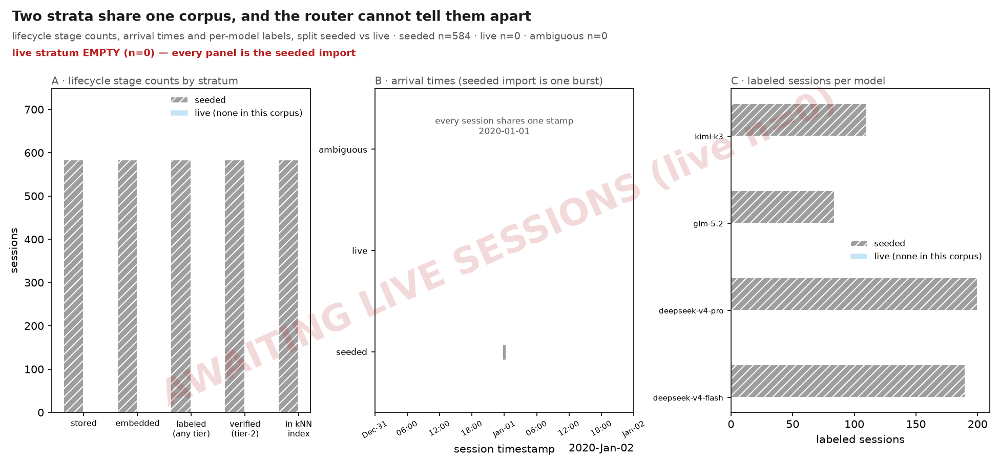
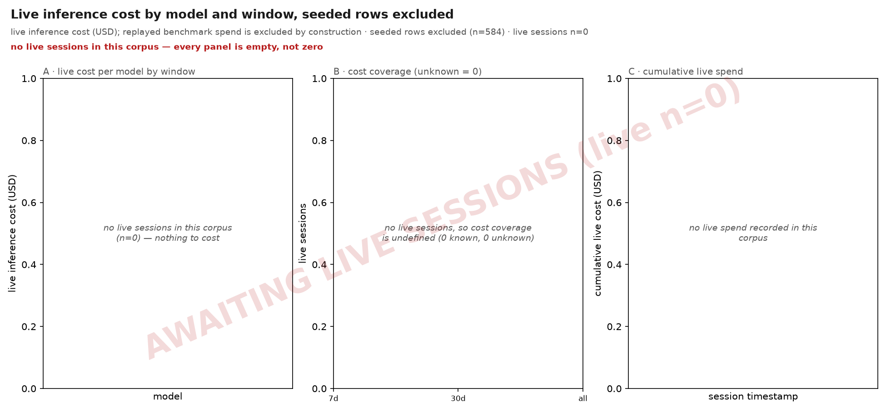
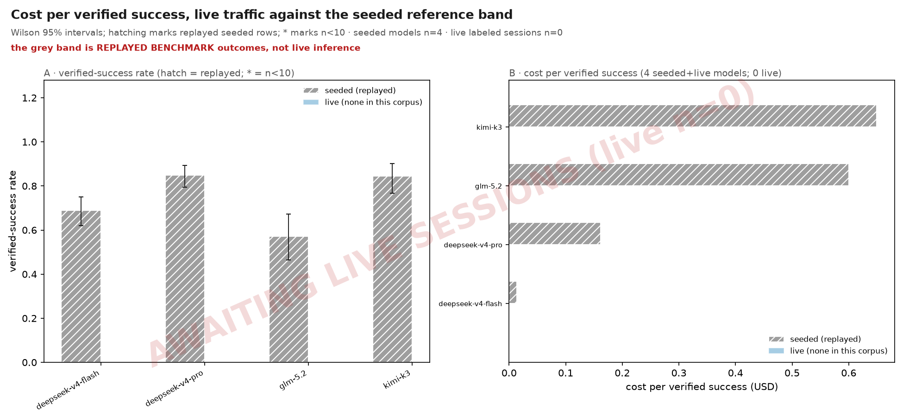
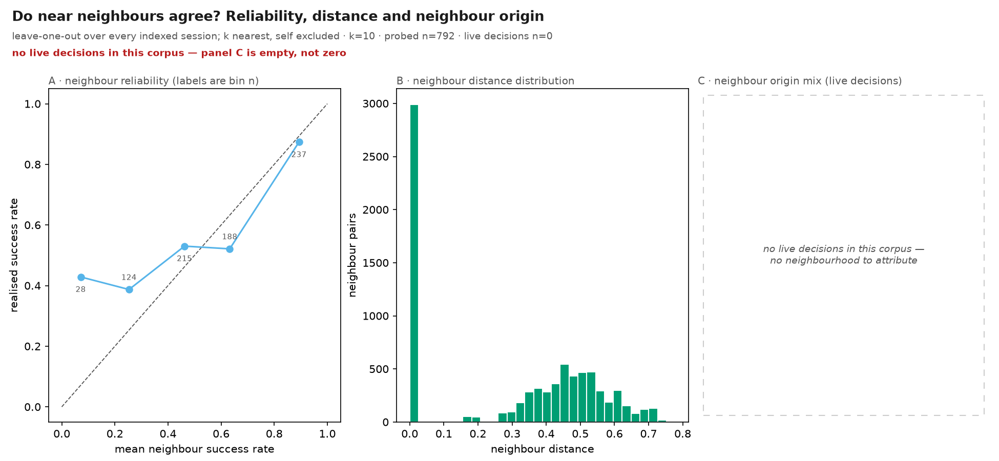
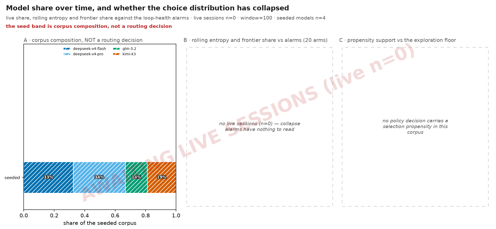
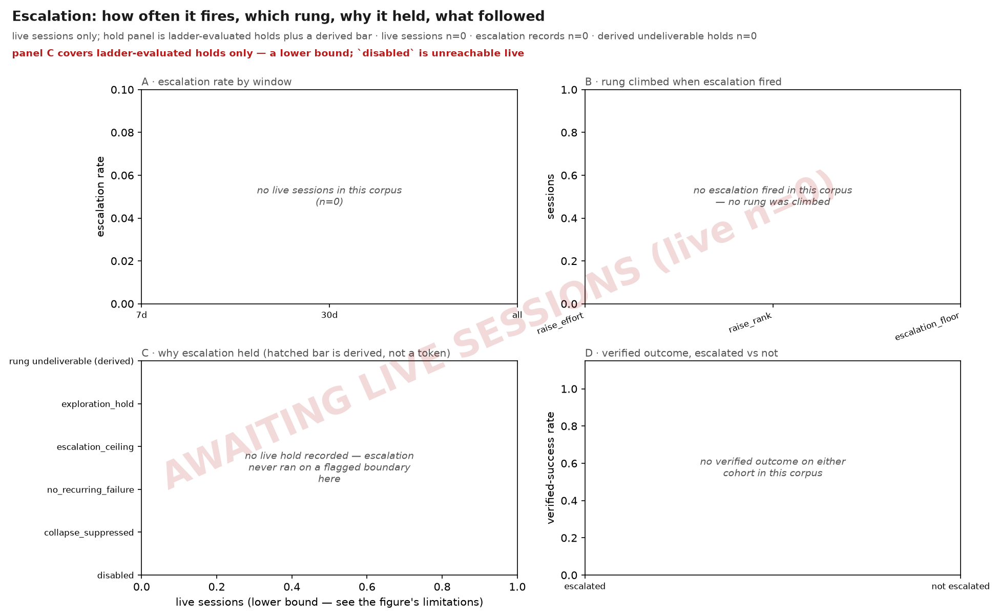
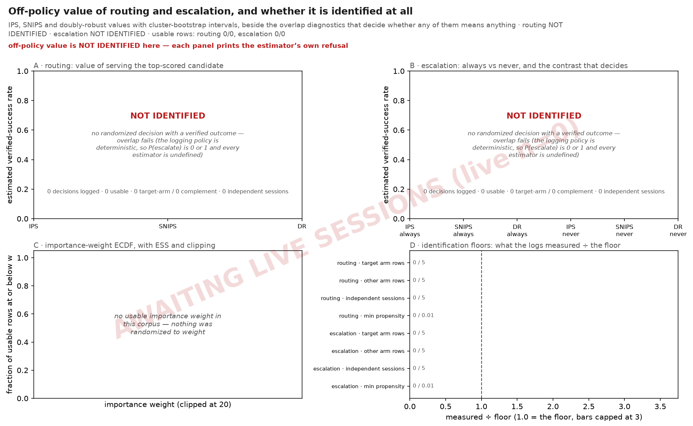

# The live router, measured

Every other results page on this site measures the router **offline**, against a
benchmark corpus replayed through a harness. This page measures the router
**as it runs**: the same seven figures read the outcome store a live Shunt writes
to, so the questions are the operational ones — what did inference cost, is the
choice distribution collapsing, do near neighbours still predict outcomes, is
escalation firing and helping.

The store the figures below were rendered from holds **no live traffic at all**.
That is not a defect of the render, and the page does not paper over it: an empty
panel is a result here, and each one says on the canvas which number is missing and
why.

## Reading this page on committed data

The committed figures come from a **deterministic seed-only store**: the
benchmark's committed seed bundle replayed into a fresh `OutcomeStore`, with **no
synthetic live rows** invented to fill the live stratum. Every seeded session
carries the `bench:` id prefix and `selection_rule_used = benchmark_seed`; nothing
in the corpus was served by a router to real traffic.

So a reader arriving at the figures should expect this, and read the emptiness as
the measurement it is:

- **F2 (cost)** and **F6 (escalation)** are **entirely empty**. Both filter to the
  live stratum, and the live stratum has no members.
- **F3 (unit economics)** draws only its seeded reference band; the **live claim is
  empty**. The grey band is replayed benchmark outcomes and is never a stand-in for
  the live number.
- **F4 (neighbourhood)** draws panels A and B over the indexed population — that
  part is real — and **panel C is empty**, because a neighbour-origin mix is a
  property of a live decision and there are none.
- **F5 (policy)** shows the seeded corpus composition as a hatched band and is
  otherwise **empty**: no live share series, no rolling entropy, no propensities.
- **F7 (off-policy)** renders a **refusal**. Both legs are NOT IDENTIFIED on this
  corpus: the logged policy did not randomize, so there is nothing to estimate and
  the panels print the estimator's own words where the bars would be.
- **F1 (strata)** is the one figure this corpus answers in full — it is about the
  corpus itself.

[The same seven figures, on invented data](inference-demo.md) draws this family over a
synthetic corpus, so the panels above that are empty can be read at all. Nothing on that
page is a measurement and every canvas says so; it is there for the layout, never the
numbers.

Rendering the same seven against a rig that *has* served traffic fills exactly those
gaps and changes nothing else. `make inference-figures` produces the committed set
above from committed data alone — no network, no rig, no model weights — and the
wrapper's own target renders the identical seven against a running local rig into
gitignored session output. The producer is shipped code
(`python -m shunt.inspect.inference --out-dir <dir>`), so the container path and the
docs path draw the same figures from the same functions.

The container path has one requirement the published image does not carry: drawing needs
the optional `inspect` extra (`pip install 'shunt-router[inspect]'`), and the product
image ships without it. Any image used to render these figures must install that extra
itself, and no test covers the in-container render — an image that drops it fails only
when someone next asks it for a figure.

## The two strata

One `OutcomeStore` holds two populations, and **the routing path cannot tell them
apart**: a replayed benchmark session and a live session are the same row shape,
sit in the same kNN index, and are equally eligible to become a neighbour of a real
decision. That is by design — seeding is what gives a cold router something to
route on — but it means every aggregate over the store is a mixed aggregate unless
something separates them first.

Origin is adjudicated from three signals, and the adjudication is **one-directional**:

| Signal | What it is | When it is written |
|---|---|---|
| session-id prefix | `bench:` marks a seeded row | at seed time, never rewritten |
| `selection_rule_used` | `benchmark_seed` for a replayed row | at decision time, never rewritten |
| winning outcome event source | `benchmark_seed` for a seeded verification | may be *overwritten* as evidence accumulates |

The first two are decision-time witnesses and are never rewritten. The third may only
**add** evidence of seeding, never remove it: a live-looking row whose outcome source
says `benchmark_seed` is surfaced as `ambiguous` rather than resolved either way. The
reason is mechanical — the store's source priority puts `benchmark_seed` first, so a
seeded task that is genuinely verified has its source overwritten, and a rule that
voted on the winning source alone would flip verified seeded rows into the live
stratum exactly when the router is working normally.

Rows whose signals disagree are counted as `ambiguous`, printed on F1's canvas, and
assigned to **neither** stratum. They are never quietly folded into the live one.

## Cost accounting

`shunt inspect`'s single diagnostic PNG once printed a `total cost` that summed
every row in the store — overwhelmingly replayed benchmark spend on a seeded rig.
Correcting that is why F2 exists, and the accounting rules it follows are worth
stating outright.

**Seeded cost is excluded, and the exclusion is printed.** A seeded row's `cost`
column is what the *benchmark run* paid when it was captured, not what inference
cost. It is never summed into a live total; the count of rows excluded appears in
F2's subtitle, so the exclusion is a stated number rather than an assumption. F3's
seeded band is the one place seeded cost is drawn, and it is drawn in grey, hatched,
and captioned as a replayed reference.

**`cost_known = 0` means the provider reported no `usage.cost` — it does not mean
zero.** The two are deliberately distinct columns of meaning: an unreported cost is
*unknown*, and a real `0.0` is a *measurement*. Unknown rows are counted and shown as
coverage in F2 panel B; they are never summed, and never zero-filled into the total.
A cost total under 100% coverage is a lower bound, and the coverage bar is how you
see by how much.

**An escalation costs more live than the benchmark's cascade rows say.** Those rows are an
offline replay in which every rung starts from a fresh context; here, shunt forwards your
messages untouched, so the model an escalation moves to is resent the whole prior
conversation by your CLI — a cache miss by construction, at full input price. The frontier
figure's dashed bracket prices that range offline; this page cannot check it against live
traffic, for the reason in the next paragraph. The full statement of what offline and live
do differently is [in one place](escalation.md#offline-vs-live-cascade), and
`escalation.context_transfer` is the knob over it.

**`cache_stats` is not a token ledger.** The proxy records exactly two fields per
session — the cache tax it paid and the prompt length in tokens. It carries **no
cache-write tokens, no completion tokens, and no provider column**. So this page can
tell you what a session cost and how much prompt it re-sent; it cannot decompose that
cost into read/write cache traffic, cannot attribute it to a provider, and cannot
report output-token spend. A cache-economics analysis needs a schema change first,
not a new figure.

## Off-policy estimates and when they are not identified

F7 asks the question a cost figure cannot: *is the routing decision worth what it
costs, and would escalating always (or never) have done better?* It answers with
three estimators — IPS, SNIPS and a doubly-robust estimate — over the logged
decisions, with cluster-bootstrap intervals over session clusters.

An off-policy estimate is only meaningful when the logged policy **randomized**:
both arms have to have been realised, on enough independent sessions, at
propensities far enough from zero for an inverse to mean anything. When that fails,
the answer is not a wide interval — it is **NOT IDENTIFIED**, which is undefined
rather than merely noisy. F7 prints the estimator's own refusal on the panel where
the bars would have been, and that refusal *is* the figure's result.

### What would have to change for F7 to draw bars

The refusal is not a missing feature in the figure; it is a property of what the
router logs. Every estimator filters to decisions that were randomized, carry a
verified outcome, and have a propensity strictly between 0 and 1. Shunt's routing
and escalation policies are deterministic, so every decision logs a propensity of
`1.0` and all three conditions fail. Note that "was this randomized" is *derived
arithmetically* from the propensity and the exploration rate — a log that merely
declares itself randomized is ignored, so the estimator cannot be talked into a
number.

**The escalation leg needs configuration and traffic, not code.** The ε-greedy
machinery ships: set `router.escalation.exploration_epsilon` to something in
0.1–0.3 (it defaults to `0.0`, deliberately, so that enabling escalation never
silently starts randomizing your routing) and arm verified capture by giving
`router.capture.work_dir` a repository. Escalation then randomizes at the
checkpoints the detector already flags and logs the realised propensity on each
one. The estimator additionally requires at least five decisions on *each* arm
spread over at least five independent sessions, with a mix of verified successes
and failures — below that it refuses on sample-size grounds rather than on
identification grounds, and says which.

**The routing leg needs code.** Routing decisions carry no exploration rate at
all, so they are rejected before anything else is considered; and the randomization
test currently recognises only ε-greedy propensities, which means a Thompson
sampler's propensity would still be rejected even once a rate was logged. Both are
open work.

Until then, the honest reading of F7 is: no claim about the value of routing or
escalation is available from these logs, at any sample size.

Two guards sit in front of every number this figure draws:

1. **Instrument validity.** The assembled pipeline — store write, production
   accessor, row encoding, estimator — must recover a signal it is known to contain
   (a positive control) and collapse to chance when that signal is destroyed (a
   shuffled-label null). Only an estimator whose certificate cleared *both* controls
   may be drawn; one that failed is named on the canvas and left undrawn.
2. **The routing contrast is withheld by construction.** The multi-arm routing leg
   is scored through the binary estimator, which makes its *level* exact and its
   *contrast* a comparison against "took some other arm" — an arbitrary mixture of
   the remaining candidates, not a policy anyone could deploy. Escalation's contrast
   is a real two-arm decision and is drawn; routing's is omitted and said to be.

## Figures

### Two strata share one corpus, and the router cannot tell them apart {#fig-inference-strata}

*lifecycle stage counts, arrival times and per-model labels, split seeded vs live · seeded n=792 · live n=0 · ambiguous n=0*
**Reading.** Panel A counts sessions at five lifecycle stages per stratum: stored, embedded, labeled, Tier-2 and indexed. They are not a funnel and do not nest: `embedded` and `indexed` are the only two contained in `stored`, while `labeled` is counted off the append-only `outcome_events` log and `tier2` off the materialized `outcomes` view, so a later stage can exceed an earlier one. Read each bar as its own count, and read the red line for any adjacent pair that actually inverts. Panel B places every session on its `timestamp`; the seeded stratum is imported in one burst and so collapses to a single column, which is exactly why any recency-window read over the whole store reports the benchmark matrix rather than router behaviour. Panel C counts labeled sessions per model in each stratum.

**What to look for.** Make the two populations sharing one outcome store visible before any figure quotes a number over them, so that a mixed aggregate is recognisable as mixed.

**Terms.** *stratum* — A session's origin. `seeded` rows were replayed into the store by the benchmark seeder and carry the `bench:` session-id prefix; `live` rows were served by the router to real traffic. `ambiguous` rows are those whose prefix and decision rule disagree. *stored* — A row in `sessions`: the router served the request and wrote the decision. Every other stage is a subset of the same population, counted a different way. *embedded* — A stored session that also carries an embedding vector (`sessions.embedding_blob`). Without one it can never be retrieved as a neighbour, however well it was labelled. *labeled (any tier)* — A session with at least one non-tombstoned event in the append-only `outcome_events` log, of EITHER tier. Tier-1 is the weak prior read off the wire; Tier-2 is a verified test or typecheck result. *verified (tier-2)* — A session whose Tier-2 verdict reached the materialized `outcomes` view. A Tier-1-only session is deliberately held out of that view until a Tier-2 corroborates it, so it never becomes a routing neighbour. *indexed* — An actual member of the kNN index: embedded, with a materialized outcome and no tombstone. This is the population a routing decision can draw a neighbour from.

**Notes.** Stratum is decided by three signals: the session-id prefix, `decision_provenance.selection_rule_used == "benchmark_seed"`, and the winning outcome event's source. Rows where they disagree are counted as `ambiguous` and surfaced on the canvas rather than assigned to either stratum.
The seeder writes one deterministic timestamp for the whole corpus, so panel B's seeded column has no width by construction.
There is no Tier-1 bar, and its absence is the point: a Tier-1-only session is kept out of the materialized view and out of the trusted kNN index until a Tier-2 corroborates it, so it cannot influence a routing decision. It is not hidden either — `labeled (any tier)` counts both tiers and `verified (tier-2)` counts only the verified one, so the GAP between those two bars is exactly the Tier-1-only population.

**Limits.** Panel A counts sessions, not requests: a session serving many turns appears once. A session with no outcome event at all is stored and possibly embedded but never labeled. That gap is the store's, not this figure's.

<!-- n: ambiguous=0, live=0, seeded=792, sessions=792 --><!-- generated-by: shunt.inspect.inference:render -->

### Live inference cost by model and window, seeded rows excluded {#fig-inference-cost}

*live inference cost (USD); replayed benchmark spend is excluded by construction · seeded rows excluded (n=792) · live sessions n=0*
> **Caveat.** no live sessions in this corpus — every panel is empty, not zero
**Reading.** Panel A is live spend per model over 7 days, 30 days and the whole store; a model absent from a window served nothing in it. Panel B is cost coverage: how many live sessions the provider actually reported a cost for, against how many it did not. Panel C accumulates live spend over time. An entirely empty figure means the corpus holds no live sessions, which is the honest answer for a seed-only render.

**What to look for.** Report what live inference actually cost, and never let replayed benchmark spend be read as inference cost — the mislabel this family exists to correct.

**Terms.** *stratum* — A session's origin. `seeded` rows were replayed into the store by the benchmark seeder and carry the `bench:` session-id prefix; `live` rows were served by the router to real traffic. `ambiguous` rows are those whose prefix and decision rule disagree. *cost unknown* — A session the provider returned no `usage.cost` for. Counted, never summed and never zero-filled: an unreported cost is unknown, and a real 0.0 is a measurement.

**Notes.** Every panel filters to the live stratum. The seeded row count excluded from the sum is printed in the subtitle, so the exclusion is stated rather than assumed.
Cost is summed over `cost_known = 1` alone; the unknown count is reported beside it as coverage rather than folded into the total.

**Limits.** A window with no live sessions is empty, not zero-cost. The figure states which. Cost is the provider's reported figure, so a provider that under-reports cache reads under-reports here too.

<!-- n: cost_unknown=0, live_sessions=0, seeded_excluded=792 --><!-- generated-by: shunt.inspect.inference:render -->

### Cost per verified success, live traffic against the seeded reference band {#fig-inference-unit-economics}

*Wilson 95% intervals; hatching marks replayed seeded rows; * marks n<10 · seeded models n=6 · live labeled sessions n=0*
> **Caveat.** the grey band is REPLAYED BENCHMARK outcomes, not live inference
**Reading.** Panel A is the verified-success rate per model with a Wilson 95% interval; a bar marked * is provisional (fewer than 10 labeled sessions) and its point estimate should not be ranked against another. Panel B divides spend by verified successes. Grey bars are the seeded reference band — replayed benchmark outcomes, a reference point and not a measurement of live routing. Coloured bars are live traffic; where there are none, the live claim is empty and says so.

**What to look for.** Give the cost-per-success question a live answer where live data exists, and a visibly absent answer where it does not, with the seeded reference never standing in for it.

**Terms.** *verified success* — A session whose Tier-2 (test/typecheck) outcome is a pass. Tier-1 rows are excluded: they are never materialized and never become routing neighbours. *provisional* — Fewer than 10 labeled sessions in the cell. The interval is drawn but the point estimate is not comparable; the bar is marked * to say so. Hatching is a different signal entirely — it marks the replayed seeded stratum.

**Notes.** The seeded band is drawn from replayed benchmark outcomes whose cost came from the benchmark run, not from live inference. It is a reference for shape, never a baseline for live spend.
Cost per verified success is undefined where a model has zero verified successes; that cell is left empty rather than drawn as an infinite or zero bar.

**Limits.** The seeded band inherits the benchmark matrix's model mix, so its per-model n is a property of the sweep design and not of demand. Success is Tier-2 only. A model whose work is never verified contributes no successes however well it performed.

<!-- n: live_labeled=0, seeded_labeled=792 --><!-- generated-by: shunt.inspect.inference:render -->

### Do near neighbours agree? Reliability, distance and neighbour origin {#fig-inference-neighbourhood}

*leave-one-out over every indexed session; k nearest, self excluded · k=10 · probed n=792 · live decisions n=0*
> **Caveat.** no live decisions in this corpus — panel C is empty, not zero
**Reading.** Panel A bins each session by the success rate of its k nearest neighbours and plots the realised success rate of the sessions in that bin against the diagonal; points on the diagonal mean the neighbourhood is calibrated, points below mean it is optimistic. Panel B is the distribution of neighbour distances — a corpus whose neighbours are all far away has no neighbourhood to speak of. Panel C asks, for each live decision, what fraction of its top-k neighbours were seeded rows; on a seed-only corpus there are no live decisions and the panel is empty.

**What to look for.** Test the assumption the whole router rests on — that a near neighbour predicts an outcome — and show how much of a live decision's evidence is borrowed from the benchmark corpus.

**Terms.** *leave-one-out* — Each indexed session is queried against the index and its own row dropped from the result, so a session never predicts itself. *neighbour origin mix* — The share of a live decision's k nearest neighbours that are seeded rows. A high share means the decision was made on replayed benchmark evidence.

**Notes.** Panels A and B are computed over the indexed population, which is both strata; the reliability question is about the embedding space, not about origin.
Distance is the index's own metric, reported unchanged.

**Limits.** Leave-one-out over a corpus imported in one burst measures the corpus, not the router's behaviour over time. A bin holding few sessions has a noisy realised rate; bin counts are printed so a bin resting on a handful of sessions is not read as a trend.

<!-- n: live_decisions=0, probed=792 --><!-- generated-by: shunt.inspect.inference:render -->

### Model share over time, and whether the choice distribution has collapsed {#fig-inference-policy}

*live share, rolling entropy and frontier share against the loop-health alarms · live sessions n=0 · window=100 · seeded models n=6*
> **Caveat.** the seed band is corpus composition, not a routing decision
**Reading.** Panel A is live model share within a trailing window — not cumulative share, which would dilute a recent collapse with history that has stopped being true. Where the corpus is seed-only it instead shows one hatched band: the seeded model distribution, which is the benchmark matrix's sweep design and not a choice the router made. Panel B tracks rolling choice entropy and frontier share against the loop-health alarm lines; entropy at or below the alarm means the distribution has concentrated onto a few arms. Panel C is each model's mean selection propensity against the exploration floor: a model below the floor has effectively stopped being tried. Panels B and C are empty where there is no live traffic to read, and say so on the canvas. Panel B is also empty when no model registry was supplied, because normalized entropy is undefined without the number of arms the router could have picked.

**What to look for.** Detect a router that has collapsed onto one arm, without ever reading the benchmark corpus's own model mix as evidence about routing.

**Terms.** *selection propensity* — The probability the routing policy assigned to the model it served. Written by the live router only; a replayed seed row never carries one. *normalized entropy* — Shannon entropy of the model-choice distribution in bits, divided by log2 of the number of models the router could have picked — the registry's count, not the count that happen to appear in the window. Same definition the shipped loop-health alarm uses, so the line drawn here is the line that fires.

**Notes.** The seeded band is captioned as corpus composition on the canvas. Presenting the benchmark matrix's distribution as router behaviour is the exact misread this family exists to prevent.
Alarm lines come from the shipped `LoopHealthThresholds` defaults, and both the frontier set and the candidate-arm count come from the shipped model registry via `top_capability_cluster`, not from a proxy derived here. A figure that re-derived either would drift from the alarm the router actually raises.

**Limits.** Entropy over a window holding fewer sessions than there are arms cannot reach 1.0 and so reads as collapse; the window size and the arm count are both printed. Propensity is missing for every non-policy decision — an escalated turn is imposed, not sampled — so panel C covers policy decisions only.

<!-- n: live_sessions=0, seeded_models=6 --><!-- generated-by: shunt.inspect.inference:render -->

### Escalation: how often it fires, which rung, why it held, what followed {#fig-inference-escalation}

*live sessions only; hold panel is ladder-evaluated holds plus a derived bar · live sessions n=0 · escalation records n=0 · derived undeliverable holds n=0*
> **Caveat.** panel C covers ladder-evaluated holds only — a lower bound; `disabled` is unreachable live
**Reading.** Panel A is the escalation rate per window. Panel B splits fired escalations by rung: `raise_effort` keeps the model and steps its reasoning arm, `raise_rank` moves to a higher-capability model, `escalation_floor` re-serves a rung this task already earned. Panel C breaks holds down by reason token, plus one derived bar for the holds the engine never tokenised. Panel D compares verified outcomes before and after an escalation fired. Empty panels mean the corpus holds no live escalations.

**What to look for.** Show whether escalation fires when it should and whether it helps, with the holds accounted for honestly rather than counted only where the engine happened to name them.

**Terms.** *hold* — Escalation ran and did not change what was served. A hold is not the same as escalation never running: the second leaves no record at all. *rung undeliverable (derived)* — A directive that said raise, on a boundary where no rung could be delivered — no arm above, or every higher-rank model unhealthy. The engine returns early with the served model unchanged, so no hold-reason token is written; the case is recovered from the voided exploration record instead.

**Notes.** The hold vocabulary is five tokens: `collapse_suppressed`, `no_recurring_failure`, `escalation_ceiling`, `exploration_hold`, and `disabled` — which a live router cannot emit, because the engine returns before the ladder runs when escalation is off, so that bar is structurally zero and is drawn only to say the vocabulary is complete. The derived bar is not a sixth token and is not written by the engine; it is inferred, and is drawn hatched to say so.
Rung is read from `selection_rule_used` plus the presence of `escalated_reasoning_arm`, which is what distinguishes an effort step from a rank step.

**Limits.** The derived bar recovers only the undeliverable holds that were also being explored. Where escalation was not exploring, an undeliverable hold leaves no record at all and is counted nowhere on this figure — panel C is therefore a lower bound on holds, and is captioned as one. Panel D compares populations, not the same session under both arms; it is descriptive and carries no causal claim.

<!-- n: escalation_records=0, live_sessions=0, undeliverable_holds=0 --><!-- generated-by: shunt.inspect.inference:render -->

### Off-policy value of routing and escalation, and whether it is identified at all {#fig-inference-ope}

*IPS, SNIPS and doubly-robust values with cluster-bootstrap intervals, beside the overlap diagnostics that decide whether any of them means anything · routing NOT IDENTIFIED · escalation NOT IDENTIFIED · usable rows: routing 0/0, escalation 0/0*
> **Caveat.** off-policy value is NOT IDENTIFIED here — each panel prints the estimator’s own refusal
**Reading.** Panel A is the value of the target routing policy (serve the top-scored candidate) against the dashed line the logged policy actually paid. Panel B is the same three estimators for `always_escalate` and `never_escalate`, plus the contrast V(escalate) - V(hold), which is the decision question a level cannot answer; the contrast is read against zero, not against the bars. Panel C is the empirical distribution of the importance weights, whose right tail is where an off-policy estimate goes wrong quietly. Panel D divides each identification floor into what the logs measured, so 1.0 is the floor and a short bar is the reason a panel refused. A panel is empty only when a leg has no logged decision at all; where a leg has decisions the estimator cannot use, the panel prints the refusal verbatim instead of drawing a bar, and that refusal is the figure's result.

**What to look for.** Answer whether routing and escalation are worth what they cost, and refuse visibly when the logs cannot support an answer rather than drawing a plausible bar.

**Terms.** *identified* — Both arms were realised under a logging policy that randomized, on enough independent sessions and at propensities far enough from zero for an inverse to mean something. Anything less is NOT_IDENTIFIED: undefined, not merely noisy. *importance weight* — The ratio of the target policy's probability of the logged action to the propensity the logging policy assigned it. Weights are clipped, and the count the clip actually bound is printed — a large maximum weight alone cannot say it. *effective sample size* — Kish ESS of those weights as a fraction of n: how many observations the estimate really rests on. A deterministic target gives every un-taken arm weight zero, so this fraction is capped by the share of rows that took the target's action even on logs with perfect overlap. *contrast* — V(target) - V(its complement), paired per decision and bootstrapped over the same session clusters. Only escalation’s is drawn; see the note below. *a value above 1* — Not an error, and not a success rate above 100%. IPS divides the weighted rewards by n rather than by the sum of the weights, so it is unnormalised and unbounded above; on a log with small propensities it exceeds 1 routinely. SNIPS divides by the weight sum and is bounded by the observed rewards; DR is bounded by its outcome model. A large gap between IPS and SNIPS is therefore a reading of the weight tail in panel C, not a disagreement about the policy's value.

**Notes.** Routing’s contrast is omitted from panel A. The reduction that scores the multi-arm routing leg through the binary estimator makes the LEVEL exact and the contrast a comparison against “took some other arm” — an arbitrary mixture of the remaining candidates, not a policy anyone could deploy. Escalation’s contrast is a real two-arm decision and means what it says.
Only estimators whose instrument certificate cleared both controls are drawn; an estimator that failed its control is named on the canvas and left undrawn rather than quietly averaged into the others.
INSTRUMENT ADMISSIBLE: positive control +3.1908, destroyed-signal null +0.4011, chance +0.0000±1.0000. Scores are band-normalised worst cases over 6 (leg, estimator) controls.

**Limits.** The routing leg covers policy turns only. An escalated turn carries no candidate scores and a cold-start turn carries none either, so both are excluded before the estimator sees them; the excluded count is printed on panel D. An ADMISSIBLE instrument verdict is a gate against breakage — a filter that stopped filtering, an estimator that stopped weighting — not a warrant that these numbers are accurate to within a few points.

<!-- n: escalation_logged=0, escalation_usable=0, routing_logged=0, routing_usable=0 --><!-- generated-by: shunt.inspect.inference:render -->
