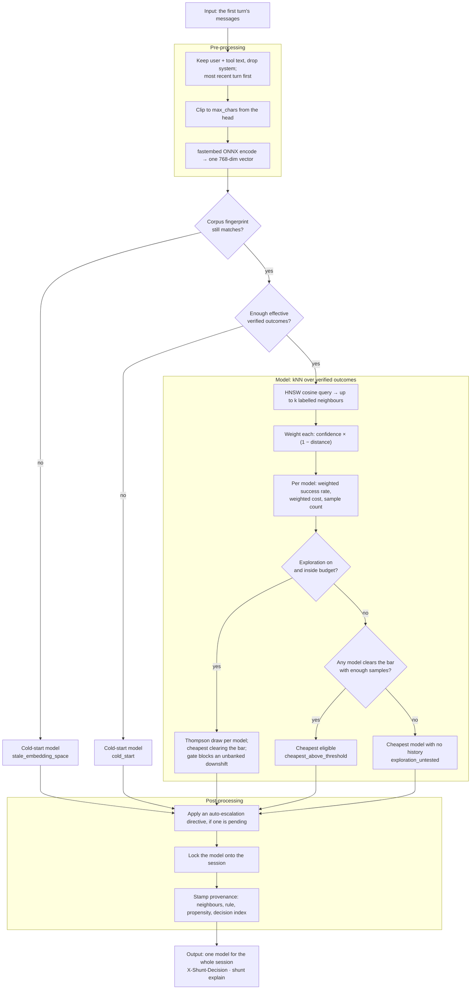
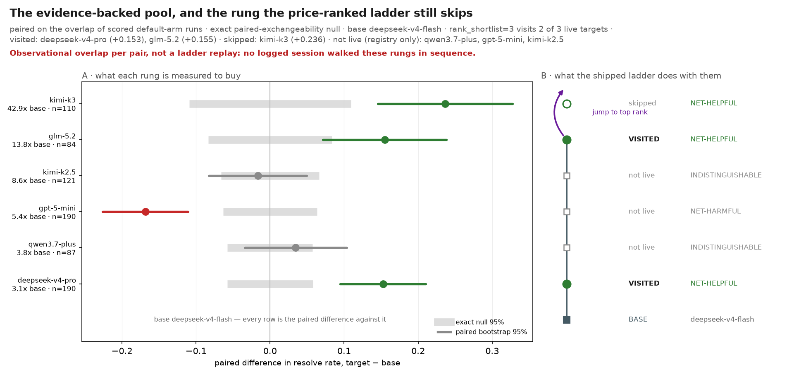

# The routing model

Shunt makes one model choice per session, on the first turn, before any tokens are
spent. This page describes what that decision actually reads, how it is computed,
why it is shaped this way, and the places where it does nothing useful. Its sibling
is [Error detection & auto-escalation](escalation.md), which acts *after* a verified
outcome exists; this one acts *before* there is any evidence about the task at hand.

> **This page describes an opt-in.** The shipped default is
> `router.strategy: session_cascade`, which starts every session on the cheapest healthy
> model and lets [verified failure](escalation.md) climb it. It **never runs this page's
> rule**: no embedding, no neighbour lookup, no candidate scoring, no per-task model
> choice. To get the routing model you set `router.strategy: knn_semantic_cascade`, and a default
> install does not. Two things follow that are easy to miss: **exploration is inert** under
> the default (it perturbs a kNN pick that is never made), and `shunt doctor` treats a
> missing embedding-weights cache as a **warning rather than a failure**, because nothing
> needs it. Why the default is the cheaper of two equal-quality points is in
> [Results](results.md#routing-at-session-cadence).

The rule is nonparametric: embed the task, look up the nearest past tasks whose
outcomes you already verified, and take the cheapest model that cleared your quality
bar on them. There is no training step and no learned weights. Everything it uses is
in the outcome store on your disk.

## The shape of it



## What it reads

Only the task-bearing text of the first turn, and only in one form: a vector.

- **Roles.** Content from `user` and `tool` messages. The `system` prompt is dropped
  on purpose — a coding agent's system prompt is many times longer than the clip
  window, and leaving it in meant every session embedded to nearly the same vector.
  A body with no `user` or `tool` message falls back to the flat wire-order text
  rather than embedding an empty string.
- **Order.** Most recent turn first. The clip below cuts from the head, so wire order
  would have thrown the task away and kept the preamble.
- **Clip.** The text is truncated to `max_chars` (packaged default 4000) before
  encoding. Attention is quadratic in length, so an unbounded prompt is an unbounded
  allocation; the cap is what keeps a long agent prompt from taking the router down.
  The full prompt still goes upstream untouched — the clip affects the routing signal
  only.
- **Encoder.** fastembed, CPU-only, running the model named in
  [`embedding.yaml`](configuration.md#choose-the-embedding-model-and-stay-swap-safe).
  The shipped default is `jina-code` (768 dimensions); `arctic` is the other bundled
  option.
- **Fingerprint.** The active model, its dimension, and `max_chars` form a corpus
  fingerprint. Change any of them and the stored vectors live in a different space,
  so their distances mean nothing. Shunt notices, refuses to consult neighbours at
  all, and routes as if cold under the reason `stale_embedding_space` until you run
  `shunt reindex`. It does not quietly compare across spaces.

## How it decides

### Cold start comes first

Until there are enough verified outcomes, kNN has nothing to search, so the router
routes to a fixed cheap model — `deepseek-v4-flash` (the cheapest live model),
falling back through `zai-glm-5.2`, then any healthy model in the pool, if the
primary is unhealthy.

Cold start ends on **effective** sample size, not row count. Each outcome's weight
folds in its verification confidence, and the gate uses the Kish effective size
`nₑ = (Σw)² / Σw²` rather than counting rows. Two thresholds end it: enough
Tier-2 (verified) outcomes, or enough labelled outcomes of any tier. A store full of
low-confidence labels therefore stays in cold start longer than a raw count would
suggest, which is the intended behaviour — the router waits for evidence it can
trust, not volume.

Cold-start sessions are still embedded and still recorded. That is the point of
them: they are how the corpus gets built.

On a fresh deployment the store is empty, so the router stays on the fixed cheap
model until enough verified outcomes accumulate. You can warm it deliberately:
`python -m benchmark.routing.seed_live` (from a checkout) loads the benchmark's
measured — never imputed — outcome cells into the store, so the index is warm at
inference. Seeded sessions use ids `bench:...` and the reason `benchmark_seed`;
they are non-policy, and the router re-fits from live verified outcomes as they
accumulate.

Re-seeding is incremental and skippable. Each seeded row stores a per-cell
`content_hash` (task, model, outcome, cost, and text); on re-import only cells
whose hash changed are written — updated in place, never re-embedded when
unchanged. The warm-start bundle commits the measured cells via git LFS at
`benchmark/routing/data/seed/`: one `.npz` per embedder fingerprint, with a plain
`manifest.json` beside it (fresh clones need `git lfs pull`). Build it with
`make seed-bundle`; `make check-seed-bundle` proves it current against the committed
`results.csv` and `challenges.json`. Re-running `seed_live` skips
re-importing while the stored marker's digests (results + challenges) still match —
`--force` forces a full re-import.

Be clear about what seeding does not buy: the embedding→outcome
signal on the benchmark corpus measured at chance (see
[the embedding-signal figure](#fig-embedding-signal)), so seeding is a start-warm
convenience, not evidence the rule routes your workload.

### The neighbourhood

Once warm, the embedding goes to an HNSW index (hnswlib, cosine space) which returns
the *k* nearest embedded sessions (`policy.k`, default 20). Sessions without a
recorded outcome are dropped, so a query can legitimately come back with fewer than
*k* neighbours — sometimes with none.

Each surviving neighbour carries the model that ran it, its verified pass/fail, its
real cost, the verification confidence of its label, and its distance. Each gets a
weight:

```
weight = verification_confidence × max(0, 1 − distance)
```

so a far neighbour or a weakly-verified one counts for less, and a neighbour beyond
distance 1 counts for nothing. There is no separate calibration model; this product
is the whole of it.

Neighbours are then grouped by model, and each group yields a weighted success rate
and a weighted cost. A neighbour whose real cost is unknown surfaces as infinite
cost, which is deliberate: unknown must never sort as cheapest.

### The selection rule

A model is **eligible** when its weighted success rate is at least
`success_rate_threshold` (shipped 0.6) *and* its group holds at least `min_samples`
neighbours (shipped 3). Among eligible models, the cheapest wins —
`cheapest_above_threshold`. That single line is the product thesis: hold a quality
bar, minimise cost under it.

When nothing is eligible, the rule walks the price-ranked pool from cheapest upward
and returns the first model that has **no history in this neighbourhood** —
`exploration_untested`. Read that carefully, because it is the rule's most
consequential branch: on a thin or empty neighbourhood it returns the *cheapest*
model, so an under-informed router behaves like `always_cheap` while reporting a
reason that sounds like a considered choice. Only the debug log distinguishes the
two. If every model in the pool has already been tried and none qualified, the
cheapest is returned as `safe_fallback` — cost-minimal, not a quality bet: the
strongest was in the tried set and failed the same bar, so escalating to it was a
heuristic, and deliberate escalation on verified failure is the auto-escalation
ladder's job (see [escalation](escalation.md)).

### Exploration

Exploration ships **on**. When it is enabled and the cumulative exploration budget
has room, a cost-aware Thompson layer runs *before* the selection rule.

Each model gets a Beta posterior built from the weighted neighbourhood counts on top
of a prior. The prior is empirical-Bayes: seeded from that model's global offline
success rate, with its pseudo-count strength capped (`prior_strength_cap`) so a long
global history regularises a sparse local neighbourhood instead of swamping it. One
rate is drawn per model; the cheapest draw clearing the same threshold wins, or the
highest draw if none clears it.

Two rails sit on top. A **conservative gate** compares the sampled pick against the
deterministic greedy pick and blocks an exploratory *downshift* to a cheaper model
unless earlier successes have banked enough slack — otherwise the choice reverts to
greedy as `conservative_fallback`. An **exploration budget** caps cumulative
exploratory spend as a fraction of what exploiting would have cost. Every decision
feeds the budget's denominator, exploit choices included.

The propensity of the realised choice is estimated by Monte Carlo and logged, so the
policy can be evaluated off-policy later. That resampling snapshots and restores the
RNG state, so turning the logging knob up cannot change which model your next request
gets.

## What happens to the decision

- **It is locked to the session.** The chosen model is written onto the session and
  reused for every later turn. The router is never consulted again for that session.
  This is the cache-safety spine: no mid-conversation model switch, so no silent
  full-price re-read of a cached context.
- **A pending escalation may override it.** If auto-escalation is enabled and a
  directive is due, it is applied here, at the boundary — raising the reasoning arm
  on the same model, or stepping a rank. See [escalation](escalation.md).
- **Provenance is stamped.** The neighbours consulted, the rule that fired, the
  propensity, the per-model scores, and the decision index all land on the session
  row. `shunt explain <session_id>` reads them back, and the `X-Shunt-Decision`
  response header names the model and reason.
- **The outcome comes back later.** At session close the verifier records a verified
  outcome; only sessions carrying one join the index. Learning is batch: the index is
  rebuilt every `refit.every_n_outcomes` captures, so a single new outcome does not
  move routing until the next re-fit or restart.

### Session identity

Sessions are keyed on the tool's conversation id when the tool presents one.
opencode sends `X-Session-Id` on every request — fresh on a new conversation,
stable when one is resumed, and a fork carries `x-parent-session-id`. A new
conversation id means a new session and a fresh routing decision on the new task.
A resumed conversation reuses the model previously locked for it (see
`session_resume` / `fork_resume`). Tools that send no conversation id (Claude
Code, aider, plain clients) still group live traffic by `(source_ip, user_agent)`
— one client, one open session — but they can now be *resumed*. Each session also
records a digest of its conversation's opening prompt: the first system block and
first user block, with the resolved repo bound in as a one-way digest. The working
directory, date and git state are normalised out of the **system** block only — the
one the host rewrites on every launch. The user's own turn is hashed as sent, because
the client replays it verbatim on a resume and because normalising it would erase the
file paths and identifiers that tell one task apart from another. Appending turns does
not move the digest, so when such a conversation comes back after a restart it finds
its own prior decision and re-serves that model (`prefix_resume`).

That digest is stable across a resume but **not unique to a conversation** — a new
conversation opening with the same question, in the same repo, from the same client
hashes the same. Two rules narrow that. The router consults it only when the request
**replays a conversation** (two or more turns on the wire); an opening request carries
a single turn and is always routed on its own merits, however familiar its question.
And when the stored rows carrying one digest **disagree on the model they served**, it
refuses to resolve and routes fresh — a cold route is cheaper than attributing one
conversation's outcome to another.

That second rule is a partial guard, not a guarantee, and it is worth knowing where it
stops: two conversations that collided on one digest *and* were both served the same
model expose no disagreement to refuse on, which under the shipped `session_cascade`
preset is the common case, since every cold session starts on the same cheapest model.
The protection that carries the weight is the replay rule above plus the digest's own
discrimination; the disagreement check is a backstop for the rest.

### The reason tokens

Every decision names its rule. These are the values you will see in the header and
in `shunt explain`:

| Reason | What happened |
|---|---|
| `cold_start` | Not enough effective verified outcomes yet — fixed cheap model |
| `stale_embedding_space` | The corpus was embedded by a different embedder; neighbours refused until `shunt reindex` |
| `cheapest_above_threshold` | A model cleared the success bar with enough samples, and was cheapest |
| `exploration_untested` | Nothing cleared the bar; the cheapest model with no local history was picked |
| `safe_fallback` | Nothing cleared the bar and every model had been tried — cheapest model |
| `exploration` | Thompson sampling diverged from the greedy pick |
| `exploration_exploit` | Thompson sampling agreed with the greedy pick |
| `conservative_fallback` | An exploratory downshift was blocked for lack of banked slack |
| `auto_escalation` | A pending escalation directive overrode the base pick |
| `escalation_floor` | This task had already escalated to a higher rank, so the base pick was lifted back to it |
| `session_resume` | A resumed conversation reused the model locked for it (persisted across restarts) — non-policy, no selection propensity |
| `fork_resume` | A conversation resumed via a fork reused the parent conversation's model — non-policy, no selection propensity |
| `prefix_resume` | A conversation with no session id was matched to its own prior turns by its opening-prompt digest, and reused the model locked for it — non-policy, no selection propensity |
| `benchmark_seed` | A session seeded from the benchmark's measured outcomes — non-policy, never a learned choice |
| `always_cheap` / `always_frontier` | A fixed strategy is configured; no embedding, no query. Both are pinned controls: a verified failure never moves them |
| `session_cascade` | The cheap-first cascade preset picked its base model; unlike the two above, a verified failure can raise it a rung later (see the escalation reasons) |

Under `knn_semantic_cascade` — the opt-in routing strategy, not the default — the base pick
reports one of the kNN tokens above
(`cheapest_above_threshold`, `exploration_untested`, `safe_fallback`, `cold_start`) —
the ladder is a *later* decision, and it shows up as `auto_escalation` and
`escalation_floor` on subsequent sessions. Every decision also carries the config id that
produced it as `strategy_id` in its provenance, so an analysis can separate cascade
sessions from the bare selection rule without reinterpreting these tokens.

## Why it is built this way

- **Nonparametric, so it works from the first labelled session.** There is no model
  to train and no minimum dataset before the mechanism functions at all — it degrades
  to cold start instead of failing.
- **Inspectable.** Every decision can be traced to the specific past sessions that
  produced it. A learned scalar cannot be argued with; a neighbour list can.
- **Cheapest-above-a-bar states the goal directly.** The alternative — optimising a
  reward that trades quality against cost — needs an exchange rate between them that
  nobody can defend. A threshold you set is honest about being your choice.
- **One decision per session, because the cache is per-session.** Routing per turn
  would break the provider's prompt cache and cost more than any routing gain.
- **Price order is the only ranking available at cold start.** Capability order needs
  measurement you do not have yet; list price is always known.

## Limitations

Read these before trusting a routing decision.

- **The core signal is unproven on coding work.** Ranking hard tasks from easy ones
  off a prompt embedding is the assumption the whole rule rests on, and on agentic
  coding it has not cleared our viability bar. See [Results](results.md). The proxy,
  the cache-safety guarantee, and the escalation path do not depend on it; the *kNN
  decision* does.
- **A thin neighbourhood is indistinguishable from a confident one.** The
  `exploration_untested` branch returns the cheapest model, and nothing in the
  response says the neighbourhood was empty. Check `shunt explain` before concluding
  the router "decided" anything.
- **Rank is price, not capability.** The pool is ordered by list price, which is not
  a capability ordering — stepping up a rank can lower your pass rate. The measured
  per-model table is in [Results](results.md).
- **It sees a clipped, system-free slice of the task.** A task described mainly in a
  system prompt is invisible to it, and a long task is truncated. The truncation rate
  is carried on each neighbour but the rule does not otherwise compensate for it.
- **It cannot react to a task that changes mid-session.** The model is locked. If
  your session drifts from a rename into a redesign, routing does not follow — that
  is what escalation is for, and escalation only acts at the next boundary.
- **Learning is batch and global.** One corpus, one index, no per-project or
  per-user models. A new outcome changes nothing until the next re-fit.
- **Exploration costs money and quality while it runs.** It is on by default so the
  router can gather evidence; if you want decisions on current beliefs only, turn it
  off.
- **SWE tasks only.** Both the corpus and the verified label assume a repository with
  a test suite. Nothing stops you routing other work through Shunt, but the decision
  has no evidence behind it and no verifier to grade it afterwards.
- **This rule is off unless you turn it on, and on this corpus turning it on cost
  money.** The default `session_cascade` never embeds. Selecting `knn_semantic_cascade` opens
  the same ladder on the kNN pick and, on the offline corpus, reached the *same* pass
  rate for **$9.78 more** cache-aware — see
  [the shipped default, measured](results.md#the-shipped-default-and-the-routing-model-priced-against-it)
  for the number and for the reason it may understate the routing model in live use.
- **The cascade numbers are an offline replay from a fresh tree.** Live, an escalated
  rung inherits the cheap rung's half-finished work and the whole prior conversation.
  What that does to quality is untested and its direction is unknown —
  [the divergence, stated once](escalation.md#offline-vs-live-cascade).

### Pros and cons at a glance

**Why use this model.** It is the cheapest thing that could plausibly work: no
training step, no embedding server, no learned weights — a lookup plus a threshold,
and it degrades gracefully to a fixed cheap model while the evidence is thin. On the
routine ~80% of tasks a cheap model handles anyway, it spends almost nothing on
prediction. The [rationale](#why-it-is-built-this-way) is above and the
[limits](#limitations) below; the table is the summary.

| Pros | Cons |
|---|---|
| Works from the first labelled session — degrades to cold start, never fails | The core signal (embedding → difficulty) is unproven on coding work |
| Every decision traces to concrete past sessions | A thin neighbourhood looks like a confident one — check `shunt explain` |
| Threshold states *your* cost/quality trade directly | Rank is price, not capability — stepping up can lower pass rate |
| Cache-safe by construction: one decision per session | Sees a clipped, system-prompt-free slice of the task |
| CPU-only embeddings; runs on any laptop | Cannot react to a task that changes mid-session |
| Batch, global, inspectable learning | Exploration costs money and quality while it runs |
| | SWE tasks only today |
| | Off by default — `knn_semantic_cascade` is opt-in, and it cost more than the cheap start here |

## Configure it

Strategy, `k`, the success threshold, `min_samples`, exploration, the live model
list, the embedding model, and the re-fit cadence are all in
[Configuration → Tune the router](configuration.md#tune-the-router). If this page's rule is
not what you want — and on agentic coding its core signal is unproven, above — you are
already there: `session_cascade` is the **default**, and it skips the prediction, starts on
the cheapest model, and lets [verified failure](escalation.md) walk the ladder. It costs no
embedding at all.

To turn this page's rule on, set `router.strategy: knn_semantic_cascade`: the same ladder, opened on
the kNN pick instead of on the cheapest model. It was spelled `knn`, then `knn_cascade`,
before the second rename, and those values still work with a warning — they still mean **kNN
routing**, so they resolve to `knn_semantic_cascade` and never to the new default. Note what
is *not* on offer: the kNN rule
**without** the ladder. The shipped values are in `src/shunt/config/router.yaml` and
`src/shunt/config/embedding.yaml`.

## Difficulty routing (judge-labelled kNN)

The embedding-based kNN above is the **semantic** family: it embeds the task text and finds
semantically similar tasks. This page's own evidence ([`embedding_signal.png`](#fig-embedding-signal))
shows that embedding carries almost no difficulty signal (LOO R² −0.04, inside its null), so a
second family routes on the thing the embedding is missing: a **difficulty label**, produced by an
LLM judge (`gpt-5.6-terra`, $1/$6 list — probed at the same label quality as the claude-sonnet-5
anchor, LOO R² +0.027 vs +0.029). The committed per-task labels live in
`benchmark/routing/data/judge_difficulty.json` (derived by `derive_judge_difficulty.py` from the
gitignored probe artifacts). The three benchmark rows are `knn_difficulty` (single-shot control),
`knn_difficulty_cascade` (difficulty pick + the session ladder) and `difficulty_band_cascade` (the
"just the label + escalation" rule: same-difficulty-band members vote, cheapest in-band model whose
pass rate clears the bar opens the ladder). Each row's cost includes the MEASURED per-task judge
bill (`judge_label_cost` in `strategy_summary.csv`), because a judge call is a real cost of running
that strategy. The measured bill is the provider-reported usage cost recorded by the probe at
2026-08-26 (~$0.0016/task, ~1.6× the $1/$6 list estimate) — it is the honest number the figures
plot, and it is the reason the "cheaper than the anchor" framing rests on the list price, not on a
measured cross-model comparison.

**Measured verdict — none cleared the inference bar, so none is wired into the product.** The
pre-registered gate was: match `session_cascade`'s pass rate within 5pp at *lower* model+judge cost.
On the 184-task corpus:

| row | pass rate | cache-aware cost | verdict |
|---|---|---|---|
| `session_cascade` (shipped) | 96.74% | $28.71 | baseline |
| `knn_difficulty_cascade` | 96.74% | $29.01 | equal quality, **more** expensive |
| `difficulty_band_cascade` | 96.74% | $29.92 | equal quality, more expensive |
| `knn_difficulty` (control) | 75.54% | $1.80 | == always-cheap; never escalates |

The difficulty cascades' model cost is `session_cascade`'s plus the judge bill:
`knn_difficulty_cascade`'s is exactly that ($28.71 + $0.30) — its difficulty pick opened
on the cheapest rung on all 184 tasks, so it replays `session_cascade`'s ladder verbatim —
while `difficulty_band_cascade`'s band pick opens above rung 0 on 12 tasks (picking
qwen3.7-plus), which is the ~$0.90 more of model cost. The difficulty pick bought nothing
on this corpus either way — the judge bill is pure addition. On the completed scoring
basis — the house basis every frontier row uses, disclosed in this section's figure limits —
the single-shot row collapses to always-cheap: deepseek-v4-flash's neighbour pass rate
clears the 0.6 eligibility bar in every completed-matrix difficulty neighbourhood, so the
rule's cheapest-eligible pick is deepseek on all 184 scored tasks. That collapse is a
property of the completed scoring basis, not a corpus invariant: on the raw 200-task
matrix the same pick routes 28 tasks to kimi-k3, and an oracle label (the task's own
outcome) would move 45 of the 184 picks off deepseek — the oracle pick still lands on
deepseek for 139 of 184
tasks — so a strong-enough label WOULD shift the routing, and the measured +0.027 LOO
label is simply not strong enough. The falsification stands on both
bases: on the raw 200-task matrix the difficulty cascade run loses quality against
`session_cascade` (164 passes vs 170) at similar cost, so neither basis changes the verdict.
This is the predict-then-cascade finding restated on a second axis: on this corpus
the **verification ladder dominates prediction** — whatever the pick, the ladder reaches
the frontier on verified failure, so a better pick cannot lower the bill at equal quality.
For the same reason there is no step-count win for the kNN-difficulty cascade (its path is
byte-identical to `session_cascade`'s); the band cascade opens higher on its 12 tasks, so
it escalates marginally *more*, not less.

**What moving a difficulty row to inference would require** (nothing blocks it mechanically; the
value does). A judge provider and key; one judge call per task *at the task boundary* (label the
first turn before the first routing decision — a cache-safe single decision per session, ~$0.0016 and
the latency of one small completion); a difficulty index over the labelled outcome history (rebuild
like the semantic index, from verified outcomes, so a label never votes without a measurement); and a
cold-start fallback to `session_cascade` when no judge is configured or the index is empty. None of
it is worth building while the measured result says the pick changes nothing. The revisit
condition is genuinely *per family*: for the single-shot and band rules — the only ones whose pick
can move — the judge label would need to approach the human tag's same-pipeline LOO R² (≈0.09,
roughly the "~0.1" ceiling; current terra is +0.027); for the session-cascade rows no label quality
helps, because the ladder reaches the frontier on verified failure regardless of where the pick
opens.

## Figures

Each figure below is the PNG committed under `docs/assets/figures/routing/`. The image carries its claim, its sample size and — where
a reader could be actively misled — one red line. The rest is here.

### Most reasoning knobs were never turned — the flat contrasts are unmeasured {#fig-arm-manipulation}


*2 of 9 reasoning knobs demonstrably fired (ratio ≥ 1.15× output tokens) · over the fired knobs only: +8.54pp on 82 co-measured pairs (exact McNemar p=0.143) · all nine pooled, including the seven that never fired: +1.68pp on 475 pairs*
> **Caveat.** 7 of 9 rows show no manipulation — their flat contrasts are unmeasured, not null.
**Reading.** Left: the manipulation check. For each (model, low arm, high arm) pair, the ratio of mean output tokens on the tasks where BOTH arms ran. A knob that was turned moves this well above 1; the red line is where nothing changed. Right: the paired pass-rate difference for the same pairs, with a 95% paired interval. A row whose knob did not fire is greyed and carries the label — its flat difference measures nothing.

**What to look for.** Do not read the right panel for a row that is grey on the left. The only row that supports any claim about reasoning effort is the one whose knob demonstrably moved.

**Terms.** *manipulation check* — evidence the treatment was applied at all, measured before any outcome. Output tokens are what a reasoning-effort setting mechanically controls. *paired contrast* — computed only on tasks where BOTH arms ran and NEITHER was censored, so a resource-limit stop cannot masquerade as a capability failure.

**Notes.** Arm coverage is sparse by design (p(arm|model) sampling), so a pair below the minimum count is greyed for sample size as well as for manipulation.
gpt-5-mini minimal→high: output-token ratio 2.85x on n=27 pairs — FIRED; paired Δ +11.1pp [-4.6, +26.8], cost Δ \$0.0318
gpt-5-mini medium→high: output-token ratio 2.61x on n=55 pairs — FIRED; paired Δ +7.3pp [-4.9, +19.5], cost Δ \$0.0311
gpt-5-mini minimal→medium: output-token ratio 1.08x on n=106 pairs — never fired — not a null; paired Δ -0.9pp [-9.4, +7.5], cost Δ \$0.0023
kimi-k2.5 nothink→think: output-token ratio 1.06x on n=58 pairs — never fired — not a null; paired Δ +0.0pp [-9.6, +9.6], cost Δ \$0.0015
qwen3.7-plus nothink→think: output-token ratio 1.00x on n=43 pairs — never fired — not a null; paired Δ -2.6pp [-17.6, +12.5], cost Δ \$-0.0029
deepseek-v4-flash high→max: output-token ratio 0.95x on n=42 pairs — never fired — not a null; paired Δ -4.8pp [-14.0, +4.5], cost Δ \$0.0000
zai-glm-5.2 nothink→think: output-token ratio 0.93x on n=8 pairs — never fired — not a null; paired Δ +12.5pp [-10.4, +35.4], cost Δ \$0.0037
deepseek-v4-flash nothink→high: output-token ratio 0.92x on n=113 pairs — never fired — not a null; paired Δ +2.7pp [-3.6, +8.9], cost Δ \$-0.0012
deepseek-v4-flash nothink→max: output-token ratio 0.78x on n=27 pairs — never fired — not a null; paired Δ +3.7pp [-12.5, +19.9], cost Δ \$-0.0034
**Limits.** The ratio is over co-measured tasks only. A knob could fire on tasks neither arm shares, and this check would not see it.

<!-- n: arm_pairs=9, fired=2 -->

### The modelled cache saving is now the same size as the whole list-to-bill discount {#fig-cache-economics}


*6 models, 1209 priced rows · cache-read price measured for 6/6 models and input share for 6/6; hit rate assumed at 90% · mean billed share 0.21 of list price vs a modelled 0.24 — residual -0.01 to +0.08 per model*
> **Caveat.** Agreement in size is not calibration: blue mixes every discount, green models caching alone.
**Reading.** Left: per model, the share of the list-price bill that was actually charged. The blue bar is MEASURED — every row's real_cost over its estimated_cost in results.csv, which is the whole gap between list price and the invoice. The green diamond is the share the registry's cache-read price predicts would survive, priced at the corpus's measured input/output token mix; the faint grey rule beneath each bar sweeps the one input nothing here measures, the cache hit rate, from 100% (left cap) to 50% (right cap). The right-hand column repeats each row as billed → modelled with its row count. Lower is cheaper. Right: the switch tax — how much of the MODELLED cache saving survives as the router changes model inside one session.

**What to look for.** Read the DISTANCE between the blue bar and the green diamond. It is now small on every model, so caching alone is a large enough effect to account for essentially the whole discount. Read that as a SIZE agreement, not as a validation: the bar mixes every reason the invoice differs from list price, and two quantities landing on the same number cannot separate them. Then read the right panel at the shipped operating point — one decision per session.

**Terms.** *billed share* — sum(real_cost) / sum(estimated_cost) over every measured row for that model. 1.0 means the invoice matched list price. It mixes EVERY reason the two differ — caching, negotiated rates, provider-side discounts — not caching alone. *registry prediction* — 1 - input_share x hit_rate x (1 - cache_read_price / input_price), the per-model cache economics benchmark.runner.kill_gate now costs with. *input share* — the share of a model's spend that is INPUT tokens, from the measured in_tok / out_tok mix in results.csv priced at registry rates. This corpus is input-dominated, which is why the modelled saving is large. *switch tax* — naive cost minus cache-aware cost. A model switch forfeits the cached prefix, so the next turn is billed at full input price.

**Notes.** The cache-read prices come from the shipped registry (src/shunt/config/models.yaml), so a provider price change moves this figure rather than silently invalidating it.
deepseek-v4-flash: billed 0.063 (n=345), registry predicts 0.141 [discount measured, input share 0.974 measured], hit-rate band 0.046–0.523
qwen3.7-plus: billed 0.243 (n=132), registry predicts 0.234 [discount measured, input share 0.946 measured], hit-rate band 0.149–0.574
gpt-5-mini: billed 0.294 (n=361), registry predicts 0.302 [discount measured, input share 0.862 measured], hit-rate band 0.224–0.612
kimi-k2.5: billed 0.239 (n=181), registry predicts 0.288 [discount measured, input share 0.949 measured], hit-rate band 0.209–0.604
zai-glm-5.2: billed 0.189 (n=87), registry predicts 0.233 [discount measured, input share 0.946 measured], hit-rate band 0.148–0.574
kimi-k3: billed 0.217 (n=103), registry predicts 0.262 [discount measured, input share 0.911 measured], hit-rate band 0.180–0.590
**Limits.** The hit rate is still assumed: no run in this corpus records a per-turn cache-hit ratio, so only the DISCOUNT and the INPUT SHARE are measured. The grey whisker is the whole range that assumption can move the green marker over. The blue bar and the markers are different quantities drawn on one axis deliberately. They now land close together, and that is NOT a calibration result: the bar also contains negotiated rates and provider-side discounts, so agreement in magnitude cannot attribute the discount to caching. The right panel is a MODEL of the switch tax, not a measurement — no live session in this corpus switched model mid-conversation, because the shipped router cannot.

<!-- n: models=6, priced_rows=1209 -->

### The split count is a LOWER bound on contestable tasks — unsampled cells can only add {#fig-complementarity}


*200 tasks x 13 columns, 1217 of 2600 cells sampled (46.8%) · coverage 21/200 (zai-glm-5.2) to 198/200 (gpt-5-mini) · contestable tasks in [96, 186] of 200 — 96 split is a FLOOR, not a ceiling*
> **Caveat.** Sampling is 47% of the grid: grey is unmeasured, never a fail — which is why 96 is a lower bound, not the ceiling.
**Reading.** Left: every task (row) against every measured (model, arm) column. Green is a pass, red a fail, grey never sampled — grey is NOT a failure. Middle: how many tasks each column was actually run on, so the uneven denominators are visible. Right: the task census. A split task — at least one pass and at least one fail — can already be won or lost by a routing decision. A task solved by every SAMPLED column has not been shown uncontestable, only untested: each one still has unsampled columns, and one failing column is enough to move it into the split slice.

**What to look for.** Read the right panel as a FLOOR, not a ceiling. The split count is what is contestable on the evidence in hand; the solved-by-all slice sits above it as tasks no column has yet been seen to fail, so the true count lies somewhere between the split count and split-plus-solved-by-all. Then read the middle panel before comparing any two columns anywhere else in this set — two columns are only fairly compared on the rows where both are non-grey, which is a different denominator from the pooled pass rates.

**Terms.** *split task* — at least one column passed and at least one failed. *sampling density* — sampled cells over total cells. The matrix is sparse BY DESIGN — p(arm|model) sampling — so a low density is a budget decision, not missing data. *contestable floor* — the measured split count. It can only rise as unsampled cells are filled: a split task stays split, while a solved-by-all task joins it as soon as any unsampled column fails.

**Notes.** Columns are ordered by model price, then by within-model reasoning rank, so the grid reads left-to-right as cheap-to-expensive.
The upper end of the interval counts the solved-by-all slice only. Solved-by-none rows are under-sampled too, but they could join only by an unsampled column PASSING, which nothing measured here supports, and a task no model solves is not value a router can capture.
solved by all: 90; split: 96; solved by none: 14
all 90 of 90 solved-by-all tasks still have unsampled columns (3 to 12 of 13, median 9) — any one of them becomes contestable if an unsampled column fails
the 14 solved-by-none tasks are under-sampled too (3 to 8 columns), but could join only by an unsampled column PASSING, so they are excluded from the interval
**Limits.** The grid is drawn from the RAW measured cache, not the imputed matrix, so a grey cell is genuinely unmeasured rather than filled. Every other figure in this set that quotes a pass rate scores the imputed matrix instead. At this sampling density 'solved by every sampled column' is NOT 'solved by every column', so the contestable count is an interval rather than a number. Only filling the grey cells pins it down.

<!-- n: columns=13, contestable_ceiling=186, contestable_floor=96, sampled_cells=1217, split_tasks=96, tasks=200 -->

### The live frontier at cache-aware cost — cost is the uncertain axis {#fig-cost-quality-frontier}


*12 strategies over 184 scored tasks · Session-Cascade \$28.71 at 96.7% vs baseline \$96.02 at 95.1% (30% of the bill, cache-aware) · cost is the wide axis: Session-Cascade's naive total spans \$22.53–\$46.14 (95% bootstrap) · area under the live frontier 0.929*
> **Caveat.** scored on 184 coverage-selected tasks (dropped are harder); 8 of 12 are not selectable as router.strategy.
**Reading.** THREE PANELS, THREE MAGNIFICATIONS, ONE PLANE. Panel A is the whole set — every strategy that carries a cost, over the full cost range, at full label, interval and hull treatment. Panel B redraws the outlined box on A at the same full width; panel C redraws the outlined box on B. Each box is joined to the panel that magnifies it by two dashed lines running from its lower corners to that panel's upper corners, so the A-to-B-to-C descent is drawn rather than asserted. The three x axes are three DIFFERENT scales, each ticked in round dollars across its own window, and only the bottom panel carries the axis label. In all three, x is total dollars spent over the scored task set on a log axis, because the strategies span two decades, and y is pass rate in percent. NEITHER BOX IS WRITTEN DOWN. B's is the DETAIL WINDOW, derived from the rows every time the figure is drawn: every strategy whose pass rate clears the best measured row's own Wilson lower bound, plus the fixed-frontier baseline and the oracle bound, widened by the room the names need. C's is the group whose MARKERS overlap inside B — measured on the rendered canvas, not chosen — widened to contain the full length of every context bracket it draws. EVERY PANEL NAMES EVERY STRATEGY ITS OWN WINDOW HOLDS, so a name repeats down the stack at each scale — that is what a magnification is, one point named twice, not two measurements. A strategy outside the detail window is therefore named on A, on the plane, at its own cost and pass rate: it is not part of the comparison B is for, and it is not a footnote either. The ONE exception is the group panel C magnifies. Above C its markers are a single blob, so a name printed there would land on a mark nobody can resolve, and those names appear only on C. Any name that could be placed on no panel at all would be listed in the notes; today there is none. THE FIGURE DEGRADES ON BOTH AXES, and says which case it is in. With nothing outside the detail window there is nothing for B to add, and the figure is A plus the magnified panel. With no overlapping markers there is nothing to magnify, and the figure is A plus the detail panel. With neither, it is the single plane it has always been. The layout note states how many levels the figure has. WHERE THE INTERVALS LIVE. Panels A and B carry them; panel C carries none. The vertical rule through each marker is its 95% Wilson interval on the pass rate, drawn BEHIND the markers and faintly: several strategies share one pass rate here, so their intervals are literally the same rule drawn several times, and at full weight they read as a picket fence of separate measurements. The thin horizontal line running from a marker ends at an open tick at the NAIVE per-call sum, so the gap between the two cost models is a drawn distance; the capped bar at that tick is the 95% bootstrap interval on the naive total, drawn on the naive statistic because that is the one it was computed for. Both cost marks appear on LIVE strategies only. At C's scale every one of these runs off the panel, so C leaves them behind and the panel caption says so. IN EVERY PANEL the marker sits at CACHE-AWARE cost — what a deployment is billed once a repeat of the same model banks its cached prefix. Marker SHAPE carries what a strategy is: circles and the orange diamond can run in production today, blue squares are blocked — no router.strategy value names them — an X is a control that must never ship, and a star is a bound that is unreachable by design. Marker FILL splits the blue squares: a SOLID square is blocked and nothing equivalent runs today, while a HOLLOW one would mark a mechanism that ships under another config surface with only its NAME blocked. NO ROW IS HOLLOW TODAY — the one that was, Session-Cascade, is now live as router.strategy: session_cascade, and every remaining blue square is solid, i.e. genuinely unrunnable. Only the live points enter the Pareto test and the shaded mixture region — a frontier anchored on a strategy the router rejects at boot describes an operating point nobody can buy. HOW A NAME IS PLACED SAYS WHAT WAS CROWDED. A name printed beside its marker had room there. A name lifted onto a level above or below the plane, on a vertical leader down to its own marker, belongs to a group whose NAMES could not all be printed where they sit — the leader is vertical and lands on the marker it names, so it cannot be misread onto a neighbour. Panel C labels its whole crowd that way, because at that scale nothing else can. Inside panel C, a DEPLOYABLE escalating strategy carries a context-transfer cost model, drawn as a dashed rule hanging under the marker it belongs to and joined to it by a thin line: the MARKER is what the benchmark measures, a fresh context on every rung, which is not a setting anyone can select; the shaded segment is `context_transfer: summary`, a band rather than a tick because how far a summariser compresses is not a constant; and the tick at the right end is `context_transfer: full`, which is what ships today. That rule asserts NO pass rate — it is horizontal, and its height carries no meaning at all. A deployable escalating row panel C does not contain carries no bracket on the canvas, and the notes name it and publish its numbers. The key is drawn ONCE for the whole figure, below the bottom panel, from every class the figure actually carries.

**What to look for.** A router earns its existence only by sitting ABOVE the shaded mixture region — below or on it, the same cost-quality point is reachable by flipping a weighted coin between two fixed policies.

**Terms.** *live* — the router may be configured with this strategy today — the set is derived from the product's own LIVE_STRATEGIES, not restated here. *live Pareto* — no other LIVE strategy is both cheaper and at least as good, on CACHE-AWARE cost. Bounds, controls and blocked strategies are excluded — none of them is a setting an operator can choose. This is the same cost model strategy_summary.csv's Pareto column uses, so the plane and the table cannot disagree. *cache-aware cost* — a repeat of the same model on a consecutive attempt is billed at the provider's cache-read rate rather than at full input price. Cascades re-serve one model by construction, so this is exactly where the two cost models part company. *context transfer* — what a deployment is billed once the model an escalation moves to is resent the conversation. The router config names the two settings the panel labels: `summary` resends a summarised prefix, `full` resends all of it, and `full` is the shipped default. The resent prefix is a cache MISS by construction — a new model receiving a prefix it has never seen — so it is charged at the full input rate, never at the cache-read rate. Context size is estimated as t = 2 x in_tok / calls. It is a cost model, it asserts no pass rate, and it rests on the token-complete subset named in the notes. *detail window* — the region of the plane panel B redraws at full width, and the box drawn on panel A. DERIVED from the rows every time the figure is drawn — the strategies whose pass rate clears the best measured row's own Wilson lower bound, unioned with the fixed-frontier baseline and the oracle bound so the two reference points can never fall out of the picture, then widened by measured label extents. Never a written-down box: costs move on every re-run, and a fixed one would end up pointing at empty canvas or cropping the comparison it exists for, with nothing failing to say so. *magnified window* — the region panel C redraws at full width, and the box drawn on panel B. Same points, same numbers, no extra data — and no intervals, which stay in the panel above. Which region it covers is decided from the RENDERED figure, not written down: it is the group whose MARKERS overlap on the parent panel, which is the one crowd no label placement can fix. A group whose names merely collide over separable markers is stacked on levels where it sits and earns no panel. The window is the overlapping group's own bounding box widened to contain everything panel C draws, including the full length of a context bracket. *level* — one full-width panel, and one step of magnification. The figure has three when something falls outside the detail window AND a group of markers overlaps inside it, two when only one of those holds, and one when neither does. The count is derived from the rows and the rendered geometry, and the layout note states it. *mixture region* — the upper convex hull of the LIVE points. Any point under it is reachable by probabilistically mixing two fixed policies. *blocked* — no router.strategy value names it, and on this corpus that now means genuinely unrunnable: the two remaining blocked cascades verify INSIDE one task, which breaks the one-decision-per-session cache-safety spine and is excluded by design rather than pending. They are excluded from the frontier, because the frontier ranks settings an operator can choose, and they are kept because they price what session cadence costs. Each row's blocker and path to live are in benchmark/routing/strategy_class.py.

**Notes.** The y axis is clipped to the data range, not to 0-100, and each panel is clipped to its own window. Every axis label carries the range it shows; the alternative was a figure on which every strategy is the same flat line.
Each panel below the first shows one REGION of the panel above it, and the region is derived rather than chosen: the layout note records the windows it landed on, and the panel above always carries every strategy the window leaves out — named there, on the plane. A strategy is never dropped; the worst that happens is that it is compared at a coarser scale than the crowd below it.
The marker and the hull use the same cache-aware cost column strategy_summary.csv decides Pareto on, so the plane and the table cannot rank strategies differently.
Oracle: \$18.33 cache-aware / \$18.33 naive, 96.74% (n=184, bound — unreachable by design)
Price-Cascade: \$27.11 cache-aware / \$27.11 naive, 96.74% (n=184, blocked — no router.strategy names it)
kNN-semantic-cascade (within-task): \$30.44 cache-aware / \$30.44 naive, 96.74% (n=184, blocked — no router.strategy names it)
Session-Cascade: \$28.71 cache-aware / \$33.56 naive, 96.74% (n=184, live, on the frontier)
kNN-difficulty-cascade: \$29.01 cache-aware / \$33.86 naive, 96.74% (n=184, blocked — no router.strategy names it)
Difficulty-Band-cascade: \$29.92 cache-aware / \$34.77 naive, 96.74% (n=184, blocked — no router.strategy names it)
kNN-semantic-cascade: \$38.49 cache-aware / \$43.28 naive, 96.74% (n=184, live, but dominated)
Always-Frontier: \$96.02 cache-aware / \$96.02 naive, 95.11% (n=184, live, but dominated)
kNN-semantic: \$11.79 cache-aware / \$11.79 naive, 77.72% (n=184, control — never shippable)
Always-Cheap: \$1.50 cache-aware / \$1.50 naive, 75.54% (n=184, live, on the frontier)
kNN-difficulty: \$1.80 cache-aware / \$1.80 naive, 75.54% (n=184, control — never shippable)
kNN-semantic-tier: \$11.53 cache-aware / \$11.53 naive, 65.76% (n=184, blocked — no router.strategy names it)
context transfer on Session-Cascade: \$28.71 as the benchmark measures it (a fresh context per rung — not a config value), \$29.12–\$29.94 at context_transfer: summary, \$32.81 at context_transfer: full (the shipped default) — a cost model over measured tokens and registry input prices, computed on the token-complete subset (n=159), asserting no pass rate
context transfer on kNN-semantic-cascade: \$38.49 as the benchmark measures it (a fresh context per rung — not a config value), \$38.93–\$39.82 at context_transfer: summary, \$42.90 at context_transfer: full (the shipped default) — a cost model over measured tokens and registry input prices, computed on the token-complete subset (n=145), asserting no pass rate
frontier vs strategy_summary.csv Pareto: drawn-only Session-Cascade (both on cache-aware cost; a difference here is the live-only filter)
selection: scored on 184/200 tasks selected by coverage; deepseek-v4-flash passes 74.1% here vs 12.5% on the 16 dropped (+61.6pp) — difficulty-biased, not a random sample
equal-coverage via monotone imputation — 47% of frontier cells imputed (every strategy scored on n=184). Monotonicity holds on 92% of 190 multi-observed task(s) (measured, not assumed). NEARLY every imputed cell is filled pass=True at a median measured price (the monotone ladder has a fail branch, and 1 of 398 filled cells took it), for the router as well as for the baseline — see evidence_basis.png for how much of each strategy's number that is, and kill_gate.png's measured-only row for what survives when the projection is removed.
layout: THREE levels of magnification, stacked full width — panel A carries every strategy over the full cost range. panel B redraws panel A's box at full width (\$8.69–\$132.56 at 89.5–100.0%), which is the detail window — every strategy whose pass rate clears the best measured row's own Wilson lower bound, plus the fixed-frontier baseline and the oracle bound, never written down. panel C redraws panel B's box at full width (\$27.90–\$33.76 at 96.5–96.9%), which is the group whose markers overlap in the panel above, measured on the rendered canvas, never written down. the pass-rate Wilson interval and the two cost marks are drawn in panel(s) A, B, and panel C carries neither — at that scale they run off the panel — carrying the context-transfer brackets instead. every panel names every strategy its own window holds, so a name repeats down the stack at each scale; the exception is the group panel C magnifies, whose markers are one blob above it and which is therefore named only there.
layout: 2 strategies within \$27.11–\$38.49 at 96.7–96.7% have separable markers but names too wide to print beside them, so the names are stacked on levels, each on a vertical leader to its own marker — no second copy of the points is drawn
layout: 2 strategies within \$1.50–\$1.80 at 75.5–75.5% have separable markers but names too wide to print beside them, so the names are stacked on levels, each on a vertical leader to its own marker — no second copy of the points is drawn
layout: the context-transfer bracket is drawn only where the markers are magnified, so kNN-semantic-cascade carries none on the canvas; its numbers are in the context-transfer note rows above

**Limits.** A non-live point's number is still a real measurement — it is the CONCLUSION that is limited: no router.strategy setting reproduces it, so it may not anchor the frontier or a headline. It does NOT follow that the underlying capability is unavailable — a blocked row may measure a mechanism that ships in a different layer — and the per-strategy blocker in benchmark/routing/strategy_class.py says which case it is. A cascade point prices the LADDER's cost, not its per-rung quality. The shipped ladder's cheap intermediate rungs are measured separately against the base model on this same corpus, and are null or net-harmful there — see ladder_rungs.png. The cache-aware x position rests on an ASSUMED cache hit rate; only the per-model discount and input share are measured — see cache_economics.png for the range that assumption spans. The difficulty rows' x position includes the MEASURED per-task judge label cost (gpt-5.6-terra, ~$0.0016/task measured — folded into both cost columns and published as judge_label_cost in strategy_summary.csv). A judge call is one per task and never cached, so it is identical under both cost models; every other row carries no judge bill at all. The horizontal interval belongs to the NAIVE total and is not transplanted onto the cache-aware marker. The cache-aware ratio's own 90% bootstrap CI is published by the kill gate (cache cost is scoped per task, so a whole-task resample preserves it) — not transplanted onto this plot. Pass rates are scored on the coverage-completed matrix, whose imputed cells are all pass=True — see evidence_basis.png for how much of each strategy's number that is. The scored set is chosen by coverage, not at random: the collector runs the expensive tier only on the discriminating slice, so both axes describe a difficulty-biased sample. The subtitle carries the measured gap. The dashed context bracket is a COST MODEL, not a measurement. It re-prices the marker when the context an attempt ends holding is resent to the model escalation moves to — a cache MISS by construction, so it is charged at full input rate. It asserts NO pass rate: the bracket is horizontal because nothing here measures what carrying context does to quality. The canvas labels the bracket in CONFIG vocabulary; the cost model underneath is parameterised by alpha, the share of the context an attempt ends holding that is resent. The mapping is exact: `context_transfer: summary` is the alpha 0.1-0.3 band (a band, because a summariser's compression ratio is not a constant and one tick would assert a precision this model does not have), `context_transfer: full` is alpha = 1.0, and the marker itself is alpha = 0 — a fresh context on every rung, which is what the OFFLINE benchmark replays and what live inference never does. alpha = 0 is deliberately not offered as a config value: `none` is not a context_transfer setting, so the marker is the offline/live divergence made visible rather than a third option. A bracket is drawn on the DEPLOYABLE escalating strategies only. The summary table also carries alpha columns for the two within-task cascades, and they are deliberately not drawn: the model prices a SESSION-BOUNDARY handoff, and those two rows are blocked precisely because they retry inside one task, so they have no boundary to hand off at. A strategy that never escalates carries nothing and correctly shows no bracket at all. The bracket's context size is estimated as t = 2 x in_tok / calls, which assumes the prefix grows LINEARLY across a task's calls. Tool output and file reads do not arrive at a constant rate, so the error is one-sided in an unknown direction, and the bracket is an ordering of magnitudes rather than a quotable dollar amount. The bracket is computed on the token-complete subset — the tasks where every attempt on the realized path landed on a measured, token-bearing cell — which is strictly smaller than the scored set, because an imputed cell carries no token columns at all. What transfers to the plotted marker is the dimensionless surcharge FACTOR, not the subset's own dollars, and that transfer ASSUMES the subset carries context per dollar the way the scored set does. The subset is not a random sample of it — it is the tasks the collector happened to measure on every rung this strategy walked — so if those tasks escalate differently from the rest, the bracket is biased in the direction of that difference and nothing here corrects it. The subset size is published as the n in the bracket note row.

<!-- n: strategies=12, tasks=184 -->

### Shunt's default matches the frontier baseline's quality at a third of the bill {#fig-cost-quality-headline}


*4 of 12 scored strategies, 184 scored tasks · Session-Cascade \$28.71 at 96.7% vs Always-Frontier \$96.02 at 95.1% — 30% of the bill · cache-aware cost on a LINEAR axis; the full twelve-strategy plane is cost_quality_frontier.png*
> **Caveat.** Oracle is a hindsight bound, not a setting anyone can buy — and the scored tasks are coverage-selected, not random.

**Reading.** One plane, four points, no legend — each point is named where it sits. Left to right is the total dollars a strategy spent over the whole scored task set, on a LINEAR axis; bottom to top is the share of tasks it passed. Cheap is left, good is up, so the best place to be is the top-left corner. The blue point is what Shunt routes with by default. The orange point is the baseline it has to beat: send everything to the strongest enabled frontier model. The grey circle at the far left is the opposite extreme — send everything to the cheapest model. The grey STAR is a bound, not a product: it is what a router that already knew each task's outcome would have paid, and no configuration reproduces it. The measuring bar across the bottom is the figure's whole point: it spans the horizontal distance between the blue point and the orange one, which is the money the router does not spend.

**What to look for.** Read the measuring bar, then check the two heights it connects. The blue point sits far to the LEFT of the orange one, at the same height or above it — cheaper for the same work is the claim, and a router that landed below and to the right of the baseline would have failed.

**Terms.** *pass rate* — share of the scored tasks a strategy solved. *cache-aware cost* — what a deployment is billed once a repeat of the same model on a consecutive attempt is charged at the provider's cache-read rate rather than full input price. *hindsight bound* — the price of choosing correctly with the answers already known — a floor on what any router could cost, never a setting an operator can select.

**Notes.** Oracle: \$18.33 cache-aware, 96.74% passed, n=184 (hindsight bound — no router.strategy value reproduces it)
Session-Cascade: \$28.71 cache-aware, 96.74% passed, n=184 (the shipped router.strategy default)
Always-Frontier: \$96.02 cache-aware, 95.11% passed, n=184 (the baseline the kill gate is measured against)
Always-Cheap: \$1.50 cache-aware, 75.54% passed, n=184 (the cheap floor)
The four rows are read from the derived strategy summary at render time, so this figure and cost_quality_frontier.png cannot quote different numbers for one strategy.
No interval is drawn. This figure states an ordering, not a precision — the intervals, the mixture region and the eight strategies left out are in cost_quality_frontier.png.

**Limits.** This is FOUR of the strategies the benchmark scores. The full plane — every strategy, its interval, the mixture region a router has to clear, and which rows are not selectable at all — is cost_quality_frontier.png, and this figure asserts nothing the parent does not. The y axis starts above zero and is labelled with the range it shows: the four points span about twenty points of pass rate, which on a 0-100 axis is a flat line. The cache-aware x position rests on an ASSUMED cache hit rate; only the per-model discount and input share are measured — see cache_economics.png for the range that assumption spans. Pass rates are scored on the coverage-completed matrix, whose imputed cells are all pass=True — see evidence_basis.png for how much of each strategy's number that is. The scored set is chosen by coverage, not at random: the collector runs the expensive tier only on the discriminating slice, so both axes describe a difficulty-biased sample.

<!-- n: strategies_drawn=4, tasks=184 -->
### Real problem text carries no routable signal; a three-level human tag does {#fig-embedding-signal}


*184 tasks, 200 permutations per null, k=20 · embedding R² -0.040 vs control +0.130, null 95% [-0.119, -0.006] · task-identity ceiling η²=0.564*
> **Caveat.** Falsified, not untested: the control clears the null on this same pipeline and n.
**Reading.** Left: routing pass-rate against k. The solid blue line holds each task OUT of its own neighbour index (what a deployed router can do), the dashed orange line lets the task see itself (pure memorisation), the green line is the best single always-one-model policy that needs no router at all, and the grey band is the same rule on outcome-shuffled data. Middle: leave-one-out R-squared predicting each task's solve rate, for the embedded problem statement and for the human difficulty tag, each against its own shuffled null, with the task-identity variance ceiling marked. Right: same-repo minus cross-repo routing advantage, at both repo-size cutoffs.

**What to look for.** Read the middle panel first and read it as a pair. The control must clear its null or the instrument proves nothing; it does. The embedding must then clear its own null to support embed-and-kNN routing; it does not. That pairing is what turns a null result into a falsification rather than a coverage gap.

**Terms.** *leave-one-task-out* — the task being routed is removed from the neighbour index. *memorisation reference* — the same rule with the task left IN its own index. *shuffled-outcome null* — outcome rows reassigned to tasks at random, preserving each model's own pass rate and breaking only the text->outcome link. *variance ceiling* — eta-squared of task identity over the (task, model) pass matrix: the most any per-task predictor could explain. *positive control* — the same pipeline with the task's human difficulty label as the similarity — a control on the MEASUREMENT, not a routing proposal.

**Notes.** The corpus embeds the real SWE-bench problem statement (median 1185 chars). The 106-char identifier label the earlier figures encoded is kept as a contrast row so the change in the input is visible, not asserted.
ADMISSIBLE: positive control +0.9875 clears chance band (>+0.6001) AND destroyed-signal null +0.5188 is at chance (+0.5000±0.1001) — the instrument recovers a real signal and does not manufacture one from noise.
NULL RESULT: the leave-one-out routing pass rate at k=2 is 0.7880, INSIDE the shuffled-outcome null band [0.7663, 0.8315] (null mean 0.7946, z=-0.41, 200 permutations)
NULL RESULT: the embedded
problem statement leave-one-out R² is -0.0396, INSIDE the shuffled-outcome null band [-0.1190, -0.0059] (null mean -0.0613, z=+0.72, 200 permutations)
the human difficulty tag
(positive control) leave-one-out R² is 0.1300, above the shuffled-outcome null band [-0.1151, 0.0114] (z=+5.65, 200 permutations)
NULL RESULT: the diagonal advantage over 10 repos with ≥8 tasks is 0.0215, INSIDE the shuffled-outcome null band [-0.0125, 0.0264] (null mean 0.0006, z=+2.42, 200 permutations)
NULL RESULT: the diagonal advantage over 8 repos with ≥16 tasks is 0.0000, INSIDE the shuffled-outcome null band [-0.0132, 0.0105] (null mean -0.0006, z=+0.12, 200 permutations)
**Limits.** Pass labels come from the coverage-completed matrix, in which every imputed cell is filled pass=True, so all series including the null sit above what measurement alone supports. The COMPARISON between them is the readable part, not the level. One workload (SWE-bench-style tasks over a dozen repositories). Transfer to a different task distribution is not evidence this figure can give. 403/1080 scored cells (37.3%) are monotone-IMPUTED, not measured, and 401/403 of them are filled pass=True — imputation here is near-exclusively pass-filling (the ladder's fail branch fires rarely), so it almost never adds a failure. Every rate on this figure is biased UPWARD by that fill.

<!-- n: permutations=200, tasks=184 -->

### A third of the evidence is filled in, and every filled cell is a pass {#fig-evidence-basis}


*410 of 1175 completed cells (35%) are imputed, 25 unknown · worst band 3: 60% imputed · imputation is overwhelmingly pass-only (397 of 398 filled cells)*
> **Caveat.** Band 3 holds more imputed cells (230) than real ones (156).
**Reading.** Left: per strategy, the share of scored DOLLARS billed to measured cells against projected ones. Middle: the same split on PASSES — the channel that decides every quality claim in this set. Right: per capability band, real against imputed against still-unknown cells; the bands are ordered weakest to strongest.

**What to look for.** Look for a strategy whose orange share is large on the PASS panel: its pass rate is that far from a measurement. Then look at the right panel for a band where orange exceeds blue — every comparison that crosses that band rests more on the imputer than on the benchmark.

**Terms.** *imputed cell* — filled by the monotone ladder: a model at least as strong as one that passed is credited with a pass. It can only ever ADD a pass, never a failure. *capability band* — models grouped by derived capability rank, weakest band first. A band with more imputed than real cells is carried by the imputer. *unknown* — a cell neither measured nor safely fillable — excluded from scoring.

**Notes.** The dollar split is PATH-AWARE: a cascade that probed a projected cell on its way to a measured pick counts as projected, so the measured bar is measured end to end.
Always-Cheap: \$1.45 measured + \$0.05 projected; 129 measured passes + 10 projected
Always-Frontier: \$52.87 measured + \$43.15 projected; 86 measured passes + 89 projected
Difficulty-Band-cascade: \$25.46 measured + \$9.30 projected; 145 measured passes + 33 projected
Oracle: \$17.61 measured + \$0.71 projected; 164 measured passes + 14 projected
Price-Cascade: \$19.60 measured + \$7.51 projected; 153 measured passes + 25 projected
Session-Cascade: \$24.79 measured + \$8.78 projected; 153 measured passes + 25 projected
kNN-difficulty: \$1.45 measured + \$0.05 projected; 129 measured passes + 10 projected
kNN-difficulty-cascade: \$25.04 measured + \$8.82 projected; 153 measured passes + 25 projected
kNN-semantic: \$7.58 measured + \$4.21 projected; 118 measured passes + 25 projected
kNN-semantic-cascade: \$29.17 measured + \$14.11 projected; 139 measured passes + 39 projected
kNN-semantic-cascade (within-task): \$21.89 measured + \$8.55 projected; 147 measured passes + 31 projected
kNN-semantic-tier: \$8.69 measured + \$2.84 projected; 85 measured passes + 36 projected
band 1: 317 real / 81 imputed / 2 unknown
band 2: 190 real / 10 imputed / 0 unknown
band 3: 156 real / 230 imputed / 14 unknown
band 4: 102 real / 89 imputed / 9 unknown
**Limits.** Imputation is directional. Nothing here corrects the bias; it states its size so a reader can discount the pass rates by it.

<!-- n: completed_cells=1175, imputed_cells=410, unknown=25 -->

### Exploration costs more, buys no pass rate, and its learning benefit is unmeasurable {#fig-exploration-cost}


*offline Direct-Method replay of the shipped policy — recorded outcomes, no live calls · dense slice 174 tasks × 2 models (deepseek-v4-flash, gpt-5-mini), 143 scored by both arms, 20 seeds · exploration bills 1.41× the exploit-only run (worst seed 1.59×) · 95% percentile-bootstrap CIs over tasks*
> **Caveat.** Static matrix: an exploratory pull can never inform a later decision — cost only, learning benefit pinned to zero.
**Reading.** A: the cost/quality plane. Each arm is one point — mean cost per task on x, pass rate on y — with 95% bootstrap intervals on both axes; the arrow runs from the exploit-only arm to the exploring one, and the box states the PAIRED difference, which is what this slice has the power to resolve. B: where the budget went. The orange curve is the running share of decisions that were exploratory as the replay proceeds, the dotted line is the router's own confidence-weighted explore counter at the end of the run, and the dashed line is the configured cap it is measured against.

**What to look for.** Read the boxed paired difference in A, not the two overlapping marginal intervals: look for the cost delta and whether the pass delta clears zero. Then read B for whether the policy is spending its budget at all — a counter far under its cap means the measured overhead is not the overhead of a saturated budget.

**Terms.** *exploration* — occasionally routing to a non-preferred model to learn its outcome. *exploit-only* — the same shipped policy with exploration switched off. *paired difference* — per-task gap between the arms, so shared task noise cancels. *explore_budget_frac* — cap on the router's own confidence-weighted explore counter — neighbourhood costs, not realized spend, so it is not comparable to the measured spend ratio.

**Notes.** The replay is EXACT, not simulated: on a fully dense sub-grid the recorded outcome is looked up and no request is sent.
The realized spend ratio exceeding the cap is expected, not a bug — the cap counts the router's confidence-weighted neighbourhood costs, not realized spend.
Unscorable cells are skipped and counted, never guessed.
Intervals are percentile-bootstrap over tasks rather than Wilson: the exploring arm's per-task pass is a mean over stochastic seeds, not a Bernoulli count.
Direct-Method replay on the fully-dense slice: 348 measured cells (full matrix 63.2% dense)
Cells skipped as unscorable: 31 baseline, 4.0/seed exploration
Realized explore/exploit SPEND 0.690 (worst seed 0.992); the router's own counter reached 0.363 of its 0.4 cap
**Limits.** The outcome matrix is static, so an exploratory pull can never improve a later decision: this measures exploration's COST with its learning benefit set to zero, the pessimistic half of the ledger — not a verdict on whether exploration pays. The dense slice is found greedily, not optimally, and comes from a single workload. How much of the corpus exploration left un-probed is NOT drawn: the replay report carries aggregate decisions, not the per-(task, model) probe record that question needs. The two marginal pass-rate CIs overlap ([69%, 83%] vs [65%, 78%]) — at 147 paired tasks only the paired difference separates the arms. NO FRONTIER ARM IN THIS SLICE: the dense sub-grid covers only deepseek-v4-flash, gpt-5-mini — the priciest model here is \$2.25/Mtok against \$18.00 across all enabled models (kimi-k3, zai-glm-5.2, kimi-k2.5, qwen3.7-plus are absent). The exploration overhead measured here is between CHEAP models and is a LOWER BOUND on the shipped policy's, where an exploratory pull can land on the frontier model. THE DROPPED BASELINE CELLS ARE NOT A RANDOM SAMPLE: all 23 unscorable exploit-only cells are qwen3.7-plus, a model outside the dense slice — so the exploit-only arm is systematically missing that model's tasks, not a random subset. The overhead is therefore reported PAIRED, over only the tasks both arms scored.

<!-- n: paired tasks=143, seeds=20, slice models=2, slice tasks=174 -->

### The pre-registered arm misses the 5pp bar on every basis; the shipped default clears it {#fig-kill-gate}


*paired Tango score at the pre-registered δ=5pp · n=184/94/20/184 · arms disagree on 38 of 184: MDE ±8.3pp there, ±5.8pp at 10% discordance*
> **Caveat.** 3 of 4 rows: WORSE by more than the margin. Those rows' savings are not at equal quality.
**Reading.** Left: one row per evidence basis. The dot is the paired pass-rate difference (the kNN selection rule minus fixed-frontier) in percentage points, the whisker its 95% paired interval, and the dashed red line the pre-registered non-inferiority margin of -5pp. A row is green only when the Tango score test rejects H0 at that margin, red when the router is proven WORSE by more than the margin, grey when the data cannot tell. Right: the same tasks' total spend, baseline dot to router dot; a leftward arrow is a saving.

**What to look for.** Read both panels together, in that order. The left panel is the gate: a saving on the right is only admissible once the left one is green. On the pre-registered rows it is not — that arm's quality deficit is several times the margin and the whisker excludes it on every basis, so the spend reduction beside it is bought at a loss that was pre-registered as unacceptable rather than at equal quality. The bottom row is a different arm and a different verdict: the shipped default clears the bar, at four times the pre-registered arm's bill and still under half the baseline's. It was not pre-registered, so read it as an observation, not as the gate being met.

**Terms.** *the two router rows* — The kNN row is the selection rule with the escalation ladder removed — the pre-registered verdict arm, and not a value router.strategy accepts. The Session-Cascade row is what a default install runs: one decision per session, cheapest-first, with the ladder on top, published without pre-registration. *non-inferiority* — H0: router quality <= baseline - delta, tested by the Tango score statistic on the discordant pairs. Rejecting it is positive evidence of equivalence; an overlapping confidence interval is not. *evidence basis* — Which tasks enter. `completed` includes monotone-imputed cells; `measured` keeps only tasks where neither arm billed a projected cell; `gate sample` is the subset benchmark.runner.kill_gate itself scores at its default N. *MDE* — The smallest true difference the design detects at 80% power, one-sided. For a paired test it is driven by the DISCORDANT rate, not by n alone, so it is quoted both at the observed discordance and at a reference 10% discordance.

**Notes.** The margin is read from benchmark.yaml:collect.noninferiority_margin, so the bar on the canvas is the one that was pre-registered rather than one chosen after seeing the result.
The pre-registration named the kNN selection rule as the verdict arm, and it is kept there: repointing it after seeing the data would rewrite the registered test. But router.strategy defaults to session_cascade, so the shipped default is drawn beside it on its own row, labelled NOT pre-registered. The gap is a pre-existing defect the rename exposed, not one it created — the pre-registered arm adjudicates a configuration no operator can select.
completed (imputed): Δ=-17.4pp [-23.5, -11.3], inferior, b=3 c=35, router \$11.79 vs baseline \$96.02, MDE ±8.3pp (±5.8pp at 10% discordance)
measured only: Δ=-19.1pp [-28.6, -9.7], inferior, b=3 c=21, router \$6.80 vs baseline \$51.71, MDE ±13.0pp (±8.1pp at 10% discordance)
gate sample (N=20): Δ=-20.0pp [-37.5, -2.5], inferior, b=0 c=4, router \$1.48 vs baseline \$9.13, MDE ±24.9pp (±17.6pp at 10% discordance)
Session-Cascade — shipped default, NOT pre-registered: Δ=+1.6pp [-0.2, +3.5], non_inferior, b=3 c=0, router \$33.56 vs baseline \$96.02, MDE ±2.3pp (±5.8pp at 10% discordance)
equal-coverage via monotone imputation — 47% of frontier cells imputed (every strategy scored on n=184). Monotonicity holds on 92% of 190 multi-observed task(s) (measured, not assumed). NEARLY every imputed cell is filled pass=True at a median measured price (the monotone ladder has a fail branch, and 1 of 398 filled cells took it), for the router as well as for the baseline — see evidence_basis.png for how much of each strategy's number that is, and kill_gate.png's measured-only row for what survives when the projection is removed.
**Limits.** The cost panel is naive per-task cost. The gate's real criterion is cache-aware cost, which the gate bootstraps per task — cache cost is scoped per task (one task is one session), so a whole-task resample preserves within-task adjacency — and publishes as a 90% CI in the tracked verdict artifact. See cache_economics.png for how far the assumed hit rate moves that ratio.

<!-- n: Session-Cascade — shipped default, NOT pre-registered=184, completed (imputed)=184, gate sample (N=20)=20, measured only=94 -->

### The router's one input does not predict outcomes; a 3-level human tag does {#fig-knn-calibration}


*184 tasks x 6 models, k=20, leave-one-out · Brier skill -0.039 vs null 95% [-0.099, -0.015] · human-tag positive control +0.065*
> **Caveat.** Falsified, not untested: the control fires on this same pipeline while the embedding sits inside the null.
**Reading.** Left: the reliability diagram. x is the weighted neighbourhood success rate the shipped rule computes for a (task, model) pair; y is how often that pair actually passed. A calibrated predictor tracks the dashed diagonal. Bars carry 95% Wilson intervals and the count in each bin. The red line is the shipped 0.6 eligibility threshold. Middle: how those scores are distributed, so the threshold's position is visible geometry rather than a claim. Right: Brier skill score against the marginal pass rate — above zero means the neighbourhood rate beats simply knowing how often each model passes — with the shuffled-outcome null band and the human-difficulty-tag positive control on the same axis.

**What to look for.** Look at the right panel first. The positive control must sit above the null band, or the instrument proves nothing either way. It does. Then look at where the observed bar sits: inside the band is a falsification, not a coverage gap.

**Terms.** *weighted success rate* — sum(similarity x outcome) / sum(similarity) over the k nearest OTHER tasks, the quantity SelectionRule thresholds at 0.6. *Brier skill score* — 1 - Brier(neighbour rate) / Brier(per-model base rate). Zero means the neighbourhood adds nothing over the model's marginal pass rate. *positive control* — The same pipeline run with the task's human difficulty label (easy/medium/hard) as the similarity, so a task's neighbours are the tasks a human called equally hard. It is a control on the MEASUREMENT, not a routing proposal.

**Notes.** Every rate is leave-one-out: a task is never its own neighbour, so a task cannot predict itself.
ADMISSIBLE: positive control +0.9875 clears chance band (>+0.6001) AND destroyed-signal null +0.5188 is at chance (+0.5000±0.1001) — the instrument recovers a real signal and does not manufacture one from noise.
bin [0.2,0.4): predicted 0.364, observed 0.750 (n=4)
bin [0.4,0.6): predicted 0.533, observed 0.655 (n=145)
bin [0.6,0.8): predicted 0.710, observed 0.729 (n=421)
bin [0.8,1.0): predicted 0.900, observed 0.874 (n=517)
**Limits.** The neighbour weight is similarity only. The shipped rule also multiplies by each neighbour's verification confidence, which is 1.0 for every cell in this corpus, so the two coincide here and could diverge on live traffic. 403/1080 scored cells (37.3%) are monotone-IMPUTED, not measured, and 401/403 of them are filled pass=True — imputation here is near-exclusively pass-filling (the ladder's fail branch fires rarely), so it almost never adds a failure. Every rate on this figure is biased UPWARD by that fill.

<!-- n: k=20, models=6, tasks=184 -->

### The evidence-backed pool, and the rung the price-ranked ladder still skips {#fig-ladder-rungs}



*paired on the overlap of scored default-arm runs · exact paired-exchangeability null · base deepseek-v4-flash · rank_shortlist=3 visits 1 of 2 live targets · visited: zai-glm-5.2 (+0.155) · skipped: kimi-k3 (+0.236) · not live (registry only): qwen3.7-plus, gpt-5-mini, kimi-k2.5*
> **Caveat.** Observational overlap per pair, not a ladder replay: no logged session walked these rungs in sequence.
**Reading.** Left: for each candidate escalation target, the paired difference in resolve rate against the cheap base model, computed only on challenges where BOTH models have a scored default-arm outcome. The dot is the point estimate, the dark whisker the paired percentile bootstrap over challenges, and the pale whisker behind it the exact paired-exchangeability null band, so a dot inside the pale band is indistinguishable from chance. Rows are ordered by list price, cheapest at the bottom, which is the same order the ladder ranks by. Right: the same rows against the SHIPPED LIVE POOL (read from `src/shunt/config/router.yaml`'s `models:` list) — a filled marker is a rung the ladder actually visits, a hollow one a live rung the shortlist jump skips, and a hollow square is a benchmark target the shipped router no longer routes to (it stays measured, never served). The visit sequence is drawn as a stepped path and the shortlist's jump as a single long arrow.

**What to look for.** Read panel A first and ignore the ladder: only two targets' intervals clear zero on the helpful side, and one of them is the most expensive rung measured. Then read panel B on the same rows: the shipped pool no longer holds the flat-to-harmful rungs (they are drawn NOT-LIVE), so the ladder's bought rungs are now the ones the evidence supports — and the remaining defect is visible on the canvas: the price-ranked walk can still jump over a net-helpful rung when a pricier frontier model's slot falls inside the shortlist. A row whose dark interval overlaps its own pale null band is unmeasured at this n, not shown to be neutral. The live pool is read from the shipped `router.yaml` `models:` list, so the three dominated models (qwen3.7-plus, gpt-5-mini, kimi-k2.5) are drawn NOT-LIVE — they stay in the registry and the benchmark, but the shipped router never routes to them; with them gone the ladder's first rank step lands on zai-glm-5.2 instead of the flat-to-harmful rungs, and the remaining skip is kimi-k3, whose price slot (between zai-glm-5.2 and the frontier tail) falls inside the jump's span — the walk steps to rank 2, then jumps to the top rank, passing over it. That skip depends on the RESEARCH-ESTIMATED prices of the frontier tail — a price-order artefact, not a capability verdict.

**Terms.** *helps* — base failed the challenge, target resolved it *hurts* — base resolved the challenge, target failed it *delta* — target resolve rate minus base resolve rate on the shared challenges == (helps - hurts) / n *exact null* — the two-sided paired randomization test, in closed form — no Monte Carlo, no seed *rung* — a model the ladder can step to; the shortlist walks the cheapest ranks one at a time and then jumps to the top rank *not live* — a benchmark target absent from `router.yaml`'s `models:` list — measured for evidence, never chosen for live inference

**Notes.** qwen3.7-plus at 3.8x base: n=87, helps 6, hurts 3, delta +0.0345 [-0.0345, +0.1034], exact null [-0.0575, +0.0575], p 0.51, INDISTINGUISHABLE
gpt-5-mini at 5.4x base: n=190, helps 4, hurts 36, delta -0.1684 [-0.2263, -0.1105], exact null [-0.0632, +0.0632], p < 1e-06, NET-HARMFUL
kimi-k2.5 at 8.6x base: n=121, helps 8, hurts 10, delta -0.0165 [-0.0826, +0.0496], exact null [-0.0661, +0.0661], p 0.81, INDISTINGUISHABLE
zai-glm-5.2 at 13.8x base: n=84, helps 14, hurts 1, delta +0.1548 [+0.0714, +0.2381], exact null [-0.0833, +0.0833], p 0.00098, NET-HELPFUL
kimi-k3 at 42.9x base: n=110, helps 29, hurts 3, delta +0.2364 [+0.1455, +0.3273], exact null [-0.1091, +0.1091], p 2.6e-06, NET-HELPFUL
the shortlist jumps over kimi-k3, a target whose interval clears zero on this corpus
**Limits.** Overlap only: each row is scored on the challenges both models were run on, and those sets differ by row, so the rows are not scored on one common set and their deltas are not directly comparable to each other. Coverage is opportunistic, not assigned: which challenges each model was run on was not randomized, so a target measured on an easier overlap looks better for free. Default reasoning arm only. A rung the ladder reaches at a raised effort arm is not this row. This measures TARGETS, not the ladder: a real ladder pays for a rung only after a verified recurrence, so the cost of a harmful rung is not the whole of its price. One base, one corpus. A rung that is net-harmful here is net-harmful on this corpus's task mix, which is SWE-bench-derived and not your workload. The live pool's price order — and therefore which rung the shortlist jump skips — depends on frontier rows whose prices are research-estimated, not live Requesty listings.

<!-- n: paired_challenges=592, targets=5, visited_rungs=1 -->

### What the bound's quality costs, and which of those prices you may actually pay {#fig-live-gap}


*7 of 12 strategies reach 96.74% ± 1pp · cheapest live \$33.56 · cheapest blocked \$27.11 · bound \$18.33 · blocked strategies hold 42% of the live-to-bound headroom*
> **Caveat.** 42% of the headroom sits behind a blocker, so it is a to-do, not a measured saving.
**Reading.** Left: every strategy that reaches the bound's pass rate within one percentage point, as a DOT at its total spend on a log axis, cheapest at the bottom, coloured by class. The axis is logarithmic, so only the dot's POSITION carries the price; the grey rule behind it is a reading guide and its length means nothing. A GREEN dot is a price you can pay today — `router.strategy` names it. The blue bracket is the span between the cheapest LIVE way to buy that quality and the cheapest BLOCKED one — engineering work, not physics. The red bracket is the span from there down to the bound, which no strategy of any class can cross. The subtitle carries how the two divide, because that split moves with the data and this title deliberately does not claim it. Right: how many strategies each class contributes and the best pass rate it reaches, with the reason that class is kept in the corpus.

**What to look for.** Read the CHEAPEST GREEN dot first — that is what this quality actually costs a deployment, and if there is no green dot in the band the subtitle says so instead of pricing an empty set. Then read the two brackets against each other. A large blue span and a small red one means the shipped router's deficit is a backlog item; the reverse means the corpus has been squeezed and the remaining distance is a property of the models, not of the routing. Neither bracket is a result you can deploy — the whole point of separating the classes is that only the green dots are purchasable.

**Terms.** *bound* — a strategy that reads the query task's own realised outcome. Unreachable BY DESIGN; it exists to say how much is left, never to be shipped. *blocked* — no router.strategy value names it, with the reason and a path to live recorded in benchmark/routing/strategy_class.py. A costed to-do, not a result — but the to-do is sometimes only the NAME, not the mechanism. *control* — exists so the other numbers mean something — a strategy the measurement is compared against, which must never ship. *at the bound's quality* — pass rate within 1.0pp of the best bound's. A cost comparison across the band is therefore an equal-quality comparison to within that tolerance.

**Notes.** Costs are the same naive per-task totals every other routing figure uses, so the brackets are comparable with cost_quality_frontier.png.
Oracle: \$18.33, 96.74% (bound)
Price-Cascade: \$27.11, 96.74% (blocked)
kNN-semantic-cascade (within-task): \$30.44, 96.74% (blocked)
Session-Cascade: \$33.56, 96.74% (live)
kNN-difficulty-cascade: \$33.86, 96.74% (blocked)
Difficulty-Band-cascade: \$34.77, 96.74% (blocked)
kNN-semantic-cascade: \$43.28, 96.74% (live)
**Limits.** The blue bracket is what the BLOCKED strategies measured here would buy IF their blockers were removed, and the blockers are not one kind of thing: some are structural (cache-safety, an offline-fit input) and the live mechanism replacing them may land nowhere near this span, while another is only that no router.strategy value names a mechanism that already ships in a different layer. Read each blocker in benchmark/routing/strategy_class.py before treating this span as unbuilt work. Only strategies inside the quality band appear on the left panel. A cheap strategy that gives up quality is not a smaller version of this gap — read the frontier figure for that trade. The bound reads realised outcomes on the SAME corpus it is measured on, so it is a ceiling for this task set, not a general one.

<!-- n: in_band=7, strategies=12 -->

### The saving is a cheaper tariff, not a better prediction {#fig-oracle-gap}


*price 138.0% + interaction -36.1% = 101.9% mechanism, volume -1.9% (64 both-pass tasks) · regret quoted at gamma=0.1; ordering IDENTICAL across gamma 0.001-0.33*
> **Caveat.** Arm-bandit, kNN-difficulty, kNN-semantic-tier carry MORE regret than always-cheapest.
**Reading.** Left: the cost saving of the router against fixed-frontier, split by Oaxaca-Blinder into a price effect (cheaper tokens), a volume effect (fewer tokens) and their interaction, over the tasks where BOTH arms landed on a measured cell and passed. Middle: cumulative regret against the hindsight oracle, lower is better, with 95% bootstrap intervals where the summary carries them; bar colour is the strategy's class — green runs live today, blue is blocked, orange is a control that must never ship, grey is a bound no router can reach — and a red outline marks a bar a fixed always-cheapest policy already beats. Right: the same ranking recomputed across three orders of magnitude of the cost/quality exchange rate, coloured the same way.

**What to look for.** Read the left panel for what routing is actually doing — if price dominates, the value is in the price list, and a fixed cheap policy captures most of it without any prediction. Then read the right panel: a flat set of lines means the middle panel's ordering does not depend on the exchange rate nobody can defend.

**Terms.** *price effect* — the saving from billing the SAME token volume at a cheaper model's rate. *volume effect* — the saving from producing FEWER tokens at the same rate. *regret* — reward the hindsight oracle collected that this strategy did not; reward is 1 for a pass, 0 for a fail, minus gamma x cost in dollars. *arm oracle* — hindsight over the reasoning ARM as well as the model — the ceiling for reasoning-effort routing given the arms actually sampled.

**Notes.** The decomposition is computed only over tasks where both arms were measured (scorable — never a coverage-gap, censored, or imputed fill) and both passed, so it is a cost comparison at genuinely equal quality on those tasks.
Always-Cheap: regret 37.3172
Always-Frontier: regret 10.7692
Arm-bandit: regret 48.9889
Arm-oracle: regret -0.3685
Difficulty-Band-cascade: regret 1.6441
Oracle: regret 0.0000
Price-Cascade: regret 0.8783
Session-Cascade: regret 1.5236
kNN-difficulty: regret 37.3472
kNN-difficulty-cascade: regret 1.5536
kNN-semantic: regret 34.3461
kNN-semantic-cascade: regret 2.4954
kNN-semantic-cascade (within-task): regret 1.2116
kNN-semantic-tier: regret 56.3201
Every strategy holds the same rank at every gamma on the grid, so the ladder's ordering is a statement about quality-at-cost and not about the exchange rate.
**Limits.** The price decomposition treats a cheaper model as a cheaper way to get the SAME outcome. Measured per-rung, the cheap intermediate targets do not deliver the base model's outcome on this corpus, so the price term is an upper bound on what cheapness buys — see ladder_rungs.png. The bandit is an illustrative inline learner drawn for this figure only, not a shipped routing strategy. It shows that a naive learner loses here; it does not show that every learner would. The arm series exist only where more than one arm per model was sampled; the coverage is sparse by design.

<!-- n: both_pass_tasks=64, series=14 -->

### The kNN selection rule's errors go both ways — it loses tasks, not just money {#fig-routing-decision-audit}


*178 decidable decisions, 6 tasks no model solved · 107 exact / 39 over-provisioned / 32 under-provisioned*
> **Caveat.** 32 task(s) were lost to under-provisioning — those are quality, not cost.
**Reading.** Left: rows are the model the router chose, columns the cheapest model that actually solved the task. The diagonal is an exact hit. BELOW it the router paid for a model it did not need; above it the router under-provisioned and the task was lost. Right: the same decisions as an error budget — exact, over-provisioned, under-provisioned, and the tasks no model solved, which no decision could have won.

**What to look for.** Read the two error columns against each other. Over-provisioning is the bill for guessing high and costs only money; under-provisioning costs a task that some dearer model would have solved, and no threshold recovers it after the fact. The rule plotted here is a single-shot kNN prediction with no verify-and-escalate step, so both are reachable — an earlier draft of this figure read the empty under-provisioned column of a CASCADE as a property of the router itself. The pick pool here is the benchmark's six-model set; the shipped live pool is a different set — the three measured-dominated models (qwen3.7-plus, gpt-5-mini, kimi-k2.5) are no longer routable and the pool holds the four benchmark-disabled frontier models in their place — so the live kNN rule cannot choose those dominated rows at all.

**Terms.** *cheapest sufficient* — the cheapest measured model that passed this task — the router's correct answer. Undefined when no model passed. *over-provisioned* — the chosen model was dearer than the cheapest that would have passed. *under-provisioned* — the chosen model failed a task some dearer model solved.

**Notes.** Both axes are in price order and rows are the CHOSEN model, so a cell below the diagonal is over-provisioning by construction rather than by convention.
exact-hit rate 60.1% over the decidable set; over-provisioning is 21.9%
**Limits.** Cheapest-sufficient is read off the coverage-completed matrix, so a task whose cheap cell was imputed pass=True yields a cheaper 'correct answer' than measurement alone supports — the over-provisioning count is an upper bound.

<!-- n: decisions=184, exact=107, over=39, under=32 -->

### A narrow mid-k band beats the two-policy mixture; the shipped setting does not {#fig-sweep-regimes}


*n=184 tasks · 5-fold outer CV · 275 cells (11 log-spaced k) · selected k=32, thresh=0.9, min_samples=1 -> 91.3% at \$75.08 out of fold · best gain over the mixture line +4.3 pp at k=12, thresh=0.9 · shipped k=20, thresh=0.6 -> 75.5% at \$3.50 (96% on deepseek-v4-flash)*
> **Caveat.** 37% of scored cells are pass-only imputed; the trace beats the mixture by at most 4.3 pp.
**Reading.** Three panels over ONE sweep. A: each point is one k on the log-spaced grid, placed at the total cost and pass rate its best threshold achieves out of fold; the dashed line is the straight mixture of the two fixed policies (send a fraction of tasks to the cheapest model and the rest to the frontier one). B: the same grid coloured by WHAT each (k, threshold) combination allocates — categorical, because the interesting fact is the regime, not the share. C: the selected configuration scored in sample beside the nested out-of-fold score of the same selection procedure.

**What to look for.** In A, a router is only worth building if its trace sits ABOVE the dashed mixture line — anything on or below it is reproducible by flipping a weighted coin between two fixed policies, with no embeddings, no index and no k. In B, look for how much of the grid is mixed at all: the degenerate bands are the sweep reporting a fixed policy's number under a routing label. In C, read the gap: it is how much of the in-sample optimum is selection optimism rather than skill.

**Terms.** *out-of-fold* — scored on a fold whose tasks were absent from BOTH the neighbour index and the selection that picked the configuration. *mixture line* — the cost/quality reachable by splitting tasks between two fixed policies. *k* — how many nearest tasks the router consults before choosing a model. *success_rate_thresh* — neighbour pass-rate below which the router escalates off the cheap model. *min_samples* — min neighbours with a recorded outcome before the router trusts them. *cost at equal quality* — cheapest cell whose pass rate clears the best cell's 95% Wilson lower bound — the selection rule, replacing reward-argmax.

**Notes.** Neighbourhoods use the real shipped jina embedder — the same Embedder the router runs, never a TF-IDF proxy.
The k grid is log-spaced (2 to 174). A uniform grid spends nearly all of its cells inside one regime and reports the same number on half of them.
OUTER-LOOP CV: for each of 5 folds the configuration is chosen on the other folds — which are also the only tasks its neighbour index may hold — and scored on the fold left out. The per-fold picks were fold 0: k=20/t=0.9/m=1, fold 1: k=32/t=0.9/m=1, fold 2: k=20/t=0.9/m=1, fold 3: k=32/t=0.9/m=1, fold 4: k=20/t=0.9/m=1.
Panel A's trace takes, per k, the cheapest cell whose out-of-fold pass rate clears the best cell's 95% Wilson lower bound. The two fixed policies are scored on the same corpus: always-cheapest (deepseek-v4-flash) 75.5% at \$1.50, always-frontier (kimi-k3) 95.1% at \$96.02.
Reward is driven by success_rate_thresh (η²=0.68); k also matters (η²=0.07) — neither can be picked freely. min_samples: η²=0.00 — negligible effect
**Limits.** Folds split TASKS, not repositories, so an out-of-fold task can still sit next to a sibling task from the same repo — this is a lower bound on optimism, not an estimate of transfer to a new codebase (see embedding_signal.png's cross-repo panel). REWARD-ARGMAX IS DEGENERATE: maximising reward (passes - gamma x cost, gamma=0.1) picks k=128, thresh=0.9, which routes 97% of tasks to kimi-k3 using 2 distinct model(s). At this gamma one extra pass is worth 10 USD against a suite costing a few dollars, so cost is nearly a no-op and the argmax escalates everything. 403/1080 cells (37.3%) in the scored matrix are monotone-IMPUTED rather than measured, and the imputation is near-exclusively pass-filling, so it almost never can never add a failure. The neighbourhood VOTES and the pass rates on this grid both read those synthetic passes — every quality number here is biased up. Cost is model-price dependent — the selected cell moves when model prices move.

### The kNN selection rule sends most of every difficulty bucket to the cheapest model {#fig-task-difficulty}


*184 scored tasks (16 incomplete challenges excluded); 6 solved by no enabled model · 4 capability bands populated · hardest bucket (0 solvers) mostly deepseek-v4-flash, easiest (6 solvers) mostly deepseek-v4-flash*
**Reading.** Left: how many tasks each capability band is the cheapest sufficient answer for, weakest band on the left, plus the tasks no enabled model solved. Right: for each count of solving models — the corpus's own difficulty measure — the share of tasks the kNN selection rule sent to each model, as stacked bars with the task count above.

**What to look for.** Compare the stacks across the right panel's buckets. The rule plotted here is kNN-semantic: it predicts ONCE from the neighbourhood and does not escalate, so a stack that barely moves from the hardest bucket to the easiest means the prediction is barely conditioning on difficulty at all. Read embedding_signal.png for why — the input it predicts from carries almost no routable signal.

**Terms.** *capability band* — models grouped by derived capability rank; a task's band is the weakest band containing a model that solved it. *solving models* — how many enabled models solved the task. Zero means unwinnable, all means free.

**Notes.** Bands and solving-model counts are read off the coverage-completed matrix, the same matrix every strategy is scored on.
band 1: 3 tasks
band 2: 139 tasks
band 3: 22 tasks
band 4: 14 tasks
0 solvers: {'deepseek-v4-flash': 6}
1 solvers: {'deepseek-v4-flash': 11, 'gpt-5-mini': 1, 'kimi-k3': 1, 'qwen3.7-plus': 1}
2 solvers: {'deepseek-v4-flash': 10, 'gpt-5-mini': 1, 'kimi-k2.5': 1}
3 solvers: {'deepseek-v4-flash': 6, 'gpt-5-mini': 1, 'kimi-k2.5': 1, 'kimi-k3': 1}
4 solvers: {'deepseek-v4-flash': 9, 'gpt-5-mini': 1, 'kimi-k2.5': 1, 'kimi-k3': 1, 'zai-glm-5.2': 1}
5 solvers: {'deepseek-v4-flash': 18, 'kimi-k2.5': 4, 'kimi-k3': 3, 'zai-glm-5.2': 1}
6 solvers: {'deepseek-v4-flash': 80, 'gpt-5-mini': 4, 'kimi-k2.5': 9, 'kimi-k3': 9, 'qwen3.7-plus': 1, 'zai-glm-5.2': 1}
**Limits.** An imputed cell is always a pass, so a task's band is a LOWER bound on the capability it truly needs and the solving-model count is an upper bound. The right panel is NOT circular for the rule plotted — kNN decides before any outcome for this task exists — but it is not independent either: the neighbours it reads and the solving-model count it is plotted against come from one matrix. 'No enabled model solved it' counts the six models at their DEFAULT arms. complementarity.png counts every sampled (model, arm) column instead, so its solved-by-none figure is smaller — a different denominator, not a disagreement.

<!-- n: excluded=16, tasks=184, unsolved=6 -->
