# The routing model

Shunt makes one model choice per session, on the first turn, before any tokens are
spent. This page describes what that decision actually reads, how it is computed,
why it is shaped this way, and the places where it does nothing useful. Its sibling
is [Error detection & auto-escalation](escalation.md), which acts *after* a verified
outcome exists; this one acts *before* there is any evidence about the task at hand.

The rule is nonparametric: embed the task, look up the nearest past tasks whose
outcomes you already verified, and take the cheapest model that cleared your quality
bar on them. There is no training step and no learned weights. Everything it uses is
in the outcome store on your disk.

## The shape of it

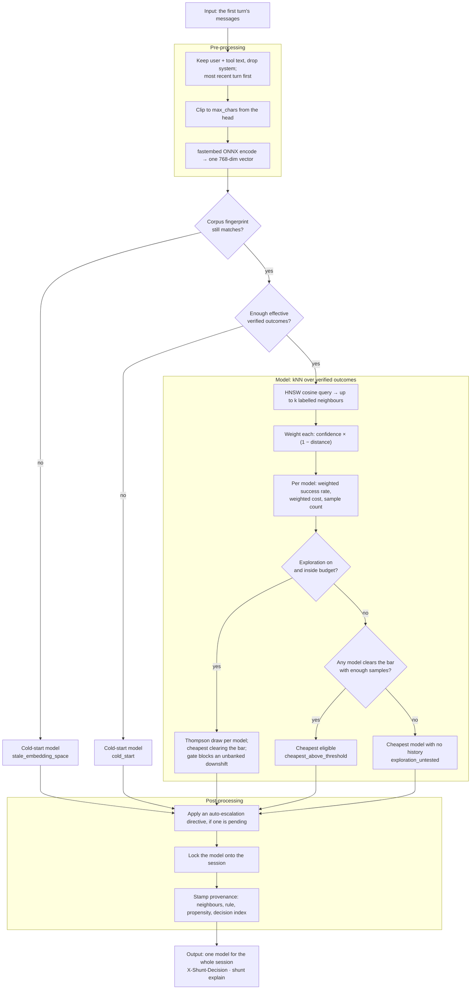

## What it reads

Only the task-bearing text of the first turn, and only in one form: a vector.

- **Roles.** Content from `user` and `tool` messages. The `system` prompt is dropped
  on purpose — a coding agent's system prompt is many times longer than the clip
  window, and leaving it in meant every session embedded to nearly the same vector.
  A body with no `user` or `tool` message falls back to the flat wire-order text
  rather than embedding an empty string.
- **Order.** Most recent turn first. The clip below cuts from the head, so wire order
  would have thrown the task away and kept the preamble.
- **Clip.** The text is truncated to `max_chars` (packaged default 4000) before
  encoding. Attention is quadratic in length, so an unbounded prompt is an unbounded
  allocation; the cap is what keeps a long agent prompt from taking the router down.
  The full prompt still goes upstream untouched — the clip affects the routing signal
  only.
- **Encoder.** fastembed, CPU-only, running the model named in
  [`embedding.yaml`](configuration.md#choose-the-embedding-model-and-stay-swap-safe).
  The shipped default is `jina-code` (768 dimensions); `arctic` is the other bundled
  option.
- **Fingerprint.** The active model, its dimension, and `max_chars` form a corpus
  fingerprint. Change any of them and the stored vectors live in a different space,
  so their distances mean nothing. Shunt notices, refuses to consult neighbours at
  all, and routes as if cold under the reason `stale_embedding_space` until you run
  `shunt reindex`. It does not quietly compare across spaces.

## How it decides

### Cold start comes first

Until there are enough verified outcomes, kNN has nothing to search, so the router
routes to a fixed cheap model — `qwen3.7-plus`, falling back through
`deepseek-v4-flash` and `zai-glm-5.2`, then any healthy model in the pool, if the
primary is unhealthy.

Cold start ends on **effective** sample size, not row count. Each outcome's weight
folds in its verification confidence, and the gate uses the Kish effective size
`nₑ = (Σw)² / Σw²` rather than counting rows. Two thresholds end it: enough
Tier-2 (verified) outcomes, or enough labelled outcomes of any tier. A store full of
low-confidence labels therefore stays in cold start longer than a raw count would
suggest, which is the intended behaviour — the router waits for evidence it can
trust, not volume.

Cold-start sessions are still embedded and still recorded. That is the point of
them: they are how the corpus gets built.

### The neighbourhood

Once warm, the embedding goes to an HNSW index (hnswlib, cosine space) which returns
the *k* nearest embedded sessions (`policy.k`, default 20). Sessions without a
recorded outcome are dropped, so a query can legitimately come back with fewer than
*k* neighbours — sometimes with none.

Each surviving neighbour carries the model that ran it, its verified pass/fail, its
real cost, the verification confidence of its label, and its distance. Each gets a
weight:

```
weight = verification_confidence × max(0, 1 − distance)
```

so a far neighbour or a weakly-verified one counts for less, and a neighbour beyond
distance 1 counts for nothing. There is no separate calibration model; this product
is the whole of it.

Neighbours are then grouped by model, and each group yields a weighted success rate
and a weighted cost. A neighbour whose real cost is unknown surfaces as infinite
cost, which is deliberate: unknown must never sort as cheapest.

### The selection rule

A model is **eligible** when its weighted success rate is at least
`success_rate_threshold` (shipped 0.6) *and* its group holds at least `min_samples`
neighbours (shipped 3). Among eligible models, the cheapest wins —
`cheapest_above_threshold`. That single line is the product thesis: hold a quality
bar, minimise cost under it.

When nothing is eligible, the rule walks the price-ranked pool from cheapest upward
and returns the first model that has **no history in this neighbourhood** —
`exploration_untested`. Read that carefully, because it is the rule's most
consequential branch: on a thin or empty neighbourhood it returns the *cheapest*
model, so an under-informed router behaves like `always_cheap` while reporting a
reason that sounds like a considered choice. Only the debug log distinguishes the
two. If every model in the pool has already been tried and none qualified, the
strongest is returned as `safe_fallback`.

### Exploration

Exploration ships **on**. When it is enabled and the cumulative exploration budget
has room, a cost-aware Thompson layer runs *before* the selection rule.

Each model gets a Beta posterior built from the weighted neighbourhood counts on top
of a prior. The prior is empirical-Bayes: seeded from that model's global offline
success rate, with its pseudo-count strength capped (`prior_strength_cap`) so a long
global history regularises a sparse local neighbourhood instead of swamping it. One
rate is drawn per model; the cheapest draw clearing the same threshold wins, or the
highest draw if none clears it.

Two rails sit on top. A **conservative gate** compares the sampled pick against the
deterministic greedy pick and blocks an exploratory *downshift* to a cheaper model
unless earlier successes have banked enough slack — otherwise the choice reverts to
greedy as `conservative_fallback`. An **exploration budget** caps cumulative
exploratory spend as a fraction of what exploiting would have cost. Every decision
feeds the budget's denominator, exploit choices included.

The propensity of the realised choice is estimated by Monte Carlo and logged, so the
policy can be evaluated off-policy later. That resampling snapshots and restores the
RNG state, so turning the logging knob up cannot change which model your next request
gets.

## What happens to the decision

- **It is locked to the session.** The chosen model is written onto the session and
  reused for every later turn. The router is never consulted again for that session.
  This is the cache-safety spine: no mid-conversation model switch, so no silent
  full-price re-read of a cached context.
- **A pending escalation may override it.** If auto-escalation is enabled and a
  directive is due, it is applied here, at the boundary — raising the reasoning arm
  on the same model, or stepping a rank. See [escalation](escalation.md).
- **Provenance is stamped.** The neighbours consulted, the rule that fired, the
  propensity, the per-model scores, and the decision index all land on the session
  row. `shunt explain <session_id>` reads them back, and the `X-Shunt-Decision`
  response header names the model and reason.
- **The outcome comes back later.** At session close the verifier records a verified
  outcome; only sessions carrying one join the index. Learning is batch: the index is
  rebuilt every `refit.every_n_outcomes` captures, so a single new outcome does not
  move routing until the next re-fit or restart.

### The reason tokens

Every decision names its rule. These are the values you will see in the header and
in `shunt explain`:

| Reason | What happened |
|---|---|
| `cold_start` | Not enough effective verified outcomes yet — fixed cheap model |
| `stale_embedding_space` | The corpus was embedded by a different embedder; neighbours refused until `shunt reindex` |
| `cheapest_above_threshold` | A model cleared the success bar with enough samples, and was cheapest |
| `exploration_untested` | Nothing cleared the bar; the cheapest model with no local history was picked |
| `safe_fallback` | Nothing cleared the bar and every model had been tried — strongest model |
| `exploration` | Thompson sampling diverged from the greedy pick |
| `exploration_exploit` | Thompson sampling agreed with the greedy pick |
| `conservative_fallback` | An exploratory downshift was blocked for lack of banked slack |
| `auto_escalation` | A pending escalation directive overrode the base pick |
| `escalation_floor` | This task had already escalated to a higher rank, so the base pick was lifted back to it |
| `always_cheap` / `always_frontier` | A fixed strategy is configured; no embedding, no query |

## Why it is built this way

- **Nonparametric, so it works from the first labelled session.** There is no model
  to train and no minimum dataset before the mechanism functions at all — it degrades
  to cold start instead of failing.
- **Inspectable.** Every decision can be traced to the specific past sessions that
  produced it. A learned scalar cannot be argued with; a neighbour list can.
- **Cheapest-above-a-bar states the goal directly.** The alternative — optimising a
  reward that trades quality against cost — needs an exchange rate between them that
  nobody can defend. A threshold you set is honest about being your choice.
- **One decision per session, because the cache is per-session.** Routing per turn
  would break the provider's prompt cache and cost more than any routing gain.
- **Price order is the only ranking available at cold start.** Capability order needs
  measurement you do not have yet; list price is always known.

## Limitations

Read these before trusting a routing decision.

- **The core signal is unproven on coding work.** Ranking hard tasks from easy ones
  off a prompt embedding is the assumption the whole rule rests on, and on agentic
  coding it has not cleared our viability bar. See [Results](results.md). The proxy,
  the cache-safety guarantee, and the escalation path do not depend on it; the *kNN
  decision* does.
- **A thin neighbourhood is indistinguishable from a confident one.** The
  `exploration_untested` branch returns the cheapest model, and nothing in the
  response says the neighbourhood was empty. Check `shunt explain` before concluding
  the router "decided" anything.
- **Rank is price, not capability.** The pool is ordered by list price, which is not
  a capability ordering — stepping up a rank can lower your pass rate. The measured
  per-model table is in [Results](results.md).
- **It sees a clipped, system-free slice of the task.** A task described mainly in a
  system prompt is invisible to it, and a long task is truncated. The truncation rate
  is carried on each neighbour but the rule does not otherwise compensate for it.
- **It cannot react to a task that changes mid-session.** The model is locked. If
  your session drifts from a rename into a redesign, routing does not follow — that
  is what escalation is for, and escalation only acts at the next boundary.
- **Learning is batch and global.** One corpus, one index, no per-project or
  per-user models. A new outcome changes nothing until the next re-fit.
- **Exploration costs money and quality while it runs.** It is on by default so the
  router can gather evidence; if you want decisions on current beliefs only, turn it
  off.
- **SWE tasks only.** Both the corpus and the verified label assume a repository with
  a test suite. Nothing stops you routing other work through Shunt, but the decision
  has no evidence behind it and no verifier to grade it afterwards.

### Pros and cons at a glance

**Why use this model.** It is the cheapest thing that could plausibly work: no
training step, no embedding server, no learned weights — a lookup plus a threshold,
and it degrades gracefully to a fixed cheap model while the evidence is thin. On the
routine ~80% of tasks a cheap model handles anyway, it spends almost nothing on
prediction. The [rationale](#why-it-is-built-this-way) is above and the
[limits](#limitations) below; the table is the summary.

| Pros | Cons |
|---|---|
| Works from the first labelled session — degrades to cold start, never fails | The core signal (embedding → difficulty) is unproven on coding work |
| Every decision traces to concrete past sessions | A thin neighbourhood looks like a confident one — check `shunt explain` |
| Threshold states *your* cost/quality trade directly | Rank is price, not capability — stepping up can lower pass rate |
| Cache-safe by construction: one decision per session | Sees a clipped, system-prompt-free slice of the task |
| CPU-only embeddings; runs on any laptop | Cannot react to a task that changes mid-session |
| Batch, global, inspectable learning | Exploration costs money and quality while it runs |
| | SWE tasks only today |

## Configure it

Strategy, `k`, the success threshold, `min_samples`, exploration, the live model
list, the embedding model, and the re-fit cadence are all in
[Configuration → Tune the router](configuration.md#tune-the-router). The shipped
values are in `src/shunt/config/router.yaml` and `src/shunt/config/embedding.yaml`.

## Figures

Each figure below is the PNG committed under `docs/assets/figures/routing/`. The image carries its claim, its sample size and — where
a reader could be actively misled — one red line. The rest is here.

### Most reasoning knobs were never turned — the flat contrasts are unmeasured {#fig-arm-manipulation}

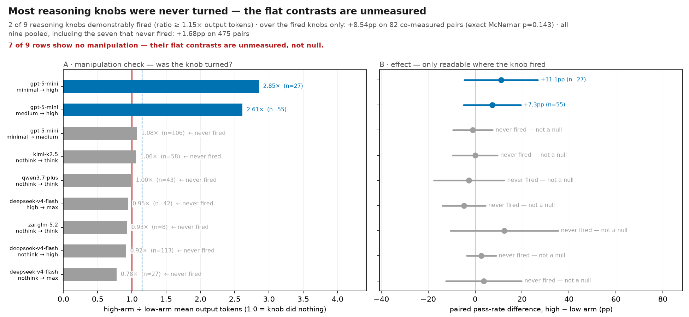

*2 of 9 reasoning knobs demonstrably fired (ratio ≥ 1.15× output tokens) · over the fired knobs only: +8.54pp on 82 co-measured pairs (exact McNemar p=0.143) · all nine pooled, including the seven that never fired: +1.68pp on 475 pairs*

> **Caveat.** 7 of 9 rows show no manipulation — their flat contrasts are unmeasured, not null.

**Reading.** Left: the manipulation check. For each (model, low arm, high arm) pair, the ratio of mean output tokens on the tasks where BOTH arms ran. A knob that was turned moves this well above 1; the red line is where nothing changed. Right: the paired pass-rate difference for the same pairs, with a 95% paired interval. A row whose knob did not fire is greyed and carries the label — its flat difference measures nothing.

**What to look for.** Do not read the right panel for a row that is grey on the left. The only row that supports any claim about reasoning effort is the one whose knob demonstrably moved.

**Terms.** *manipulation check* — evidence the treatment was applied at all, measured before any outcome. Output tokens are what a reasoning-effort setting mechanically controls. *paired contrast* — computed only on tasks where BOTH arms ran and NEITHER was censored, so a resource-limit stop cannot masquerade as a capability failure.

**Notes.** Arm coverage is sparse by design (p(arm|model) sampling), so a pair below the minimum count is greyed for sample size as well as for manipulation. gpt-5-mini minimal→high: output-token ratio 2.85x on n=27 pairs — FIRED; paired Δ +11.1pp [-4.6, +26.8], cost Δ \$0.0318. gpt-5-mini medium→high: output-token ratio 2.61x on n=55 pairs — FIRED; paired Δ +7.3pp [-4.9, +19.5], cost Δ \$0.0311. gpt-5-mini minimal→medium: output-token ratio 1.08x on n=106 pairs — never fired — not a null; paired Δ -0.9pp [-9.4, +7.5], cost Δ \$0.0023. kimi-k2.5 nothink→think: output-token ratio 1.06x on n=58 pairs — never fired — not a null; paired Δ +0.0pp [-9.6, +9.6], cost Δ \$0.0015. qwen3.7-plus nothink→think: output-token ratio 1.00x on n=43 pairs — never fired — not a null; paired Δ -2.6pp [-17.6, +12.5], cost Δ \$-0.0029. deepseek-v4-flash high→max: output-token ratio 0.95x on n=42 pairs — never fired — not a null; paired Δ -4.8pp [-14.0, +4.5], cost Δ \$0.0000. zai-glm-5.2 nothink→think: output-token ratio 0.93x on n=8 pairs — never fired — not a null; paired Δ +12.5pp [-10.4, +35.4], cost Δ \$0.0037. deepseek-v4-flash nothink→high: output-token ratio 0.92x on n=113 pairs — never fired — not a null; paired Δ +2.7pp [-3.6, +8.9], cost Δ \$-0.0012. deepseek-v4-flash nothink→max: output-token ratio 0.78x on n=27 pairs — never fired — not a null; paired Δ +3.7pp [-12.5, +19.9], cost Δ \$-0.0034.

**Limits.** The ratio is over co-measured tasks only. A knob could fire on tasks neither arm shares, and this check would not see it.

<!-- n: arm_pairs=9, fired=2 -->

### The modelled cache saving is now the same size as the whole list-to-bill discount {#fig-cache-economics}

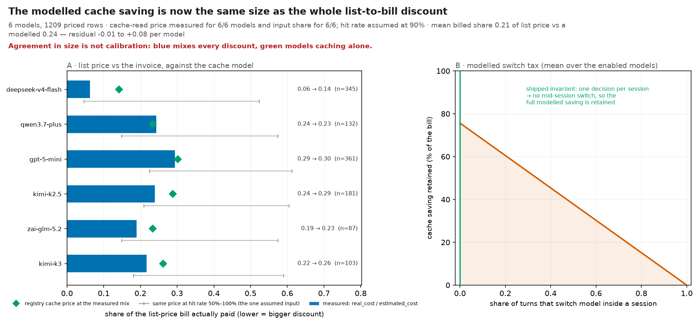

*6 models, 1209 priced rows · cache-read price measured for 6/6 models and input share for 6/6; hit rate assumed at 90% · mean billed share 0.21 of list price vs a modelled 0.24 — residual -0.01 to +0.08 per model*

> **Caveat.** Agreement in size is not calibration: blue mixes every discount, green models caching alone.

**Reading.** Left: per model, the share of the list-price bill that was actually charged. The blue bar is MEASURED — every row's real_cost over its estimated_cost in results.csv, which is the whole gap between list price and the invoice. The green diamond is the share the registry's cache-read price predicts would survive, priced at the corpus's measured input/output token mix; the faint grey rule beneath each bar sweeps the one input nothing here measures, the cache hit rate, from 100% (left cap) to 50% (right cap). The right-hand column repeats each row as billed → modelled with its row count. Lower is cheaper. Right: the switch tax — how much of the MODELLED cache saving survives as the router changes model inside one session.

**What to look for.** Read the DISTANCE between the blue bar and the green diamond. It is now small on every model, so caching alone is a large enough effect to account for essentially the whole discount. Read that as a SIZE agreement, not as a validation: the bar mixes every reason the invoice differs from list price, and two quantities landing on the same number cannot separate them. Then read the right panel at the shipped operating point — one decision per session.

**Terms.** *billed share* — sum(real_cost) / sum(estimated_cost) over every measured row for that model. 1.0 means the invoice matched list price. It mixes EVERY reason the two differ — caching, negotiated rates, provider-side discounts — not caching alone. *registry prediction* — 1 - input_share x hit_rate x (1 - cache_read_price / input_price), the per-model cache economics benchmark.runner.kill_gate now costs with. *input share* — the share of a model's spend that is INPUT tokens, from the measured in_tok / out_tok mix in results.csv priced at registry rates. This corpus is input-dominated, which is why the modelled saving is large. *switch tax* — naive cost minus cache-aware cost. A model switch forfeits the cached prefix, so the next turn is billed at full input price.

**Notes.** The cache-read prices come from the shipped registry (src/shunt/config/models.yaml), so a provider price change moves this figure rather than silently invalidating it. deepseek-v4-flash: billed 0.063 (n=345), registry predicts 0.141 [discount measured, input share 0.974 measured], hit-rate band 0.046–0.523. qwen3.7-plus: billed 0.243 (n=132), registry predicts 0.234 [discount measured, input share 0.946 measured], hit-rate band 0.149–0.574. gpt-5-mini: billed 0.294 (n=361), registry predicts 0.302 [discount measured, input share 0.862 measured], hit-rate band 0.224–0.612. kimi-k2.5: billed 0.239 (n=181), registry predicts 0.288 [discount measured, input share 0.949 measured], hit-rate band 0.209–0.604. zai-glm-5.2: billed 0.189 (n=87), registry predicts 0.234 [discount measured, input share 0.946 measured], hit-rate band 0.149–0.574. kimi-k3: billed 0.217 (n=103), registry predicts 0.262 [discount measured, input share 0.911 measured], hit-rate band 0.180–0.590.

**Limits.** The hit rate is still assumed: no run in this corpus records a per-turn cache-hit ratio, so only the DISCOUNT and the INPUT SHARE are measured. The grey whisker is the whole range that assumption can move the green marker over. The blue bar and the markers are different quantities drawn on one axis deliberately. They now land close together, and that is NOT a calibration result: the bar also contains negotiated rates and provider-side discounts, so agreement in magnitude cannot attribute the discount to caching. The right panel is a MODEL of the switch tax, not a measurement — no live session in this corpus switched model mid-conversation, because the shipped router cannot.

<!-- n: models=6, priced_rows=1209 -->

### The split count is a LOWER bound on contestable tasks — unsampled cells can only add {#fig-complementarity}

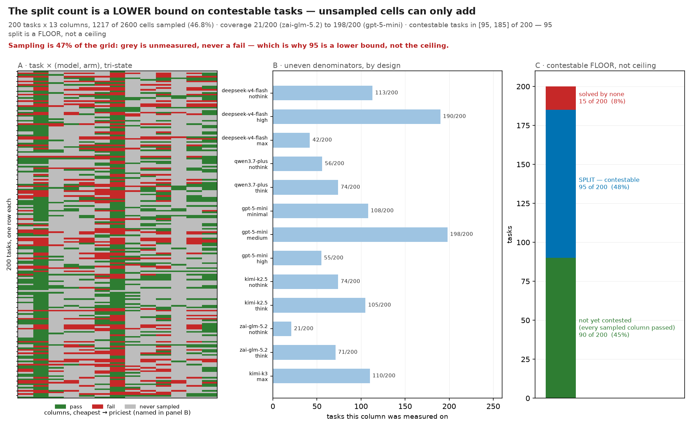

*200 tasks x 13 columns, 1217 of 2600 cells sampled (46.8%) · coverage 21/200 (zai-glm-5.2) to 198/200 (gpt-5-mini) · contestable tasks in [95, 185] of 200 — 95 split is a FLOOR, not a ceiling*

> **Caveat.** Sampling is 47% of the grid: grey is unmeasured, never a fail — which is why 95 is a lower bound, not the ceiling.

**Reading.** Left: every task (row) against every measured (model, arm) column. Green is a pass, red a fail, grey never sampled — grey is NOT a failure. Middle: how many tasks each column was actually run on, so the uneven denominators are visible. Right: the task census. A split task — at least one pass and at least one fail — can already be won or lost by a routing decision. A task solved by every SAMPLED column has not been shown uncontestable, only untested: each one still has unsampled columns, and one failing column is enough to move it into the split slice.

**What to look for.** Read the right panel as a FLOOR, not a ceiling. The split count is what is contestable on the evidence in hand; the solved-by-all slice sits above it as tasks no column has yet been seen to fail, so the true count lies somewhere between the split count and split-plus-solved-by-all. Then read the middle panel before comparing any two columns anywhere else in this set — two columns are only fairly compared on the rows where both are non-grey, which is a different denominator from the pooled pass rates.

**Terms.** *split task* — at least one column passed and at least one failed. *sampling density* — sampled cells over total cells. The matrix is sparse BY DESIGN — p(arm|model) sampling — so a low density is a budget decision, not missing data. *contestable floor* — the measured split count. It can only rise as unsampled cells are filled: a split task stays split, while a solved-by-all task joins it as soon as any unsampled column fails.

**Notes.** Columns are ordered by model price, then by within-model reasoning rank, so the grid reads left-to-right as cheap-to-expensive. The upper end of the interval counts the solved-by-all slice only. Solved-by-none rows are under-sampled too, but they could join only by an unsampled column PASSING, which nothing measured here supports, and a task no model solves is not value a router can capture. solved by all: 90; split: 95; solved by none: 15. all 90 of 90 solved-by-all tasks still have unsampled columns (3 to 12 of 13, median 9) — any one of them becomes contestable if an unsampled column fails. the 15 solved-by-none tasks are under-sampled too (3 to 8 columns), but could join only by an unsampled column PASSING, so they are excluded from the interval.

**Limits.** The grid is drawn from the RAW measured cache, not the imputed matrix, so a grey cell is genuinely unmeasured rather than filled. Every other figure in this set that quotes a pass rate scores the imputed matrix instead. At this sampling density 'solved by every sampled column' is NOT 'solved by every column', so the contestable count is an interval rather than a number. Only filling the grey cells pins it down.

<!-- n: columns=13, contestable_ceiling=185, contestable_floor=95, sampled_cells=1217, split_tasks=95, tasks=200 -->

### The live frontier at cache-aware cost — cost is the uncertain axis {#fig-cost-quality-frontier}

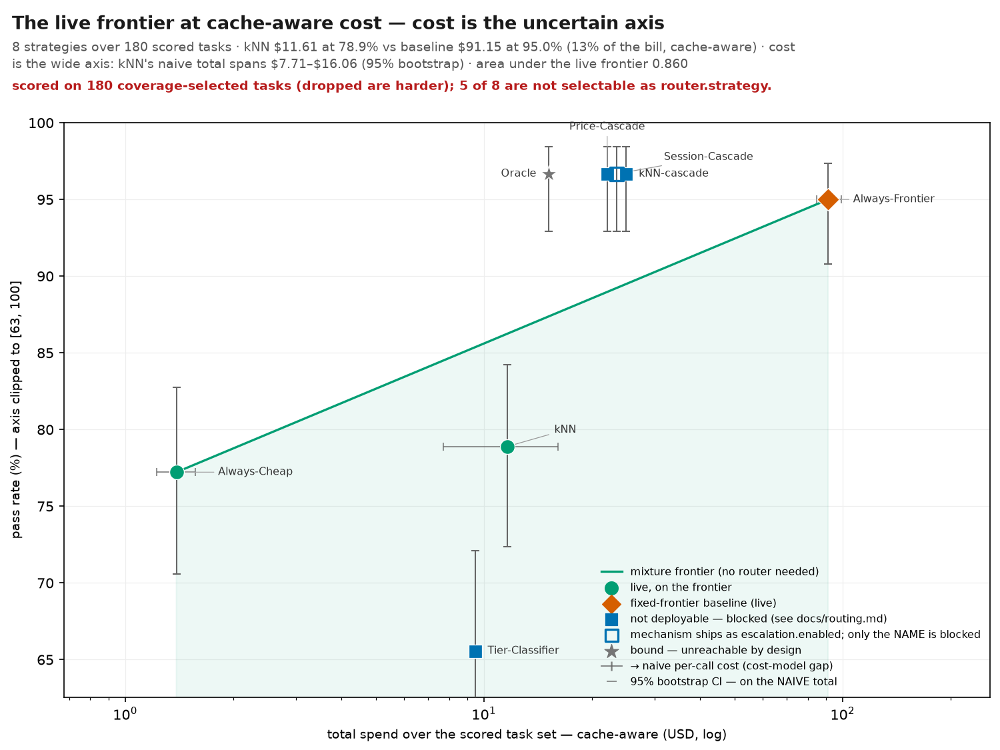

*8 strategies over 180 scored tasks · kNN \$11.61 at 78.9% vs baseline \$91.15 at 95.0% (13% of the bill, cache-aware) · cost is the wide axis: kNN's naive total spans \$7.71–\$16.06 (95% bootstrap) · area under the live frontier 0.860*

> **Caveat.** scored on 180 coverage-selected tasks (dropped are harder); 5 of 8 are not selectable as router.strategy.

**Reading.** x is total dollars spent over the scored task set, on a log axis because the strategies span two decades. The marker sits at CACHE-AWARE cost — what a deployment is billed once a repeat of the same model banks its cached prefix — and the thin line running from it ends at an open tick at the NAIVE per-call sum, so the gap between the two cost models is a drawn distance. The capped bar at that tick is the 95% bootstrap interval on the naive total; it is drawn on the naive statistic because that is the one it was computed for. Both cost marks appear on LIVE strategies only. y is pass rate in percent with a 95% Wilson interval. Marker SHAPE carries what a strategy is: circles and the orange diamond can run in production today, blue squares are blocked — no router.strategy value names them — an X is a control that must never ship, and a star is a bound that is unreachable by design. Marker FILL splits the blue squares, and it is the distinction most likely to be misread: a SOLID square is blocked and nothing equivalent runs today, while a HOLLOW one marks a mechanism that already ships and is on by default under another config surface, where the only thing blocked is the strategy NAME. Only the live points enter the Pareto test and the shaded mixture region — a frontier anchored on a strategy the router rejects at boot describes an operating point nobody can buy.

**What to look for.** A router earns its existence only by sitting ABOVE the shaded mixture region — below or on it, the same cost-quality point is reachable by flipping a weighted coin between two fixed policies.

**Terms.** *live* — the router may be configured with this strategy today — the set is derived from the product's own LIVE_STRATEGIES, not restated here. *live Pareto* — no other LIVE strategy is both cheaper and at least as good, on CACHE-AWARE cost. Bounds, controls and blocked strategies are excluded — none of them is a setting an operator can choose. This is the same cost model strategy_summary.csv's Pareto column uses, so the plane and the table cannot disagree. *cache-aware cost* — a repeat of the same model on a consecutive attempt is billed at the provider's cache-read rate rather than at full input price. Cascades re-serve one model by construction, so this is exactly where the two cost models part company. *mixture region* — the upper convex hull of the LIVE points. Any point under it is reachable by probabilistically mixing two fixed policies. *blocked* — no router.strategy value names it. This says nothing about whether the MECHANISM runs: a solid square cannot be run today, a hollow one already runs in every default install under the config surface named in the legend. Both are excluded from the frontier, because the frontier ranks settings an operator can choose. Each row's blocker and path to live are in benchmark/routing/strategy_class.py.

**Notes.** The y axis is clipped to the data range, not to 0-100. The axis label says so; the alternative was a figure on which every strategy is the same flat line. The marker and the hull use the same cache-aware cost column strategy_summary.csv decides Pareto on, so the plane and the table cannot rank strategies differently. Oracle: \$15.18 cache-aware / \$15.18 naive, 96.67% (n=180, bound — unreachable by design). Price-Cascade: \$22.07 cache-aware / \$22.07 naive, 96.67% (n=180, blocked — no router.strategy names it). kNN-cascade: \$24.95 cache-aware / \$24.95 naive, 96.67% (n=180, blocked — no router.strategy names it). Session-Cascade: \$23.46 cache-aware / \$27.68 naive, 96.67% (n=180, blocked as a NAME only — the mechanism ships as escalation.enabled). Always-Frontier: \$91.15 cache-aware / \$91.15 naive, 95.00% (n=180, live, on the frontier). kNN: \$11.61 cache-aware / \$11.61 naive, 78.89% (n=180, live, on the frontier). Always-Cheap: \$1.39 cache-aware / \$1.39 naive, 77.22% (n=180, live, on the frontier). Tier-Classifier: \$9.46 cache-aware / \$9.46 naive, 65.56% (n=180, blocked — no router.strategy names it). frontier vs strategy_summary.csv Pareto: drawn-only Always-Frontier (both on cache-aware cost; a difference here is the live-only filter). selection: scored on 180/200 tasks selected by coverage; deepseek-v4-flash passes 75.9% here vs 10.0% on the 20 dropped (+65.9pp) — difficulty-biased, not a random sample. equal-coverage via monotone imputation — 47% of frontier cells imputed (every strategy scored on n=180). Monotonicity holds on 92% of 190 multi-observed task(s) (measured, not assumed). NEARLY every imputed cell is filled pass=True at a median measured price (the monotone ladder has a fail branch, and 1 of 398 filled cells took it), for the router as well as for the baseline — see evidence_basis.png for how much of each strategy's number that is, and kill_gate.png's measured-only row for what survives when the projection is removed.

**Limits.** A non-live point's number is still a real measurement — it is the CONCLUSION that is limited: no router.strategy setting reproduces it, so it may not anchor the frontier or a headline. It does NOT follow that the underlying capability is unavailable — a blocked row may measure a mechanism that ships in a different layer — and the per-strategy blocker in benchmark/routing/strategy_class.py says which case it is. The cache-aware x position rests on an ASSUMED cache hit rate; only the per-model discount and input share are measured — see cache_economics.png for the range that assumption spans. The horizontal interval belongs to the NAIVE total and is not transplanted onto the cache-aware marker. No bootstrap interval on cache-aware cost is published, so the sampling uncertainty of the plotted x is bracketed by the naive one, not measured. Pass rates are scored on the coverage-completed matrix, whose imputed cells are all pass=True — see evidence_basis.png for how much of each strategy's number that is. The scored set is chosen by coverage, not at random: the collector runs the expensive tier only on the discriminating slice, so both axes describe a difficulty-biased sample. The subtitle carries the measured gap.

<!-- n: strategies=8, tasks=180 -->

### Real problem text carries no routable signal; a three-level human tag does {#fig-embedding-signal}


*180 tasks, 200 permutations per null, k=20 · embedding R² -0.063 vs control +0.083, null 95% [-0.120, +0.008] · task-identity ceiling η²=0.560*

> **Caveat.** Falsified, not untested: the control clears the null on this same pipeline and n.

**Reading.** Left: routing pass-rate against k. The solid blue line holds each task OUT of its own neighbour index (what a deployed router can do), the dashed orange line lets the task see itself (pure memorisation), the green line is the best single always-one-model policy that needs no router at all, and the grey band is the same rule on outcome-shuffled data. Middle: leave-one-out R-squared predicting each task's solve rate, for the embedded problem statement and for the human difficulty tag, each against its own shuffled null, with the task-identity variance ceiling marked. Right: same-repo minus cross-repo routing advantage, at both repo-size cutoffs.

**What to look for.** Read the middle panel first and read it as a pair. The control must clear its null or the instrument proves nothing; it does. The embedding must then clear its own null to support embed-and-kNN routing; it does not. That pairing is what turns a null result into a falsification rather than a coverage gap.

**Terms.** *leave-one-task-out* — the task being routed is removed from the neighbour index. *memorisation reference* — the same rule with the task left IN its own index. *shuffled-outcome null* — outcome rows reassigned to tasks at random, preserving each model's own pass rate and breaking only the text->outcome link. *variance ceiling* — eta-squared of task identity over the (task, model) pass matrix: the most any per-task predictor could explain. *positive control* — the same pipeline with the task's human difficulty label as the similarity — a control on the MEASUREMENT, not a routing proposal.

**Notes.** The corpus embeds the real SWE-bench problem statement (median 1185 chars). The 106-char identifier label the earlier figures encoded is kept as a contrast row so the change in the input is visible, not asserted. ADMISSIBLE: positive control +1.0000 clears chance band (>+0.6001) AND destroyed-signal null +0.5188 is at chance (+0.5000±0.1001) — the instrument recovers a real signal and does not manufacture one from noise. NULL RESULT: the leave-one-out routing pass rate at k=2 is 0.7944, INSIDE the shuffled-outcome null band [0.7722, 0.8389] (null mean 0.8055, z=-0.65, 200 permutations). NULL RESULT: the embedded
problem statement leave-one-out R² is -0.0630, INSIDE the shuffled-outcome null band [-0.1198, 0.0076] (null mean -0.0604, z=-0.08, 200 permutations). the human difficulty tag
(positive control) leave-one-out R² is 0.0832, above the shuffled-outcome null band [-0.1129, 0.0021] (z=+4.57, 200 permutations). the diagonal advantage over 10 repos with ≥8 tasks is 0.0234, above the shuffled-outcome null band [-0.0113, 0.0217] (z=+2.53, 200 permutations). NULL RESULT: the diagonal advantage over 8 repos with ≥16 tasks is 0.0000, INSIDE the shuffled-outcome null band [-0.0122, 0.0106] (null mean -0.0008, z=+0.17, 200 permutations).
problem statement leave-one-out R² is -0.0525, INSIDE the shuffled-outcome null band [-0.1153, -0.0009] (null mean -0.0571, z=+0.15, 200 permutations). the human difficulty tag
(positive control) leave-one-out R² is 0.0758, above the shuffled-outcome null band [-0.1313, 0.0056] (z=+4.02, 200 permutations). the diagonal advantage over 10 repos with ≥8 tasks is 0.0330, above the shuffled-outcome null band [-0.0125, 0.0207] (z=+4.63, 200 permutations). NULL RESULT: the diagonal advantage over 8 repos with ≥16 tasks is 0.0000, INSIDE the shuffled-outcome null band [-0.0111, 0.0081] (null mean -0.0008, z=+0.17, 200 permutations).

**Limits.** Pass labels come from the coverage-completed matrix, in which every imputed cell is filled pass=True, so all series including the null sit above what measurement alone supports. The COMPARISON between them is the readable part, not the level. One workload (SWE-bench-style tasks over a dozen repositories). Transfer to a different task distribution is not evidence this figure can give. 403/1080 scored cells (37.3%) are monotone-IMPUTED, not measured, and 401/403 of them are filled pass=True — imputation here is near-exclusively pass-filling (the ladder's fail branch fires rarely), so it almost never adds a failure. Every rate on this figure is biased UPWARD by that fill.

<!-- n: permutations=200, tasks=180 -->

### A third of the evidence is filled in, and every filled cell is a pass {#fig-evidence-basis}

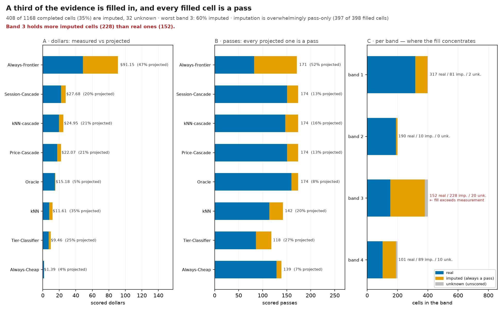

*408 of 1168 completed cells (35%) are imputed, 32 unknown · worst band 3: 60% imputed · imputation is overwhelmingly pass-only (397 of 398 filled cells)*

> **Caveat.** Band 3 holds more imputed cells (228) than real ones (152).

**Reading.** Left: per strategy, the share of scored DOLLARS billed to measured cells against projected ones. Middle: the same split on PASSES — the channel that decides every quality claim in this set. Right: per capability band, real against imputed against still-unknown cells; the bands are ordered weakest to strongest.

**What to look for.** Look for a strategy whose orange share is large on the PASS panel: its pass rate is that far from a measurement. Then look at the right panel for a band where orange exceeds blue — every comparison that crosses that band rests more on the imputer than on the benchmark.

**Terms.** *imputed cell* — filled by the monotone ladder: a model at least as strong as one that passed is credited with a pass. It can only ever ADD a pass, never a failure. *capability band* — models grouped by derived capability rank, weakest band first. A band with more imputed than real cells is carried by the imputer. *unknown* — a cell neither measured nor safely fillable — excluded from scoring.

**Notes.** The dollar split is PATH-AWARE: a cascade that probed a projected cell on its way to a measured pick counts as projected, so the measured bar is measured end to end. Always-Cheap: \$1.34 measured + \$0.05 projected; 129 measured passes + 10 projected. Always-Frontier: \$48.73 measured + \$42.42 projected; 82 measured passes + 89 projected. Oracle: \$14.47 measured + \$0.71 projected; 160 measured passes + 14 projected. Price-Cascade: \$17.37 measured + \$4.71 projected; 151 measured passes + 23 projected. Session-Cascade: \$22.18 measured + \$5.50 projected; 151 measured passes + 23 projected. Tier-Classifier: \$7.14 measured + \$2.32 projected; 86 measured passes + 32 projected. kNN: \$7.57 measured + \$4.04 projected; 114 measured passes + 28 projected. kNN-cascade: \$19.59 measured + \$5.36 projected; 147 measured passes + 27 projected. band 1: 317 real / 81 imputed / 2 unknown. band 2: 190 real / 10 imputed / 0 unknown. band 3: 152 real / 228 imputed / 20 unknown. band 4: 101 real / 89 imputed / 10 unknown.

**Limits.** Imputation is directional. Nothing here corrects the bias; it states its size so a reader can discount the pass rates by it.

<!-- n: completed_cells=1168, imputed_cells=408, unknown=32 -->

### Exploration costs more, buys no pass rate, and its learning benefit is unmeasurable {#fig-exploration-cost}

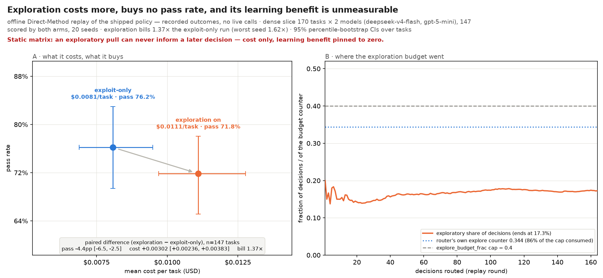

*offline Direct-Method replay of the shipped policy — recorded outcomes, no live calls · dense slice 170 tasks × 2 models (deepseek-v4-flash, gpt-5-mini), 147 scored by both arms, 20 seeds · exploration bills 1.37× the exploit-only run (worst seed 1.62×) · 95% percentile-bootstrap CIs over tasks*

> **Caveat.** Static matrix: an exploratory pull can never inform a later decision — cost only, learning benefit pinned to zero.

**Reading.** A: the cost/quality plane. Each arm is one point — mean cost per task on x, pass rate on y — with 95% bootstrap intervals on both axes; the arrow runs from the exploit-only arm to the exploring one, and the box states the PAIRED difference, which is what this slice has the power to resolve. B: where the budget went. The orange curve is the running share of decisions that were exploratory as the replay proceeds, the dotted line is the router's own confidence-weighted explore counter at the end of the run, and the dashed line is the configured cap it is measured against.

**What to look for.** Read the boxed paired difference in A, not the two overlapping marginal intervals: look for the cost delta and whether the pass delta clears zero. Then read B for whether the policy is spending its budget at all — a counter far under its cap means the measured overhead is not the overhead of a saturated budget.

**Terms.** *exploration* — occasionally routing to a non-preferred model to learn its outcome. *exploit-only* — the same shipped policy with exploration switched off. *paired difference* — per-task gap between the arms, so shared task noise cancels. *explore_budget_frac* — cap on the router's own confidence-weighted explore counter — neighbourhood costs, not realized spend, so it is not comparable to the measured spend ratio.

**Notes.** The replay is EXACT, not simulated: on a fully dense sub-grid the recorded outcome is looked up and no request is sent. The realized spend ratio exceeding the cap is expected, not a bug — the cap counts the router's confidence-weighted neighbourhood costs, not realized spend. Unscorable cells are skipped and counted, never guessed. Intervals are percentile-bootstrap over tasks rather than Wilson: the exploring arm's per-task pass is a mean over stochastic seeds, not a Bernoulli count. Direct-Method replay on the fully-dense slice: 340 measured cells (full matrix 62.7% dense). Cells skipped as unscorable: 23 baseline, 1.9/seed exploration. Realized explore/exploit SPEND 0.620 (worst seed 0.928); the router's own counter reached 0.344 of its 0.4 cap.

**Limits.** The outcome matrix is static, so an exploratory pull can never improve a later decision: this measures exploration's COST with its learning benefit set to zero, the pessimistic half of the ledger — not a verdict on whether exploration pays. The dense slice is found greedily, not optimally, and comes from a single workload. How much of the corpus exploration left un-probed is NOT drawn: the replay report carries aggregate decisions, not the per-(task, model) probe record that question needs. The two marginal pass-rate CIs overlap ([69%, 83%] vs [65%, 78%]) — at 147 paired tasks only the paired difference separates the arms. NO FRONTIER ARM IN THIS SLICE: the dense sub-grid covers only deepseek-v4-flash, gpt-5-mini — the priciest model here is \$2.25/Mtok against \$18.00 across all enabled models (kimi-k3, zai-glm-5.2, kimi-k2.5, qwen3.7-plus are absent). The exploration overhead measured here is between CHEAP models and is a LOWER BOUND on the shipped policy's, where an exploratory pull can land on the frontier model. THE DROPPED BASELINE CELLS ARE NOT A RANDOM SAMPLE: all 23 unscorable exploit-only cells are qwen3.7-plus, a model outside the dense slice — so the exploit-only arm is systematically missing that model's tasks, not a random subset. The overhead is therefore reported PAIRED, over only the tasks both arms scored.

<!-- n: paired tasks=147, seeds=20, slice models=2, slice tasks=170 -->

### The shipped router misses the pre-registered 5pp bar on every evidence basis {#fig-kill-gate}


*paired Tango score at the pre-registered δ=5pp · n=180/90/20 · arms disagree on 35 of 180: MDE ±8.2pp there, ±5.9pp at 10% discordance*

> **Caveat.** 3 of 3 bases: the router is WORSE by more than the margin. The saving is not at equal quality.

**Reading.** Left: one row per evidence basis. The dot is the paired pass-rate difference (the shipped kNN router minus fixed-frontier) in percentage points, the whisker its 95% paired interval, and the dashed red line the pre-registered non-inferiority margin of -5pp. A row is green only when the Tango score test rejects H0 at that margin, red when the router is proven WORSE by more than the margin, grey when the data cannot tell. Right: the same tasks' total spend, baseline dot to router dot; a leftward arrow is a saving.

**What to look for.** Read both panels together, in that order. The left panel is the gate: a saving on the right is only admissible once the left one is green. It is not — the shipped router's quality deficit is several times the margin, and the whisker excludes it on every basis, so the spend reduction beside it is bought at a quality loss that was pre-registered as unacceptable rather than at equal quality.

**Terms.** *non-inferiority* — H0: router quality <= baseline - delta, tested by the Tango score statistic on the discordant pairs. Rejecting it is positive evidence of equivalence; an overlapping confidence interval is not. *evidence basis* — Which tasks enter. `completed` includes monotone-imputed cells; `measured` keeps only tasks where neither arm billed a projected cell; `gate sample` is the subset benchmark.runner.kill_gate itself scores at its default N. *MDE* — The smallest true difference the design detects at 80% power, one-sided. For a paired test it is driven by the DISCORDANT rate, not by n alone, so it is quoted both at the observed discordance and at a reference 10% discordance.

**Notes.** The margin is read from benchmark.yaml:collect.noninferiority_margin, so the bar on the canvas is the one that was pre-registered rather than one chosen after seeing the result. completed (imputed): Δ=-16.1pp [-22.1, -10.1], inferior, b=3 c=32, router \$11.61 vs baseline \$91.15, MDE ±8.2pp (±5.9pp at 10% discordance). measured only: Δ=-16.7pp [-26.0, -7.3], inferior, b=3 c=18, router \$6.91 vs baseline \$47.94, MDE ±12.7pp (±8.3pp at 10% discordance). gate sample (N=20): Δ=-20.0pp [-37.5, -2.5], inferior, b=0 c=4, router \$0.84 vs baseline \$9.08, MDE ±24.9pp (±17.6pp at 10% discordance). equal-coverage via monotone imputation — 47% of frontier cells imputed (every strategy scored on n=180). Monotonicity holds on 92% of 190 multi-observed task(s) (measured, not assumed). NEARLY every imputed cell is filled pass=True at a median measured price (the monotone ladder has a fail branch, and 1 of 398 filled cells took it), for the router as well as for the baseline — see evidence_basis.png for how much of each strategy's number that is, and kill_gate.png's measured-only row for what survives when the projection is removed.

**Limits.** The cost panel is naive per-task cost. The gate's real criterion is cache-aware cost, which is adjacency-dependent and therefore not bootstrappable — see cache_economics.png.

<!-- n: completed (imputed)=180, gate sample (N=20)=20, measured only=90 -->

### The router's one input does not predict outcomes; a 3-level human tag does {#fig-knn-calibration}

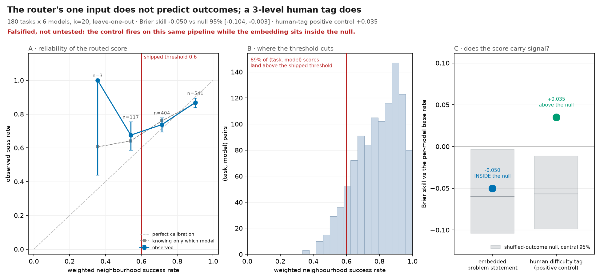

*180 tasks x 6 models, k=20, leave-one-out · Brier skill -0.050 vs null 95% [-0.104, -0.003] · human-tag positive control +0.035*

> **Caveat.** Falsified, not untested: the control fires on this same pipeline while the embedding sits inside the null.

**Reading.** Left: the reliability diagram. x is the weighted neighbourhood success rate the shipped rule computes for a (task, model) pair; y is how often that pair actually passed. A calibrated predictor tracks the dashed diagonal. Bars carry 95% Wilson intervals and the count in each bin. The red line is the shipped 0.6 eligibility threshold. Middle: how those scores are distributed, so the threshold's position is visible geometry rather than a claim. Right: Brier skill score against the marginal pass rate — above zero means the neighbourhood rate beats simply knowing how often each model passes — with the shuffled-outcome null band and the human-difficulty-tag positive control on the same axis.

**What to look for.** Look at the right panel first. The positive control must sit above the null band, or the instrument proves nothing either way. It does. Then look at where the observed bar sits: inside the band is a falsification, not a coverage gap.

**Terms.** *weighted success rate* — sum(similarity x outcome) / sum(similarity) over the k nearest OTHER tasks, the quantity SelectionRule thresholds at 0.6. *Brier skill score* — 1 - Brier(neighbour rate) / Brier(per-model base rate). Zero means the neighbourhood adds nothing over the model's marginal pass rate. *positive control* — The same pipeline run with the task's human difficulty label (easy/medium/hard) as the similarity, so a task's neighbours are the tasks a human called equally hard. It is a control on the MEASUREMENT, not a routing proposal.

**Notes.** Every rate is leave-one-out: a task is never its own neighbour, so a task cannot predict itself. ADMISSIBLE: positive control +1.0000 clears chance band (>+0.6001) AND destroyed-signal null +0.5188 is at chance (+0.5000±0.1001) — the instrument recovers a real signal and does not manufacture one from noise. bin [0.2,0.4): predicted 0.356, observed 1.000 (n=3). bin [0.4,0.6): predicted 0.541, observed 0.675 (n=117). bin [0.6,0.8): predicted 0.715, observed 0.738 (n=404). bin [0.8,1.0): predicted 0.901, observed 0.869 (n=541).

**Limits.** The neighbour weight is similarity only. The shipped rule also multiplies by each neighbour's verification confidence, which is 1.0 for every cell in this corpus, so the two coincide here and could diverge on live traffic. 403/1080 scored cells (37.3%) are monotone-IMPUTED, not measured, and 401/403 of them are filled pass=True — imputation here is near-exclusively pass-filling (the ladder's fail branch fires rarely), so it almost never adds a failure. Every rate on this figure is biased UPWARD by that fill.

<!-- n: k=20, models=6, tasks=180 -->

### Most of the headroom above the shipped router is blocked, not impossible {#fig-live-gap}

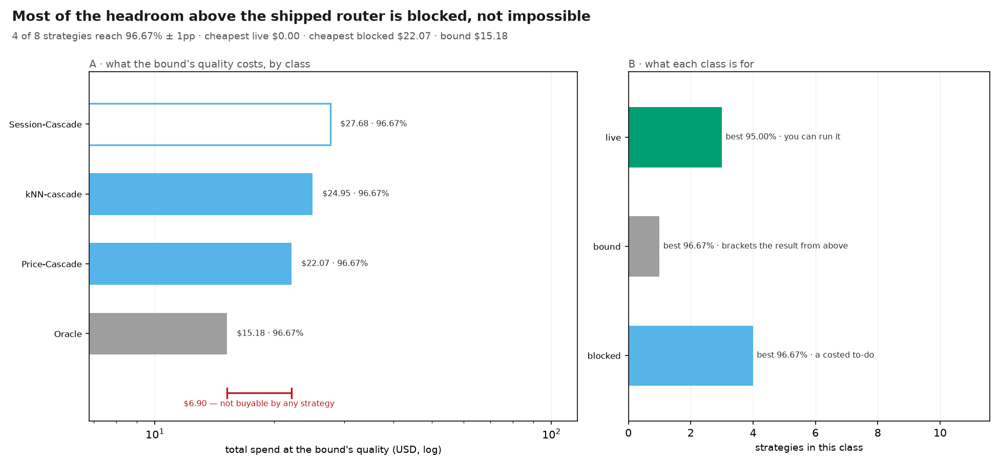

*4 of 8 strategies reach 96.67% ± 1pp · cheapest live \$0.00 · cheapest blocked \$22.07 · bound \$15.18*

**Reading.** Left: every strategy that reaches the bound's pass rate within one percentage point, as total spend on a log axis, cheapest at the bottom, coloured by class. A HOLLOW bar is a blocked row whose mechanism already ships and is on by default under another config surface — what is blocked there is the strategy NAME, not the capability, so do not read its share of the bracket as unbuilt work. The blue bracket is the span between the cheapest LIVE way to buy that quality and the cheapest BLOCKED one — engineering work, not physics. The red bracket is the span from there down to the bound, which no strategy of any class can cross. Right: how many strategies each class contributes and the best pass rate it reaches, with the reason that class is kept in the corpus.

**What to look for.** Read the two brackets against each other. A large blue span and a small red one means the shipped router's deficit is a backlog item; the reverse would mean the corpus has been squeezed and the remaining distance is a property of the models, not of the routing. Neither bracket is a result you can deploy — the whole point of separating the classes is that only the green bars are purchasable.

**Terms.** *bound* — a strategy that reads the query task's own realised outcome. Unreachable BY DESIGN; it exists to say how much is left, never to be shipped. *blocked* — no router.strategy value names it, with the reason and a path to live recorded in benchmark/routing/strategy_class.py. A costed to-do, not a result — but the to-do is sometimes only the NAME, not the mechanism. *control* — exists so the other numbers mean something — a strategy the measurement is compared against, which must never ship. *at the bound's quality* — pass rate within 1.0pp of the best bound's. A cost comparison across the band is therefore an equal-quality comparison to within that tolerance.

**Notes.** Costs are the same naive per-task totals every other routing figure uses, so the brackets are comparable with cost_quality_frontier.png. Oracle: \$15.18, 96.67% (bound). Price-Cascade: \$22.07, 96.67% (blocked). kNN-cascade: \$24.95, 96.67% (blocked). Session-Cascade: \$27.68, 96.67% (blocked).

**Limits.** The blue bracket is what the BLOCKED strategies measured here would buy IF their blockers were removed, and the blockers are not one kind of thing: some are structural (cache-safety, an offline-fit input) and the live mechanism replacing them may land nowhere near this span, while another is only that no router.strategy value names a mechanism that already ships in a different layer. Read each blocker in benchmark/routing/strategy_class.py before treating this span as unbuilt work. Only strategies inside the quality band appear on the left panel. A cheap strategy that gives up quality is not a smaller version of this gap — read the frontier figure for that trade. The bound reads realised outcomes on the SAME corpus it is measured on, so it is a ceiling for this task set, not a general one.

<!-- n: in_band=4, strategies=8 -->

### The saving is a cheaper tariff, not a better prediction {#fig-oracle-gap}

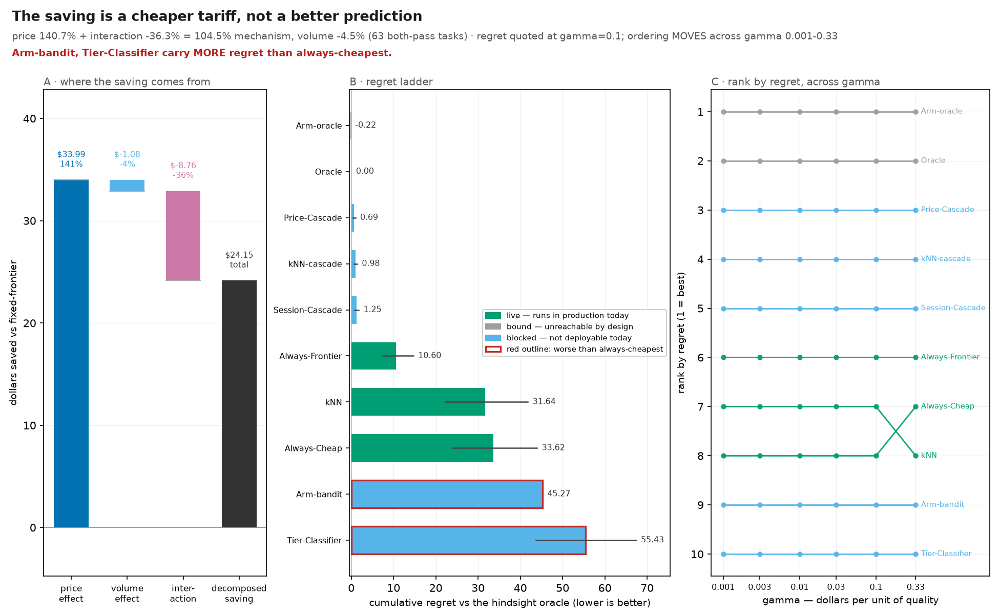

*price 140.7% + interaction -36.3% = 104.5% mechanism, volume -4.5% (63 both-pass tasks) · regret quoted at gamma=0.1; ordering MOVES across gamma 0.001-0.33*

> **Caveat.** Arm-bandit, Tier-Classifier carry MORE regret than always-cheapest.

**Reading.** Left: the cost saving of the router against fixed-frontier, split by Oaxaca-Blinder into a price effect (cheaper tokens), a volume effect (fewer tokens) and their interaction, over the tasks where BOTH arms passed. Middle: cumulative regret against the hindsight oracle, lower is better, with 95% bootstrap intervals where the summary carries them; bar colour is the strategy's class — green runs live today, blue is blocked, orange is a control that must never ship, grey is a bound no router can reach — and a red outline marks a bar a fixed always-cheapest policy already beats. Right: the same ranking recomputed across three orders of magnitude of the cost/quality exchange rate, coloured the same way.

**What to look for.** Read the left panel for what routing is actually doing — if price dominates, the value is in the price list, and a fixed cheap policy captures most of it without any prediction. Then read the right panel: a flat set of lines means the middle panel's ordering does not depend on the exchange rate nobody can defend.

**Terms.** *price effect* — the saving from billing the SAME token volume at a cheaper model's rate. *volume effect* — the saving from producing FEWER tokens at the same rate. *regret* — reward the hindsight oracle collected that this strategy did not; reward is 1 for a pass, 0 for a fail, minus gamma x cost in dollars. *arm oracle* — hindsight over the reasoning ARM as well as the model — the ceiling for reasoning-effort routing given the arms actually sampled.

**Notes.** The decomposition is computed only over tasks where both arms passed, so it is a cost comparison at genuinely equal quality on those tasks. Always-Cheap: regret 33.6212. Always-Frontier: regret 10.5973. Arm-bandit: regret 45.2745. Arm-oracle: regret -0.2205. Oracle: regret 0.0000. Price-Cascade: regret 0.6895. Session-Cascade: regret 1.2501. Tier-Classifier: regret 55.4281. kNN: regret 31.6433. kNN-cascade: regret 0.9772.

**Limits.** The bandit is an illustrative inline learner drawn for this figure only, not a shipped routing strategy. It shows that a naive learner loses here; it does not show that every learner would. The arm series exist only where more than one arm per model was sampled; the coverage is sparse by design.

<!-- n: both_pass_tasks=63, series=10 -->

### The shipped router's errors go both ways — it loses tasks, not just money {#fig-routing-decision-audit}

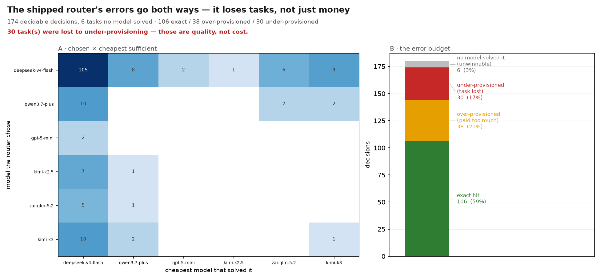

*174 decidable decisions, 6 tasks no model solved · 106 exact / 38 over-provisioned / 30 under-provisioned*

> **Caveat.** 30 task(s) were lost to under-provisioning — those are quality, not cost.

**Reading.** Left: rows are the model the router chose, columns the cheapest model that actually solved the task. The diagonal is an exact hit. BELOW it the router paid for a model it did not need; above it the router under-provisioned and the task was lost. Right: the same decisions as an error budget — exact, over-provisioned, under-provisioned, and the tasks no model solved, which no decision could have won.

**What to look for.** Read the two error columns against each other. Over-provisioning is the bill for guessing high and costs only money; under-provisioning costs a task that some dearer model would have solved, and no threshold recovers it after the fact. The shipped router is a single-shot kNN prediction with no verify-and-escalate step, so both are reachable — an earlier draft of this figure read the empty under-provisioned column of a CASCADE as a property of the router itself.

**Terms.** *cheapest sufficient* — the cheapest measured model that passed this task — the router's correct answer. Undefined when no model passed. *over-provisioned* — the chosen model was dearer than the cheapest that would have passed. *under-provisioned* — the chosen model failed a task some dearer model solved.

**Notes.** Both axes are in price order and rows are the CHOSEN model, so a cell below the diagonal is over-provisioning by construction rather than by convention. exact-hit rate 60.9% over the decidable set; over-provisioning is 21.8%.

**Limits.** Cheapest-sufficient is read off the coverage-completed matrix, so a task whose cheap cell was imputed pass=True yields a cheaper 'correct answer' than measurement alone supports — the over-provisioning count is an upper bound.

<!-- n: decisions=180, exact=106, over=38, under=30 -->

### A narrow mid-k band beats the two-policy mixture; the shipped setting does not {#fig-sweep-regimes}

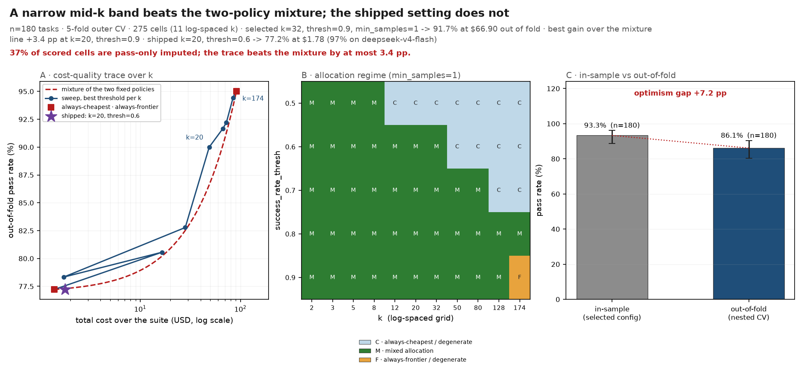

*n=180 tasks · 5-fold outer CV · 275 cells (11 log-spaced k) · selected k=32, thresh=0.9, min_samples=1 -> 91.7% at \$66.90 out of fold · best gain over the mixture line +3.4 pp at k=20, thresh=0.9 · shipped k=20, thresh=0.6 -> 77.2% at \$1.78 (97% on deepseek-v4-flash)*

> **Caveat.** 37% of scored cells are pass-only imputed; the trace beats the mixture by at most 3.4 pp.

**Reading.** Three panels over ONE sweep. A: each point is one k on the log-spaced grid, placed at the total cost and pass rate its best threshold achieves out of fold; the dashed line is the straight mixture of the two fixed policies (send a fraction of tasks to the cheapest model and the rest to the frontier one). B: the same grid coloured by WHAT each (k, threshold) combination allocates — categorical, because the interesting fact is the regime, not the share. C: the selected configuration scored in sample beside the nested out-of-fold score of the same selection procedure.

**What to look for.** In A, a router is only worth building if its trace sits ABOVE the dashed mixture line — anything on or below it is reproducible by flipping a weighted coin between two fixed policies, with no embeddings, no index and no k. In B, look for how much of the grid is mixed at all: the degenerate bands are the sweep reporting a fixed policy's number under a routing label. In C, read the gap: it is how much of the in-sample optimum is selection optimism rather than skill.

**Terms.** *out-of-fold* — scored on a fold whose tasks were absent from BOTH the neighbour index and the selection that picked the configuration. *mixture line* — the cost/quality reachable by splitting tasks between two fixed policies. *k* — how many nearest tasks the router consults before choosing a model. *success_rate_thresh* — neighbour pass-rate below which the router escalates off the cheap model. *min_samples* — min neighbours with a recorded outcome before the router trusts them. *cost at equal quality* — cheapest cell whose pass rate clears the best cell's 95% Wilson lower bound — the selection rule, replacing reward-argmax.

**Notes.** Neighbourhoods use the real shipped jina embedder — the same Embedder the router runs, never a TF-IDF proxy. The k grid is log-spaced (2 to 174). A uniform grid spends nearly all of its cells inside one regime and reports the same number on half of them. OUTER-LOOP CV: for each of 5 folds the configuration is chosen on the other folds — which are also the only tasks its neighbour index may hold — and scored on the fold left out. The per-fold picks were fold 0: k=12/t=0.9/m=1, fold 1: k=8/t=0.9/m=1, fold 2: k=32/t=0.9/m=1, fold 3: k=50/t=0.9/m=1, fold 4: k=32/t=0.9/m=1. Panel A's trace takes, per k, the cheapest cell whose out-of-fold pass rate clears the best cell's 95% Wilson lower bound. The two fixed policies are scored on the same corpus: always-cheapest (deepseek-v4-flash) 77.2% at \$1.39, always-frontier (kimi-k3) 95.0% at \$91.15. Reward is driven by success_rate_thresh (η²=0.65); k also matters (η²=0.07) — neither can be picked freely. min_samples: η²=0.00 — negligible effect.

**Limits.** Folds split TASKS, not repositories, so an out-of-fold task can still sit next to a sibling task from the same repo — this is a lower bound on optimism, not an estimate of transfer to a new codebase (see embedding_signal.png's cross-repo panel). REWARD-ARGMAX IS DEGENERATE: maximising reward (passes - gamma x cost, gamma=0.1) picks k=128, thresh=0.9, which routes 97% of tasks to kimi-k3 using 2 distinct model(s). At this gamma one extra pass is worth 10 USD against a suite costing a few dollars, so cost is nearly a no-op and the argmax escalates everything. 403/1080 cells (37.3%) in the scored matrix are monotone-IMPUTED rather than measured, and the imputation is near-exclusively pass-filling, so it almost never can never add a failure. The neighbourhood VOTES and the pass rates on this grid both read those synthetic passes — every quality number here is biased up. Cost is model-price dependent — the selected cell moves when model prices move.

### The shipped router sends most of every difficulty bucket to the cheapest model {#fig-task-difficulty}

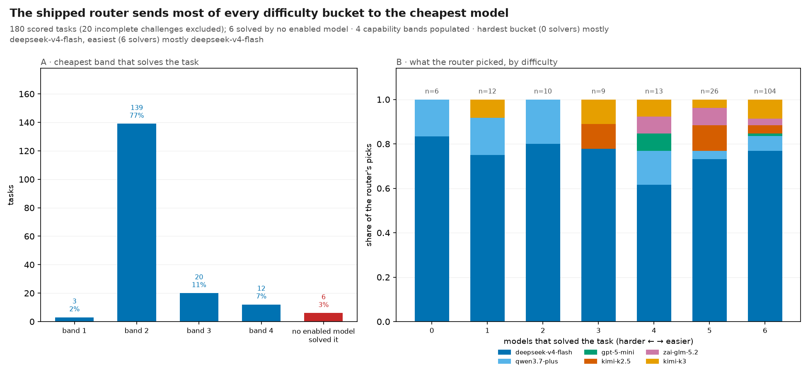

*180 scored tasks (20 incomplete challenges excluded); 6 solved by no enabled model · 4 capability bands populated · hardest bucket (0 solvers) mostly deepseek-v4-flash, easiest (6 solvers) mostly deepseek-v4-flash*

**Reading.** Left: how many tasks each capability band is the cheapest sufficient answer for, weakest band on the left, plus the tasks no enabled model solved. Right: for each count of solving models — the corpus's own difficulty measure — the share of tasks the shipped kNN router sent to each model, as stacked bars with the task count above.

**What to look for.** Compare the stacks across the right panel's buckets. The shipped router is kNN: it predicts ONCE from the neighbourhood and does not escalate, so a stack that barely moves from the hardest bucket to the easiest means the prediction is barely conditioning on difficulty at all. Read embedding_signal.png for why — the input it predicts from carries almost no routable signal.

**Terms.** *capability band* — models grouped by derived capability rank; a task's band is the weakest band containing a model that solved it. *solving models* — how many enabled models solved the task. Zero means unwinnable, all means free.

**Notes.** Bands and solving-model counts are read off the coverage-completed matrix, the same matrix every strategy is scored on. band 1: 3 tasks. band 2: 139 tasks. band 3: 20 tasks. band 4: 12 tasks. 0 solvers: {'deepseek-v4-flash': 5, 'qwen3.7-plus': 1}. 1 solvers: {'deepseek-v4-flash': 9, 'kimi-k3': 1, 'qwen3.7-plus': 2}. 2 solvers: {'deepseek-v4-flash': 8, 'qwen3.7-plus': 2}. 3 solvers: {'deepseek-v4-flash': 7, 'kimi-k2.5': 1, 'kimi-k3': 1}. 4 solvers: {'deepseek-v4-flash': 8, 'gpt-5-mini': 1, 'kimi-k3': 1, 'qwen3.7-plus': 2, 'zai-glm-5.2': 1}. 5 solvers: {'deepseek-v4-flash': 19, 'kimi-k2.5': 3, 'kimi-k3': 1, 'qwen3.7-plus': 1, 'zai-glm-5.2': 2}. 6 solvers: {'deepseek-v4-flash': 80, 'gpt-5-mini': 1, 'kimi-k2.5': 4, 'kimi-k3': 9, 'qwen3.7-plus': 7, 'zai-glm-5.2': 3}.

**Limits.** An imputed cell is always a pass, so a task's band is a LOWER bound on the capability it truly needs and the solving-model count is an upper bound. The right panel is NOT circular for the shipped router — kNN decides before any outcome for this task exists — but it is not independent either: the neighbours it reads and the solving-model count it is plotted against come from one matrix. 'No enabled model solved it' counts the six models at their DEFAULT arms. complementarity.png counts every sampled (model, arm) column instead, so its solved-by-none figure is smaller — a different denominator, not a disagreement.

<!-- n: excluded=20, tasks=180, unsolved=6 -->
