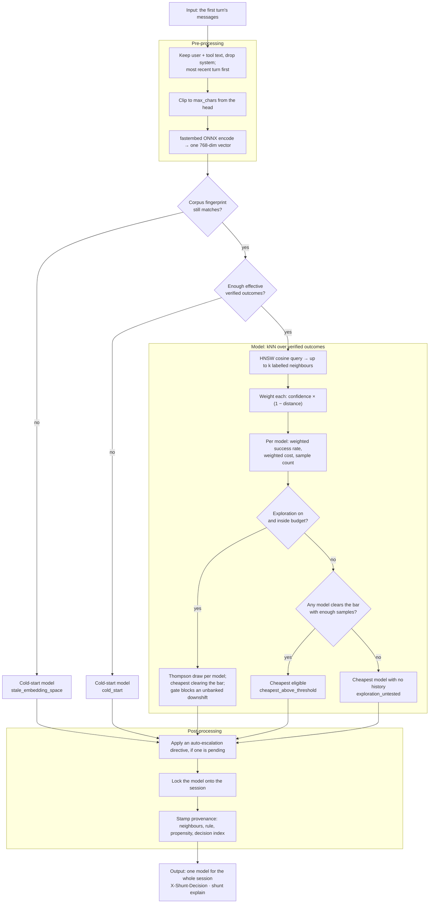

# The routing model

Shunt makes one model choice per session, on the first turn, before any tokens are
spent. This page describes what that decision actually reads, how it is computed,
why it is shaped this way, and the places where it does nothing useful. Its sibling
is [Error detection & auto-escalation](escalation.md), which acts *after* a verified
outcome exists; this one acts *before* there is any evidence about the task at hand.

The rule is nonparametric: embed the task, look up the nearest past tasks whose
outcomes you already verified, and take the cheapest model that cleared your quality
bar on them. There is no training step and no learned weights. Everything it uses is
in the outcome store on your disk.

## The shape of it



## What it reads

Only the task-bearing text of the first turn, and only in one form: a vector.

- **Roles.** Content from `user` and `tool` messages. The `system` prompt is dropped
  on purpose — a coding agent's system prompt is many times longer than the clip
  window, and leaving it in meant every session embedded to nearly the same vector.
  A body with no `user` or `tool` message falls back to the flat wire-order text
  rather than embedding an empty string.
- **Order.** Most recent turn first. The clip below cuts from the head, so wire order
  would have thrown the task away and kept the preamble.
- **Clip.** The text is truncated to `max_chars` (packaged default 4000) before
  encoding. Attention is quadratic in length, so an unbounded prompt is an unbounded
  allocation; the cap is what keeps a long agent prompt from taking the router down.
  The full prompt still goes upstream untouched — the clip affects the routing signal
  only.
- **Encoder.** fastembed, CPU-only, running the model named in
  [`embedding.yaml`](configuration.md#choose-the-embedding-model-and-stay-swap-safe).
  The shipped default is `jina-code` (768 dimensions); `arctic` is the other bundled
  option.
- **Fingerprint.** The active model, its dimension, and `max_chars` form a corpus
  fingerprint. Change any of them and the stored vectors live in a different space,
  so their distances mean nothing. Shunt notices, refuses to consult neighbours at
  all, and routes as if cold under the reason `stale_embedding_space` until you run
  `shunt reindex`. It does not quietly compare across spaces.

## How it decides

### Cold start comes first

Until there are enough verified outcomes, kNN has nothing to search, so the router
routes to a fixed cheap model — `qwen3.7-plus`, falling back through
`deepseek-v4-flash` and `zai-glm-5.2`, then any healthy model in the pool, if the
primary is unhealthy.

Cold start ends on **effective** sample size, not row count. Each outcome's weight
folds in its verification confidence, and the gate uses the Kish effective size
`nₑ = (Σw)² / Σw²` rather than counting rows. Two thresholds end it: enough
Tier-2 (verified) outcomes, or enough labelled outcomes of any tier. A store full of
low-confidence labels therefore stays in cold start longer than a raw count would
suggest, which is the intended behaviour — the router waits for evidence it can
trust, not volume.

Cold-start sessions are still embedded and still recorded. That is the point of
them: they are how the corpus gets built.

### The neighbourhood

Once warm, the embedding goes to an HNSW index (hnswlib, cosine space) which returns
the *k* nearest embedded sessions (`policy.k`, default 20). Sessions without a
recorded outcome are dropped, so a query can legitimately come back with fewer than
*k* neighbours — sometimes with none.

Each surviving neighbour carries the model that ran it, its verified pass/fail, its
real cost, the verification confidence of its label, and its distance. Each gets a
weight:

```
weight = verification_confidence × max(0, 1 − distance)
```

so a far neighbour or a weakly-verified one counts for less, and a neighbour beyond
distance 1 counts for nothing. There is no separate calibration model; this product
is the whole of it.

Neighbours are then grouped by model, and each group yields a weighted success rate
and a weighted cost. A neighbour whose real cost is unknown surfaces as infinite
cost, which is deliberate: unknown must never sort as cheapest.

### The selection rule

A model is **eligible** when its weighted success rate is at least
`success_rate_threshold` (shipped 0.6) *and* its group holds at least `min_samples`
neighbours (shipped 3). Among eligible models, the cheapest wins —
`cheapest_above_threshold`. That single line is the product thesis: hold a quality
bar, minimise cost under it.

When nothing is eligible, the rule walks the price-ranked pool from cheapest upward
and returns the first model that has **no history in this neighbourhood** —
`exploration_untested`. Read that carefully, because it is the rule's most
consequential branch: on a thin or empty neighbourhood it returns the *cheapest*
model, so an under-informed router behaves like `always_cheap` while reporting a
reason that sounds like a considered choice. Only the debug log distinguishes the
two. If every model in the pool has already been tried and none qualified, the
strongest is returned as `safe_fallback`.

### Exploration

Exploration ships **on**. When it is enabled and the cumulative exploration budget
has room, a cost-aware Thompson layer runs *before* the selection rule.

Each model gets a Beta posterior built from the weighted neighbourhood counts on top
of a prior. The prior is empirical-Bayes: seeded from that model's global offline
success rate, with its pseudo-count strength capped (`prior_strength_cap`) so a long
global history regularises a sparse local neighbourhood instead of swamping it. One
rate is drawn per model; the cheapest draw clearing the same threshold wins, or the
highest draw if none clears it.

Two rails sit on top. A **conservative gate** compares the sampled pick against the
deterministic greedy pick and blocks an exploratory *downshift* to a cheaper model
unless earlier successes have banked enough slack — otherwise the choice reverts to
greedy as `conservative_fallback`. An **exploration budget** caps cumulative
exploratory spend as a fraction of what exploiting would have cost. Every decision
feeds the budget's denominator, exploit choices included.

The propensity of the realised choice is estimated by Monte Carlo and logged, so the
policy can be evaluated off-policy later. That resampling snapshots and restores the
RNG state, so turning the logging knob up cannot change which model your next request
gets.

## What happens to the decision

- **It is locked to the session.** The chosen model is written onto the session and
  reused for every later turn. The router is never consulted again for that session.
  This is the cache-safety spine: no mid-conversation model switch, so no silent
  full-price re-read of a cached context.
- **A pending escalation may override it.** If auto-escalation is enabled and a
  directive is due, it is applied here, at the boundary — raising the reasoning arm
  on the same model, or stepping a rank. See [escalation](escalation.md).
- **Provenance is stamped.** The neighbours consulted, the rule that fired, the
  propensity, the per-model scores, and the decision index all land on the session
  row. `shunt explain <session_id>` reads them back, and the `X-Shunt-Decision`
  response header names the model and reason.
- **The outcome comes back later.** At session close the verifier records a verified
  outcome; only sessions carrying one join the index. Learning is batch: the index is
  rebuilt every `refit.every_n_outcomes` captures, so a single new outcome does not
  move routing until the next re-fit or restart.

### The reason tokens

Every decision names its rule. These are the values you will see in the header and
in `shunt explain`:

| Reason | What happened |
|---|---|
| `cold_start` | Not enough effective verified outcomes yet — fixed cheap model |
| `stale_embedding_space` | The corpus was embedded by a different embedder; neighbours refused until `shunt reindex` |
| `cheapest_above_threshold` | A model cleared the success bar with enough samples, and was cheapest |
| `exploration_untested` | Nothing cleared the bar; the cheapest model with no local history was picked |
| `safe_fallback` | Nothing cleared the bar and every model had been tried — strongest model |
| `exploration` | Thompson sampling diverged from the greedy pick |
| `exploration_exploit` | Thompson sampling agreed with the greedy pick |
| `conservative_fallback` | An exploratory downshift was blocked for lack of banked slack |
| `auto_escalation` | A pending escalation directive overrode the base pick |
| `always_cheap` / `always_frontier` | A fixed strategy is configured; no embedding, no query |

## Why it is built this way

- **Nonparametric, so it works from the first labelled session.** There is no model
  to train and no minimum dataset before the mechanism functions at all — it degrades
  to cold start instead of failing.
- **Inspectable.** Every decision can be traced to the specific past sessions that
  produced it. A learned scalar cannot be argued with; a neighbour list can.
- **Cheapest-above-a-bar states the goal directly.** The alternative — optimising a
  reward that trades quality against cost — needs an exchange rate between them that
  nobody can defend. A threshold you set is honest about being your choice.
- **One decision per session, because the cache is per-session.** Routing per turn
  would break the provider's prompt cache and cost more than any routing gain.
- **Price order is the only ranking available at cold start.** Capability order needs
  measurement you do not have yet; list price is always known.

## Limitations

Read these before trusting a routing decision.

- **The core signal is unproven on coding work.** Ranking hard tasks from easy ones
  off a prompt embedding is the assumption the whole rule rests on, and on agentic
  coding it has not cleared our viability bar. See [Results](results.md). The proxy,
  the cache-safety guarantee, and the escalation path do not depend on it; the *kNN
  decision* does.
- **A thin neighbourhood is indistinguishable from a confident one.** The
  `exploration_untested` branch returns the cheapest model, and nothing in the
  response says the neighbourhood was empty. Check `shunt explain` before concluding
  the router "decided" anything.
- **Rank is price, not capability.** The pool is ordered by list price, which is not
  a capability ordering — stepping up a rank can lower your pass rate. The measured
  per-model table is in [Results](results.md).
- **It sees a clipped, system-free slice of the task.** A task described mainly in a
  system prompt is invisible to it, and a long task is truncated. The truncation rate
  is carried on each neighbour but the rule does not otherwise compensate for it.
- **It cannot react to a task that changes mid-session.** The model is locked. If
  your session drifts from a rename into a redesign, routing does not follow — that
  is what escalation is for, and escalation only acts at the next boundary.
- **Learning is batch and global.** One corpus, one index, no per-project or
  per-user models. A new outcome changes nothing until the next re-fit.
- **Exploration costs money and quality while it runs.** It is on by default so the
  router can gather evidence; if you want decisions on current beliefs only, turn it
  off.
- **SWE tasks only.** Both the corpus and the verified label assume a repository with
  a test suite. Nothing stops you routing other work through Shunt, but the decision
  has no evidence behind it and no verifier to grade it afterwards.

## Configure it

Strategy, `k`, the success threshold, `min_samples`, exploration, the live model
list, the embedding model, and the re-fit cadence are all in
[Configuration → Tune the router](configuration.md#tune-the-router). The shipped
values are in `src/shunt/config/router.yaml` and `src/shunt/config/embedding.yaml`.
